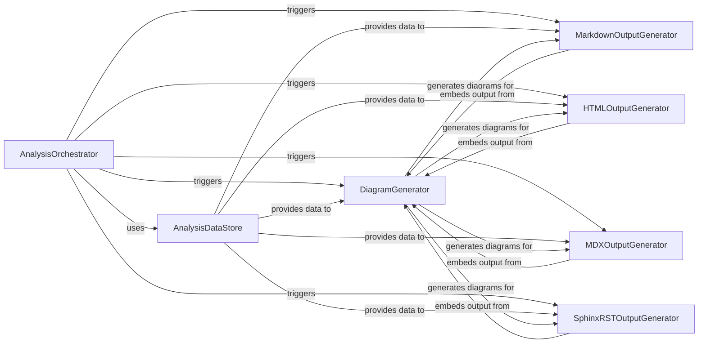

## Details

Transforms the processed analysis data and insights into user-friendly documentation formats (e.g., Markdown, HTML) and generates visual representations like architectural diagrams.

### AnalysisOrchestrator
Coordinates the overall workflow of the documentation and diagram generation process. It acts as the high-level entry point, parsing command-line arguments, managing repository interactions, and triggering the various output generators after analysis data is available.

**Related Classes/Methods**:

- <a href="https://github.com/CodeBoarding/CodeBoarding/blob/main/.codeboardinggithub_action.py" target="_blank" rel="noopener noreferrer">`repos.codeboarding.orchestrator.AnalysisOrchestrator`</a>
- <a href="https://github.com/CodeBoarding/CodeBoarding/blob/main/.codeboardinggithub_action.py" target="_blank" rel="noopener noreferrer">`repos.codeboarding.cli.CLIParser`</a>
- <a href="https://github.com/CodeBoarding/CodeBoarding/blob/main/.codeboardinggithub_action.py" target="_blank" rel="noopener noreferrer">`repos.codeboarding.repository.RepositoryManager`</a>

### AnalysisDataStore
Serves as the central repository for all processed analysis data, including component manifests, Control Flow Graphs (CFG), call graphs, and file coverage. It provides the raw input for all documentation and diagram generators, ensuring a single source of truth.

**Related Classes/Methods**: _None_

### DiagramGenerator
Specializes in converting structured analysis data into visual architectural diagrams, primarily using formats like Mermaid.js syntax. It produces diagram definitions that can be embedded into various documentation formats by other generators.

**Related Classes/Methods**:

- <a href="https://github.com/CodeBoarding/CodeBoarding/blob/main/.codeboardingoutput_generators/sphinx.py" target="_blank" rel="noopener noreferrer">`repos.codeboarding.output.DiagramGenerator`</a>
- <a href="https://github.com/CodeBoarding/CodeBoarding/blob/main/.codeboardingdiagram_analysis/diagram_generator.py" target="_blank" rel="noopener noreferrer">`repos.codeboarding.diagram_analysis.diagram_generator.MermaidGenerator`</a>

### MarkdownOutputGenerator
Generates documentation content in Markdown format. It incorporates textual explanations, code snippets, and embeds diagrams provided by the DiagramGenerator to create comprehensive Markdown files.

**Related Classes/Methods**:

- <a href="https://github.com/CodeBoarding/CodeBoarding/blob/main/.codeboardingoutput_generators/sphinx.py" target="_blank" rel="noopener noreferrer">`repos.codeboarding.output.MarkdownOutputGenerator`</a>
- <a href="https://github.com/CodeBoarding/CodeBoarding/blob/main/.codeboardingoutput_generators/markdown.py" target="_blank" rel="noopener noreferrer">`repos.codeboarding.output.markdown.MarkdownBuilder`</a>

### HTMLOutputGenerator
Produces interactive HTML documentation, rendering analysis insights and diagrams into a web-friendly format. It utilizes templates and potentially libraries like Cytoscape for dynamic visualizations.

**Related Classes/Methods**:

- <a href="https://github.com/CodeBoarding/CodeBoarding/blob/main/.codeboardingoutput_generators/html.py" target="_blank" rel="noopener noreferrer">`repos.codeboarding.output.html.HTMLGenerator`</a>
- <a href="https://github.com/CodeBoarding/CodeBoarding/blob/main/.codeboardingoutput_generators/html.py" target="_blank" rel="noopener noreferrer">`repos.codeboarding.output.html.TemplateRenderer`</a>
- <a href="https://github.com/CodeBoarding/CodeBoarding/blob/main/.codeboardingoutput_generators/html.py" target="_blank" rel="noopener noreferrer">`repos.codeboarding.output.html.CytoscapeRenderer`</a>

### MDXOutputGenerator
Creates documentation files in MDX format, which combines Markdown with JSX. This allows for rich, interactive content and seamless integration into modern documentation sites, handling front-matter and embedding diagrams.

**Related Classes/Methods**:

- <a href="https://github.com/CodeBoarding/CodeBoarding/blob/main/.codeboardingoutput_generators/mdx.py" target="_blank" rel="noopener noreferrer">`repos.codeboarding.output.mdx.MDXGenerator`</a>
- <a href="https://github.com/CodeBoarding/CodeBoarding/blob/main/.codeboardingoutput_generators/mdx.py" target="_blank" rel="noopener noreferrer">`repos.codeboarding.output.mdx.FrontMatterProcessor`</a>
- <a href="https://github.com/CodeBoarding/CodeBoarding/blob/main/.codeboardingoutput_generators/mdx.py" target="_blank" rel="noopener noreferrer">`repos.codeboarding.output.mdx.MermaidEmbedder`</a>

### SphinxRSTOutputGenerator
Generates reStructuredText (RST) output, specifically tailored for integration with Sphinx documentation projects. It includes component headers and embeds diagrams to produce Sphinx-compatible documentation.

**Related Classes/Methods**: _None_

### [FAQ](https://github.com/CodeBoarding/GeneratedOnBoardings/tree/main?tab=readme-ov-file#faq)