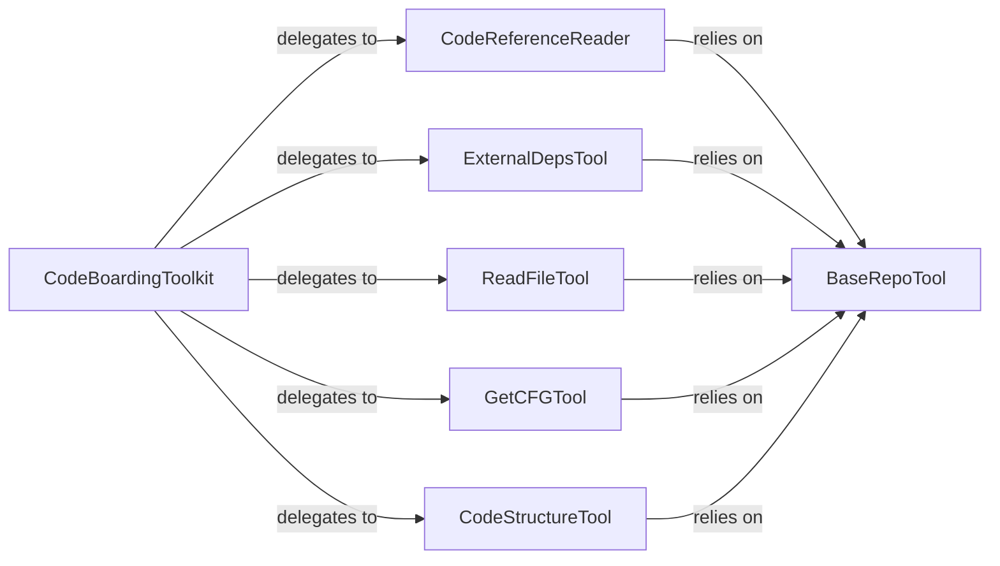

## Details

Primary facade for the LLM Agent Core, aggregating and exposing all code analysis and interaction tools. It orchestrates and delegates requests from the agent to the appropriate specialized tools.

### CodeBoardingToolkit
The central orchestrator and entry point for the Agent Tooling Interface. It aggregates various code analysis capabilities and delegates agent requests to the appropriate specialized tools, managing their lifecycle and coordinating their outputs.

**Related Classes/Methods**:

- <a href="https://github.com/CodeBoarding/CodeBoarding/blob/main/.codeboardingagents/tools/read_source.py" target="_blank" rel="noopener noreferrer">`agents.tools.read_source.CodeBoardingToolkit`</a>

### CodeReferenceReader
Specializes in parsing code references (e.g., fully qualified names) and extracting specific source code snippets or definitions from the codebase. It translates high‑level references into concrete code segments for analysis.

**Related Classes/Methods**:

- <a href="https://github.com/CodeBoarding/CodeBoarding/blob/main/.codeboardingagents/tools/read_source.py" target="_blank" rel="noopener noreferrer">`agents.tools.read_source.CodeReferenceReader`</a>

### ExternalDepsTool
Responsible for identifying and summarizing external software dependencies by scanning project manifests, configuration files, and build scripts. It provides an overview of the project's external ecosystem.

**Related Classes/Methods**:

- <a href="https://github.com/CodeBoarding/CodeBoarding/blob/main/.codeboardingagents/tools/read_source.py" target="_blank" rel="noopener noreferrer">`agents.tools.read_source.ExternalDepsTool`</a>

### ReadFileTool
Provides direct access to the file system, allowing for the retrieval of raw file content based on a given file path. It acts as a low‑level interface for reading source files.

**Related Classes/Methods**:

- <a href="https://github.com/CodeBoarding/CodeBoarding/blob/main/.codeboardingagents/tools/read_source.py" target="_blank" rel="noopener noreferrer">`agents.tools.read_source.ReadFileTool`</a>

### GetCFGTool
Generates and retrieves Control Flow Graphs (CFGs) for specified code units (e.g., functions, methods). This tool is essential for understanding the execution paths and logical flow within the code.

**Related Classes/Methods**:

- <a href="https://github.com/CodeBoarding/CodeBoarding/blob/main/.codeboardingagents/tools/read_source.py" target="_blank" rel="noopener noreferrer">`agents.tools.read_source.GetCFGTool`</a>

### CodeStructureTool
Analyzes the codebase to extract and present its structural organization, including class hierarchies, module relationships, function signatures, and other high‑level architectural elements.

**Related Classes/Methods**:

- <a href="https://github.com/CodeBoarding/CodeBoarding/blob/main/.codeboardingagents/tools/read_source.py" target="_blank" rel="noopener noreferrer">`agents.tools.read_source.CodeStructureTool`</a>

### BaseRepoTool
Offers foundational repository utilities, including context management, caching mechanisms for file system operations, and methods for traversing the project directory structure. It serves as a common backend for other tools requiring repository access.

**Related Classes/Methods**:

- <a href="https://github.com/CodeBoarding/CodeBoarding/blob/main/.codeboardingagents/tools/read_source.py" target="_blank" rel="noopener noreferrer">`agents.tools.read_source.BaseRepoTool`</a>

### [FAQ](https://github.com/CodeBoarding/GeneratedOnBoardings/tree/main?tab=readme-ov-file#faq)