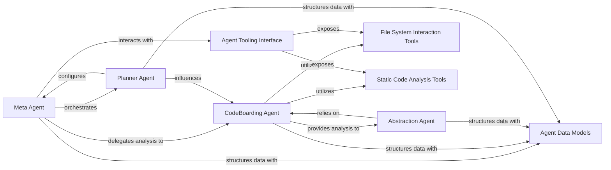

## Details

Manages the lifecycle, coordination, and execution of various AI agents, providing them with tools, prompts, and LLM configurations to perform codebase analysis and generate insights. This component includes the core agent logic, specific tools for interaction, and the overall strategy for agent-based analysis.

### Meta Agent
Acts as the primary orchestrator for the entire codebase analysis workflow. It establishes the initial project context by analyzing metadata, classifies files, and guides the overall analysis strategy.

**Related Classes/Methods**:

- <a href="https://github.com/CodeBoarding/CodeBoarding/blob/main/.codeboardingagents/meta_agent.py" target="_blank" rel="noopener noreferrer">`agents.meta_agent.MetaAgent`</a>

### CodeBoarding Agent
Performs detailed, granular analysis of specific components or clusters identified during the initial phases. It is responsible for grouping files into logical components, managing their assignments, and extracting in-depth information about their internal structure and relationships.

**Related Classes/Methods**:

- <a href="https://github.com/CodeBoarding/CodeBoarding/blob/main/.codeboardingagents/cluster_methods_mixin.py" target="_blank" rel="noopener noreferrer">`agents.codeboarding_agent.CodeBoardingAgent`</a>

### Abstraction Agent
Generates higher-level architectural abstractions and relationships between components based on the detailed analysis provided by other agents. This aids in creating conceptual diagrams and understanding the overall system design.

**Related Classes/Methods**:

- <a href="https://github.com/CodeBoarding/CodeBoarding/blob/main/.codeboardingagents/abstraction_agent.py" target="_blank" rel="noopener noreferrer">`agents.abstraction_agent.AbstractionAgent`</a>

### Planner Agent
Manages the planning of analysis steps, determines component expansion strategies, and provides system-wide constants and configuration settings for the agent system. It ensures an efficient and adaptive analysis workflow.

**Related Classes/Methods**:

- <a href="https://github.com/CodeBoarding/CodeBoarding/blob/main/.codeboardingagents/planner_agent.py" target="_blank" rel="noopener noreferrer">`agents.planner_agent.plan_analysis`</a>

### Agent Tooling Interface
Serves as a unified interface and factory for all specialized analysis tools. It provides a centralized mechanism for agents to access functionalities like reading files, documentation, CFG data, package dependencies, and code structure.

**Related Classes/Methods**:

- <a href="https://github.com/CodeBoarding/CodeBoarding/blob/main/.codeboardingagents/tools/toolkit.py" target="_blank" rel="noopener noreferrer">`agents.tools.toolkit.CodeBoardingToolkit`</a>

### File System Interaction Tools
A collection of tools dedicated to interacting with the file system. They provide capabilities to read documentation files, retrieve project directory structures, read the content of specific files, analyze Git diffs, and manage repository context.

**Related Classes/Methods**:

- <a href="https://github.com/CodeBoarding/CodeBoarding/blob/main/.codeboardingagents/tools/read_git_diff.py" target="_blank" rel="noopener noreferrer">`agents.tools.read_git_diff`</a>
- <a href="https://github.com/CodeBoarding/CodeBoarding/blob/main/.codeboardingagents/tools/read_file.py" target="_blank" rel="noopener noreferrer">`agents.tools.read_file`</a>
- <a href="https://github.com/CodeBoarding/CodeBoarding/blob/main/.codeboardingagents/tools/read_git_diff.py" target="_blank" rel="noopener noreferrer">`agents.tools.get_file_structure`</a>

### Static Code Analysis Tools
A suite of tools focused on static code analysis. They enable the retrieval of source code for specific references, package dependency graphs, Control Flow Graph (CFG) data, class hierarchies, and method invocation details.

**Related Classes/Methods**:

- <a href="https://github.com/CodeBoarding/CodeBoarding/blob/main/.codeboardingagents/tools/get_method_invocations.py" target="_blank" rel="noopener noreferrer">`agents.tools.get_source_code`</a>
- <a href="https://github.com/CodeBoarding/CodeBoarding/blob/main/.codeboardingagents/tools/get_method_invocations.py" target="_blank" rel="noopener noreferrer">`agents.tools.get_package_dependencies`</a>
- <a href="https://github.com/CodeBoarding/CodeBoarding/blob/main/.codeboardingagents/tools/get_method_invocations.py" target="_blank" rel="noopener noreferrer">`agents.tools.get_class_hierarchy`</a>
- <a href="https://github.com/CodeBoarding/CodeBoarding/blob/main/.codeboardingagents/tools/get_method_invocations.py" target="_blank" rel="noopener noreferrer">`agents.tools.get_cfg_data`</a>

### Agent Data Models
Defines the data models and structures for all inputs and outputs within the agent system. This includes models for analysis insights, component definitions, file classifications, and validation results, ensuring consistent data exchange and interoperability.

**Related Classes/Methods**:

- <a href="https://github.com/CodeBoarding/CodeBoarding/blob/main/.codeboardingagents/agent_responses.py" target="_blank" rel="noopener noreferrer">`agents.models.AnalysisInsight`</a>
- <a href="https://github.com/CodeBoarding/CodeBoarding/blob/main/.codeboardingagents/agent_responses.py" target="_blank" rel="noopener noreferrer">`agents.models.ComponentDefinition`</a>
- <a href="https://github.com/CodeBoarding/CodeBoarding/blob/main/.codeboardingagents/agent_responses.py" target="_blank" rel="noopener noreferrer">`agents.models.FileClassification`</a>
- <a href="https://github.com/CodeBoarding/CodeBoarding/blob/main/.codeboardingagents/agent_responses.py" target="_blank" rel="noopener noreferrer">`agents.models.ValidationResult`</a>

### [FAQ](https://github.com/CodeBoarding/GeneratedOnBoardings/tree/main?tab=readme-ov-file#faq)
