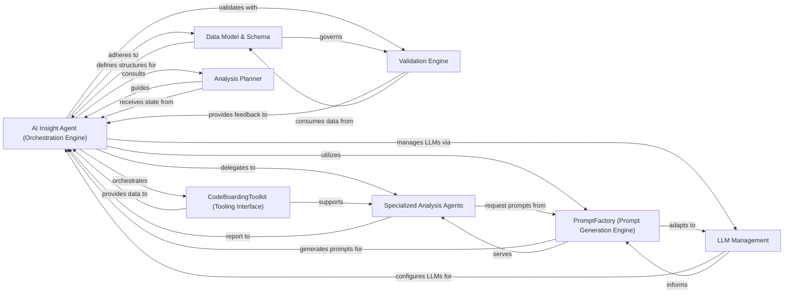

## Details

This component provides the AI intelligence, housing the core agent logic that plans, executes, and validates analysis tasks using Large Language Models (LLMs). It includes a comprehensive toolkit for agents to interact with the codebase and static analysis results, and a robust prompt management system for effective LLM communication.

### AI Insight Agent (Orchestration Engine)
Manages the overall workflow of code analysis, including file classification, component grouping, and validation. It coordinates the execution of specialized agents and tools, acting as the central intelligence for planning and executing analysis tasks.

**Related Classes/Methods**:

- <a href="https://github.com/CodeBoarding/CodeBoarding/blob/main/.codeboardingagents/agent.py" target="_blank" rel="noopener noreferrer">`agents.agent.CodeBoardingAgent`</a>

### CodeBoardingToolkit (Tooling Interface)
Provides a unified interface to a suite of tools for accessing and analyzing the codebase (e.g., reading files, CFG, file structure, external dependencies, method invocations). It enables agents to interact with the codebase effectively.

**Related Classes/Methods**:

- <a href="https://github.com/CodeBoarding/CodeBoarding/blob/main/.codeboardingagents/tools/toolkit.py" target="_blank" rel="noopener noreferrer">`agents.tools.toolkit.CodeBoardingToolkit`</a>

### PromptFactory (Prompt Generation Engine)
Generates and manages LLM prompts, adapting them for different analysis tasks and specific LLM models. It ensures effective communication with LLMs by providing tailored prompts.

**Related Classes/Methods**:

- <a href="https://github.com/CodeBoarding/CodeBoarding/blob/main/.codeboardingagents/prompts/prompt_factory.py" target="_blank" rel="noopener noreferrer">`agents.prompts.prompt_factory.PromptFactory`</a>

### LLM Management
Handles the configuration, initialization, and lifecycle of various Large Language Models (LLMs) used throughout the analysis process, ensuring agents can interact with the appropriate LLM.

**Related Classes/Methods**:

- <a href="https://github.com/CodeBoarding/CodeBoarding/blob/main/.codeboardingagents/llm_config.py" target="_blank" rel="noopener noreferrer">`agents.llm.LLMManager`</a>
- <a href="https://github.com/CodeBoarding/CodeBoarding/blob/main/.codeboardingagents/llm_config.py" target="_blank" rel="noopener noreferrer">`agents.llm.LLMConfigurator`</a>

### Data Model & Schema
Defines the structured data formats (Pydantic models) for representing inputs, intermediate results, and final outputs of the code analysis, ensuring consistency across components and LLM interactions.

**Related Classes/Methods**:

- <a href="https://github.com/CodeBoarding/CodeBoarding/blob/main/.codeboardingagents/agent_responses.py" target="_blank" rel="noopener noreferrer">`agents.agent_responses.LLMBaseModel`</a>

### Validation Engine
Ensures the consistency and correctness of the generated analysis results, including file classifications, component relationships, and cluster coverage, providing a feedback mechanism for the agent's output.

**Related Classes/Methods**:

- <a href="https://github.com/CodeBoarding/CodeBoarding/blob/main/.codeboardingagents/validation.py" target="_blank" rel="noopener noreferrer">`agents.validation.ResultValidator`</a>
- <a href="https://github.com/CodeBoarding/CodeBoarding/blob/main/.codeboardingagents/validation.py" target="_blank" rel="noopener noreferrer">`agents.validation.SchemaValidator`</a>

### Analysis Planner
Determines the scope and depth of analysis for individual components or clusters, advising the Orchestration Engine on whether further expansion or detailed examination is required.

**Related Classes/Methods**:

- <a href="https://github.com/CodeBoarding/CodeBoarding/blob/main/.codeboardingagents/planner_agent.py" target="_blank" rel="noopener noreferrer">`agents.planner.AnalysisPlanner`</a>
- <a href="https://github.com/CodeBoarding/CodeBoarding/blob/main/.codeboardingagents/planner_agent.py" target="_blank" rel="noopener noreferrer">`agents.planner.AnalysisStrategy`</a>

### Specialized Analysis Agents
A group of specialized agents responsible for performing specific types of analysis: detailed insights, abstract representations, and metadata extraction. They report their findings to the Orchestration Engine.

**Related Classes/Methods**:

- <a href="https://github.com/CodeBoarding/CodeBoarding/blob/main/.codeboardingagents/abstraction_agent.py" target="_blank" rel="noopener noreferrer">`agents.agent.DetailedAnalysisAgent`</a>
- <a href="https://github.com/CodeBoarding/CodeBoarding/blob/main/.codeboardingagents/abstraction_agent.py" target="_blank" rel="noopener noreferrer">`agents.agent.AbstractionAgent`</a>
- <a href="https://github.com/CodeBoarding/CodeBoarding/blob/main/.codeboardingagents/abstraction_agent.py" target="_blank" rel="noopener noreferrer">`agents.agent.MetadataAnalysisAgent`</a>

### [FAQ](https://github.com/CodeBoarding/GeneratedOnBoardings/tree/main?tab=readme-ov-file#faq)
