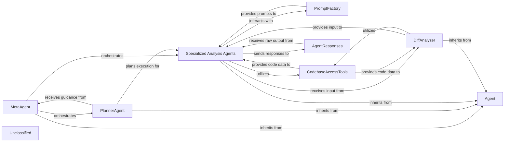

## Details

The system's architecture is centered around a hierarchy of AI agents designed for comprehensive code analysis. The MetaAgent orchestrates the overall analysis workflow, delegating tasks to the PlannerAgent which strategizes the execution sequence. Specialized Analysis Agents (AbstractionAgent, DetailsAgent, ValidatorAgent) perform the core AI-driven analysis, leveraging the CodebaseAccessTools for programmatic access to codebase information, including source code and CFGs. This access is significantly powered by an enhanced Language Server Protocol (LSP) client, improving the precision and scope of code interpretation. The DiffAnalyzer provides targeted input by analyzing code changes, while the PromptFactory dynamically generates prompts for various LLMs. Finally, AgentResponses processes and transforms raw LLM outputs into actionable architectural insights. This structure ensures a modular, extensible, and intelligent approach to code understanding and architectural analysis.

### Agent
The foundational component, defining the base interface and common functionalities for all specialized agents, acting as the core orchestrator for individual AI-driven analysis tasks.

**Related Classes/Methods**:

- <a href="https://github.com/CodeBoarding/CodeBoarding/blob/main/.codeboardingagents/agent.py" target="_blank" rel="noopener noreferrer">`Agent`</a>

### MetaAgent
Responsible for higher-level orchestration and coordination of multiple specialized agents, guiding the overall analysis workflow. It acts as the primary entry point for initiating complex analysis tasks.

**Related Classes/Methods**:

- <a href="https://github.com/CodeBoarding/CodeBoarding/blob/main/.codeboardingagents/meta_agent.py" target="_blank" rel="noopener noreferrer">`MetaAgent`</a>

### PlannerAgent
Determines the strategic sequence of analysis steps and the specific agents to be invoked based on the analysis goals, effectively creating an execution plan.

**Related Classes/Methods**:

- <a href="https://github.com/CodeBoarding/CodeBoarding/blob/main/.codeboardingagents/planner_agent.py" target="_blank" rel="noopener noreferrer">`PlannerAgent`</a>

### Specialized Analysis Agents
A group of agents (AbstractionAgent, DetailsAgent, ValidatorAgent) that perform specific AI-driven analysis tasks: identifying high-level architectural concepts, delving into granular code details, and verifying insights against architectural principles.

**Related Classes/Methods**:

- <a href="https://github.com/CodeBoarding/CodeBoarding/blob/main/.codeboardingagents/abstraction_agent.py" target="_blank" rel="noopener noreferrer">`AbstractionAgent`</a>
- <a href="https://github.com/CodeBoarding/CodeBoarding/blob/main/.codeboardingagents/details_agent.py" target="_blank" rel="noopener noreferrer">`DetailsAgent`</a>
- <a href="https://github.com/CodeBoarding/CodeBoarding/blob/main/.codeboardingagents/validator_agent.py" target="_blank" rel="noopener noreferrer">`ValidatorAgent`</a>

### DiffAnalyzer
Analyzes code differences (e.g., from Git commits) to provide targeted input for agents, enabling incremental analysis and integration with CI/CD pipelines.

**Related Classes/Methods**:

- <a href="https://github.com/CodeBoarding/CodeBoarding/blob/main/.codeboardingagents/diff_analyzer.py" target="_blank" rel="noopener noreferrer">`DiffAnalyzer`</a>

### PromptFactory
Manages the dynamic generation and selection of appropriate prompts for interacting with various Large Language Models (LLMs), adapting to different LLM providers and analysis contexts.

**Related Classes/Methods**:

- <a href="https://github.com/CodeBoarding/CodeBoarding/blob/main/.codeboardingagents/prompts/prompt_factory.py" target="_blank" rel="noopener noreferrer">`PromptFactory`</a>

### CodebaseAccessTools
Provides agents with the capability to programmatically access and interpret different aspects of the codebase, including source code, Control Flow Graphs, and file structures. This component has been significantly enhanced with an updated Language Server Protocol (LSP) client (`static_analyzer/lsp_client/client.py`), which is crucial for its ability to programmatically access and interpret codebase information, leading to improved performance, accuracy, or expanded capabilities in code analysis.

**Related Classes/Methods**:

- <a href="https://github.com/CodeBoarding/CodeBoarding/blob/main/.codeboardingagents/tools/read_source.py" target="_blank" rel="noopener noreferrer">`read_source`</a>
- <a href="https://github.com/CodeBoarding/CodeBoarding/blob/main/.codeboardingagents/tools/read_cfg.py" target="_blank" rel="noopener noreferrer">`read_cfg`</a>
- <a href="https://github.com/CodeBoarding/CodeBoarding/blob/main/.codeboardingagents/tools/read_file_structure.py" target="_blank" rel="noopener noreferrer">`read_file_structure`</a>
- <a href="https://github.com/CodeBoarding/CodeBoarding/blob/main/.codeboardingstatic_analyzer/lsp_client/client.py" target="_blank" rel="noopener noreferrer">`static_analyzer/lsp_client/client.py`</a>

### AgentResponses
Handles the structured parsing, interpretation, and transformation of raw LLM outputs into actionable architectural insights or data structures.

**Related Classes/Methods**:

- <a href="https://github.com/CodeBoarding/CodeBoarding/blob/main/.codeboardingagents/agent_responses.py" target="_blank" rel="noopener noreferrer">`AgentResponses`</a>

### Unclassified
Component for all unclassified files and utility functions (Utility functions/External Libraries/Dependencies)

**Related Classes/Methods**: _None_

### [FAQ](https://github.com/CodeBoarding/GeneratedOnBoardings/tree/main?tab=readme-ov-file#faq)
