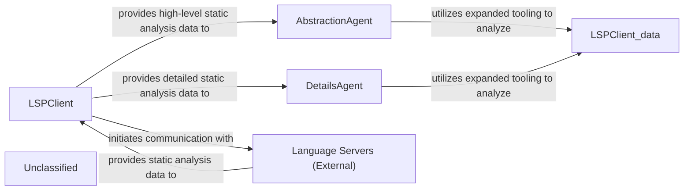

## Details

The system's architecture is centered around the LSPClient, which serves as a robust data acquisition layer, orchestrating communication with various Language Servers (External) to gather comprehensive static analysis data. This client, now enhanced with flexible language configuration and VSCode integration, efficiently collects diverse code intelligence. The collected data is then channeled to two specialized analytical components: the AbstractionAgent and the DetailsAgent. The AbstractionAgent consumes high-level data to identify major system components and their interconnections, forming an abstract architectural representation. Concurrently, the DetailsAgent utilizes detailed data to perform granular analysis, uncovering implementation specifics and design patterns. Both agents leverage expanded internal tooling to process this data, ensuring a thorough and multi-faceted understanding of the codebase. This design facilitates a clear separation of concerns, enabling efficient and scalable architectural analysis.

### LSPClient
Acts as the central data acquisition and orchestration layer, establishing robust communication with various Language Servers (External). It is enhanced with flexible language detection and configuration mechanisms, alongside deeper integration with the VSCode environment, making it a sophisticated data provider.

**Related Classes/Methods**:

- <a href="https://github.com/CodeBoarding/CodeBoarding/blob/main/.codeboardingstatic_analyzer/lsp_client/client.py#L57-L1102" target="_blank" rel="noopener noreferrer">`LSPClient`:57-1102</a>

### AbstractionAgent
Focuses on synthesizing high-level architectural views, identifying major components and their responsibilities. It processes data using expanded tooling to synthesize high-level architectural views.

**Related Classes/Methods**:

- <a href="https://github.com/CodeBoarding/CodeBoarding/blob/main/.codeboardingagents/abstraction_agent.py#L30-L206" target="_blank" rel="noopener noreferrer">`AbstractionAgent`:30-206</a>

### DetailsAgent
Delves into specific code sections, uncovering design patterns and explaining implementation rationale. It processes data using expanded tooling to perform in-depth analysis of code structures.

**Related Classes/Methods**:

- <a href="https://github.com/CodeBoarding/CodeBoarding/blob/main/.codeboardingagents/details_agent.py#L31-L191" target="_blank" rel="noopener noreferrer">`DetailsAgent`:31-191</a>

### Language Servers (External)
External services that provide comprehensive static analysis data and code intelligence (e.g., call graphs, symbol references) to the LSPClient.

**Related Classes/Methods**:

- `LanguageServer`:1-10

### Unclassified
Component for all unclassified files and utility functions (Utility functions/External Libraries/Dependencies)

**Related Classes/Methods**: _None_

### [FAQ](https://github.com/CodeBoarding/GeneratedOnBoardings/tree/main?tab=readme-ov-file#faq)
