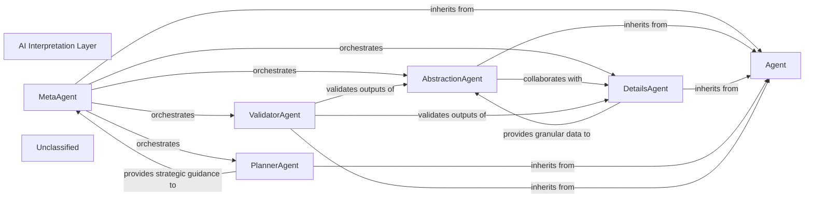

## Details

The AI Interpretation Layer subsystem is primarily defined by the `agents` package. It is the overarching core intelligence component that orchestrates AI-driven analysis, interprets LLM responses, and derives architectural insights. It acts as a multi-agent system, transforming raw LLM outputs and static analysis data into structured architectural knowledge, aligning with the project's AI-centric and pipeline-driven architectural bias.

### AI Interpretation Layer [[Expand]](./AI_Interpretation_Layer.md)
The overarching core intelligence component that orchestrates AI-driven analysis, interprets LLM responses, and derives architectural insights. It acts as a multi-agent system, transforming raw LLM outputs and static analysis data into structured architectural knowledge.

**Related Classes/Methods**:

- <a href="https://github.com/CodeBoarding/CodeBoarding/blob/main/.codeboardingagents/__init__.py" target="_blank" rel="noopener noreferrer">`agents`</a>

### Agent
Serves as the foundational base class or interface for all specialized agents within this layer, defining common methods and properties for agent behavior.

**Related Classes/Methods**:

- <a href="https://github.com/CodeBoarding/CodeBoarding/blob/main/.codeboardingagents/agent.py" target="_blank" rel="noopener noreferrer">`Agent`</a>

### MetaAgent
The primary orchestrator of the AI Interpretation Layer. It receives LLM responses and static analysis data, then delegates tasks to other agents to achieve comprehensive architectural insights, managing the overall workflow and interpretation strategy.

**Related Classes/Methods**:

- <a href="https://github.com/CodeBoarding/CodeBoarding/blob/main/.codeboardingagents/meta_agent.py" target="_blank" rel="noopener noreferrer">`MetaAgent`</a>

### AbstractionAgent
Responsible for synthesizing high-level architectural patterns, components, and relationships from raw LLM interpretations and static analysis data, focusing on deriving abstract insights.

**Related Classes/Methods**:

- <a href="https://github.com/CodeBoarding/CodeBoarding/blob/main/.codeboardingagents/abstraction_agent.py" target="_blank" rel="noopener noreferrer">`AbstractionAgent`</a>

### DetailsAgent
Extracts granular, specific details from LLM responses and code, complementing the AbstractionAgent by providing supporting evidence or finer-grained information.

**Related Classes/Methods**:

- <a href="https://github.com/CodeBoarding/CodeBoarding/blob/main/.codeboardingagents/details_agent.py" target="_blank" rel="noopener noreferrer">`DetailsAgent`</a>

### PlannerAgent
Determines the optimal sequence of analysis steps and the overall strategy for interpreting LLM responses, guiding the MetaAgent's orchestration.

**Related Classes/Methods**:

- <a href="https://github.com/CodeBoarding/CodeBoarding/blob/main/.codeboardingagents/planner_agent.py" target="_blank" rel="noopener noreferrer">`PlannerAgent`</a>

### ValidatorAgent
Responsible for reviewing and validating the architectural insights generated by other agents, ensuring accuracy, consistency, and completeness against static analysis data and predefined rules.

**Related Classes/Methods**:

- <a href="https://github.com/CodeBoarding/CodeBoarding/blob/main/.codeboardingagents/validator_agent.py" target="_blank" rel="noopener noreferrer">`ValidatorAgent`</a>

### Unclassified
Component for all unclassified files and utility functions (Utility functions/External Libraries/Dependencies)

**Related Classes/Methods**: _None_

### [FAQ](https://github.com/CodeBoarding/GeneratedOnBoardings/tree/main?tab=readme-ov-file#faq)
