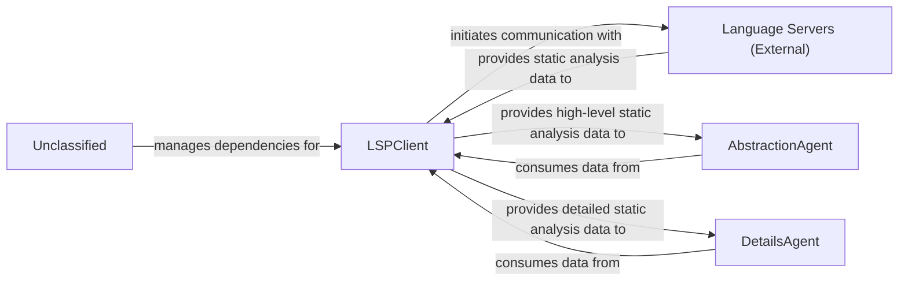

## Details

The system's core revolves around the LSPClient, which establishes and manages communication with external Language Servers to gather comprehensive static analysis data. This client now incorporates enhanced mechanisms for defining, detecting, and configuring programming languages, making it a more sophisticated and flexible data acquisition layer. The collected data is then channeled to two specialized agents: the AbstractionAgent, which distills high-level architectural views, and the DetailsAgent, which performs granular analysis of specific code sections. External Language Servers provide the raw code intelligence, while the Unclassified component manages project dependencies and packaging, ensuring the operational integrity of the entire system.

### LSPClient
Establishes and manages communication with external Language Servers using the Language Server Protocol (LSP). It orchestrates the collection of comprehensive static analysis data, including call graphs, class hierarchies, package relations, and symbol references. It now features enhanced and more flexible mechanisms for defining, detecting, and configuring programming languages, acting as a robust data acquisition layer with sophisticated language-specific configuration handling. It also features enhanced integration with the VSCode environment, leveraging specific configurations and data structures for refined interaction within a VSCode context.

**Related Classes/Methods**:

- <a href="https://github.com/CodeBoarding/CodeBoarding/blob/main/.codeboardingstatic_analyzer/lsp_client/client.py#L58-L1097" target="_blank" rel="noopener noreferrer">`LSPClient`:58-1097</a>

### AbstractionAgent
Consumes high-level static analysis data provided by the LSPClient to identify major system components, their primary responsibilities, and interconnections, forming an abstract architectural representation. It distills complex codebases into understandable, high-level architectural views.

**Related Classes/Methods**:

- <a href="https://github.com/CodeBoarding/CodeBoarding/blob/main/.codeboardingagents/agent.py" target="_blank" rel="noopener noreferrer">`AbstractionAgent`</a>

### DetailsAgent
Utilizes detailed static analysis data from the LSPClient to perform granular analysis within specific architectural components or code sections. It delves into implementation details, identifies specific design patterns, explains the rationale behind code structures, and highlights areas of interest or concern.

**Related Classes/Methods**:

- <a href="https://github.com/CodeBoarding/CodeBoarding/blob/main/.codeboardingagents/agent.py" target="_blank" rel="noopener noreferrer">`DetailsAgent`</a>

### Language Servers (External)
External processes that provide static analysis capabilities for specific programming languages. They respond to LSP requests from the LSPClient with code intelligence data such as symbol definitions, references, call hierarchies, and type information.

**Related Classes/Methods**:

### Unclassified
Component for all unclassified files, utility functions, and external libraries/dependencies. This includes managing project dependencies and packaging configurations as defined in `setup.py`, which may introduce new external libraries or alter project build and deployment characteristics.

**Related Classes/Methods**:

- <a href="https://github.com/CodeBoarding/CodeBoarding/blob/main/.codeboardingsetup.py" target="_blank" rel="noopener noreferrer">`setup.py`</a>

### Unclassified
Component for all unclassified files and utility functions (Utility functions/External Libraries/Dependencies)

**Related Classes/Methods**: _None_

### [FAQ](https://github.com/CodeBoarding/GeneratedOnBoardings/tree/main?tab=readme-ov-file#faq)
