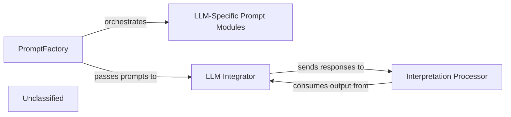

## Details

The system initiates by leveraging the PromptFactory to dynamically generate prompts, which are then specialized by LLM-Specific Prompt Modules to suit the chosen LLM. The LLM Integrator configures and manages the connection to the external LLM service, sending the prepared prompts. Upon receiving responses, the Interpretation Processor, embodied by various agents, processes and interprets the LLM's output, driving the subsequent analytical or operational tasks within the system. The architecture is centered around an intelligent agent system that dynamically interacts with various Large Language Models (LLMs). The PromptFactory and its LLM-Specific Prompt Modules form the core of prompt generation, ensuring adaptability across different LLM providers. The LLM Integrator acts as the crucial interface for external LLM communication, handling configuration and API interactions. Finally, the Interpretation Processor, represented by the Agent and MetaAgent components, is responsible for making sense of the LLM responses, driving the system's analytical and operational capabilities. This modular design allows for flexible integration of new LLMs and prompt strategies, while maintaining a clear separation of concerns for prompt management, LLM interaction, and response interpretation.

### PromptFactory
The primary component for generating and managing prompts. It dynamically constructs prompts tailored to specific LLMs and analysis tasks, incorporating static analysis data and contextual information. This component is crucial for the adaptability of the system to different LLM providers and varying analysis requirements.

**Related Classes/Methods**:

- <a href="https://github.com/CodeBoarding/CodeBoarding/blob/main/.codeboardingagents/prompts/prompt_factory.py" target="_blank" rel="noopener noreferrer">`agents.prompts.prompt_factory.PromptFactory`</a>

### LLM-Specific Prompt Modules
Specializes in creating and managing prompt segments or full prompts for particular LLM providers (e.g., Claude, OpenAI, Google). These modules handle the nuances of each LLM's input format, token limits, and specific prompting strategies (e.g., bidirectional for conversational flows).

**Related Classes/Methods**:

- <a href="https://github.com/CodeBoarding/CodeBoarding/blob/main/.codeboardingagents/prompts/claude_prompts_bidirectional.py" target="_blank" rel="noopener noreferrer">`agents.prompts.claude_prompts_bidirectional.ClaudeBidirectionalPromptFactory`</a>

### LLM Integrator
This component is responsible for configuring and managing the interaction with various external LLM services. It handles the setup of LLM models and their specific parameters, acting as the bridge between the application and the LLM providers.

**Related Classes/Methods**:

- <a href="https://github.com/CodeBoarding/CodeBoarding/blob/main/.codeboardingagents/llm_config.py" target="_blank" rel="noopener noreferrer">`agents.llm_config`</a>

### Interpretation Processor
This component is responsible for processing and interpreting the responses received from the LLMs. It encompasses the logic for agents that utilize LLM outputs to perform specific tasks, such as analysis, planning, or validation, and orchestrates the overall flow of information within the agent system.

**Related Classes/Methods**:

- <a href="https://github.com/CodeBoarding/CodeBoarding/blob/main/.codeboardingagents/agent.py" target="_blank" rel="noopener noreferrer">`agents.agent.Agent`</a>
- <a href="https://github.com/CodeBoarding/CodeBoarding/blob/main/.codeboardingagents/meta_agent.py" target="_blank" rel="noopener noreferrer">`agents.meta_agent.MetaAgent`</a>

### Unclassified
Component for all unclassified files and utility functions (Utility functions/External Libraries/Dependencies)

**Related Classes/Methods**: _None_

### [FAQ](https://github.com/CodeBoarding/GeneratedOnBoardings/tree/main?tab=readme-ov-file#faq)
