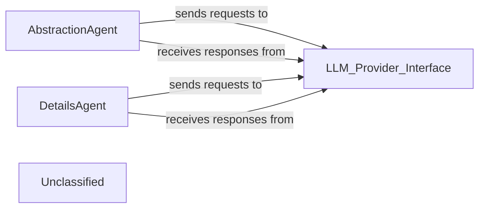

## Details

The system's core functionality revolves around two primary agents, AbstractionAgent and DetailsAgent, which are responsible for interpreting static analysis data at different levels of granularity. Both agents rely on a conceptual LLM_Provider_Interface to interact with Large Language Models. This interface acts as a crucial abstraction layer, standardizing communication with various LLM providers and handling underlying complexities like API calls and authentication. The architecture is centered on two specialized agents, AbstractionAgent and DetailsAgent, each designed for distinct levels of static analysis interpretation. The AbstractionAgent focuses on high-level architectural understanding, while the DetailsAgent delves into granular code specifics. Both agents communicate with external Large Language Models through a unified LLM_Provider_Interface. This interface is a critical abstraction, managing the complexities of LLM interactions and ensuring a consistent communication layer for the agents. This design promotes modularity and allows for flexible integration with different LLM services, enabling the agents to effectively process and interpret static analysis data to generate comprehensive architectural insights.

### AbstractionAgent
Interprets structured static analysis data to derive and generate high-level architectural understanding and insights, including identifying major components, their relationships, and overall system design patterns. This agent focuses on macro-level architectural interpretation.

**Related Classes/Methods**:

- <a href="https://github.com/CodeBoarding/CodeBoarding/blob/main/.codeboardingagents/abstraction_agent.py" target="_blank" rel="noopener noreferrer">`AbstractionAgent`</a>

### DetailsAgent
Interprets structured static analysis data to derive and generate detailed code context and specific, granular insights, including understanding class structures, method functionalities, and local dependencies. This agent focuses on micro-level code interpretation.

**Related Classes/Methods**:

- <a href="https://github.com/CodeBoarding/CodeBoarding/blob/main/.codeboardingagents/details_agent.py" target="_blank" rel="noopener noreferrer">`DetailsAgent`</a>

### LLM_Provider_Interface
Abstracts away the specifics of different LLM providers, providing a unified interface for agents to interact with various large language models. It handles API calls, authentication, rate limiting, and basic error handling, ensuring a consistent interaction layer for all LLM-dependent components.

**Related Classes/Methods**:

- `LLM_Provider_Interface`

### Unclassified
Component for all unclassified files and utility functions (Utility functions/External Libraries/Dependencies)

**Related Classes/Methods**: _None_

### [FAQ](https://github.com/CodeBoarding/GeneratedOnBoardings/tree/main?tab=readme-ov-file#faq)
