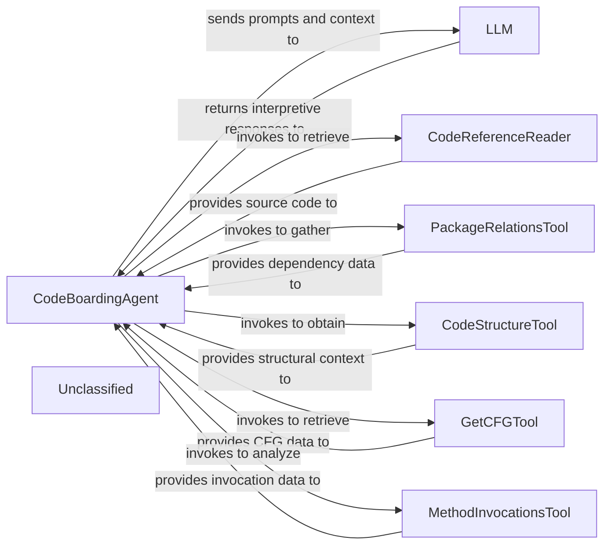

## Details

The `CodeBoardingAgent` acts as the central intelligence, orchestrating the entire code interpretation process. It interacts with the `LLM` to process and interpret architectural patterns from code. To gather the necessary context for the `LLM`, the `CodeBoardingAgent` leverages a suite of specialized tools: `CodeReferenceReader` for source code retrieval, `PackageRelationsTool` for dependency analysis, `CodeStructureTool` for understanding code organization, `GetCFGTool` for control flow analysis, and `MethodInvocationsTool` for method interaction insights. This modular design allows the `CodeBoardingAgent` to dynamically gather and feed comprehensive code context to the `LLM`, enabling robust architectural analysis and insight generation.

### CodeBoardingAgent
The central orchestrator of the AI interpretation process. It manages LLM selection, prompt engineering, tool invocation for gathering context, and parsing of LLM responses. It translates raw static analysis data into actionable architectural insights.

**Related Classes/Methods**:

- <a href="https://github.com/CodeBoarding/CodeBoarding/blob/main/.codeboardingagents/agent.py" target="_blank" rel="noopener noreferrer">`CodeBoardingAgent`</a>

### LLM
The core AI engine responsible for performing the actual interpretation of code context. It identifies architectural patterns, generates explanations, and responds to prompts provided by the `CodeBoardingAgent`.

**Related Classes/Methods**:

- <a href="https://github.com/CodeBoarding/CodeBoarding/blob/main/.codeboardingagents/agent.py#L86-L153" target="_blank" rel="noopener noreferrer">`LLM`:86-153</a>

### CodeReferenceReader
A specialized tool that abstracts the retrieval of source code based on fully qualified names. It provides the `CodeBoardingAgent` with specific code snippets for detailed LLM analysis.

**Related Classes/Methods**:

- <a href="https://github.com/CodeBoarding/CodeBoarding/blob/main/.codeboardingagents/tools/read_source.py#L26-L114" target="_blank" rel="noopener noreferrer">`CodeReferenceReader`:26-114</a>

### PackageRelationsTool
A specialized tool that abstracts the analysis of package dependencies. It supplies the `CodeBoardingAgent` with data on how modules and packages relate, enabling architectural pattern identification.

**Related Classes/Methods**:

- <a href="https://github.com/CodeBoarding/CodeBoarding/blob/main/.codeboardingagents/tools/read_packages.py#L29-L69" target="_blank" rel="noopener noreferrer">`PackageRelationsTool`:29-69</a>

### CodeStructureTool
A specialized tool that abstracts the understanding of code structure, such as class hierarchies and internal organization. It provides structural context to the `CodeBoardingAgent` for LLM interpretation.

**Related Classes/Methods**:

- <a href="https://github.com/CodeBoarding/CodeBoarding/blob/main/.codeboardingagents/tools/read_structure.py#L17-L58" target="_blank" rel="noopener noreferrer">`CodeStructureTool`:17-58</a>

### GetCFGTool
A specialized tool that abstracts the retrieval of Control Flow Graphs (CFGs). It provides the `CodeBoardingAgent` with data on execution paths, enabling the `LLM` to interpret behavioral patterns.

**Related Classes/Methods**:

- <a href="https://github.com/CodeBoarding/CodeBoarding/blob/main/.codeboardingagents/tools/read_cfg.py#L11-L68" target="_blank" rel="noopener noreferrer">`GetCFGTool`:11-68</a>

### MethodInvocationsTool
A specialized tool that abstracts the analysis of method invocation patterns. It delivers data on how methods interact, assisting the `CodeBoardingAgent` and `LLM` in understanding component interactions and data flow.

**Related Classes/Methods**:

- <a href="https://github.com/CodeBoarding/CodeBoarding/blob/main/.codeboardingagents/tools/get_method_invocations.py#L17-L54" target="_blank" rel="noopener noreferrer">`MethodInvocationsTool`:17-54</a>

### Unclassified
Component for all unclassified files and utility functions (Utility functions/External Libraries/Dependencies)

**Related Classes/Methods**: _None_

### [FAQ](https://github.com/CodeBoarding/GeneratedOnBoardings/tree/main?tab=readme-ov-file#faq)
