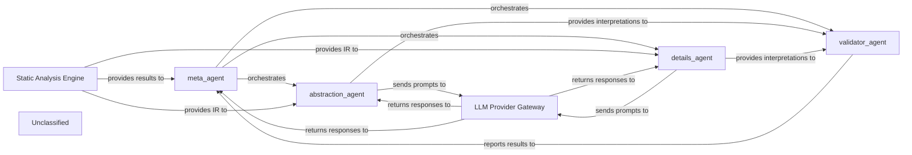

## Details

The AI Interpretation Layer is orchestrated by the `meta_agent`, which directs the flow of analysis. It receives initial static analysis results, including an Intermediate Representation (IR), from the `Static Analysis Engine`. The `meta_agent` then delegates tasks to specialized agents: the `abstraction_agent` for high-level insights and the `details_agent` for granular information. Both `abstraction_agent` and `details_agent` interact with the `LLM Provider Gateway` to leverage Large Language Models for interpretation. Their generated interpretations are then passed to the `validator_agent` for quality assurance. Finally, the `validator_agent` reports its findings back to the `meta_agent`, which aggregates and synthesizes the complete interpretation before delivering it to the `Output Generation Engine` for final presentation. This architecture ensures a structured, multi-faceted approach to code analysis and interpretation.

### meta_agent
Orchestrates the overall interpretation process, invoking other agents, managing information flow, and synthesizing their outputs. It acts as the primary control point for the AI Interpretation Layer.

**Related Classes/Methods**:

- <a href="https://github.com/CodeBoarding/CodeBoarding/blob/main/.codeboardingagents/meta_agent.py" target="_blank" rel="noopener noreferrer">`agents.meta_agent.MetaAgent`</a>

### abstraction_agent
Interprets static analysis results to identify high-level concepts, architectural patterns, and summarized insights.

**Related Classes/Methods**:

- <a href="https://github.com/CodeBoarding/CodeBoarding/blob/main/.codeboardingagents/abstraction_agent.py" target="_blank" rel="noopener noreferrer">`agents.abstraction_agent.AbstractionAgent`</a>

### details_agent
Extracts granular details, specific code characteristics, and detailed explanations from static analysis results.

**Related Classes/Methods**:

- <a href="https://github.com/CodeBoarding/CodeBoarding/blob/main/.codeboardingagents/details_agent.py" target="_blank" rel="noopener noreferrer">`agents.details_agent.DetailsAgent`</a>

### validator_agent
Validates interpretations from `abstraction_agent` and `details_agent` for consistency, accuracy, and completeness.

**Related Classes/Methods**:

- <a href="https://github.com/CodeBoarding/CodeBoarding/blob/main/.codeboardingagents/validator_agent.py" target="_blank" rel="noopener noreferrer">`agents.validator_agent.ValidatorAgent`</a>

### Static Analysis Engine [[Expand]](./Static_Analysis_Engine.md)
Performs static analysis on the codebase, generating an Intermediate Representation (IR) and identifying characteristics, issues, and vulnerabilities. This component implicitly includes the "Intermediate Representation (IR) Generator" functionality.

**Related Classes/Methods**:

- <a href="https://github.com/CodeBoarding/CodeBoarding/blob/main/.codeboardingstatic_analyzer/__init__.py" target="_blank" rel="noopener noreferrer">`static_analyzer`</a>

### LLM Provider Gateway
Provides a standardized interface for all agents to interact with Large Language Models (LLMs) for generating interpretations. This is handled by the `llm` attribute within `CodeBoardingAgent`.

**Related Classes/Methods**:

- <a href="https://github.com/CodeBoarding/CodeBoarding/blob/main/.codeboardingagents/agent.py" target="_blank" rel="noopener noreferrer">`agents.agent.CodeBoardingAgent`</a>

### Unclassified
Component for all unclassified files and utility functions (Utility functions/External Libraries/Dependencies)

**Related Classes/Methods**: _None_

### [FAQ](https://github.com/CodeBoarding/GeneratedOnBoardings/tree/main?tab=readme-ov-file#faq)
