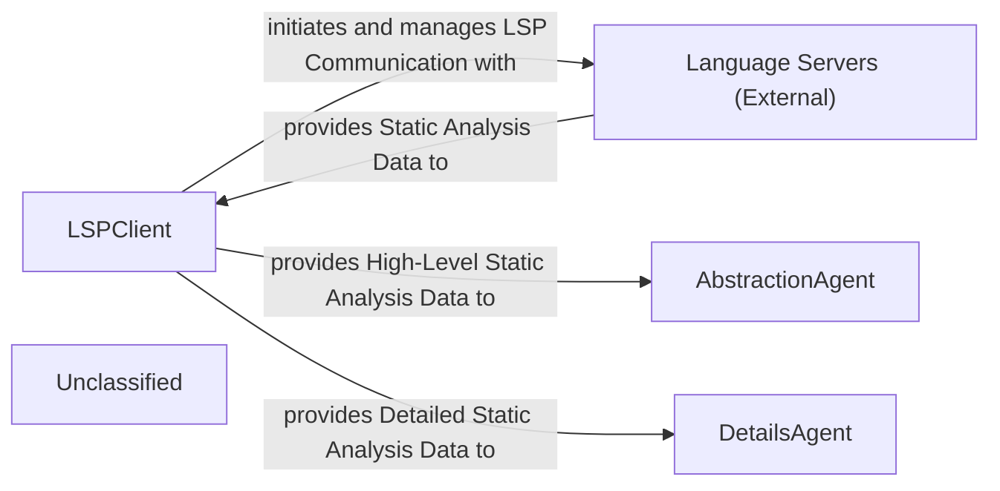

## Details

The static analysis subsystem is anchored by the LSPClient, a pivotal component responsible for interfacing with external Language Servers to gather comprehensive code intelligence. The LSPClient establishes and maintains LSP connections, orchestrating the collection of critical static analysis data such as call graphs, class hierarchies, package dependencies, and symbol references. This data forms the foundational input for the system's analytical capabilities. The AbstractionAgent then processes this information to generate high-level architectural overviews, identifying core components and their interrelationships. Simultaneously, the DetailsAgent delves into the granular static analysis data to provide in-depth insights into specific code structures and design patterns. The recent significant refinements to the LSPClient, including enhanced Windows compatibility, underscore its role as a robust and reliable data acquisition layer, directly impacting the quality and breadth of analysis performed by both the AbstractionAgent and DetailsAgent.

### LSPClient
Establishes and manages communication with external Language Servers using the Language Server Protocol (LSP). Orchestrates the collection of comprehensive static analysis data, including call graphs, class hierarchies, package relations, and symbol references. Filters source files and handles language-specific configurations. The recent changes indicate an expansion and refinement of its capabilities, including improved Windows compatibility, making it a more robust data acquisition layer.

**Related Classes/Methods**:

- <a href="https://github.com/CodeBoarding/CodeBoarding/blob/main/.codeboardingstatic_analyzer/lsp_client/client.py" target="_blank" rel="noopener noreferrer">`static_analyzer/lsp_client/client.py`</a>

### AbstractionAgent
Consumes the static analysis data provided by the LSPClient to identify major system components, their primary responsibilities, and interconnections, forming an abstract architectural representation. It distills complex codebases into understandable, high-level architectural views.

**Related Classes/Methods**:

- <a href="https://github.com/CodeBoarding/CodeBoarding/blob/main/.codeboardingagents/abstraction_agent.py" target="_blank" rel="noopener noreferrer">`agents/abstraction_agent.py`</a>

### DetailsAgent
Utilizes the detailed static analysis data from the LSPClient to perform granular analysis within specific architectural components or code sections. It delves into implementation details, identifies specific design patterns, explains the rationale behind code structures, and highlights areas of interest or concern.

**Related Classes/Methods**:

- <a href="https://github.com/CodeBoarding/CodeBoarding/blob/main/.codeboardingagents/details_agent.py" target="_blank" rel="noopener noreferrer">`agents/details_agent.py`</a>

### Language Servers (External)
External processes that provide static analysis capabilities for specific programming languages. They respond to LSP requests from the LSPClient with code intelligence data such as symbol definitions, references, call hierarchies, and type information.

**Related Classes/Methods**:

- `External.LanguageServers`

### Unclassified
Component for all unclassified files and utility functions (Utility functions/External Libraries/Dependencies)

**Related Classes/Methods**: _None_

### [FAQ](https://github.com/CodeBoarding/GeneratedOnBoardings/tree/main?tab=readme-ov-file#faq)
