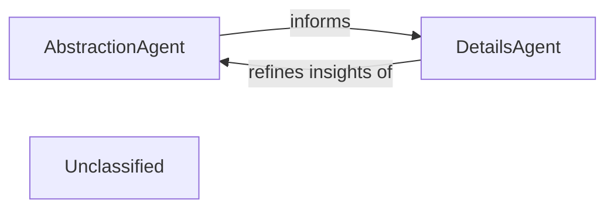

## Details

The AI Interpretation Layer is responsible for interfacing with various Large Language Model (LLM) providers to process static analysis results and user prompts. Its primary function is to interpret code context and generate architectural insights, encompassing both high-level abstraction and detailed analysis. The core components defining this layer are AbstractionAgent and DetailsAgent. The layer operates as a two-stage process where the AbstractionAgent first establishes a foundational, high-level understanding of the codebase. This abstract view then serves as input and context for the DetailsAgent, which performs a more granular analysis on specific parts. The detailed insights from the DetailsAgent can then feedback to refine or validate the initial abstractions, creating a complementary and iterative analytical workflow.

### AbstractionAgent
This agent focuses on generating high-level architectural views from the detailed static analysis data. It identifies major system components, their primary responsibilities, and their interconnections, distilling complex codebases into understandable, abstract architectural representations. This component is crucial for establishing the initial architectural blueprint.

**Related Classes/Methods**:

- <a href="https://github.com/CodeBoarding/CodeBoarding/blob/main/.codeboardingagents/abstraction_agent.py" target="_blank" rel="noopener noreferrer">`abstraction_agent`</a>

### DetailsAgent
This agent provides granular insights and detailed analysis within specific architectural components or code sections, often identified or guided by the AbstractionAgent. It delves into implementation details, identifies specific design patterns, explains the rationale behind code structures, and highlights areas of interest or concern. This component adds depth and specificity to the architectural understanding.

**Related Classes/Methods**:

- <a href="https://github.com/CodeBoarding/CodeBoarding/blob/main/.codeboardingagents/details_agent.py" target="_blank" rel="noopener noreferrer">`details_agent`</a>

### Unclassified
Component for all unclassified files and utility functions (Utility functions/External Libraries/Dependencies)

**Related Classes/Methods**: _None_

### [FAQ](https://github.com/CodeBoarding/GeneratedOnBoardings/tree/main?tab=readme-ov-file#faq)
