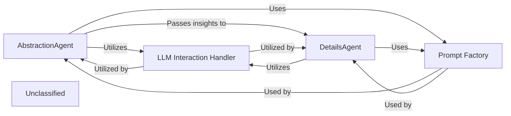

## Details

The core of the system revolves around two primary agents, `AbstractionAgent` and `DetailsAgent`, which collaboratively perform AI-driven architectural analysis. The `AbstractionAgent` initiates the process by transforming raw static analysis data into high-level architectural concepts, leveraging LLMs for interpretation. Subsequently, the `DetailsAgent` refines these abstractions, extracting granular insights. Both agents rely on a `LLM Interaction Handler` to manage communication with various LLM providers, ensuring consistent API calls and response processing. A `Prompt Factory` component is crucial for both agents, providing optimized prompt templates and strategies to ensure effective and consistent interactions with the LLMs, thereby maintaining the quality and relevance of the architectural interpretations. This modular design allows for flexible integration of different LLM technologies and robust prompt management.

### AbstractionAgent
Responsible for abstracting raw static analysis data into higher-level architectural concepts, identifying components, patterns, and relationships by formulating prompts for LLMs. This agent initiates the AI-driven analysis.

**Related Classes/Methods**:

- <a href="https://github.com/CodeBoarding/CodeBoarding/blob/main/.codeboardingagents/abstraction_agent.py" target="_blank" rel="noopener noreferrer">`AbstractionAgent`</a>

### DetailsAgent
Complements the AbstractionAgent by refining initial abstractions, extracting specific details, or providing granular insights into the architecture using LLMs. It acts on the insights provided by the AbstractionAgent.

**Related Classes/Methods**:

- <a href="https://github.com/CodeBoarding/CodeBoarding/blob/main/.codeboardingagents/details_agent.py" target="_blank" rel="noopener noreferrer">`DetailsAgent`</a>

### LLM Interaction Handler
This component is responsible for abstracting away the specifics of various LLM APIs, handling API calls, authentication, and response normalization for diverse LLM providers. It ensures the system's adaptability to different LLM technologies.

**Related Classes/Methods**:

- <a href="https://github.com/CodeBoarding/CodeBoarding/blob/main/.codeboardingagents/agent.py" target="_blank" rel="noopener noreferrer">`agents.agent.Agent`</a>

### Prompt Factory [[Expand]](./Prompt_Factory.md)
Manages prompt templates, context windows, and strategies to optimize LLM responses, ensuring consistent and effective communication with LLMs for architectural interpretation. This component ensures the quality and consistency of LLM interactions.

**Related Classes/Methods**:

- <a href="https://github.com/CodeBoarding/CodeBoarding/blob/main/.codeboardingagents/prompts/prompt_factory.py" target="_blank" rel="noopener noreferrer">`agents.prompts.prompt_factory.PromptFactory`</a>

### Unclassified
Component for all unclassified files and utility functions (Utility functions/External Libraries/Dependencies)

**Related Classes/Methods**: _None_

### [FAQ](https://github.com/CodeBoarding/GeneratedOnBoardings/tree/main?tab=readme-ov-file#faq)
