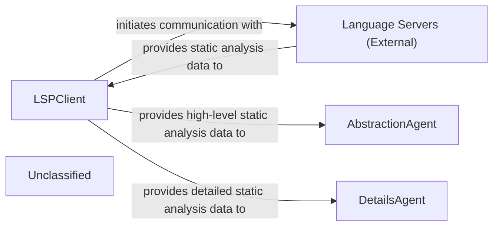

## Details

The system's architecture is centered around the LSPClient, which acts as the primary interface for interacting with Language Servers (External) to gather comprehensive static analysis data. This data is then channeled to two specialized agents: the AbstractionAgent and the DetailsAgent. The AbstractionAgent is responsible for synthesizing high-level architectural views from the static analysis, while the DetailsAgent performs in-depth, granular analysis of specific code sections. Recent internal enhancements to the agents, particularly within agents/agent.py, indicate a continuous refinement of their analytical capabilities, ensuring a more robust and capable analysis process without altering the fundamental architectural structure or inter-component communication.

### LSPClient
Establishes and manages communication with external Language Servers using the Language Server Protocol (LSP). It orchestrates the collection of comprehensive static analysis data, including call graphs, class hierarchies, package relations, and symbol references. It filters source files and handles language-specific configurations, acting as a robust data acquisition layer.

**Related Classes/Methods**:

- <a href="https://github.com/CodeBoarding/CodeBoarding/blob/main/.codeboardingstatic_analyzer/lsp_client/client.py#L58-L1097" target="_blank" rel="noopener noreferrer">`LSPClient`:58-1097</a>

### AbstractionAgent
Consumes high-level static analysis data provided by the LSPClient to identify major system components, their primary responsibilities, and interconnections, forming an abstract architectural representation. It distills complex codebases into understandable, high-level architectural views.

**Related Classes/Methods**:

- <a href="https://github.com/CodeBoarding/CodeBoarding/blob/main/.codeboardingagents/agent.py" target="_blank" rel="noopener noreferrer">`AbstractionAgent`</a>

### DetailsAgent
Utilizes detailed static analysis data from the LSPClient to perform granular analysis within specific architectural components or code sections. It delves into implementation details, identifies specific design patterns, explains the rationale behind code structures, and highlights areas of interest or concern.

**Related Classes/Methods**:

- <a href="https://github.com/CodeBoarding/CodeBoarding/blob/main/.codeboardingagents/agent.py" target="_blank" rel="noopener noreferrer">`DetailsAgent`</a>

### Language Servers (External)
External processes that provide static analysis capabilities for specific programming languages. They respond to LSP requests from the LSPClient with code intelligence data such as symbol definitions, references, call hierarchies, and type information.

**Related Classes/Methods**:

- `LSP_Protocol`:1-10

### Unclassified
Component for all unclassified files and utility functions (Utility functions/External Libraries/Dependencies)

**Related Classes/Methods**: _None_

### [FAQ](https://github.com/CodeBoarding/GeneratedOnBoardings/tree/main?tab=readme-ov-file#faq)
