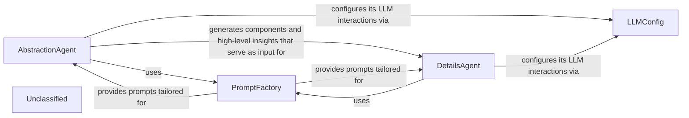

## Details

The core of the system revolves around two primary agents, `AbstractionAgent` and `DetailsAgent`, which collaboratively perform a multi-stage analysis of a project. The `AbstractionAgent` initiates the process by conducting a high-level architectural analysis, identifying abstract components, and classifying files. This initial analysis then feeds into the `DetailsAgent`, which performs a more granular, in-depth examination of each identified component. Both agents rely on the `PromptFactory` for dynamic prompt generation tailored to specific LLM providers and tasks, ensuring consistent and flexible interaction with Large Language Models. The `LLMConfig` component provides a centralized configuration for these LLM interactions, managing model selection and API parameters. This structured approach allows for a comprehensive understanding of the project's architecture, from abstract components to detailed internal structures.

### AbstractionAgent
Performs initial, high-level architectural analysis of the entire project. This includes analyzing Control Flow Graphs (CFGs) and source code to identify abstract components and generate overall project insights. It also classifies files into these high-level components.

**Related Classes/Methods**:

- <a href="https://github.com/CodeBoarding/CodeBoarding/blob/main/.codeboardingagents/abstraction_agent.py" target="_blank" rel="noopener noreferrer">`agents.abstraction_agent.AbstractionAgent`</a>

### DetailsAgent
Conducts in-depth, granular analysis of specific components identified by the AbstractionAgent. It refines the structural understanding of individual components, generates detailed documentation, and further classifies files within those components.

**Related Classes/Methods**:

- <a href="https://github.com/CodeBoarding/CodeBoarding/blob/main/.codeboardingagents/details_agent.py" target="_blank" rel="noopener noreferrer">`agents.details_agent.DetailsAgent`</a>

### PromptFactory
Acts as a central manager for all LLM prompts. It dynamically selects and provides the correct prompt templates based on the chosen LLM provider and the desired prompt type (e.g., bidirectional, unidirectional). This ensures consistency and flexibility in prompt management.

**Related Classes/Methods**:

- <a href="https://github.com/CodeBoarding/CodeBoarding/blob/main/.codeboardingagents/prompts/prompt_factory.py" target="_blank" rel="noopener noreferrer">`agents.prompts.prompt_factory.PromptFactory`</a>

### LLMConfig
Provides a centralized and extensible configuration for integrating with various Large Language Model (LLM) providers. It defines the specific models to be used for different tasks (e.g., "agent" model for complex reasoning, "parsing" model for structured output), API keys, and other provider-specific parameters.

**Related Classes/Methods**:

- <a href="https://github.com/CodeBoarding/CodeBoarding/blob/main/.codeboardingagents/llm_config.py#L14-L52" target="_blank" rel="noopener noreferrer">`agents.llm_config.LLMConfig`:14-52</a>

### Unclassified
Component for all unclassified files and utility functions (Utility functions/External Libraries/Dependencies)

**Related Classes/Methods**: _None_

### [FAQ](https://github.com/CodeBoarding/GeneratedOnBoardings/tree/main?tab=readme-ov-file#faq)
