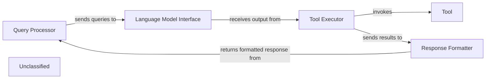

## Details

This graph represents the core functionality of a system that processes user queries, generates responses using a language model, and interacts with external tools. The main flow involves receiving a query, parsing it, invoking a language model to determine the appropriate action, executing that action (which might involve using a tool), and finally formatting and returning the response to the user. Its purpose is to provide a flexible and extensible framework for building AI-powered applications that can understand and act upon user requests.

### Query Processor
Handles incoming user queries, including parsing and initial validation.

**Related Classes/Methods**:

- `QueryParser:parse`

### Language Model Interface
Manages interactions with the underlying language model, sending prompts and receiving generated text.

**Related Classes/Methods**:

- `LLMClient:send_prompt`
- `LLMClient:receive_response`

### Tool Executor
Executes specific tools based on the language model's output, handling tool invocation and result retrieval.

**Related Classes/Methods**:

- <a href="https://github.com/CodeBoarding/CodeBoarding/blob/main/.codeboardingagents/tools/toolkit.py" target="_blank" rel="noopener noreferrer">`ToolRegistry:get_tool`</a>
- `Tool:execute`

### Response Formatter
Formats the final response to be sent back to the user, potentially combining information from the language model and tool outputs.

**Related Classes/Methods**:

- `ResponseBuilder:build`

### Unclassified
Component for all unclassified files and utility functions (Utility functions/External Libraries/Dependencies)

**Related Classes/Methods**: _None_

### [FAQ](https://github.com/CodeBoarding/GeneratedOnBoardings/tree/main?tab=readme-ov-file#faq)
