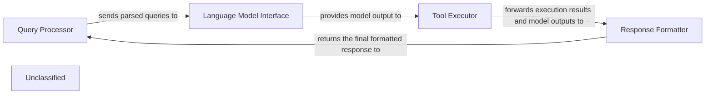

## Details

The system's core architecture revolves around processing user queries through a sequence of specialized components. The Query Processor initiates the flow by parsing incoming requests. These parsed queries are then forwarded to the Language Model Interface, which handles communication with the underlying language model. The output from the language model, which may include instructions for tool usage, is then managed by the Tool Executor. This component is responsible for orchestrating the invocation of various tools, incorporating sophisticated decision-making and execution logic. Finally, the Response Formatter aggregates and structures the information from both the language model and tool executions to construct a coherent and user-friendly response, which is then returned to the Query Processor. This design ensures a clear separation of concerns, enabling efficient and adaptable query processing and tool integration.

### Query Processor
Handles incoming user queries, including parsing and initial validation.

**Related Classes/Methods**:

### Language Model Interface
Manages interactions with the underlying language model, sending prompts and receiving generated text.

**Related Classes/Methods**:

- `LLMClient:send_prompt`

### Tool Executor
Orchestrates the execution of specific tools, incorporating complex decision-making and execution flows based on the language model's output. It manages tool invocation, result retrieval, and potentially iterative processing or re-prompting.

**Related Classes/Methods**:

- <a href="https://github.com/CodeBoarding/CodeBoarding/blob/main/.codeboardingagents/tools/toolkit.py" target="_blank" rel="noopener noreferrer">`ToolRegistry:get_tool`</a>
- <a href="https://github.com/CodeBoarding/CodeBoarding/blob/main/.codeboardingagents/tools/base.py#L57-L96" target="_blank" rel="noopener noreferrer">`Tool:execute`:57-96</a>

### Response Formatter
Formats the final response to be sent back to the user, combining information from the language model and tool outputs.

**Related Classes/Methods**:

- `ResponseBuilder:build`

### Unclassified
Component for all unclassified files and utility functions (Utility functions/External Libraries/Dependencies)

**Related Classes/Methods**: _None_

### [FAQ](https://github.com/CodeBoarding/GeneratedOnBoardings/tree/main?tab=readme-ov-file#faq)
