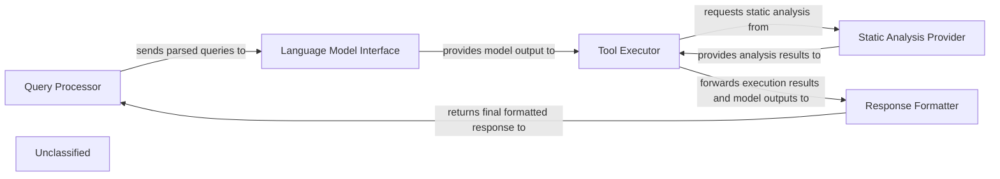

## Details

The system is designed around a core flow that begins with the Query Processor handling incoming user queries. These queries are then passed to the Language Model Interface for interaction with the underlying language model. The generated model output drives the Tool Executor, which orchestrates tool execution, now enhanced with sophisticated validation and the ability to leverage the Static Analysis Provider for deeper code understanding. Finally, the Response Formatter aggregates all information to construct and return the final response to the user. This architecture ensures a clear separation of concerns, enabling modular development and maintainability.

### Query Processor
Handles incoming user queries, including parsing and initial validation, and serves as the entry and exit point for user interaction.

**Related Classes/Methods**:

- <a href="https://github.com/CodeBoarding/CodeBoarding/blob/main/.codeboarding." target="_blank" rel="noopener noreferrer">`QueryParser:parse`</a>

### Language Model Interface
Manages communication with the underlying language model, sending prompts and receiving generated text.

**Related Classes/Methods**:

- <a href="https://github.com/CodeBoarding/CodeBoarding/blob/main/.codeboarding." target="_blank" rel="noopener noreferrer">`LLMClient:receive_response`</a>

### Tool Executor
Orchestrates tool execution, incorporating complex decision-making, enhanced validation, and iterative processing based on language model outputs. It can also leverage static analysis capabilities.

**Related Classes/Methods**:

- <a href="https://github.com/CodeBoarding/CodeBoarding/blob/main/.codeboardingagents/tools/toolkit.py" target="_blank" rel="noopener noreferrer">`ToolRegistry:get_tool`</a>
- <a href="https://github.com/CodeBoarding/CodeBoarding/blob/main/.codeboardingagents/tools/base.py#L57-L96" target="_blank" rel="noopener noreferrer">`Tool:execute`:57-96</a>

### Static Analysis Provider
Offers static analysis and reference resolution services to other components, primarily supporting the Tool Executor in understanding and validating code references.

**Related Classes/Methods**:

- <a href="https://github.com/CodeBoarding/CodeBoarding/blob/main/.codeboardingstatic_analyzer/reference_resolve_mixin.py" target="_blank" rel="noopener noreferrer">`static_analyzer/reference_resolve_mixin.py`</a>

### Response Formatter
Formats the final response by combining information from the language model and tool outputs before returning it to the user.

**Related Classes/Methods**:

### Unclassified
Component for all unclassified files and utility functions (Utility functions/External Libraries/Dependencies)

**Related Classes/Methods**: _None_

### [FAQ](https://github.com/CodeBoarding/GeneratedOnBoardings/tree/main?tab=readme-ov-file#faq)
