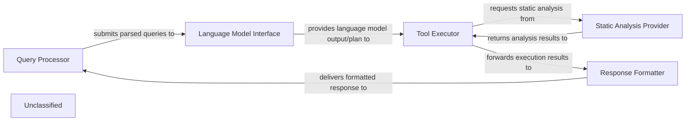

## Details

The system processes user queries through a structured flow, leveraging a language model and specialized tools, with static analysis capabilities. The Query Processor initiates the interaction, passing parsed queries to the Language Model Interface. The language model's output then guides the Tool Executor, which orchestrates tool usage, potentially consulting the Static Analysis Provider for validation or information. Finally, the Response Formatter synthesizes all outputs into a coherent response, delivered back via the Query Processor.

### Query Processor
Manages initial user query parsing, validation, and serves as the system's entry and exit point.

**Related Classes/Methods**:

### Language Model Interface
Handles all communication with the underlying language model, sending prompts and receiving generated responses.

**Related Classes/Methods**:

- `LanguageModelInterface`

### Tool Executor
Orchestrates the execution of tools, making decisions based on language model outputs, performing validation, and integrating static analysis.

**Related Classes/Methods**:

### Static Analysis Provider
Provides static analysis and code reference resolution services, primarily to support the Tool Executor.

**Related Classes/Methods**:

- `StaticAnalysisProvider`:1-10

### Response Formatter
Combines language model outputs and tool execution results to construct and format the final response for the user.

**Related Classes/Methods**:

- `ResponseFormatter`

### Unclassified
Component for all unclassified files and utility functions (Utility functions/External Libraries/Dependencies)

**Related Classes/Methods**: _None_

### [FAQ](https://github.com/CodeBoarding/GeneratedOnBoardings/tree/main?tab=readme-ov-file#faq)
