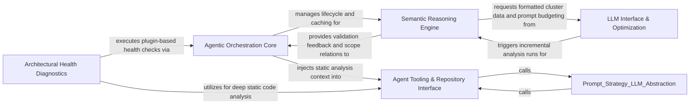

## Details

The system's brain, using LLMs for semantic interpretation of clusters and performing architectural health checks.

### Agent Tooling & Repository Interface
Provides the set of tools and interfaces that agents use to interact with the codebase and file system. This cluster contains the FileStructureTool and get_tree_string logic, allowing agents to perform discovery on the repository's file system, including directory caching and tree string generation.

**Related Classes/Methods**:

- `agents.tools.toolkit.CodeBoardingToolkit`:19-111
- `agents.tools.read_structure.CodeStructureTool`:14-49
- `agents.tools.read_source.CodeReferenceReader`:25-85

**Source Files:**

- [`agents/tools/read_file_structure.py`](https://github.com/CodeBoarding/CodeBoarding/blob/main/.codeboardingagents/tools/read_file_structure.py)
  - `agents.tools.read_file_structure.DirInput` ([L12-L19](https://github.com/CodeBoarding/CodeBoarding/blob/main/.codeboardingagents/tools/read_file_structure.py#L12-L19)) - Class
  - `agents.tools.read_file_structure.FileStructureTool` ([L22-L101](https://github.com/CodeBoarding/CodeBoarding/blob/main/.codeboardingagents/tools/read_file_structure.py#L22-L101)) - Class
  - `agents.tools.read_file_structure.FileStructureTool.cached_dirs` ([L34-L37](https://github.com/CodeBoarding/CodeBoarding/blob/main/.codeboardingagents/tools/read_file_structure.py#L34-L37)) - Method
  - `agents.tools.read_file_structure.FileStructureTool._run` ([L39-L101](https://github.com/CodeBoarding/CodeBoarding/blob/main/.codeboardingagents/tools/read_file_structure.py#L39-L101)) - Method
  - `agents.tools.read_file_structure.get_tree_string` ([L104-L155](https://github.com/CodeBoarding/CodeBoarding/blob/main/.codeboardingagents/tools/read_file_structure.py#L104-L155)) - Function
- [`agents/validation.py`](https://github.com/CodeBoarding/CodeBoarding/blob/main/.codeboardingagents/validation.py)
  - `agents.validation._build_cluster_edge_lookup` ([L586-L613](https://github.com/CodeBoarding/CodeBoarding/blob/main/.codeboardingagents/validation.py#L586-L613)) - Function
  - `agents.validation._check_edge_between_cluster_sets` ([L616-L654](https://github.com/CodeBoarding/CodeBoarding/blob/main/.codeboardingagents/validation.py#L616-L654)) - Function
- [`static_analyzer/__init__.py`](https://github.com/CodeBoarding/CodeBoarding/blob/main/.codeboardingstatic_analyzer/__init__.py)
  - `static_analyzer.__init__.StaticAnalysisFatalError` ([L47-L48](https://github.com/CodeBoarding/CodeBoarding/blob/main/.codeboardingstatic_analyzer/__init__.py#L47-L48)) - Class
  - `static_analyzer.__init__.StaticAnalyzer.collect_fresh_diagnostics` ([L337-L349](https://github.com/CodeBoarding/CodeBoarding/blob/main/.codeboardingstatic_analyzer/__init__.py#L337-L349)) - Method
  - `static_analyzer.__init__.StaticAnalyzer.notify_file_changed` ([L387-L404](https://github.com/CodeBoarding/CodeBoarding/blob/main/.codeboardingstatic_analyzer/__init__.py#L387-L404)) - Method
  - `static_analyzer.__init__.StaticAnalyzer.get_file_symbols` ([L406-L429](https://github.com/CodeBoarding/CodeBoarding/blob/main/.codeboardingstatic_analyzer/__init__.py#L406-L429)) - Method
  - `static_analyzer.__init__.StaticAnalyzer.get_adapter_for_file` ([L431-L437](https://github.com/CodeBoarding/CodeBoarding/blob/main/.codeboardingstatic_analyzer/__init__.py#L431-L437)) - Method
  - `static_analyzer.__init__.StaticAnalyzer.analyze` ([L490-L549](https://github.com/CodeBoarding/CodeBoarding/blob/main/.codeboardingstatic_analyzer/__init__.py#L490-L549)) - Method
  - `static_analyzer.__init__.StaticAnalyzer._run_full_lsp_pass` ([L551-L591](https://github.com/CodeBoarding/CodeBoarding/blob/main/.codeboardingstatic_analyzer/__init__.py#L551-L591)) - Method
  - `static_analyzer.__init__.StaticAnalyzer._update_cached_results` ([L593-L639](https://github.com/CodeBoarding/CodeBoarding/blob/main/.codeboardingstatic_analyzer/__init__.py#L593-L639)) - Method
  - `static_analyzer.__init__.StaticAnalyzer._absorb_into_results` ([L666-L673](https://github.com/CodeBoarding/CodeBoarding/blob/main/.codeboardingstatic_analyzer/__init__.py#L666-L673)) - Method
  - `static_analyzer.__init__.StaticAnalyzer._collect_diagnostics_for` ([L675-L697](https://github.com/CodeBoarding/CodeBoarding/blob/main/.codeboardingstatic_analyzer/__init__.py#L675-L697)) - Method
  - `static_analyzer.__init__.StaticAnalyzer._loc_for_adapter` ([L699-L707](https://github.com/CodeBoarding/CodeBoarding/blob/main/.codeboardingstatic_analyzer/__init__.py#L699-L707)) - Method
  - `static_analyzer.__init__.StaticAnalyzer._run_full_analysis` ([L709-L750](https://github.com/CodeBoarding/CodeBoarding/blob/main/.codeboardingstatic_analyzer/__init__.py#L709-L750)) - Method
  - `static_analyzer.__init__.StaticAnalyzer._validate_analysis_results` ([L752-L771](https://github.com/CodeBoarding/CodeBoarding/blob/main/.codeboardingstatic_analyzer/__init__.py#L752-L771)) - Method
- [`static_analyzer/analysis_cache.py`](https://github.com/CodeBoarding/CodeBoarding/blob/main/.codeboardingstatic_analyzer/analysis_cache.py)
  - `static_analyzer.analysis_cache.invalidate_files` ([L336-L390](https://github.com/CodeBoarding/CodeBoarding/blob/main/.codeboardingstatic_analyzer/analysis_cache.py#L336-L390)) - Function
  - `static_analyzer.analysis_cache.merge_results` ([L393-L422](https://github.com/CodeBoarding/CodeBoarding/blob/main/.codeboardingstatic_analyzer/analysis_cache.py#L393-L422)) - Function
  - `static_analyzer.analysis_cache._validate_no_dangling_references` ([L436-L469](https://github.com/CodeBoarding/CodeBoarding/blob/main/.codeboardingstatic_analyzer/analysis_cache.py#L436-L469)) - Function
- [`static_analyzer/analysis_result.py`](https://github.com/CodeBoarding/CodeBoarding/blob/main/.codeboardingstatic_analyzer/analysis_result.py)
  - `static_analyzer.analysis_result.StaticAnalysisResults` ([L166-L317](https://github.com/CodeBoarding/CodeBoarding/blob/main/.codeboardingstatic_analyzer/analysis_result.py#L166-L317)) - Class
  - `static_analyzer.analysis_result.StaticAnalysisResults._bucket` ([L177-L178](https://github.com/CodeBoarding/CodeBoarding/blob/main/.codeboardingstatic_analyzer/analysis_result.py#L177-L178)) - Method
  - `static_analyzer.analysis_result.StaticAnalysisResults.add_class_hierarchy` ([L184-L186](https://github.com/CodeBoarding/CodeBoarding/blob/main/.codeboardingstatic_analyzer/analysis_result.py#L184-L186)) - Method
  - `static_analyzer.analysis_result.StaticAnalysisResults.add_cfg` ([L188-L190](https://github.com/CodeBoarding/CodeBoarding/blob/main/.codeboardingstatic_analyzer/analysis_result.py#L188-L190)) - Method
  - `static_analyzer.analysis_result.StaticAnalysisResults.add_package_dependencies` ([L192-L194](https://github.com/CodeBoarding/CodeBoarding/blob/main/.codeboardingstatic_analyzer/analysis_result.py#L192-L194)) - Method
  - `static_analyzer.analysis_result.StaticAnalysisResults.add_references` ([L196-L202](https://github.com/CodeBoarding/CodeBoarding/blob/main/.codeboardingstatic_analyzer/analysis_result.py#L196-L202)) - Method
  - `static_analyzer.analysis_result.StaticAnalysisResults.add_source_files` ([L301-L303](https://github.com/CodeBoarding/CodeBoarding/blob/main/.codeboardingstatic_analyzer/analysis_result.py#L301-L303)) - Method
- [`static_analyzer/cluster_relations.py`](https://github.com/CodeBoarding/CodeBoarding/blob/main/.codeboardingstatic_analyzer/cluster_relations.py)
  - `static_analyzer.cluster_relations.ClusterRelation` ([L19-L25](https://github.com/CodeBoarding/CodeBoarding/blob/main/.codeboardingstatic_analyzer/cluster_relations.py#L19-L25)) - Class
  - `static_analyzer.cluster_relations.build_component_relations` ([L42-L83](https://github.com/CodeBoarding/CodeBoarding/blob/main/.codeboardingstatic_analyzer/cluster_relations.py#L42-L83)) - Function
- [`static_analyzer/constants.py`](https://github.com/CodeBoarding/CodeBoarding/blob/main/.codeboardingstatic_analyzer/constants.py)
  - `static_analyzer.constants.NodeType` ([L86-L137](https://github.com/CodeBoarding/CodeBoarding/blob/main/.codeboardingstatic_analyzer/constants.py#L86-L137)) - Class
- [`static_analyzer/engine/adapters/csharp_adapter.py`](https://github.com/CodeBoarding/CodeBoarding/blob/main/.codeboardingstatic_analyzer/engine/adapters/csharp_adapter.py)
  - `static_analyzer.engine.adapters.csharp_adapter.CSharpAdapter.is_reference_worthy` ([L262-L264](https://github.com/CodeBoarding/CodeBoarding/blob/main/.codeboardingstatic_analyzer/engine/adapters/csharp_adapter.py#L262-L264)) - Method
- [`static_analyzer/engine/adapters/go_adapter.py`](https://github.com/CodeBoarding/CodeBoarding/blob/main/.codeboardingstatic_analyzer/engine/adapters/go_adapter.py)
  - `static_analyzer.engine.adapters.go_adapter.GoAdapter.discover_source_files` ([L188-L200](https://github.com/CodeBoarding/CodeBoarding/blob/main/.codeboardingstatic_analyzer/engine/adapters/go_adapter.py#L188-L200)) - Method
  - `static_analyzer.engine.adapters.go_adapter.GoAdapter._has_excluding_build_tag` ([L203-L223](https://github.com/CodeBoarding/CodeBoarding/blob/main/.codeboardingstatic_analyzer/engine/adapters/go_adapter.py#L203-L223)) - Method
- [`static_analyzer/engine/adapters/php_adapter.py`](https://github.com/CodeBoarding/CodeBoarding/blob/main/.codeboardingstatic_analyzer/engine/adapters/php_adapter.py)
  - `static_analyzer.engine.adapters.php_adapter.PHPAdapter.is_reference_worthy` ([L46-L47](https://github.com/CodeBoarding/CodeBoarding/blob/main/.codeboardingstatic_analyzer/engine/adapters/php_adapter.py#L46-L47)) - Method
- [`static_analyzer/engine/call_graph_builder.py`](https://github.com/CodeBoarding/CodeBoarding/blob/main/.codeboardingstatic_analyzer/engine/call_graph_builder.py)
  - `static_analyzer.engine.call_graph_builder.CallGraphBuilder` ([L23-L302](https://github.com/CodeBoarding/CodeBoarding/blob/main/.codeboardingstatic_analyzer/engine/call_graph_builder.py#L23-L302)) - Class
  - `static_analyzer.engine.call_graph_builder.CallGraphBuilder.symbol_table` ([L40-L42](https://github.com/CodeBoarding/CodeBoarding/blob/main/.codeboardingstatic_analyzer/engine/call_graph_builder.py#L40-L42)) - Method
- [`static_analyzer/engine/language_adapter.py`](https://github.com/CodeBoarding/CodeBoarding/blob/main/.codeboardingstatic_analyzer/engine/language_adapter.py)
  - `static_analyzer.engine.language_adapter.LanguageAdapter.language` ([L27-L28](https://github.com/CodeBoarding/CodeBoarding/blob/main/.codeboardingstatic_analyzer/engine/language_adapter.py#L27-L28)) - Method
  - `static_analyzer.engine.language_adapter.LanguageAdapter.language_enum` ([L32-L37](https://github.com/CodeBoarding/CodeBoarding/blob/main/.codeboardingstatic_analyzer/engine/language_adapter.py#L32-L37)) - Method
  - `static_analyzer.engine.language_adapter.LanguageAdapter.file_extensions` ([L40-L46](https://github.com/CodeBoarding/CodeBoarding/blob/main/.codeboardingstatic_analyzer/engine/language_adapter.py#L40-L46)) - Method
  - `static_analyzer.engine.language_adapter.LanguageAdapter.config_key` ([L54-L60](https://github.com/CodeBoarding/CodeBoarding/blob/main/.codeboardingstatic_analyzer/engine/language_adapter.py#L54-L60)) - Method
  - `static_analyzer.engine.language_adapter.LanguageAdapter.language_id` ([L77-L79](https://github.com/CodeBoarding/CodeBoarding/blob/main/.codeboardingstatic_analyzer/engine/language_adapter.py#L77-L79)) - Method
  - `static_analyzer.engine.language_adapter.LanguageAdapter.fail_on_empty_symbols` ([L195-L197](https://github.com/CodeBoarding/CodeBoarding/blob/main/.codeboardingstatic_analyzer/engine/language_adapter.py#L195-L197)) - Method
  - `static_analyzer.engine.language_adapter.LanguageAdapter.wait_for_diagnostics` ([L199-L214](https://github.com/CodeBoarding/CodeBoarding/blob/main/.codeboardingstatic_analyzer/engine/language_adapter.py#L199-L214)) - Method
  - `static_analyzer.engine.language_adapter.LanguageAdapter.discover_source_files` ([L230-L250](https://github.com/CodeBoarding/CodeBoarding/blob/main/.codeboardingstatic_analyzer/engine/language_adapter.py#L230-L250)) - Method
  - `static_analyzer.engine.language_adapter.LanguageAdapter.is_reference_worthy` ([L273-L284](https://github.com/CodeBoarding/CodeBoarding/blob/main/.codeboardingstatic_analyzer/engine/language_adapter.py#L273-L284)) - Method
- [`static_analyzer/engine/lsp_client.py`](https://github.com/CodeBoarding/CodeBoarding/blob/main/.codeboardingstatic_analyzer/engine/lsp_client.py)
  - `static_analyzer.engine.lsp_client.LSPClient.get_collected_diagnostics` ([L402-L405](https://github.com/CodeBoarding/CodeBoarding/blob/main/.codeboardingstatic_analyzer/engine/lsp_client.py#L402-L405)) - Method
- [`static_analyzer/engine/result_converter.py`](https://github.com/CodeBoarding/CodeBoarding/blob/main/.codeboardingstatic_analyzer/engine/result_converter.py)
  - `static_analyzer.engine.result_converter.convert_to_codeboarding_format` ([L17-L122](https://github.com/CodeBoarding/CodeBoarding/blob/main/.codeboardingstatic_analyzer/engine/result_converter.py#L17-L122)) - Function
  - `static_analyzer.engine.result_converter._map_symbol_kind` ([L125-L134](https://github.com/CodeBoarding/CodeBoarding/blob/main/.codeboardingstatic_analyzer/engine/result_converter.py#L125-L134)) - Function
- [`static_analyzer/graph.py`](https://github.com/CodeBoarding/CodeBoarding/blob/main/.codeboardingstatic_analyzer/graph.py)
  - `static_analyzer.graph.LocationKey` ([L38-L45](https://github.com/CodeBoarding/CodeBoarding/blob/main/.codeboardingstatic_analyzer/graph.py#L38-L45)) - Class
  - `static_analyzer.graph.Edge` ([L70-L82](https://github.com/CodeBoarding/CodeBoarding/blob/main/.codeboardingstatic_analyzer/graph.py#L70-L82)) - Class
  - `static_analyzer.graph.Edge.get_source` ([L75-L76](https://github.com/CodeBoarding/CodeBoarding/blob/main/.codeboardingstatic_analyzer/graph.py#L75-L76)) - Method
  - `static_analyzer.graph.Edge.get_destination` ([L78-L79](https://github.com/CodeBoarding/CodeBoarding/blob/main/.codeboardingstatic_analyzer/graph.py#L78-L79)) - Method
  - `static_analyzer.graph.CallGraph` ([L85-L827](https://github.com/CodeBoarding/CodeBoarding/blob/main/.codeboardingstatic_analyzer/graph.py#L85-L827)) - Class
  - `static_analyzer.graph.CallGraph.add_node` ([L110-L147](https://github.com/CodeBoarding/CodeBoarding/blob/main/.codeboardingstatic_analyzer/graph.py#L110-L147)) - Method
  - `static_analyzer.graph.CallGraph.has_node` ([L149-L151](https://github.com/CodeBoarding/CodeBoarding/blob/main/.codeboardingstatic_analyzer/graph.py#L149-L151)) - Method
  - `static_analyzer.graph.CallGraph._resolve_name` ([L153-L155](https://github.com/CodeBoarding/CodeBoarding/blob/main/.codeboardingstatic_analyzer/graph.py#L153-L155)) - Method
  - `static_analyzer.graph.CallGraph.add_edge` ([L157-L172](https://github.com/CodeBoarding/CodeBoarding/blob/main/.codeboardingstatic_analyzer/graph.py#L157-L172)) - Method
  - `static_analyzer.graph.CallGraph.filter` ([L174-L200](https://github.com/CodeBoarding/CodeBoarding/blob/main/.codeboardingstatic_analyzer/graph.py#L174-L200)) - Method
  - `static_analyzer.graph.CallGraph.union` ([L202-L226](https://github.com/CodeBoarding/CodeBoarding/blob/main/.codeboardingstatic_analyzer/graph.py#L202-L226)) - Method
  - `static_analyzer.graph.CallGraph._prune_cluster_cache` ([L228-L253](https://github.com/CodeBoarding/CodeBoarding/blob/main/.codeboardingstatic_analyzer/graph.py#L228-L253)) - Method
  - `static_analyzer.graph.CallGraph.filter_by_files` ([L333-L358](https://github.com/CodeBoarding/CodeBoarding/blob/main/.codeboardingstatic_analyzer/graph.py#L333-L358)) - Method
  - `static_analyzer.graph.CallGraph.filter_by_nodes` ([L360-L375](https://github.com/CodeBoarding/CodeBoarding/blob/main/.codeboardingstatic_analyzer/graph.py#L360-L375)) - Method
  - `static_analyzer.graph.CallGraph._llm_str_detailed` ([L755-L780](https://github.com/CodeBoarding/CodeBoarding/blob/main/.codeboardingstatic_analyzer/graph.py#L755-L780)) - Method
- [`static_analyzer/incremental_orchestrator.py`](https://github.com/CodeBoarding/CodeBoarding/blob/main/.codeboardingstatic_analyzer/incremental_orchestrator.py)
  - `static_analyzer.incremental_orchestrator.update_cfg_for_changed_files` ([L34-L106](https://github.com/CodeBoarding/CodeBoarding/blob/main/.codeboardingstatic_analyzer/incremental_orchestrator.py#L34-L106)) - Function
  - `static_analyzer.incremental_orchestrator._filter_to_live_files` ([L305-L338](https://github.com/CodeBoarding/CodeBoarding/blob/main/.codeboardingstatic_analyzer/incremental_orchestrator.py#L305-L338)) - Function
- [`static_analyzer/language_results.py`](https://github.com/CodeBoarding/CodeBoarding/blob/main/.codeboardingstatic_analyzer/language_results.py)
  - `static_analyzer.language_results.ControlFlowGraph.merge` ([L21-L31](https://github.com/CodeBoarding/CodeBoarding/blob/main/.codeboardingstatic_analyzer/language_results.py#L21-L31)) - Method
  - `static_analyzer.language_results.ClassHierarchy.merge` ([L44-L52](https://github.com/CodeBoarding/CodeBoarding/blob/main/.codeboardingstatic_analyzer/language_results.py#L44-L52)) - Method
  - `static_analyzer.language_results.References.add` ([L66-L70](https://github.com/CodeBoarding/CodeBoarding/blob/main/.codeboardingstatic_analyzer/language_results.py#L66-L70)) - Method
  - `static_analyzer.language_results.PackageDependencies.merge` ([L84-L88](https://github.com/CodeBoarding/CodeBoarding/blob/main/.codeboardingstatic_analyzer/language_results.py#L84-L88)) - Method
  - `static_analyzer.language_results.SourceFiles.extend` ([L102-L105](https://github.com/CodeBoarding/CodeBoarding/blob/main/.codeboardingstatic_analyzer/language_results.py#L102-L105)) - Method
  - `static_analyzer.language_results.LanguageResults` ([L114-L128](https://github.com/CodeBoarding/CodeBoarding/blob/main/.codeboardingstatic_analyzer/language_results.py#L114-L128)) - Class
- [`static_analyzer/node.py`](https://github.com/CodeBoarding/CodeBoarding/blob/main/.codeboardingstatic_analyzer/node.py)
  - `static_analyzer.node.Node` ([L9-L69](https://github.com/CodeBoarding/CodeBoarding/blob/main/.codeboardingstatic_analyzer/node.py#L9-L69)) - Class
  - `static_analyzer.node.Node.__init__` ([L12-L27](https://github.com/CodeBoarding/CodeBoarding/blob/main/.codeboardingstatic_analyzer/node.py#L12-L27)) - Method
  - `static_analyzer.node.Node.entity_label` ([L29-L31](https://github.com/CodeBoarding/CodeBoarding/blob/main/.codeboardingstatic_analyzer/node.py#L29-L31)) - Method
  - `static_analyzer.node.Node.added_method_called_by_me` ([L59-L63](https://github.com/CodeBoarding/CodeBoarding/blob/main/.codeboardingstatic_analyzer/node.py#L59-L63)) - Method

### Agentic Orchestration Core
Manages the high-level reasoning loops, state transitions, and prompt sequencing for the AI agents. Includes agents.abstraction_agent.AbstractionAgent, which orchestrates complex workflows such as grouping, final analysis, and validation.

**Related Classes/Methods**:

- `agents.agent.CodeBoardingAgent`:35-428
- `agents.tools.toolkit.CodeBoardingToolkit`:19-111
- `agents.tools.base.RepoContext`:10-54

**Source Files:**

- [`agents/abstraction_agent.py`](https://github.com/CodeBoarding/CodeBoarding/blob/main/.codeboardingagents/abstraction_agent.py)
  - `agents.abstraction_agent.AbstractionAgent.__init__` ([L39-L62](https://github.com/CodeBoarding/CodeBoarding/blob/main/.codeboardingagents/abstraction_agent.py#L39-L62)) - Method
- [`agents/agent.py`](https://github.com/CodeBoarding/CodeBoarding/blob/main/.codeboardingagents/agent.py)
  - `agents.agent.CodeBoardingAgent.__init__` ([L36-L59](https://github.com/CodeBoarding/CodeBoarding/blob/main/.codeboardingagents/agent.py#L36-L59)) - Method
  - `agents.agent.CodeBoardingAgent.read_source_reference` ([L62-L63](https://github.com/CodeBoarding/CodeBoarding/blob/main/.codeboardingagents/agent.py#L62-L63)) - Method
  - `agents.agent.CodeBoardingAgent.read_packages_tool` ([L66-L67](https://github.com/CodeBoarding/CodeBoarding/blob/main/.codeboardingagents/agent.py#L66-L67)) - Method
  - `agents.agent.CodeBoardingAgent.read_structure_tool` ([L70-L71](https://github.com/CodeBoarding/CodeBoarding/blob/main/.codeboardingagents/agent.py#L70-L71)) - Method
  - `agents.agent.CodeBoardingAgent.read_file_structure` ([L74-L75](https://github.com/CodeBoarding/CodeBoarding/blob/main/.codeboardingagents/agent.py#L74-L75)) - Method
  - `agents.agent.CodeBoardingAgent.read_cfg_tool` ([L78-L79](https://github.com/CodeBoarding/CodeBoarding/blob/main/.codeboardingagents/agent.py#L78-L79)) - Method
  - `agents.agent.CodeBoardingAgent.read_method_invocations_tool` ([L82-L83](https://github.com/CodeBoarding/CodeBoarding/blob/main/.codeboardingagents/agent.py#L82-L83)) - Method
  - `agents.agent.CodeBoardingAgent.read_file_tool` ([L86-L87](https://github.com/CodeBoarding/CodeBoarding/blob/main/.codeboardingagents/agent.py#L86-L87)) - Method
  - `agents.agent.CodeBoardingAgent.read_docs` ([L90-L91](https://github.com/CodeBoarding/CodeBoarding/blob/main/.codeboardingagents/agent.py#L90-L91)) - Method
  - `agents.agent.CodeBoardingAgent.external_deps_tool` ([L94-L95](https://github.com/CodeBoarding/CodeBoarding/blob/main/.codeboardingagents/agent.py#L94-L95)) - Method
- [`agents/details_agent.py`](https://github.com/CodeBoarding/CodeBoarding/blob/main/.codeboardingagents/details_agent.py)
  - `agents.details_agent.DetailsAgent.__init__` ([L38-L65](https://github.com/CodeBoarding/CodeBoarding/blob/main/.codeboardingagents/details_agent.py#L38-L65)) - Method
- [`agents/incremental_agent.py`](https://github.com/CodeBoarding/CodeBoarding/blob/main/.codeboardingagents/incremental_agent.py)
  - `agents.incremental_agent.IncrementalAgent.__init__` ([L53-L82](https://github.com/CodeBoarding/CodeBoarding/blob/main/.codeboardingagents/incremental_agent.py#L53-L82)) - Method
- [`agents/meta_agent.py`](https://github.com/CodeBoarding/CodeBoarding/blob/main/.codeboardingagents/meta_agent.py)
  - `agents.meta_agent.MetaAgent.__init__` ([L20-L48](https://github.com/CodeBoarding/CodeBoarding/blob/main/.codeboardingagents/meta_agent.py#L20-L48)) - Method
- [`agents/model_capabilities.py`](https://github.com/CodeBoarding/CodeBoarding/blob/main/.codeboardingagents/model_capabilities.py)
  - `agents.model_capabilities.ContextWindow` ([L24-L27](https://github.com/CodeBoarding/CodeBoarding/blob/main/.codeboardingagents/model_capabilities.py#L24-L27)) - Class
- [`agents/prompts/__init__.py`](https://github.com/CodeBoarding/CodeBoarding/blob/main/.codeboardingagents/prompts/__init__.py)
  - `agents.prompts.__init__.__getattr__` ([L37-L49](https://github.com/CodeBoarding/CodeBoarding/blob/main/.codeboardingagents/prompts/__init__.py#L37-L49)) - Function
- [`agents/prompts/abstract_prompt_factory.py`](https://github.com/CodeBoarding/CodeBoarding/blob/main/.codeboardingagents/prompts/abstract_prompt_factory.py)
  - `agents.prompts.abstract_prompt_factory.AbstractPromptFactory.get_system_message` ([L14-L15](https://github.com/CodeBoarding/CodeBoarding/blob/main/.codeboardingagents/prompts/abstract_prompt_factory.py#L14-L15)) - Method
  - `agents.prompts.abstract_prompt_factory.AbstractPromptFactory.get_cluster_grouping_message` ([L18-L19](https://github.com/CodeBoarding/CodeBoarding/blob/main/.codeboardingagents/prompts/abstract_prompt_factory.py#L18-L19)) - Method
  - `agents.prompts.abstract_prompt_factory.AbstractPromptFactory.get_final_analysis_message` ([L22-L23](https://github.com/CodeBoarding/CodeBoarding/blob/main/.codeboardingagents/prompts/abstract_prompt_factory.py#L22-L23)) - Method
  - `agents.prompts.abstract_prompt_factory.AbstractPromptFactory.get_planner_system_message` ([L26-L27](https://github.com/CodeBoarding/CodeBoarding/blob/main/.codeboardingagents/prompts/abstract_prompt_factory.py#L26-L27)) - Method
  - `agents.prompts.abstract_prompt_factory.AbstractPromptFactory.get_expansion_prompt` ([L30-L31](https://github.com/CodeBoarding/CodeBoarding/blob/main/.codeboardingagents/prompts/abstract_prompt_factory.py#L30-L31)) - Method
  - `agents.prompts.abstract_prompt_factory.AbstractPromptFactory.get_system_meta_analysis_message` ([L34-L35](https://github.com/CodeBoarding/CodeBoarding/blob/main/.codeboardingagents/prompts/abstract_prompt_factory.py#L34-L35)) - Method
  - `agents.prompts.abstract_prompt_factory.AbstractPromptFactory.get_meta_information_prompt` ([L38-L39](https://github.com/CodeBoarding/CodeBoarding/blob/main/.codeboardingagents/prompts/abstract_prompt_factory.py#L38-L39)) - Method
  - `agents.prompts.abstract_prompt_factory.AbstractPromptFactory.get_file_classification_message` ([L42-L43](https://github.com/CodeBoarding/CodeBoarding/blob/main/.codeboardingagents/prompts/abstract_prompt_factory.py#L42-L43)) - Method
  - `agents.prompts.abstract_prompt_factory.AbstractPromptFactory.get_validation_feedback_message` ([L46-L47](https://github.com/CodeBoarding/CodeBoarding/blob/main/.codeboardingagents/prompts/abstract_prompt_factory.py#L46-L47)) - Method
  - `agents.prompts.abstract_prompt_factory.AbstractPromptFactory.get_system_details_message` ([L50-L51](https://github.com/CodeBoarding/CodeBoarding/blob/main/.codeboardingagents/prompts/abstract_prompt_factory.py#L50-L51)) - Method
  - `agents.prompts.abstract_prompt_factory.AbstractPromptFactory.get_cfg_details_message` ([L54-L55](https://github.com/CodeBoarding/CodeBoarding/blob/main/.codeboardingagents/prompts/abstract_prompt_factory.py#L54-L55)) - Method
  - `agents.prompts.abstract_prompt_factory.AbstractPromptFactory.get_details_message` ([L58-L59](https://github.com/CodeBoarding/CodeBoarding/blob/main/.codeboardingagents/prompts/abstract_prompt_factory.py#L58-L59)) - Method
  - `agents.prompts.abstract_prompt_factory.AbstractPromptFactory.get_incremental_grouping_message` ([L62-L63](https://github.com/CodeBoarding/CodeBoarding/blob/main/.codeboardingagents/prompts/abstract_prompt_factory.py#L62-L63)) - Method
  - `agents.prompts.abstract_prompt_factory.AbstractPromptFactory.get_scope_relations_message` ([L66-L67](https://github.com/CodeBoarding/CodeBoarding/blob/main/.codeboardingagents/prompts/abstract_prompt_factory.py#L66-L67)) - Method
- [`agents/prompts/prompt_factory.py`](https://github.com/CodeBoarding/CodeBoarding/blob/main/.codeboardingagents/prompts/prompt_factory.py)
  - `agents.prompts.prompt_factory.LLMType.from_model_name` ([L30-L46](https://github.com/CodeBoarding/CodeBoarding/blob/main/.codeboardingagents/prompts/prompt_factory.py#L30-L46)) - Method
  - `agents.prompts.prompt_factory.PromptFactory` ([L49-L99](https://github.com/CodeBoarding/CodeBoarding/blob/main/.codeboardingagents/prompts/prompt_factory.py#L49-L99)) - Class
  - `agents.prompts.prompt_factory.PromptFactory.get_prompt` ([L81-L87](https://github.com/CodeBoarding/CodeBoarding/blob/main/.codeboardingagents/prompts/prompt_factory.py#L81-L87)) - Method
  - `agents.prompts.prompt_factory.initialize_global_factory` ([L106-L111](https://github.com/CodeBoarding/CodeBoarding/blob/main/.codeboardingagents/prompts/prompt_factory.py#L106-L111)) - Function
  - `agents.prompts.prompt_factory.get_global_factory` ([L114-L121](https://github.com/CodeBoarding/CodeBoarding/blob/main/.codeboardingagents/prompts/prompt_factory.py#L114-L121)) - Function
  - `agents.prompts.prompt_factory.get_prompt` ([L124-L126](https://github.com/CodeBoarding/CodeBoarding/blob/main/.codeboardingagents/prompts/prompt_factory.py#L124-L126)) - Function
  - `agents.prompts.prompt_factory.get_system_message` ([L130-L131](https://github.com/CodeBoarding/CodeBoarding/blob/main/.codeboardingagents/prompts/prompt_factory.py#L130-L131)) - Function
  - `agents.prompts.prompt_factory.get_cluster_grouping_message` ([L134-L135](https://github.com/CodeBoarding/CodeBoarding/blob/main/.codeboardingagents/prompts/prompt_factory.py#L134-L135)) - Function
  - `agents.prompts.prompt_factory.get_final_analysis_message` ([L138-L139](https://github.com/CodeBoarding/CodeBoarding/blob/main/.codeboardingagents/prompts/prompt_factory.py#L138-L139)) - Function
  - `agents.prompts.prompt_factory.get_planner_system_message` ([L142-L143](https://github.com/CodeBoarding/CodeBoarding/blob/main/.codeboardingagents/prompts/prompt_factory.py#L142-L143)) - Function
  - `agents.prompts.prompt_factory.get_expansion_prompt` ([L146-L147](https://github.com/CodeBoarding/CodeBoarding/blob/main/.codeboardingagents/prompts/prompt_factory.py#L146-L147)) - Function
  - `agents.prompts.prompt_factory.get_system_meta_analysis_message` ([L150-L151](https://github.com/CodeBoarding/CodeBoarding/blob/main/.codeboardingagents/prompts/prompt_factory.py#L150-L151)) - Function
  - `agents.prompts.prompt_factory.get_meta_information_prompt` ([L154-L155](https://github.com/CodeBoarding/CodeBoarding/blob/main/.codeboardingagents/prompts/prompt_factory.py#L154-L155)) - Function
  - `agents.prompts.prompt_factory.get_file_classification_message` ([L158-L159](https://github.com/CodeBoarding/CodeBoarding/blob/main/.codeboardingagents/prompts/prompt_factory.py#L158-L159)) - Function
  - `agents.prompts.prompt_factory.get_validation_feedback_message` ([L162-L163](https://github.com/CodeBoarding/CodeBoarding/blob/main/.codeboardingagents/prompts/prompt_factory.py#L162-L163)) - Function
  - `agents.prompts.prompt_factory.get_system_details_message` ([L166-L167](https://github.com/CodeBoarding/CodeBoarding/blob/main/.codeboardingagents/prompts/prompt_factory.py#L166-L167)) - Function
  - `agents.prompts.prompt_factory.get_cfg_details_message` ([L170-L171](https://github.com/CodeBoarding/CodeBoarding/blob/main/.codeboardingagents/prompts/prompt_factory.py#L170-L171)) - Function
  - `agents.prompts.prompt_factory.get_details_message` ([L174-L175](https://github.com/CodeBoarding/CodeBoarding/blob/main/.codeboardingagents/prompts/prompt_factory.py#L174-L175)) - Function
  - `agents.prompts.prompt_factory.get_incremental_grouping_message` ([L178-L179](https://github.com/CodeBoarding/CodeBoarding/blob/main/.codeboardingagents/prompts/prompt_factory.py#L178-L179)) - Function
  - `agents.prompts.prompt_factory.get_scope_relations_message` ([L182-L183](https://github.com/CodeBoarding/CodeBoarding/blob/main/.codeboardingagents/prompts/prompt_factory.py#L182-L183)) - Function
- [`agents/tools/base.py`](https://github.com/CodeBoarding/CodeBoarding/blob/main/.codeboardingagents/tools/base.py)
  - `agents.tools.base.RepoContext` ([L10-L54](https://github.com/CodeBoarding/CodeBoarding/blob/main/.codeboardingagents/tools/base.py#L10-L54)) - Class
- [`agents/tools/get_external_deps.py`](https://github.com/CodeBoarding/CodeBoarding/blob/main/.codeboardingagents/tools/get_external_deps.py)
  - `agents.tools.get_external_deps.ExternalDepsTool` ([L15-L47](https://github.com/CodeBoarding/CodeBoarding/blob/main/.codeboardingagents/tools/get_external_deps.py#L15-L47)) - Class
- [`agents/tools/get_method_invocations.py`](https://github.com/CodeBoarding/CodeBoarding/blob/main/.codeboardingagents/tools/get_method_invocations.py)
  - `agents.tools.get_method_invocations.MethodInvocationsTool` ([L14-L47](https://github.com/CodeBoarding/CodeBoarding/blob/main/.codeboardingagents/tools/get_method_invocations.py#L14-L47)) - Class
- [`agents/tools/read_cfg.py`](https://github.com/CodeBoarding/CodeBoarding/blob/main/.codeboardingagents/tools/read_cfg.py)
  - `agents.tools.read_cfg.GetCFGTool` ([L8-L61](https://github.com/CodeBoarding/CodeBoarding/blob/main/.codeboardingagents/tools/read_cfg.py#L8-L61)) - Class
- [`agents/tools/read_docs.py`](https://github.com/CodeBoarding/CodeBoarding/blob/main/.codeboardingagents/tools/read_docs.py)
  - `agents.tools.read_docs.ReadDocsTool` ([L22-L132](https://github.com/CodeBoarding/CodeBoarding/blob/main/.codeboardingagents/tools/read_docs.py#L22-L132)) - Class
- [`agents/tools/read_file.py`](https://github.com/CodeBoarding/CodeBoarding/blob/main/.codeboardingagents/tools/read_file.py)
  - `agents.tools.read_file.ReadFileTool` ([L19-L90](https://github.com/CodeBoarding/CodeBoarding/blob/main/.codeboardingagents/tools/read_file.py#L19-L90)) - Class
- [`agents/tools/read_file_structure.py`](https://github.com/CodeBoarding/CodeBoarding/blob/main/.codeboardingagents/tools/read_file_structure.py)
  - `agents.tools.read_file_structure.DirInput` ([L12-L19](https://github.com/CodeBoarding/CodeBoarding/blob/main/.codeboardingagents/tools/read_file_structure.py#L12-L19)) - Class
  - `agents.tools.read_file_structure.FileStructureTool` ([L22-L101](https://github.com/CodeBoarding/CodeBoarding/blob/main/.codeboardingagents/tools/read_file_structure.py#L22-L101)) - Class
  - `agents.tools.read_file_structure.FileStructureTool.cached_dirs` ([L34-L37](https://github.com/CodeBoarding/CodeBoarding/blob/main/.codeboardingagents/tools/read_file_structure.py#L34-L37)) - Method
  - `agents.tools.read_file_structure.FileStructureTool._run` ([L39-L101](https://github.com/CodeBoarding/CodeBoarding/blob/main/.codeboardingagents/tools/read_file_structure.py#L39-L101)) - Method
  - `agents.tools.read_file_structure.get_tree_string` ([L104-L155](https://github.com/CodeBoarding/CodeBoarding/blob/main/.codeboardingagents/tools/read_file_structure.py#L104-L155)) - Function
- [`agents/tools/read_packages.py`](https://github.com/CodeBoarding/CodeBoarding/blob/main/.codeboardingagents/tools/read_packages.py)
  - `agents.tools.read_packages.PackageRelationsTool` ([L26-L60](https://github.com/CodeBoarding/CodeBoarding/blob/main/.codeboardingagents/tools/read_packages.py#L26-L60)) - Class
- [`agents/tools/read_source.py`](https://github.com/CodeBoarding/CodeBoarding/blob/main/.codeboardingagents/tools/read_source.py)
  - `agents.tools.read_source.CodeReferenceReader` ([L25-L85](https://github.com/CodeBoarding/CodeBoarding/blob/main/.codeboardingagents/tools/read_source.py#L25-L85)) - Class
- [`agents/tools/read_structure.py`](https://github.com/CodeBoarding/CodeBoarding/blob/main/.codeboardingagents/tools/read_structure.py)
  - `agents.tools.read_structure.CodeStructureTool` ([L14-L49](https://github.com/CodeBoarding/CodeBoarding/blob/main/.codeboardingagents/tools/read_structure.py#L14-L49)) - Class
- [`agents/tools/toolkit.py`](https://github.com/CodeBoarding/CodeBoarding/blob/main/.codeboardingagents/tools/toolkit.py)
  - `agents.tools.toolkit.CodeBoardingToolkit` ([L19-L111](https://github.com/CodeBoarding/CodeBoarding/blob/main/.codeboardingagents/tools/toolkit.py#L19-L111)) - Class
  - `agents.tools.toolkit.CodeBoardingToolkit.read_source_reference` ([L30-L33](https://github.com/CodeBoarding/CodeBoarding/blob/main/.codeboardingagents/tools/toolkit.py#L30-L33)) - Method
  - `agents.tools.toolkit.CodeBoardingToolkit.read_packages` ([L36-L39](https://github.com/CodeBoarding/CodeBoarding/blob/main/.codeboardingagents/tools/toolkit.py#L36-L39)) - Method
  - `agents.tools.toolkit.CodeBoardingToolkit.read_structure` ([L42-L45](https://github.com/CodeBoarding/CodeBoarding/blob/main/.codeboardingagents/tools/toolkit.py#L42-L45)) - Method
  - `agents.tools.toolkit.CodeBoardingToolkit.read_file_structure` ([L48-L51](https://github.com/CodeBoarding/CodeBoarding/blob/main/.codeboardingagents/tools/toolkit.py#L48-L51)) - Method
  - `agents.tools.toolkit.CodeBoardingToolkit.read_cfg` ([L54-L57](https://github.com/CodeBoarding/CodeBoarding/blob/main/.codeboardingagents/tools/toolkit.py#L54-L57)) - Method
  - `agents.tools.toolkit.CodeBoardingToolkit.read_method_invocations` ([L60-L63](https://github.com/CodeBoarding/CodeBoarding/blob/main/.codeboardingagents/tools/toolkit.py#L60-L63)) - Method
  - `agents.tools.toolkit.CodeBoardingToolkit.read_file` ([L66-L69](https://github.com/CodeBoarding/CodeBoarding/blob/main/.codeboardingagents/tools/toolkit.py#L66-L69)) - Method
  - `agents.tools.toolkit.CodeBoardingToolkit.read_docs` ([L72-L75](https://github.com/CodeBoarding/CodeBoarding/blob/main/.codeboardingagents/tools/toolkit.py#L72-L75)) - Method
  - `agents.tools.toolkit.CodeBoardingToolkit.external_deps` ([L78-L81](https://github.com/CodeBoarding/CodeBoarding/blob/main/.codeboardingagents/tools/toolkit.py#L78-L81)) - Method
  - `agents.tools.toolkit.CodeBoardingToolkit.get_agent_tools` ([L83-L93](https://github.com/CodeBoarding/CodeBoarding/blob/main/.codeboardingagents/tools/toolkit.py#L83-L93)) - Method
  - `agents.tools.toolkit.CodeBoardingToolkit.get_all_tools` ([L95-L111](https://github.com/CodeBoarding/CodeBoarding/blob/main/.codeboardingagents/tools/toolkit.py#L95-L111)) - Method
- [`caching/meta_cache.py`](https://github.com/CodeBoarding/CodeBoarding/blob/main/.codeboardingcaching/meta_cache.py)
  - `caching.meta_cache.MetaCache` ([L40-L111](https://github.com/CodeBoarding/CodeBoarding/blob/main/.codeboardingcaching/meta_cache.py#L40-L111)) - Class
- [`core/__init__.py`](https://github.com/CodeBoarding/CodeBoarding/blob/main/.codeboardingcore/__init__.py)
  - `core.__init__.Registries` ([L30-L38](https://github.com/CodeBoarding/CodeBoarding/blob/main/.codeboardingcore/__init__.py#L30-L38)) - Class
  - `core.__init__.get_registries` ([L44-L49](https://github.com/CodeBoarding/CodeBoarding/blob/main/.codeboardingcore/__init__.py#L44-L49)) - Function
  - `core.__init__.run_plugin_health_checks` ([L58-L74](https://github.com/CodeBoarding/CodeBoarding/blob/main/.codeboardingcore/__init__.py#L58-L74)) - Function
  - `core.__init__.load_plugin_tools` ([L77-L89](https://github.com/CodeBoarding/CodeBoarding/blob/main/.codeboardingcore/__init__.py#L77-L89)) - Function
- [`core/registry.py`](https://github.com/CodeBoarding/CodeBoarding/blob/main/.codeboardingcore/registry.py)
  - `core.registry.Registry.all` ([L35-L37](https://github.com/CodeBoarding/CodeBoarding/blob/main/.codeboardingcore/registry.py#L35-L37)) - Method
- [`static_analyzer/reference_resolve_mixin.py`](https://github.com/CodeBoarding/CodeBoarding/blob/main/.codeboardingstatic_analyzer/reference_resolve_mixin.py)
  - `static_analyzer.reference_resolve_mixin.ReferenceResolverMixin.__init__` ([L15-L17](https://github.com/CodeBoarding/CodeBoarding/blob/main/.codeboardingstatic_analyzer/reference_resolve_mixin.py#L15-L17)) - Method

### Semantic Reasoning Engine
Handles the transformation of raw code data into semantic insights using LLM prompts and validation logic. Key classes include agents.prompts.prompt_factory and agents.agent_responses.MetaAnalysisInsights, which facilitate the reasoning phase of the pipeline.

**Related Classes/Methods**:

- `agents.abstraction_agent.AbstractionAgent`:38-177
- `agents.meta_agent.MetaAgent`:18-66
- `agents.agent_responses.LLMBaseModel`:15-120

**Source Files:**

- [`agents/abstraction_agent.py`](https://github.com/CodeBoarding/CodeBoarding/blob/main/.codeboardingagents/abstraction_agent.py)
  - `agents.abstraction_agent.AbstractionAgent.step_clusters_grouping` ([L65-L105](https://github.com/CodeBoarding/CodeBoarding/blob/main/.codeboardingagents/abstraction_agent.py#L65-L105)) - Method
  - `agents.abstraction_agent.AbstractionAgent.step_final_analysis` ([L108-L151](https://github.com/CodeBoarding/CodeBoarding/blob/main/.codeboardingagents/abstraction_agent.py#L108-L151)) - Method
  - `agents.abstraction_agent.AbstractionAgent.run` ([L153-L177](https://github.com/CodeBoarding/CodeBoarding/blob/main/.codeboardingagents/abstraction_agent.py#L153-L177)) - Method
- [`agents/agent.py`](https://github.com/CodeBoarding/CodeBoarding/blob/main/.codeboardingagents/agent.py)
  - `agents.agent.EmptyExtractorMessageError` ([L31-L32](https://github.com/CodeBoarding/CodeBoarding/blob/main/.codeboardingagents/agent.py#L31-L32)) - Class
  - `agents.agent.CodeBoardingAgent._invoke` ([L97-L162](https://github.com/CodeBoarding/CodeBoarding/blob/main/.codeboardingagents/agent.py#L97-L162)) - Method
  - `agents.agent.CodeBoardingAgent._invoke.call_once` ([L112-L132](https://github.com/CodeBoarding/CodeBoarding/blob/main/.codeboardingagents/agent.py#L112-L132)) - Function
  - `agents.agent.CodeBoardingAgent._invoke.classify` ([L134-L147](https://github.com/CodeBoarding/CodeBoarding/blob/main/.codeboardingagents/agent.py#L134-L147)) - Function
  - `agents.agent.CodeBoardingAgent._invoke.on_exhausted` ([L149-L154](https://github.com/CodeBoarding/CodeBoarding/blob/main/.codeboardingagents/agent.py#L149-L154)) - Function
  - `agents.agent.CodeBoardingAgent._invoke_with_timeout` ([L164-L202](https://github.com/CodeBoarding/CodeBoarding/blob/main/.codeboardingagents/agent.py#L164-L202)) - Method
  - `agents.agent.CodeBoardingAgent._invoke_with_timeout.invoke_target` ([L172-L180](https://github.com/CodeBoarding/CodeBoarding/blob/main/.codeboardingagents/agent.py#L172-L180)) - Function
  - `agents.agent.CodeBoardingAgent._parse_invoke` ([L204-L207](https://github.com/CodeBoarding/CodeBoarding/blob/main/.codeboardingagents/agent.py#L204-L207)) - Method
  - `agents.agent.CodeBoardingAgent._score_result` ([L209-L234](https://github.com/CodeBoarding/CodeBoarding/blob/main/.codeboardingagents/agent.py#L209-L234)) - Method
  - `agents.agent.CodeBoardingAgent._validation_invoke` ([L236-L331](https://github.com/CodeBoarding/CodeBoarding/blob/main/.codeboardingagents/agent.py#L236-L331)) - Method
  - `agents.agent.CodeBoardingAgent._parse_response` ([L333-L380](https://github.com/CodeBoarding/CodeBoarding/blob/main/.codeboardingagents/agent.py#L333-L380)) - Method
  - `agents.agent.CodeBoardingAgent._parse_response.call_once` ([L348-L355](https://github.com/CodeBoarding/CodeBoarding/blob/main/.codeboardingagents/agent.py#L348-L355)) - Function
  - `agents.agent.CodeBoardingAgent._parse_response.classify` ([L357-L365](https://github.com/CodeBoarding/CodeBoarding/blob/main/.codeboardingagents/agent.py#L357-L365)) - Function
  - `agents.agent.CodeBoardingAgent._parse_response.on_exhausted` ([L367-L372](https://github.com/CodeBoarding/CodeBoarding/blob/main/.codeboardingagents/agent.py#L367-L372)) - Function
  - `agents.agent.CodeBoardingAgent._structured_parse` ([L382-L407](https://github.com/CodeBoarding/CodeBoarding/blob/main/.codeboardingagents/agent.py#L382-L407)) - Method
  - `agents.agent.CodeBoardingAgent._extractor_parse` ([L409-L428](https://github.com/CodeBoarding/CodeBoarding/blob/main/.codeboardingagents/agent.py#L409-L428)) - Method
- [`agents/agent_responses.py`](https://github.com/CodeBoarding/CodeBoarding/blob/main/.codeboardingagents/agent_responses.py)
  - `agents.agent_responses.LLMBaseModel.llm_str` ([L19-L20](https://github.com/CodeBoarding/CodeBoarding/blob/main/.codeboardingagents/agent_responses.py#L19-L20)) - Method
  - `agents.agent_responses.LLMBaseModel._is_field_hidden` ([L23-L29](https://github.com/CodeBoarding/CodeBoarding/blob/main/.codeboardingagents/agent_responses.py#L23-L29)) - Method
  - `agents.agent_responses.LLMBaseModel._excluded_fields` ([L32-L41](https://github.com/CodeBoarding/CodeBoarding/blob/main/.codeboardingagents/agent_responses.py#L32-L41)) - Method
  - `agents.agent_responses.LLMBaseModel._resolve_excluded_by_title` ([L44-L63](https://github.com/CodeBoarding/CodeBoarding/blob/main/.codeboardingagents/agent_responses.py#L44-L63)) - Method
  - `agents.agent_responses.LLMBaseModel._resolve_excluded_by_title.walk` ([L48-L60](https://github.com/CodeBoarding/CodeBoarding/blob/main/.codeboardingagents/agent_responses.py#L48-L60)) - Function
  - `agents.agent_responses.LLMBaseModel._extractor_fields` ([L66-L85](https://github.com/CodeBoarding/CodeBoarding/blob/main/.codeboardingagents/agent_responses.py#L66-L85)) - Method
  - `agents.agent_responses.LLMBaseModel.extractor_str` ([L88-L95](https://github.com/CodeBoarding/CodeBoarding/blob/main/.codeboardingagents/agent_responses.py#L88-L95)) - Method
  - `agents.agent_responses.LLMBaseModel.model_json_schema` ([L98-L120](https://github.com/CodeBoarding/CodeBoarding/blob/main/.codeboardingagents/agent_responses.py#L98-L120)) - Method
  - `agents.agent_responses.Relation.llm_str` ([L176-L177](https://github.com/CodeBoarding/CodeBoarding/blob/main/.codeboardingagents/agent_responses.py#L176-L177)) - Method
  - `agents.agent_responses.ClustersComponent.llm_str` ([L226-L228](https://github.com/CodeBoarding/CodeBoarding/blob/main/.codeboardingagents/agent_responses.py#L226-L228)) - Method
  - `agents.agent_responses.ClusterAnalysis` ([L231-L243](https://github.com/CodeBoarding/CodeBoarding/blob/main/.codeboardingagents/agent_responses.py#L231-L243)) - Class
  - `agents.agent_responses.ClusterAnalysis.llm_str` ([L238-L243](https://github.com/CodeBoarding/CodeBoarding/blob/main/.codeboardingagents/agent_responses.py#L238-L243)) - Method
  - `agents.agent_responses.Component.llm_str` ([L329-L339](https://github.com/CodeBoarding/CodeBoarding/blob/main/.codeboardingagents/agent_responses.py#L329-L339)) - Method
  - `agents.agent_responses.AnalysisInsights.llm_str` ([L357-L363](https://github.com/CodeBoarding/CodeBoarding/blob/main/.codeboardingagents/agent_responses.py#L357-L363)) - Method
  - `agents.agent_responses.assign_component_ids` ([L370-L413](https://github.com/CodeBoarding/CodeBoarding/blob/main/.codeboardingagents/agent_responses.py#L370-L413)) - Function
  - `agents.agent_responses.CFGComponent.llm_str` ([L448-L455](https://github.com/CodeBoarding/CodeBoarding/blob/main/.codeboardingagents/agent_responses.py#L448-L455)) - Method
  - `agents.agent_responses.CFGAnalysisInsights.llm_str` ([L464-L470](https://github.com/CodeBoarding/CodeBoarding/blob/main/.codeboardingagents/agent_responses.py#L464-L470)) - Method
  - `agents.agent_responses.MetaAnalysisInsights.llm_str` ([L524-L534](https://github.com/CodeBoarding/CodeBoarding/blob/main/.codeboardingagents/agent_responses.py#L524-L534)) - Method
  - `agents.agent_responses.ScopeRelations.llm_str` ([L567-L570](https://github.com/CodeBoarding/CodeBoarding/blob/main/.codeboardingagents/agent_responses.py#L567-L570)) - Method
- [`agents/cluster_methods_mixin.py`](https://github.com/CodeBoarding/CodeBoarding/blob/main/.codeboardingagents/cluster_methods_mixin.py)
  - `agents.cluster_methods_mixin.ClusterMethodsMixin._ensure_unique_key_entities` ([L279-L326](https://github.com/CodeBoarding/CodeBoarding/blob/main/.codeboardingagents/cluster_methods_mixin.py#L279-L326)) - Method
  - `agents.cluster_methods_mixin.ClusterMethodsMixin._resolve_cluster_ids_from_groups` ([L328-L343](https://github.com/CodeBoarding/CodeBoarding/blob/main/.codeboardingagents/cluster_methods_mixin.py#L328-L343)) - Method
  - `agents.cluster_methods_mixin.ClusterMethodsMixin._find_nearest_cluster` ([L525-L562](https://github.com/CodeBoarding/CodeBoarding/blob/main/.codeboardingagents/cluster_methods_mixin.py#L525-L562)) - Method
  - `agents.cluster_methods_mixin.ClusterMethodsMixin._build_cluster_to_component_map` ([L612-L618](https://github.com/CodeBoarding/CodeBoarding/blob/main/.codeboardingagents/cluster_methods_mixin.py#L612-L618)) - Method
  - `agents.cluster_methods_mixin.ClusterMethodsMixin._build_node_to_cluster_map` ([L620-L629](https://github.com/CodeBoarding/CodeBoarding/blob/main/.codeboardingagents/cluster_methods_mixin.py#L620-L629)) - Method
  - `agents.cluster_methods_mixin.ClusterMethodsMixin._validate_cluster_coverage` ([L631-L639](https://github.com/CodeBoarding/CodeBoarding/blob/main/.codeboardingagents/cluster_methods_mixin.py#L631-L639)) - Method
  - `agents.cluster_methods_mixin.ClusterMethodsMixin._find_component_by_file` ([L641-L657](https://github.com/CodeBoarding/CodeBoarding/blob/main/.codeboardingagents/cluster_methods_mixin.py#L641-L657)) - Method
  - `agents.cluster_methods_mixin.ClusterMethodsMixin._assign_nodes_to_components` ([L659-L724](https://github.com/CodeBoarding/CodeBoarding/blob/main/.codeboardingagents/cluster_methods_mixin.py#L659-L724)) - Method
  - `agents.cluster_methods_mixin.ClusterMethodsMixin._log_node_coverage` ([L726-L730](https://github.com/CodeBoarding/CodeBoarding/blob/main/.codeboardingagents/cluster_methods_mixin.py#L726-L730)) - Method
  - `agents.cluster_methods_mixin.ClusterMethodsMixin.populate_file_methods` ([L752-L792](https://github.com/CodeBoarding/CodeBoarding/blob/main/.codeboardingagents/cluster_methods_mixin.py#L752-L792)) - Method
- [`agents/details_agent.py`](https://github.com/CodeBoarding/CodeBoarding/blob/main/.codeboardingagents/details_agent.py)
  - `agents.details_agent.DetailsAgent.step_clusters_grouping` ([L68-L125](https://github.com/CodeBoarding/CodeBoarding/blob/main/.codeboardingagents/details_agent.py#L68-L125)) - Method
  - `agents.details_agent.DetailsAgent.step_final_analysis` ([L128-L195](https://github.com/CodeBoarding/CodeBoarding/blob/main/.codeboardingagents/details_agent.py#L128-L195)) - Method
  - `agents.details_agent.DetailsAgent.run` ([L197-L249](https://github.com/CodeBoarding/CodeBoarding/blob/main/.codeboardingagents/details_agent.py#L197-L249)) - Method
- [`agents/incremental_agent.py`](https://github.com/CodeBoarding/CodeBoarding/blob/main/.codeboardingagents/incremental_agent.py)
  - `agents.incremental_agent.IncrementalAgent.run` ([L85-L148](https://github.com/CodeBoarding/CodeBoarding/blob/main/.codeboardingagents/incremental_agent.py#L85-L148)) - Method
  - `agents.incremental_agent.IncrementalAgent.generate_scope_relations` ([L151-L212](https://github.com/CodeBoarding/CodeBoarding/blob/main/.codeboardingagents/incremental_agent.py#L151-L212)) - Method
  - `agents.incremental_agent.IncrementalAgent.generate_all_scope_relations` ([L215-L241](https://github.com/CodeBoarding/CodeBoarding/blob/main/.codeboardingagents/incremental_agent.py#L215-L241)) - Method
  - `agents.incremental_agent._log_routing_summary` ([L308-L318](https://github.com/CodeBoarding/CodeBoarding/blob/main/.codeboardingagents/incremental_agent.py#L308-L318)) - Function
  - `agents.incremental_agent._log_scope_relations_summary` ([L336-L341](https://github.com/CodeBoarding/CodeBoarding/blob/main/.codeboardingagents/incremental_agent.py#L336-L341)) - Function
- [`agents/meta_agent.py`](https://github.com/CodeBoarding/CodeBoarding/blob/main/.codeboardingagents/meta_agent.py)
  - `agents.meta_agent.MetaAgent.analyze_project_metadata` ([L51-L66](https://github.com/CodeBoarding/CodeBoarding/blob/main/.codeboardingagents/meta_agent.py#L51-L66)) - Method
- [`agents/retry.py`](https://github.com/CodeBoarding/CodeBoarding/blob/main/.codeboardingagents/retry.py)
  - `agents.retry.RetryDecision` ([L48-L55](https://github.com/CodeBoarding/CodeBoarding/blob/main/.codeboardingagents/retry.py#L48-L55)) - Class
  - `agents.retry.default_backoff` ([L58-L61](https://github.com/CodeBoarding/CodeBoarding/blob/main/.codeboardingagents/retry.py#L58-L61)) - Function
  - `agents.retry._default_classify` ([L64-L65](https://github.com/CodeBoarding/CodeBoarding/blob/main/.codeboardingagents/retry.py#L64-L65)) - Function
  - `agents.retry.with_retries` ([L68-L118](https://github.com/CodeBoarding/CodeBoarding/blob/main/.codeboardingagents/retry.py#L68-L118)) - Function
- [`agents/validation.py`](https://github.com/CodeBoarding/CodeBoarding/blob/main/.codeboardingagents/validation.py)
  - `agents.validation.ValidationContext` ([L32-L47](https://github.com/CodeBoarding/CodeBoarding/blob/main/.codeboardingagents/validation.py#L32-L47)) - Class
  - `agents.validation.ValidationResult` ([L51-L55](https://github.com/CodeBoarding/CodeBoarding/blob/main/.codeboardingagents/validation.py#L51-L55)) - Class
  - `agents.validation.score_validation_results` ([L58-L78](https://github.com/CodeBoarding/CodeBoarding/blob/main/.codeboardingagents/validation.py#L58-L78)) - Function
  - `agents.validation.validate_cluster_coverage` ([L81-L145](https://github.com/CodeBoarding/CodeBoarding/blob/main/.codeboardingagents/validation.py#L81-L145)) - Function
  - `agents.validation.validate_existing_component_ids` ([L148-L180](https://github.com/CodeBoarding/CodeBoarding/blob/main/.codeboardingagents/validation.py#L148-L180)) - Function
  - `agents.validation._normalize_group_name` ([L183-L190](https://github.com/CodeBoarding/CodeBoarding/blob/main/.codeboardingagents/validation.py#L183-L190)) - Function
  - `agents.validation._fuzzy_match_group_name` ([L193-L211](https://github.com/CodeBoarding/CodeBoarding/blob/main/.codeboardingagents/validation.py#L193-L211)) - Function
  - `agents.validation._auto_correct_group_names` ([L214-L260](https://github.com/CodeBoarding/CodeBoarding/blob/main/.codeboardingagents/validation.py#L214-L260)) - Function
  - `agents.validation.validate_group_name_coverage` ([L263-L355](https://github.com/CodeBoarding/CodeBoarding/blob/main/.codeboardingagents/validation.py#L263-L355)) - Function
  - `agents.validation.validate_key_entities` ([L358-L447](https://github.com/CodeBoarding/CodeBoarding/blob/main/.codeboardingagents/validation.py#L358-L447)) - Function
  - `agents.validation.validate_relation_component_names` ([L513-L554](https://github.com/CodeBoarding/CodeBoarding/blob/main/.codeboardingagents/validation.py#L513-L554)) - Function
  - `agents.validation.validate_scope_relation_names` ([L557-L583](https://github.com/CodeBoarding/CodeBoarding/blob/main/.codeboardingagents/validation.py#L557-L583)) - Function
- [`caching/cache.py`](https://github.com/CodeBoarding/CodeBoarding/blob/main/.codeboardingcaching/cache.py)
  - `caching.cache.BaseCache._open_sqlite` ([L65-L73](https://github.com/CodeBoarding/CodeBoarding/blob/main/.codeboardingcaching/cache.py#L65-L73)) - Method
  - `caching.cache.BaseCache._configure_sqlite_connection` ([L76-L83](https://github.com/CodeBoarding/CodeBoarding/blob/main/.codeboardingcaching/cache.py#L76-L83)) - Method
  - `caching.cache.BaseCache._open_sqlite_unlocked` ([L85-L119](https://github.com/CodeBoarding/CodeBoarding/blob/main/.codeboardingcaching/cache.py#L85-L119)) - Method
  - `caching.cache.BaseCache._reset_if_incompatible_schema` ([L121-L135](https://github.com/CodeBoarding/CodeBoarding/blob/main/.codeboardingcaching/cache.py#L121-L135)) - Method
  - `caching.cache.BaseCache.signature` ([L137-L139](https://github.com/CodeBoarding/CodeBoarding/blob/main/.codeboardingcaching/cache.py#L137-L139)) - Method
  - `caching.cache.BaseCache._lookup` ([L141-L157](https://github.com/CodeBoarding/CodeBoarding/blob/main/.codeboardingcaching/cache.py#L141-L157)) - Method
  - `caching.cache.BaseCache._upsert_conn` ([L159-L174](https://github.com/CodeBoarding/CodeBoarding/blob/main/.codeboardingcaching/cache.py#L159-L174)) - Method
  - `caching.cache.BaseCache._clear_conn` ([L176-L183](https://github.com/CodeBoarding/CodeBoarding/blob/main/.codeboardingcaching/cache.py#L176-L183)) - Method
  - `caching.cache.BaseCache.load` ([L185-L197](https://github.com/CodeBoarding/CodeBoarding/blob/main/.codeboardingcaching/cache.py#L185-L197)) - Method
  - `caching.cache.BaseCache.store` ([L199-L216](https://github.com/CodeBoarding/CodeBoarding/blob/main/.codeboardingcaching/cache.py#L199-L216)) - Method
  - `caching.cache.BaseCache.clear` ([L218-L229](https://github.com/CodeBoarding/CodeBoarding/blob/main/.codeboardingcaching/cache.py#L218-L229)) - Method
  - `caching.cache.BaseCache.load_most_recent_run` ([L231-L257](https://github.com/CodeBoarding/CodeBoarding/blob/main/.codeboardingcaching/cache.py#L231-L257)) - Method
- [`caching/details_cache.py`](https://github.com/CodeBoarding/CodeBoarding/blob/main/.codeboardingcaching/details_cache.py)
  - `caching.details_cache.DetailsCacheKey` ([L12-L15](https://github.com/CodeBoarding/CodeBoarding/blob/main/.codeboardingcaching/details_cache.py#L12-L15)) - Class
  - `caching.details_cache.FinalAnalysisCache` ([L18-L34](https://github.com/CodeBoarding/CodeBoarding/blob/main/.codeboardingcaching/details_cache.py#L18-L34)) - Class
  - `caching.details_cache.FinalAnalysisCache.build_key` ([L33-L34](https://github.com/CodeBoarding/CodeBoarding/blob/main/.codeboardingcaching/details_cache.py#L33-L34)) - Method
  - `caching.details_cache.ClusterCache` ([L37-L53](https://github.com/CodeBoarding/CodeBoarding/blob/main/.codeboardingcaching/details_cache.py#L37-L53)) - Class
  - `caching.details_cache.ClusterCache.build_key` ([L52-L53](https://github.com/CodeBoarding/CodeBoarding/blob/main/.codeboardingcaching/details_cache.py#L52-L53)) - Method
  - `caching.details_cache.prune_details_caches` ([L56-L58](https://github.com/CodeBoarding/CodeBoarding/blob/main/.codeboardingcaching/details_cache.py#L56-L58)) - Function
- [`diagram_analysis/run_context.py`](https://github.com/CodeBoarding/CodeBoarding/blob/main/.codeboardingdiagram_analysis/run_context.py)
  - `diagram_analysis.run_context._load_existing_run_id` ([L43-L60](https://github.com/CodeBoarding/CodeBoarding/blob/main/.codeboardingdiagram_analysis/run_context.py#L43-L60)) - Function
- [`monitoring/context.py`](https://github.com/CodeBoarding/CodeBoarding/blob/main/.codeboardingmonitoring/context.py)
  - `monitoring.context.trace` ([L131-L173](https://github.com/CodeBoarding/CodeBoarding/blob/main/.codeboardingmonitoring/context.py#L131-L173)) - Function
  - `monitoring.context.trace._create_wrapper` ([L139-L161](https://github.com/CodeBoarding/CodeBoarding/blob/main/.codeboardingmonitoring/context.py#L139-L161)) - Function
  - `monitoring.context.trace._create_wrapper.wrapper` ([L141-L159](https://github.com/CodeBoarding/CodeBoarding/blob/main/.codeboardingmonitoring/context.py#L141-L159)) - Function
  - `monitoring.context.trace.decorator` ([L169-L171](https://github.com/CodeBoarding/CodeBoarding/blob/main/.codeboardingmonitoring/context.py#L169-L171)) - Function
- [`static_analyzer/cluster_helpers.py`](https://github.com/CodeBoarding/CodeBoarding/blob/main/.codeboardingstatic_analyzer/cluster_helpers.py)
  - `static_analyzer.cluster_helpers.get_all_cluster_ids` ([L478-L491](https://github.com/CodeBoarding/CodeBoarding/blob/main/.codeboardingstatic_analyzer/cluster_helpers.py#L478-L491)) - Function
- [`static_analyzer/graph.py`](https://github.com/CodeBoarding/CodeBoarding/blob/main/.codeboardingstatic_analyzer/graph.py)
  - `static_analyzer.graph.ClusterResult.get_clusters_for_file` ([L63-L64](https://github.com/CodeBoarding/CodeBoarding/blob/main/.codeboardingstatic_analyzer/graph.py#L63-L64)) - Method
- [`static_analyzer/reference_resolve_mixin.py`](https://github.com/CodeBoarding/CodeBoarding/blob/main/.codeboardingstatic_analyzer/reference_resolve_mixin.py)
  - `static_analyzer.reference_resolve_mixin.ReferenceResolverMixin.fix_source_code_reference_lines` ([L19-L39](https://github.com/CodeBoarding/CodeBoarding/blob/main/.codeboardingstatic_analyzer/reference_resolve_mixin.py#L19-L39)) - Method
  - `static_analyzer.reference_resolve_mixin.ReferenceResolverMixin._remove_unresolved_references` ([L168-L183](https://github.com/CodeBoarding/CodeBoarding/blob/main/.codeboardingstatic_analyzer/reference_resolve_mixin.py#L168-L183)) - Method
  - `static_analyzer.reference_resolve_mixin.ReferenceResolverMixin._relative_paths` ([L185-L191](https://github.com/CodeBoarding/CodeBoarding/blob/main/.codeboardingstatic_analyzer/reference_resolve_mixin.py#L185-L191)) - Method

### LLM Interface & Optimization
Manages the technical bridge to LLM providers, including prompt generation tailored to specific models and context management strategies to handle large codebases.

**Related Classes/Methods**:

- `agents.prompts.prompt_factory.PromptFactory`:49-99
- `agents.cluster_budget.ClusterPromptBudget`:10-21
- `diagram_analysis.cluster_delta.ClusterDelta`:46-66

**Source Files:**

- [`agents/cluster_budget.py`](https://github.com/CodeBoarding/CodeBoarding/blob/main/.codeboardingagents/cluster_budget.py)
  - `agents.cluster_budget.ClusterPromptBudget` ([L10-L21](https://github.com/CodeBoarding/CodeBoarding/blob/main/.codeboardingagents/cluster_budget.py#L10-L21)) - Class
  - `agents.cluster_budget.ClusterPromptBudget.available_chars` ([L18-L21](https://github.com/CodeBoarding/CodeBoarding/blob/main/.codeboardingagents/cluster_budget.py#L18-L21)) - Method
- [`agents/cluster_methods_mixin.py`](https://github.com/CodeBoarding/CodeBoarding/blob/main/.codeboardingagents/cluster_methods_mixin.py)
  - `agents.cluster_methods_mixin._RenderedClusterString` ([L44-L47](https://github.com/CodeBoarding/CodeBoarding/blob/main/.codeboardingagents/cluster_methods_mixin.py#L44-L47)) - Class
  - `agents.cluster_methods_mixin._describe_window` ([L50-L52](https://github.com/CodeBoarding/CodeBoarding/blob/main/.codeboardingagents/cluster_methods_mixin.py#L50-L52)) - Function
  - `agents.cluster_methods_mixin._window_telemetry` ([L55-L61](https://github.com/CodeBoarding/CodeBoarding/blob/main/.codeboardingagents/cluster_methods_mixin.py#L55-L61)) - Function
  - `agents.cluster_methods_mixin.ClusterMethodsMixin._build_cluster_string` ([L86-L124](https://github.com/CodeBoarding/CodeBoarding/blob/main/.codeboardingagents/cluster_methods_mixin.py#L86-L124)) - Method
  - `agents.cluster_methods_mixin.ClusterMethodsMixin._render_cluster_string` ([L126-L160](https://github.com/CodeBoarding/CodeBoarding/blob/main/.codeboardingagents/cluster_methods_mixin.py#L126-L160)) - Method
  - `agents.cluster_methods_mixin.ClusterMethodsMixin._plan_skip_sets` ([L162-L238](https://github.com/CodeBoarding/CodeBoarding/blob/main/.codeboardingagents/cluster_methods_mixin.py#L162-L238)) - Method
  - `agents.cluster_methods_mixin.ClusterMethodsMixin._language_budget_targets` ([L241-L250](https://github.com/CodeBoarding/CodeBoarding/blob/main/.codeboardingagents/cluster_methods_mixin.py#L241-L250)) - Method
  - `agents.cluster_methods_mixin.ClusterMethodsMixin._raise_cluster_budget_error` ([L253-L272](https://github.com/CodeBoarding/CodeBoarding/blob/main/.codeboardingagents/cluster_methods_mixin.py#L253-L272)) - Method
  - `agents.cluster_methods_mixin.ClusterMethodsMixin._cluster_prompt_budget` ([L275-L277](https://github.com/CodeBoarding/CodeBoarding/blob/main/.codeboardingagents/cluster_methods_mixin.py#L275-L277)) - Method
  - `agents.cluster_methods_mixin.ClusterMethodsMixin.build_files_index` ([L732-L750](https://github.com/CodeBoarding/CodeBoarding/blob/main/.codeboardingagents/cluster_methods_mixin.py#L732-L750)) - Method
- [`agents/incremental_agent.py`](https://github.com/CodeBoarding/CodeBoarding/blob/main/.codeboardingagents/incremental_agent.py)
  - `agents.incremental_agent.IncrementalAgent` ([L50-L241](https://github.com/CodeBoarding/CodeBoarding/blob/main/.codeboardingagents/incremental_agent.py#L50-L241)) - Class
  - `agents.incremental_agent.remove_deleted_files` ([L713-L723](https://github.com/CodeBoarding/CodeBoarding/blob/main/.codeboardingagents/incremental_agent.py#L713-L723)) - Function
  - `agents.incremental_agent._scrub_one_analysis` ([L726-L742](https://github.com/CodeBoarding/CodeBoarding/blob/main/.codeboardingagents/incremental_agent.py#L726-L742)) - Function
  - `agents.incremental_agent.prune_empty_components` ([L745-L781](https://github.com/CodeBoarding/CodeBoarding/blob/main/.codeboardingagents/incremental_agent.py#L745-L781)) - Function
  - `agents.incremental_agent.prune_empty_components._has_methods` ([L755-L756](https://github.com/CodeBoarding/CodeBoarding/blob/main/.codeboardingagents/incremental_agent.py#L755-L756)) - Function
  - `agents.incremental_agent.prune_empty_components._collect_empty` ([L758-L761](https://github.com/CodeBoarding/CodeBoarding/blob/main/.codeboardingagents/incremental_agent.py#L758-L761)) - Function
  - `agents.incremental_agent._strip_relations` ([L784-L787](https://github.com/CodeBoarding/CodeBoarding/blob/main/.codeboardingagents/incremental_agent.py#L784-L787)) - Function
- [`agents/llm_config.py`](https://github.com/CodeBoarding/CodeBoarding/blob/main/.codeboardingagents/llm_config.py)
  - `agents.llm_config.configure_models` ([L37-L63](https://github.com/CodeBoarding/CodeBoarding/blob/main/.codeboardingagents/llm_config.py#L37-L63)) - Function
  - `agents.llm_config._model_accepts_temperature` ([L39-L42](https://github.com/CodeBoarding/CodeBoarding/blob/main/.codeboardingagents/llm_config.py#L39-L42)) - Function
  - `agents.llm_config.LLMConfig` ([L84-L140](https://github.com/CodeBoarding/CodeBoarding/blob/main/.codeboardingagents/llm_config.py#L84-L140)) - Class
  - `agents.llm_config.LLMConfig.get_api_key` ([L119-L120](https://github.com/CodeBoarding/CodeBoarding/blob/main/.codeboardingagents/llm_config.py#L119-L120)) - Method
  - `agents.llm_config.LLMConfig.has_real_api_key` ([L122-L128](https://github.com/CodeBoarding/CodeBoarding/blob/main/.codeboardingagents/llm_config.py#L122-L128)) - Method
  - `agents.llm_config.LLMConfig.is_selected_by_env` ([L130-L132](https://github.com/CodeBoarding/CodeBoarding/blob/main/.codeboardingagents/llm_config.py#L130-L132)) - Method
  - `agents.llm_config.LLMConfig.get_resolved_extra_args` ([L134-L140](https://github.com/CodeBoarding/CodeBoarding/blob/main/.codeboardingagents/llm_config.py#L134-L140)) - Method
  - `agents.llm_config._all_selection_envs` ([L318-L319](https://github.com/CodeBoarding/CodeBoarding/blob/main/.codeboardingagents/llm_config.py#L318-L319)) - Function
  - `agents.llm_config._unselected_key_hints` ([L322-L329](https://github.com/CodeBoarding/CodeBoarding/blob/main/.codeboardingagents/llm_config.py#L322-L329)) - Function
  - `agents.llm_config.selected_providers` ([L332-L334](https://github.com/CodeBoarding/CodeBoarding/blob/main/.codeboardingagents/llm_config.py#L332-L334)) - Function
  - `agents.llm_config._initialize_llm` ([L337-L373](https://github.com/CodeBoarding/CodeBoarding/blob/main/.codeboardingagents/llm_config.py#L337-L373)) - Function
  - `agents.llm_config._resolve_selected_provider` ([L376-L385](https://github.com/CodeBoarding/CodeBoarding/blob/main/.codeboardingagents/llm_config.py#L376-L385)) - Function
  - `agents.llm_config.LLMConfigError` ([L388-L389](https://github.com/CodeBoarding/CodeBoarding/blob/main/.codeboardingagents/llm_config.py#L388-L389)) - Class
  - `agents.llm_config.validate_api_key_provided` ([L392-L422](https://github.com/CodeBoarding/CodeBoarding/blob/main/.codeboardingagents/llm_config.py#L392-L422)) - Function
  - `agents.llm_config.initialize_agent_llm` ([L425-L428](https://github.com/CodeBoarding/CodeBoarding/blob/main/.codeboardingagents/llm_config.py#L425-L428)) - Function
  - `agents.llm_config.get_current_agent_context_window` ([L431-L445](https://github.com/CodeBoarding/CodeBoarding/blob/main/.codeboardingagents/llm_config.py#L431-L445)) - Function
  - `agents.llm_config.get_current_agent_model_ref` ([L448-L454](https://github.com/CodeBoarding/CodeBoarding/blob/main/.codeboardingagents/llm_config.py#L448-L454)) - Function
  - `agents.llm_config.initialize_parsing_llm` ([L457-L459](https://github.com/CodeBoarding/CodeBoarding/blob/main/.codeboardingagents/llm_config.py#L457-L459)) - Function
  - `agents.llm_config.initialize_llms` ([L462-L465](https://github.com/CodeBoarding/CodeBoarding/blob/main/.codeboardingagents/llm_config.py#L462-L465)) - Function
  - `agents.llm_config.supports_prompt_caching` ([L468-L474](https://github.com/CodeBoarding/CodeBoarding/blob/main/.codeboardingagents/llm_config.py#L468-L474)) - Function
- [`agents/prompts/claude_prompts.py`](https://github.com/CodeBoarding/CodeBoarding/blob/main/.codeboardingagents/prompts/claude_prompts.py)
  - `agents.prompts.claude_prompts.ClaudePromptFactory` ([L395-L447](https://github.com/CodeBoarding/CodeBoarding/blob/main/.codeboardingagents/prompts/claude_prompts.py#L395-L447)) - Class
- [`agents/prompts/deepseek_prompts.py`](https://github.com/CodeBoarding/CodeBoarding/blob/main/.codeboardingagents/prompts/deepseek_prompts.py)
  - `agents.prompts.deepseek_prompts.DeepSeekPromptFactory` ([L404-L456](https://github.com/CodeBoarding/CodeBoarding/blob/main/.codeboardingagents/prompts/deepseek_prompts.py#L404-L456)) - Class
- [`agents/prompts/gemini_flash_prompts.py`](https://github.com/CodeBoarding/CodeBoarding/blob/main/.codeboardingagents/prompts/gemini_flash_prompts.py)
  - `agents.prompts.gemini_flash_prompts.GeminiFlashPromptFactory` ([L359-L411](https://github.com/CodeBoarding/CodeBoarding/blob/main/.codeboardingagents/prompts/gemini_flash_prompts.py#L359-L411)) - Class
- [`agents/prompts/glm_prompts.py`](https://github.com/CodeBoarding/CodeBoarding/blob/main/.codeboardingagents/prompts/glm_prompts.py)
  - `agents.prompts.glm_prompts.GLMPromptFactory` ([L432-L484](https://github.com/CodeBoarding/CodeBoarding/blob/main/.codeboardingagents/prompts/glm_prompts.py#L432-L484)) - Class
- [`agents/prompts/gpt_prompts.py`](https://github.com/CodeBoarding/CodeBoarding/blob/main/.codeboardingagents/prompts/gpt_prompts.py)
  - `agents.prompts.gpt_prompts.GPTPromptFactory` ([L467-L519](https://github.com/CodeBoarding/CodeBoarding/blob/main/.codeboardingagents/prompts/gpt_prompts.py#L467-L519)) - Class
- [`agents/prompts/kimi_prompts.py`](https://github.com/CodeBoarding/CodeBoarding/blob/main/.codeboardingagents/prompts/kimi_prompts.py)
  - `agents.prompts.kimi_prompts.KimiPromptFactory` ([L397-L449](https://github.com/CodeBoarding/CodeBoarding/blob/main/.codeboardingagents/prompts/kimi_prompts.py#L397-L449)) - Class
- [`agents/prompts/prompt_factory.py`](https://github.com/CodeBoarding/CodeBoarding/blob/main/.codeboardingagents/prompts/prompt_factory.py)
  - `agents.prompts.prompt_factory.PromptFactory.__init__` ([L52-L54](https://github.com/CodeBoarding/CodeBoarding/blob/main/.codeboardingagents/prompts/prompt_factory.py#L52-L54)) - Method
  - `agents.prompts.prompt_factory.PromptFactory._create_prompt_factory` ([L56-L79](https://github.com/CodeBoarding/CodeBoarding/blob/main/.codeboardingagents/prompts/prompt_factory.py#L56-L79)) - Method
- [`diagram_analysis/cluster_delta.py`](https://github.com/CodeBoarding/CodeBoarding/blob/main/.codeboardingdiagram_analysis/cluster_delta.py)
  - `diagram_analysis.cluster_delta.LanguageDelta.affected_cluster_ids` ([L41-L42](https://github.com/CodeBoarding/CodeBoarding/blob/main/.codeboardingdiagram_analysis/cluster_delta.py#L41-L42)) - Method
  - `diagram_analysis.cluster_delta.ClusterDelta.has_changes` ([L50-L51](https://github.com/CodeBoarding/CodeBoarding/blob/main/.codeboardingdiagram_analysis/cluster_delta.py#L50-L51)) - Method
  - `diagram_analysis.cluster_delta.ClusterDelta.all_affected_cluster_ids` ([L53-L54](https://github.com/CodeBoarding/CodeBoarding/blob/main/.codeboardingdiagram_analysis/cluster_delta.py#L53-L54)) - Method
  - `diagram_analysis.cluster_delta.ClusterDelta.cluster_results` ([L59-L60](https://github.com/CodeBoarding/CodeBoarding/blob/main/.codeboardingdiagram_analysis/cluster_delta.py#L59-L60)) - Method
- [`diagram_analysis/cluster_snapshot.py`](https://github.com/CodeBoarding/CodeBoarding/blob/main/.codeboardingdiagram_analysis/cluster_snapshot.py)
  - `diagram_analysis.cluster_snapshot.ClusterSnapshot.all_cluster_ids` ([L36-L37](https://github.com/CodeBoarding/CodeBoarding/blob/main/.codeboardingdiagram_analysis/cluster_snapshot.py#L36-L37)) - Method
- [`diagram_analysis/diagram_generator.py`](https://github.com/CodeBoarding/CodeBoarding/blob/main/.codeboardingdiagram_analysis/diagram_generator.py)
  - `diagram_analysis.diagram_generator.DiagramGenerator.generate_analysis_incremental` ([L547-L688](https://github.com/CodeBoarding/CodeBoarding/blob/main/.codeboardingdiagram_analysis/diagram_generator.py#L547-L688)) - Method
  - `diagram_analysis.diagram_generator._collect_components_by_id` ([L691-L706](https://github.com/CodeBoarding/CodeBoarding/blob/main/.codeboardingdiagram_analysis/diagram_generator.py#L691-L706)) - Function
  - `diagram_analysis.diagram_generator._merge_sub_analyses` ([L709-L744](https://github.com/CodeBoarding/CodeBoarding/blob/main/.codeboardingdiagram_analysis/diagram_generator.py#L709-L744)) - Function
- [`diagram_analysis/exceptions.py`](https://github.com/CodeBoarding/CodeBoarding/blob/main/.codeboardingdiagram_analysis/exceptions.py)
  - `diagram_analysis.exceptions.IncrementalCacheMissingError` ([L8-L43](https://github.com/CodeBoarding/CodeBoarding/blob/main/.codeboardingdiagram_analysis/exceptions.py#L8-L43)) - Class
- [`monitoring/callbacks.py`](https://github.com/CodeBoarding/CodeBoarding/blob/main/.codeboardingmonitoring/callbacks.py)
  - `monitoring.callbacks.MonitoringCallback.model_name` ([L33-L35](https://github.com/CodeBoarding/CodeBoarding/blob/main/.codeboardingmonitoring/callbacks.py#L33-L35)) - Method
  - `monitoring.callbacks.MonitoringCallback.stats` ([L38-L41](https://github.com/CodeBoarding/CodeBoarding/blob/main/.codeboardingmonitoring/callbacks.py#L38-L41)) - Method
  - `monitoring.callbacks.MonitoringCallback.on_llm_end` ([L43-L62](https://github.com/CodeBoarding/CodeBoarding/blob/main/.codeboardingmonitoring/callbacks.py#L43-L62)) - Method
  - `monitoring.callbacks.MonitoringCallback.on_tool_start` ([L64-L79](https://github.com/CodeBoarding/CodeBoarding/blob/main/.codeboardingmonitoring/callbacks.py#L64-L79)) - Method
  - `monitoring.callbacks.MonitoringCallback.on_tool_end` ([L81-L89](https://github.com/CodeBoarding/CodeBoarding/blob/main/.codeboardingmonitoring/callbacks.py#L81-L89)) - Method
  - `monitoring.callbacks.MonitoringCallback.on_tool_error` ([L91-L104](https://github.com/CodeBoarding/CodeBoarding/blob/main/.codeboardingmonitoring/callbacks.py#L91-L104)) - Method
  - `monitoring.callbacks.MonitoringCallback._extract_usage` ([L106-L163](https://github.com/CodeBoarding/CodeBoarding/blob/main/.codeboardingmonitoring/callbacks.py#L106-L163)) - Method
  - `monitoring.callbacks.MonitoringCallback._extract_usage._coerce_int` ([L107-L111](https://github.com/CodeBoarding/CodeBoarding/blob/main/.codeboardingmonitoring/callbacks.py#L107-L111)) - Function
  - `monitoring.callbacks.MonitoringCallback._extract_usage._extract_usage_from_mapping` ([L113-L131](https://github.com/CodeBoarding/CodeBoarding/blob/main/.codeboardingmonitoring/callbacks.py#L113-L131)) - Function
- [`static_analyzer/cfg_skip_planner.py`](https://github.com/CodeBoarding/CodeBoarding/blob/main/.codeboardingstatic_analyzer/cfg_skip_planner.py)
  - `static_analyzer.cfg_skip_planner.ContextBudgetExceededError` ([L27-L40](https://github.com/CodeBoarding/CodeBoarding/blob/main/.codeboardingstatic_analyzer/cfg_skip_planner.py#L27-L40)) - Class
  - `static_analyzer.cfg_skip_planner._compute_peel_order` ([L43-L60](https://github.com/CodeBoarding/CodeBoarding/blob/main/.codeboardingstatic_analyzer/cfg_skip_planner.py#L43-L60)) - Function
  - `static_analyzer.cfg_skip_planner._build_allowed_skip_list` ([L63-L79](https://github.com/CodeBoarding/CodeBoarding/blob/main/.codeboardingstatic_analyzer/cfg_skip_planner.py#L63-L79)) - Function
  - `static_analyzer.cfg_skip_planner._select_high_savings_fit` ([L82-L122](https://github.com/CodeBoarding/CodeBoarding/blob/main/.codeboardingstatic_analyzer/cfg_skip_planner.py#L82-L122)) - Function
  - `static_analyzer.cfg_skip_planner._minimize_skip_set` ([L125-L136](https://github.com/CodeBoarding/CodeBoarding/blob/main/.codeboardingstatic_analyzer/cfg_skip_planner.py#L125-L136)) - Function
  - `static_analyzer.cfg_skip_planner.plan_skip_set` ([L139-L214](https://github.com/CodeBoarding/CodeBoarding/blob/main/.codeboardingstatic_analyzer/cfg_skip_planner.py#L139-L214)) - Function
- [`static_analyzer/graph.py`](https://github.com/CodeBoarding/CodeBoarding/blob/main/.codeboardingstatic_analyzer/graph.py)
  - `static_analyzer.graph.ClusterResult.get_cluster_ids` ([L57-L58](https://github.com/CodeBoarding/CodeBoarding/blob/main/.codeboardingstatic_analyzer/graph.py#L57-L58)) - Method

### Architectural Health Diagnostics
Executes deterministic checks for structural integrity, such as circular dependencies and cohesion metrics, integrating LSP data for precise diagnostics.

**Related Classes/Methods**:

- `health.runner.run_health_checks`:193-242
- `health.checks.circular_deps.check_circular_dependencies`:10-48
- `health.checks.unused_code_diagnostics.LSPDiagnosticsCollector`:138-262

**Source Files:**

- [`diagram_analysis/diagram_generator.py`](https://github.com/CodeBoarding/CodeBoarding/blob/main/.codeboardingdiagram_analysis/diagram_generator.py)
  - `diagram_analysis.diagram_generator.DiagramGenerator._run_health_report` ([L148-L166](https://github.com/CodeBoarding/CodeBoarding/blob/main/.codeboardingdiagram_analysis/diagram_generator.py#L148-L166)) - Method
  - `diagram_analysis.diagram_generator.DiagramGenerator.pre_analysis.get_static_with_new_analyzer` ([L284-L293](https://github.com/CodeBoarding/CodeBoarding/blob/main/.codeboardingdiagram_analysis/diagram_generator.py#L284-L293)) - Function
- [`health/checks/circular_deps.py`](https://github.com/CodeBoarding/CodeBoarding/blob/main/.codeboardinghealth/checks/circular_deps.py)
  - `health.checks.circular_deps.check_circular_dependencies` ([L10-L48](https://github.com/CodeBoarding/CodeBoarding/blob/main/.codeboardinghealth/checks/circular_deps.py#L10-L48)) - Function
- [`health/checks/cohesion.py`](https://github.com/CodeBoarding/CodeBoarding/blob/main/.codeboardinghealth/checks/cohesion.py)
  - `health.checks.cohesion.check_component_cohesion` ([L9-L99](https://github.com/CodeBoarding/CodeBoarding/blob/main/.codeboardinghealth/checks/cohesion.py#L9-L99)) - Function
- [`health/checks/coupling.py`](https://github.com/CodeBoarding/CodeBoarding/blob/main/.codeboardinghealth/checks/coupling.py)
  - `health.checks.coupling.collect_coupling_values` ([L15-L32](https://github.com/CodeBoarding/CodeBoarding/blob/main/.codeboardinghealth/checks/coupling.py#L15-L32)) - Function
  - `health.checks.coupling.check_fan_out` ([L35-L85](https://github.com/CodeBoarding/CodeBoarding/blob/main/.codeboardinghealth/checks/coupling.py#L35-L85)) - Function
  - `health.checks.coupling.check_fan_in` ([L88-L140](https://github.com/CodeBoarding/CodeBoarding/blob/main/.codeboardinghealth/checks/coupling.py#L88-L140)) - Function
- [`health/checks/function_size.py`](https://github.com/CodeBoarding/CodeBoarding/blob/main/.codeboardinghealth/checks/function_size.py)
  - `health.checks.function_size.collect_function_sizes` ([L16-L25](https://github.com/CodeBoarding/CodeBoarding/blob/main/.codeboardinghealth/checks/function_size.py#L16-L25)) - Function
  - `health.checks.function_size.check_function_size` ([L28-L85](https://github.com/CodeBoarding/CodeBoarding/blob/main/.codeboardinghealth/checks/function_size.py#L28-L85)) - Function
- [`health/checks/god_class.py`](https://github.com/CodeBoarding/CodeBoarding/blob/main/.codeboardinghealth/checks/god_class.py)
  - `health.checks.god_class._group_methods_by_class` ([L16-L27](https://github.com/CodeBoarding/CodeBoarding/blob/main/.codeboardinghealth/checks/god_class.py#L16-L27)) - Function
  - `health.checks.god_class.collect_god_class_values` ([L30-L64](https://github.com/CodeBoarding/CodeBoarding/blob/main/.codeboardinghealth/checks/god_class.py#L30-L64)) - Function
  - `health.checks.god_class.check_god_classes` ([L67-L167](https://github.com/CodeBoarding/CodeBoarding/blob/main/.codeboardinghealth/checks/god_class.py#L67-L167)) - Function
- [`health/checks/inheritance.py`](https://github.com/CodeBoarding/CodeBoarding/blob/main/.codeboardinghealth/checks/inheritance.py)
  - `health.checks.inheritance._compute_inheritance_depths` ([L15-L50](https://github.com/CodeBoarding/CodeBoarding/blob/main/.codeboardinghealth/checks/inheritance.py#L15-L50)) - Function
  - `health.checks.inheritance.check_inheritance_depth` ([L53-L104](https://github.com/CodeBoarding/CodeBoarding/blob/main/.codeboardinghealth/checks/inheritance.py#L53-L104)) - Function
- [`health/checks/instability.py`](https://github.com/CodeBoarding/CodeBoarding/blob/main/.codeboardinghealth/checks/instability.py)
  - `health.checks.instability.check_package_instability` ([L8-L77](https://github.com/CodeBoarding/CodeBoarding/blob/main/.codeboardinghealth/checks/instability.py#L8-L77)) - Function
- [`health/checks/unused_code_diagnostics.py`](https://github.com/CodeBoarding/CodeBoarding/blob/main/.codeboardinghealth/checks/unused_code_diagnostics.py)
  - `health.checks.unused_code_diagnostics.DiagnosticIssue` ([L45-L54](https://github.com/CodeBoarding/CodeBoarding/blob/main/.codeboardinghealth/checks/unused_code_diagnostics.py#L45-L54)) - Class
  - `health.checks.unused_code_diagnostics.FileDiagnostic` ([L131-L135](https://github.com/CodeBoarding/CodeBoarding/blob/main/.codeboardinghealth/checks/unused_code_diagnostics.py#L131-L135)) - Class
  - `health.checks.unused_code_diagnostics.LSPDiagnosticsCollector` ([L138-L262](https://github.com/CodeBoarding/CodeBoarding/blob/main/.codeboardinghealth/checks/unused_code_diagnostics.py#L138-L262)) - Class
  - `health.checks.unused_code_diagnostics.LSPDiagnosticsCollector.add_diagnostic` ([L145-L146](https://github.com/CodeBoarding/CodeBoarding/blob/main/.codeboardinghealth/checks/unused_code_diagnostics.py#L145-L146)) - Method
  - `health.checks.unused_code_diagnostics.LSPDiagnosticsCollector.process_diagnostics` ([L148-L183](https://github.com/CodeBoarding/CodeBoarding/blob/main/.codeboardinghealth/checks/unused_code_diagnostics.py#L148-L183)) - Method
  - `health.checks.unused_code_diagnostics.LSPDiagnosticsCollector._convert_to_issue` ([L185-L213](https://github.com/CodeBoarding/CodeBoarding/blob/main/.codeboardinghealth/checks/unused_code_diagnostics.py#L185-L213)) - Method
  - `health.checks.unused_code_diagnostics.LSPDiagnosticsCollector._categorize_diagnostic` ([L215-L235](https://github.com/CodeBoarding/CodeBoarding/blob/main/.codeboardinghealth/checks/unused_code_diagnostics.py#L215-L235)) - Method
  - `health.checks.unused_code_diagnostics.LSPDiagnosticsCollector._categorize_by_message` ([L237-L243](https://github.com/CodeBoarding/CodeBoarding/blob/main/.codeboardinghealth/checks/unused_code_diagnostics.py#L237-L243)) - Method
  - `health.checks.unused_code_diagnostics.LSPDiagnosticsCollector._map_severity` ([L245-L253](https://github.com/CodeBoarding/CodeBoarding/blob/main/.codeboardinghealth/checks/unused_code_diagnostics.py#L245-L253)) - Method
  - `health.checks.unused_code_diagnostics.LSPDiagnosticsCollector.get_issues_by_category` ([L255-L262](https://github.com/CodeBoarding/CodeBoarding/blob/main/.codeboardinghealth/checks/unused_code_diagnostics.py#L255-L262)) - Method
  - `health.checks.unused_code_diagnostics.check_unused_code_diagnostics` ([L265-L340](https://github.com/CodeBoarding/CodeBoarding/blob/main/.codeboardinghealth/checks/unused_code_diagnostics.py#L265-L340)) - Function
  - `health.checks.unused_code_diagnostics.get_category_description` ([L343-L355](https://github.com/CodeBoarding/CodeBoarding/blob/main/.codeboardinghealth/checks/unused_code_diagnostics.py#L343-L355)) - Function
- [`health/config.py`](https://github.com/CodeBoarding/CodeBoarding/blob/main/.codeboardinghealth/config.py)
  - `health.config._initialize_template` ([L76-L83](https://github.com/CodeBoarding/CodeBoarding/blob/main/.codeboardinghealth/config.py#L76-L83)) - Function
  - `health.config.initialize_health_dir` ([L86-L97](https://github.com/CodeBoarding/CodeBoarding/blob/main/.codeboardinghealth/config.py#L86-L97)) - Function
  - `health.config._load_health_exclude_patterns` ([L100-L125](https://github.com/CodeBoarding/CodeBoarding/blob/main/.codeboardinghealth/config.py#L100-L125)) - Function
  - `health.config.load_health_config` ([L128-L172](https://github.com/CodeBoarding/CodeBoarding/blob/main/.codeboardinghealth/config.py#L128-L172)) - Function
- [`health/models.py`](https://github.com/CodeBoarding/CodeBoarding/blob/main/.codeboardinghealth/models.py)
  - `health.models.FindingEntity` ([L18-L39](https://github.com/CodeBoarding/CodeBoarding/blob/main/.codeboardinghealth/models.py#L18-L39)) - Class
  - `health.models.FindingGroup` ([L42-L48](https://github.com/CodeBoarding/CodeBoarding/blob/main/.codeboardinghealth/models.py#L42-L48)) - Class
  - `health.models.StandardCheckSummary` ([L63-L85](https://github.com/CodeBoarding/CodeBoarding/blob/main/.codeboardinghealth/models.py#L63-L85)) - Class
  - `health.models.CircularDependencyCheck` ([L88-L103](https://github.com/CodeBoarding/CodeBoarding/blob/main/.codeboardinghealth/models.py#L88-L103)) - Class
  - `health.models.FileHealthSummary` ([L110-L119](https://github.com/CodeBoarding/CodeBoarding/blob/main/.codeboardinghealth/models.py#L110-L119)) - Class
  - `health.models.HealthReport` ([L122-L135](https://github.com/CodeBoarding/CodeBoarding/blob/main/.codeboardinghealth/models.py#L122-L135)) - Class
  - `health.models.HealthCheckConfig` ([L138-L186](https://github.com/CodeBoarding/CodeBoarding/blob/main/.codeboardinghealth/models.py#L138-L186)) - Class
- [`health/runner.py`](https://github.com/CodeBoarding/CodeBoarding/blob/main/.codeboardinghealth/runner.py)
  - `health.runner._matches_exclude_pattern` ([L34-L41](https://github.com/CodeBoarding/CodeBoarding/blob/main/.codeboardinghealth/runner.py#L34-L41)) - Function
  - `health.runner._apply_exclude_patterns` ([L44-L63](https://github.com/CodeBoarding/CodeBoarding/blob/main/.codeboardinghealth/runner.py#L44-L63)) - Function
  - `health.runner._relativize_path` ([L66-L68](https://github.com/CodeBoarding/CodeBoarding/blob/main/.codeboardinghealth/runner.py#L66-L68)) - Function
  - `health.runner._collect_checks_for_language` ([L71-L131](https://github.com/CodeBoarding/CodeBoarding/blob/main/.codeboardinghealth/runner.py#L71-L131)) - Function
  - `health.runner._compute_overall_score` ([L134-L142](https://github.com/CodeBoarding/CodeBoarding/blob/main/.codeboardinghealth/runner.py#L134-L142)) - Function
  - `health.runner._aggregate_file_summaries` ([L145-L171](https://github.com/CodeBoarding/CodeBoarding/blob/main/.codeboardinghealth/runner.py#L145-L171)) - Function
  - `health.runner._relativize_report_paths` ([L174-L190](https://github.com/CodeBoarding/CodeBoarding/blob/main/.codeboardinghealth/runner.py#L174-L190)) - Function
  - `health.runner.run_health_checks` ([L193-L242](https://github.com/CodeBoarding/CodeBoarding/blob/main/.codeboardinghealth/runner.py#L193-L242)) - Function
- [`health_main.py`](https://github.com/CodeBoarding/CodeBoarding/blob/main/.codeboardinghealth_main.py)
  - `health_main.run_health_check_local` ([L29-L49](https://github.com/CodeBoarding/CodeBoarding/blob/main/.codeboardinghealth_main.py#L29-L49)) - Function
  - `health_main.run_health_check_remote` ([L52-L71](https://github.com/CodeBoarding/CodeBoarding/blob/main/.codeboardinghealth_main.py#L52-L71)) - Function
  - `health_main._run_health_checks` ([L74-L94](https://github.com/CodeBoarding/CodeBoarding/blob/main/.codeboardinghealth_main.py#L74-L94)) - Function
  - `health_main.main` ([L97-L148](https://github.com/CodeBoarding/CodeBoarding/blob/main/.codeboardinghealth_main.py#L97-L148)) - Function
- [`logging_config.py`](https://github.com/CodeBoarding/CodeBoarding/blob/main/.codeboardinglogging_config.py)
  - `logging_config.setup_logging` ([L14-L71](https://github.com/CodeBoarding/CodeBoarding/blob/main/.codeboardinglogging_config.py#L14-L71)) - Function
  - `logging_config.add_file_handler` ([L74-L95](https://github.com/CodeBoarding/CodeBoarding/blob/main/.codeboardinglogging_config.py#L74-L95)) - Function
  - `logging_config._resolve_log_path` ([L98-L120](https://github.com/CodeBoarding/CodeBoarding/blob/main/.codeboardinglogging_config.py#L98-L120)) - Function
  - `logging_config._fix_console_encoding` ([L123-L136](https://github.com/CodeBoarding/CodeBoarding/blob/main/.codeboardinglogging_config.py#L123-L136)) - Function
- [`repo_utils/ignore.py`](https://github.com/CodeBoarding/CodeBoarding/blob/main/.codeboardingrepo_utils/ignore.py)
  - `repo_utils.ignore.RepoIgnoreManager.should_skip_file` ([L290-L299](https://github.com/CodeBoarding/CodeBoarding/blob/main/.codeboardingrepo_utils/ignore.py#L290-L299)) - Method
- [`static_analyzer/__init__.py`](https://github.com/CodeBoarding/CodeBoarding/blob/main/.codeboardingstatic_analyzer/__init__.py)
  - `static_analyzer.__init__.StaticAnalyzer` ([L169-L771](https://github.com/CodeBoarding/CodeBoarding/blob/main/.codeboardingstatic_analyzer/__init__.py#L169-L771)) - Class
  - `static_analyzer.__init__.get_static_analysis` ([L774-L802](https://github.com/CodeBoarding/CodeBoarding/blob/main/.codeboardingstatic_analyzer/__init__.py#L774-L802)) - Function
- [`static_analyzer/cluster_helpers.py`](https://github.com/CodeBoarding/CodeBoarding/blob/main/.codeboardingstatic_analyzer/cluster_helpers.py)
  - `static_analyzer.cluster_helpers.get_files_for_cluster_ids` ([L494-L509](https://github.com/CodeBoarding/CodeBoarding/blob/main/.codeboardingstatic_analyzer/cluster_helpers.py#L494-L509)) - Function
- [`static_analyzer/graph.py`](https://github.com/CodeBoarding/CodeBoarding/blob/main/.codeboardingstatic_analyzer/graph.py)
  - `static_analyzer.graph.ClusterResult.get_files_for_cluster` ([L60-L61](https://github.com/CodeBoarding/CodeBoarding/blob/main/.codeboardingstatic_analyzer/graph.py#L60-L61)) - Method
- [`static_analyzer/node.py`](https://github.com/CodeBoarding/CodeBoarding/blob/main/.codeboardingstatic_analyzer/node.py)
  - `static_analyzer.node.Node.is_class` ([L37-L39](https://github.com/CodeBoarding/CodeBoarding/blob/main/.codeboardingstatic_analyzer/node.py#L37-L39)) - Method
  - `static_analyzer.node.Node.is_data` ([L41-L43](https://github.com/CodeBoarding/CodeBoarding/blob/main/.codeboardingstatic_analyzer/node.py#L41-L43)) - Method
- [`vscode_constants.py`](https://github.com/CodeBoarding/CodeBoarding/blob/main/.codeboardingvscode_constants.py)
  - `vscode_constants.get_bin_path` ([L5-L12](https://github.com/CodeBoarding/CodeBoarding/blob/main/.codeboardingvscode_constants.py#L5-L12)) - Function
  - `vscode_constants.update_command_paths` ([L15-L62](https://github.com/CodeBoarding/CodeBoarding/blob/main/.codeboardingvscode_constants.py#L15-L62)) - Function
  - `vscode_constants.update_config` ([L72-L74](https://github.com/CodeBoarding/CodeBoarding/blob/main/.codeboardingvscode_constants.py#L72-L74)) - Function

### [FAQ](https://github.com/CodeBoarding/GeneratedOnBoardings/tree/main?tab=readme-ov-file#faq)