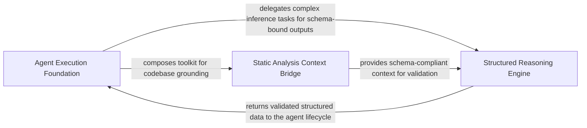

## Details

Provides the foundational execution framework for all agents, managing the lifecycle of LLM interactions, including the 'invoke-validate-repair' loop and provider-agnostic communication.

### Agent Execution Foundation
Establishes identity and operational state for agents, managing their lifecycle and system prompt generation.

**Related Classes/Methods**: _None_

**Source Files:**

- [`agents/abstraction_agent.py`](https://github.com/CodeBoarding/CodeBoarding/blob/main/.codeboardingagents/abstraction_agent.py)
  - `agents.abstraction_agent.AbstractionAgent.__init__` ([L44-L79](https://github.com/CodeBoarding/CodeBoarding/blob/main/.codeboardingagents/abstraction_agent.py#L44-L79)) - Method
  - `agents.abstraction_agent.AbstractionAgent.run` ([L189-L226](https://github.com/CodeBoarding/CodeBoarding/blob/main/.codeboardingagents/abstraction_agent.py#L189-L226)) - Method

### Structured Reasoning Engine
Handles the orchestration logic for the 'Invoke-Validate-Repair' loop, ensuring LLM outputs conform to expected schemas.

**Related Classes/Methods**: _None_

**Source Files:**

- [`agents/abstraction_agent.py`](https://github.com/CodeBoarding/CodeBoarding/blob/main/.codeboardingagents/abstraction_agent.py)
  - `agents.abstraction_agent.AbstractionAgent.step_clusters_grouping` ([L82-L91](https://github.com/CodeBoarding/CodeBoarding/blob/main/.codeboardingagents/abstraction_agent.py#L82-L91)) - Method
  - `agents.abstraction_agent.AbstractionAgent.step_api_surfaces` ([L143-L150](https://github.com/CodeBoarding/CodeBoarding/blob/main/.codeboardingagents/abstraction_agent.py#L143-L150)) - Method

### Static Analysis Context Bridge
Translates raw static analysis artifacts into LLM-readable formats to ground agent reasoning in codebase structure.

**Related Classes/Methods**: _None_

**Source Files:**

- [`agents/abstraction_agent.py`](https://github.com/CodeBoarding/CodeBoarding/blob/main/.codeboardingagents/abstraction_agent.py)
  - `agents.abstraction_agent.AbstractionAgent.step_final_analysis` ([L94-L140](https://github.com/CodeBoarding/CodeBoarding/blob/main/.codeboardingagents/abstraction_agent.py#L94-L140)) - Method
  - `agents.abstraction_agent.AbstractionAgent.step_relation_analysis` ([L153-L187](https://github.com/CodeBoarding/CodeBoarding/blob/main/.codeboardingagents/abstraction_agent.py#L153-L187)) - Method

### [FAQ](https://github.com/CodeBoarding/GeneratedOnBoardings/tree/main?tab=readme-ov-file#faq)