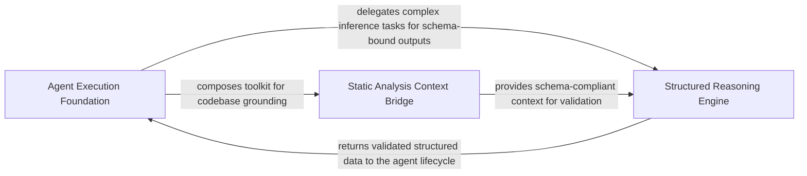

```mermaid
graph LR
    Agent_Execution_Foundation["Agent Execution Foundation"]
    Structured_Reasoning_Engine["Structured Reasoning Engine"]
    Static_Analysis_Context_Bridge["Static Analysis Context Bridge"]
    Agent_Execution_Foundation -- "delegates complex inference tasks for schema-bound outputs" --> Structured_Reasoning_Engine
    Agent_Execution_Foundation -- "composes toolkit for codebase grounding" --> Static_Analysis_Context_Bridge
    Structured_Reasoning_Engine -- "returns validated structured data to the agent lifecycle" --> Agent_Execution_Foundation
    Static_Analysis_Context_Bridge -- "provides schema-compliant context for validation" --> Structured_Reasoning_Engine
```

## Details

Provides the foundational execution framework for all agents, managing the lifecycle of LLM interactions, including the 'invoke-validate-repair' loop and provider-agnostic communication.

### Agent Execution Foundation
Establishes identity and operational state for agents, managing their lifecycle and system prompt generation.

**Related Classes/Methods**: _None_

**Source Files:**

- [`agents/abstraction_agent.py`](https://github.com/CodeBoarding/CodeBoarding/blob/main/.codeboardingagents/abstraction_agent.py)
  - `agents.abstraction_agent.AbstractionAgent.__init__` ([L45-L80](https://github.com/CodeBoarding/CodeBoarding/blob/main/.codeboardingagents/abstraction_agent.py#L45-L80)) - Method
  - `agents.abstraction_agent.AbstractionAgent.run` ([L193-L230](https://github.com/CodeBoarding/CodeBoarding/blob/main/.codeboardingagents/abstraction_agent.py#L193-L230)) - Method

### Structured Reasoning Engine
Handles the orchestration logic for the 'Invoke-Validate-Repair' loop, ensuring LLM outputs conform to expected schemas.

**Related Classes/Methods**: _None_

**Source Files:**

- [`agents/abstraction_agent.py`](https://github.com/CodeBoarding/CodeBoarding/blob/main/.codeboardingagents/abstraction_agent.py)
  - `agents.abstraction_agent.AbstractionAgent.step_clusters_grouping` ([L83-L95](https://github.com/CodeBoarding/CodeBoarding/blob/main/.codeboardingagents/abstraction_agent.py#L83-L95)) - Method
  - `agents.abstraction_agent.AbstractionAgent.step_api_surfaces` ([L147-L154](https://github.com/CodeBoarding/CodeBoarding/blob/main/.codeboardingagents/abstraction_agent.py#L147-L154)) - Method

### Static Analysis Context Bridge
Translates raw static analysis artifacts into LLM-readable formats to ground agent reasoning in codebase structure.

**Related Classes/Methods**: _None_

**Source Files:**

- [`agents/abstraction_agent.py`](https://github.com/CodeBoarding/CodeBoarding/blob/main/.codeboardingagents/abstraction_agent.py)
  - `agents.abstraction_agent.AbstractionAgent.step_final_analysis` ([L98-L144](https://github.com/CodeBoarding/CodeBoarding/blob/main/.codeboardingagents/abstraction_agent.py#L98-L144)) - Method
  - `agents.abstraction_agent.AbstractionAgent.step_relation_analysis` ([L157-L191](https://github.com/CodeBoarding/CodeBoarding/blob/main/.codeboardingagents/abstraction_agent.py#L157-L191)) - Method

### [FAQ](https://github.com/CodeBoarding/GeneratedOnBoardings/tree/main?tab=readme-ov-file#faq)