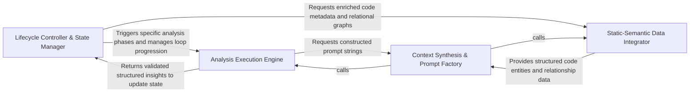

## Details

Manages the high-level lifecycle and state transitions of the analysis process.

### Lifecycle Controller & State Manager
Acts as the central authority for the analysis workflow, managing the transition between different execution phases and maintaining the global state of the agentic process.

**Related Classes/Methods**:

- `agents.agent.CodeBoardingAgent`:35-428

**Source Files:**

- [`agents/agent.py`](https://github.com/CodeBoarding/CodeBoarding/blob/main/.codeboardingagents/agent.py)
  - `agents.agent.EmptyExtractorMessageError` ([L31-L32](https://github.com/CodeBoarding/CodeBoarding/blob/main/.codeboardingagents/agent.py#L31-L32)) - Class
  - `agents.agent.CodeBoardingAgent` ([L35-L428](https://github.com/CodeBoarding/CodeBoarding/blob/main/.codeboardingagents/agent.py#L35-L428)) - Class
  - `agents.agent.CodeBoardingAgent.__init__` ([L36-L59](https://github.com/CodeBoarding/CodeBoarding/blob/main/.codeboardingagents/agent.py#L36-L59)) - Method
  - `agents.agent.CodeBoardingAgent._extractor_parse` ([L409-L428](https://github.com/CodeBoarding/CodeBoarding/blob/main/.codeboardingagents/agent.py#L409-L428)) - Method
- [`agents/tools/base.py`](https://github.com/CodeBoarding/CodeBoarding/blob/main/.codeboardingagents/tools/base.py)
  - `agents.tools.base.RepoContext` ([L10-L54](https://github.com/CodeBoarding/CodeBoarding/blob/main/.codeboardingagents/tools/base.py#L10-L54)) - Class
  - `agents.tools.base.RepoContext.Config` ([L22-L23](https://github.com/CodeBoarding/CodeBoarding/blob/main/.codeboardingagents/tools/base.py#L22-L23)) - Class
  - `agents.tools.base.BaseRepoTool` ([L57-L96](https://github.com/CodeBoarding/CodeBoarding/blob/main/.codeboardingagents/tools/base.py#L57-L96)) - Class
- [`agents/tools/get_external_deps.py`](https://github.com/CodeBoarding/CodeBoarding/blob/main/.codeboardingagents/tools/get_external_deps.py)
  - `agents.tools.get_external_deps.ExternalDepsInput` ([L11-L12](https://github.com/CodeBoarding/CodeBoarding/blob/main/.codeboardingagents/tools/get_external_deps.py#L11-L12)) - Class
- [`agents/tools/get_method_invocations.py`](https://github.com/CodeBoarding/CodeBoarding/blob/main/.codeboardingagents/tools/get_method_invocations.py)
  - `agents.tools.get_method_invocations.MethodInvocationsInput` ([L10-L11](https://github.com/CodeBoarding/CodeBoarding/blob/main/.codeboardingagents/tools/get_method_invocations.py#L10-L11)) - Class
- [`agents/tools/read_docs.py`](https://github.com/CodeBoarding/CodeBoarding/blob/main/.codeboardingagents/tools/read_docs.py)
  - `agents.tools.read_docs.ReadDocsFile` ([L10-L19](https://github.com/CodeBoarding/CodeBoarding/blob/main/.codeboardingagents/tools/read_docs.py#L10-L19)) - Class
- [`agents/tools/read_file.py`](https://github.com/CodeBoarding/CodeBoarding/blob/main/.codeboardingagents/tools/read_file.py)
  - `agents.tools.read_file.ReadFileInput` ([L10-L16](https://github.com/CodeBoarding/CodeBoarding/blob/main/.codeboardingagents/tools/read_file.py#L10-L16)) - Class
- [`agents/tools/read_file_structure.py`](https://github.com/CodeBoarding/CodeBoarding/blob/main/.codeboardingagents/tools/read_file_structure.py)
  - `agents.tools.read_file_structure.DirInput` ([L12-L19](https://github.com/CodeBoarding/CodeBoarding/blob/main/.codeboardingagents/tools/read_file_structure.py#L12-L19)) - Class
- [`agents/tools/read_packages.py`](https://github.com/CodeBoarding/CodeBoarding/blob/main/.codeboardingagents/tools/read_packages.py)
  - `agents.tools.read_packages.PackageInput` ([L9-L15](https://github.com/CodeBoarding/CodeBoarding/blob/main/.codeboardingagents/tools/read_packages.py#L9-L15)) - Class
  - `agents.tools.read_packages.NoRootPackageFoundError` ([L18-L23](https://github.com/CodeBoarding/CodeBoarding/blob/main/.codeboardingagents/tools/read_packages.py#L18-L23)) - Class
- [`agents/tools/read_source.py`](https://github.com/CodeBoarding/CodeBoarding/blob/main/.codeboardingagents/tools/read_source.py)
  - `agents.tools.read_source.ModuleInput` ([L12-L22](https://github.com/CodeBoarding/CodeBoarding/blob/main/.codeboardingagents/tools/read_source.py#L12-L22)) - Class
- [`agents/tools/read_structure.py`](https://github.com/CodeBoarding/CodeBoarding/blob/main/.codeboardingagents/tools/read_structure.py)
  - `agents.tools.read_structure.ClassQualifiedName` ([L10-L11](https://github.com/CodeBoarding/CodeBoarding/blob/main/.codeboardingagents/tools/read_structure.py#L10-L11)) - Class

### Context Synthesis & Prompt Factory
Responsible for the "Prompt Engineering" layer, dynamically assembling complex system and task messages by injecting static analysis metadata into predefined templates for LLM consumption.

**Related Classes/Methods**: _None_

**Source Files:**

- [`agents/agent.py`](https://github.com/CodeBoarding/CodeBoarding/blob/main/.codeboardingagents/agent.py)
  - `agents.agent.CodeBoardingAgent._invoke` ([L97-L162](https://github.com/CodeBoarding/CodeBoarding/blob/main/.codeboardingagents/agent.py#L97-L162)) - Method

### Analysis Execution Engine
Executes the iterative "steps" of the analysis, handling the low-level communication with LLM providers and validating that the model's output conforms to the expected architectural schemas.

**Related Classes/Methods**: _None_

**Source Files:**

- [`agents/agent.py`](https://github.com/CodeBoarding/CodeBoarding/blob/main/.codeboardingagents/agent.py)
  - `agents.agent.CodeBoardingAgent._invoke.call_once` ([L112-L132](https://github.com/CodeBoarding/CodeBoarding/blob/main/.codeboardingagents/agent.py#L112-L132)) - Function
  - `agents.agent.CodeBoardingAgent._invoke.on_exhausted` ([L149-L154](https://github.com/CodeBoarding/CodeBoarding/blob/main/.codeboardingagents/agent.py#L149-L154)) - Function

### Static-Semantic Data Integrator
A data-enrichment layer that bridges raw static analysis (LSP/AST data) with the agent's internal model, resolving code references and building the relational graph used for context.

**Related Classes/Methods**: _None_

**Source Files:**

- [`agents/agent.py`](https://github.com/CodeBoarding/CodeBoarding/blob/main/.codeboardingagents/agent.py)
  - `agents.agent.CodeBoardingAgent._invoke.classify` ([L134-L147](https://github.com/CodeBoarding/CodeBoarding/blob/main/.codeboardingagents/agent.py#L134-L147)) - Function

### [FAQ](https://github.com/CodeBoarding/GeneratedOnBoardings/tree/main?tab=readme-ov-file#faq)