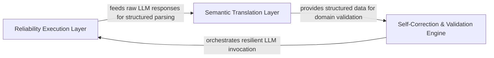

## Details

The central controller for the agent's lifecycle, managing prompt generation, LLM invocation, and deterministic control loops for self-repair and validation.

### Reliability Execution Layer
Manages the low-level lifecycle of LLM requests, including timeout enforcement and sophisticated retry strategies to handle transient network issues and rate limits.

**Related Classes/Methods**:

- `agents.agent.CodeBoardingAgent._invoke`:128-194
- `agents.retry.with_retries`:68-118
- `agents.retry.RetryDecision`:48-55
- `agents.agent.CodeBoardingAgent._invoke_with_timeout`:196-234

**Source Files:**

- [`agents/agent.py`](https://github.com/CodeBoarding/CodeBoarding/blob/main/.codeboardingagents/agent.py)
  - `agents.agent._raise_if_auth_error` ([L47-L59](https://github.com/CodeBoarding/CodeBoarding/blob/main/.codeboardingagents/agent.py#L47-L59)) - Function
  - `agents.agent.CodeBoardingAgent._invoke` ([L128-L194](https://github.com/CodeBoarding/CodeBoarding/blob/main/.codeboardingagents/agent.py#L128-L194)) - Method
  - `agents.agent.CodeBoardingAgent._invoke.call_once` ([L143-L163](https://github.com/CodeBoarding/CodeBoarding/blob/main/.codeboardingagents/agent.py#L143-L163)) - Function
  - `agents.agent.CodeBoardingAgent._invoke.classify` ([L165-L179](https://github.com/CodeBoarding/CodeBoarding/blob/main/.codeboardingagents/agent.py#L165-L179)) - Function
  - `agents.agent.CodeBoardingAgent._invoke.on_exhausted` ([L181-L186](https://github.com/CodeBoarding/CodeBoarding/blob/main/.codeboardingagents/agent.py#L181-L186)) - Function
  - `agents.agent.CodeBoardingAgent._invoke_with_timeout` ([L196-L234](https://github.com/CodeBoarding/CodeBoarding/blob/main/.codeboardingagents/agent.py#L196-L234)) - Method
  - `agents.agent.CodeBoardingAgent._invoke_with_timeout.invoke_target` ([L204-L212](https://github.com/CodeBoarding/CodeBoarding/blob/main/.codeboardingagents/agent.py#L204-L212)) - Function
  - `agents.agent.CodeBoardingAgent._parse_invoke` ([L236-L244](https://github.com/CodeBoarding/CodeBoarding/blob/main/.codeboardingagents/agent.py#L236-L244)) - Method
  - `agents.agent.CodeBoardingAgent._parse_response` ([L396-L444](https://github.com/CodeBoarding/CodeBoarding/blob/main/.codeboardingagents/agent.py#L396-L444)) - Method
  - `agents.agent.CodeBoardingAgent._parse_response.classify` ([L420-L429](https://github.com/CodeBoarding/CodeBoarding/blob/main/.codeboardingagents/agent.py#L420-L429)) - Function
  - `agents.agent.CodeBoardingAgent._parse_response.on_exhausted` ([L431-L436](https://github.com/CodeBoarding/CodeBoarding/blob/main/.codeboardingagents/agent.py#L431-L436)) - Function
- [`agents/retry.py`](https://github.com/CodeBoarding/CodeBoarding/blob/main/.codeboardingagents/retry.py)
  - `agents.retry.RetryAction` ([L41-L44](https://github.com/CodeBoarding/CodeBoarding/blob/main/.codeboardingagents/retry.py#L41-L44)) - Class
  - `agents.retry.RetryDecision` ([L48-L55](https://github.com/CodeBoarding/CodeBoarding/blob/main/.codeboardingagents/retry.py#L48-L55)) - Class
  - `agents.retry.default_backoff` ([L58-L61](https://github.com/CodeBoarding/CodeBoarding/blob/main/.codeboardingagents/retry.py#L58-L61)) - Function
  - `agents.retry._default_classify` ([L64-L65](https://github.com/CodeBoarding/CodeBoarding/blob/main/.codeboardingagents/retry.py#L64-L65)) - Function
  - `agents.retry.with_retries` ([L68-L118](https://github.com/CodeBoarding/CodeBoarding/blob/main/.codeboardingagents/retry.py#L68-L118)) - Function

### Semantic Translation Layer
Bridges the gap between natural language LLM output and structured data requirements by parsing raw strings into internal schemas and handling malformed syntax.

**Related Classes/Methods**:

- `agents.agent.CodeBoardingAgent._structured_parse`:446-471
- `agents.agent.CodeBoardingAgent._extractor_parse`:473-492
- `agents.agent.EmptyExtractorMessageError`:43-44

**Source Files:**

- [`agents/agent.py`](https://github.com/CodeBoarding/CodeBoarding/blob/main/.codeboardingagents/agent.py)
  - `agents.agent.EmptyExtractorMessageError` ([L43-L44](https://github.com/CodeBoarding/CodeBoarding/blob/main/.codeboardingagents/agent.py#L43-L44)) - Class
  - `agents.agent.CodeBoardingAgent._parse_response.call_once` ([L411-L418](https://github.com/CodeBoarding/CodeBoarding/blob/main/.codeboardingagents/agent.py#L411-L418)) - Function
  - `agents.agent.CodeBoardingAgent._structured_parse` ([L446-L471](https://github.com/CodeBoarding/CodeBoarding/blob/main/.codeboardingagents/agent.py#L446-L471)) - Method
  - `agents.agent.CodeBoardingAgent._extractor_parse` ([L473-L492](https://github.com/CodeBoarding/CodeBoarding/blob/main/.codeboardingagents/agent.py#L473-L492)) - Method

### Self-Correction & Validation Engine
Implements the agentic loop by evaluating parsed results against domain rules and orchestrating repair attempts to guarantee output integrity.

**Related Classes/Methods**:

- `agents.agent.CodeBoardingAgent._invoke_repair_validate`:289-313
- `agents.agent.CodeBoardingAgent._score_result`:257-287
- `agents.agent.CodeBoardingAgent._repair_result`:246-255

**Source Files:**

- [`agents/agent.py`](https://github.com/CodeBoarding/CodeBoarding/blob/main/.codeboardingagents/agent.py)
  - `agents.agent.RepairValidationResult.llm_str` ([L40-L40](https://github.com/CodeBoarding/CodeBoarding/blob/main/.codeboardingagents/agent.py#L40-L40)) - Method
  - `agents.agent.CodeBoardingAgent._repair_result` ([L246-L255](https://github.com/CodeBoarding/CodeBoarding/blob/main/.codeboardingagents/agent.py#L246-L255)) - Method
  - `agents.agent.CodeBoardingAgent._score_result` ([L257-L287](https://github.com/CodeBoarding/CodeBoarding/blob/main/.codeboardingagents/agent.py#L257-L287)) - Method
  - `agents.agent.CodeBoardingAgent._invoke_repair_validate` ([L289-L313](https://github.com/CodeBoarding/CodeBoarding/blob/main/.codeboardingagents/agent.py#L289-L313)) - Method
  - `agents.agent.CodeBoardingAgent._invoke_repair_validate.repair_candidate` ([L302-L303](https://github.com/CodeBoarding/CodeBoarding/blob/main/.codeboardingagents/agent.py#L302-L303)) - Function
  - `agents.agent.CodeBoardingAgent._invoke_validate` ([L315-L394](https://github.com/CodeBoarding/CodeBoarding/blob/main/.codeboardingagents/agent.py#L315-L394)) - Method

### [FAQ](https://github.com/CodeBoarding/GeneratedOnBoardings/tree/main?tab=readme-ov-file#faq)