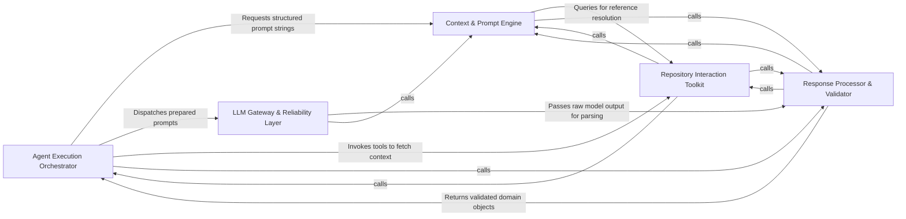

## Details

The foundational execution layer that manages the lifecycle of LLM interactions, base agent behaviors, retry logic, and the toolkit for repository data interaction.

### Agent Execution Orchestrator [[Expand]](./Agent_Execution_Orchestrator.md)
Manages the high-level lifecycle and state transitions of the analysis process.

**Related Classes/Methods**:

- `agents.agent.CodeBoardingAgent`:35-428

**Source Files:**

- [`agents/agent.py`](https://github.com/CodeBoarding/CodeBoarding/blob/main/.codeboardingagents/agent.py)
  - `agents.agent.EmptyExtractorMessageError` ([L31-L32](https://github.com/CodeBoarding/CodeBoarding/blob/main/.codeboardingagents/agent.py#L31-L32)) - Class
  - `agents.agent.CodeBoardingAgent` ([L35-L428](https://github.com/CodeBoarding/CodeBoarding/blob/main/.codeboardingagents/agent.py#L35-L428)) - Class
  - `agents.agent.CodeBoardingAgent.__init__` ([L36-L59](https://github.com/CodeBoarding/CodeBoarding/blob/main/.codeboardingagents/agent.py#L36-L59)) - Method
  - `agents.agent.CodeBoardingAgent._invoke` ([L97-L162](https://github.com/CodeBoarding/CodeBoarding/blob/main/.codeboardingagents/agent.py#L97-L162)) - Method
  - `agents.agent.CodeBoardingAgent._invoke.call_once` ([L112-L132](https://github.com/CodeBoarding/CodeBoarding/blob/main/.codeboardingagents/agent.py#L112-L132)) - Function
  - `agents.agent.CodeBoardingAgent._invoke.classify` ([L134-L147](https://github.com/CodeBoarding/CodeBoarding/blob/main/.codeboardingagents/agent.py#L134-L147)) - Function
  - `agents.agent.CodeBoardingAgent._invoke.on_exhausted` ([L149-L154](https://github.com/CodeBoarding/CodeBoarding/blob/main/.codeboardingagents/agent.py#L149-L154)) - Function
  - `agents.agent.CodeBoardingAgent._extractor_parse` ([L409-L428](https://github.com/CodeBoarding/CodeBoarding/blob/main/.codeboardingagents/agent.py#L409-L428)) - Method
- [`agents/tools/base.py`](https://github.com/CodeBoarding/CodeBoarding/blob/main/.codeboardingagents/tools/base.py)
  - `agents.tools.base.RepoContext` ([L10-L54](https://github.com/CodeBoarding/CodeBoarding/blob/main/.codeboardingagents/tools/base.py#L10-L54)) - Class
  - `agents.tools.base.RepoContext.Config` ([L22-L23](https://github.com/CodeBoarding/CodeBoarding/blob/main/.codeboardingagents/tools/base.py#L22-L23)) - Class
  - `agents.tools.base.BaseRepoTool` ([L57-L96](https://github.com/CodeBoarding/CodeBoarding/blob/main/.codeboardingagents/tools/base.py#L57-L96)) - Class
- [`agents/tools/get_external_deps.py`](https://github.com/CodeBoarding/CodeBoarding/blob/main/.codeboardingagents/tools/get_external_deps.py)
  - `agents.tools.get_external_deps.ExternalDepsInput` ([L11-L12](https://github.com/CodeBoarding/CodeBoarding/blob/main/.codeboardingagents/tools/get_external_deps.py#L11-L12)) - Class
- [`agents/tools/get_method_invocations.py`](https://github.com/CodeBoarding/CodeBoarding/blob/main/.codeboardingagents/tools/get_method_invocations.py)
  - `agents.tools.get_method_invocations.MethodInvocationsInput` ([L10-L11](https://github.com/CodeBoarding/CodeBoarding/blob/main/.codeboardingagents/tools/get_method_invocations.py#L10-L11)) - Class
- [`agents/tools/read_docs.py`](https://github.com/CodeBoarding/CodeBoarding/blob/main/.codeboardingagents/tools/read_docs.py)
  - `agents.tools.read_docs.ReadDocsFile` ([L10-L19](https://github.com/CodeBoarding/CodeBoarding/blob/main/.codeboardingagents/tools/read_docs.py#L10-L19)) - Class
- [`agents/tools/read_file.py`](https://github.com/CodeBoarding/CodeBoarding/blob/main/.codeboardingagents/tools/read_file.py)
  - `agents.tools.read_file.ReadFileInput` ([L10-L16](https://github.com/CodeBoarding/CodeBoarding/blob/main/.codeboardingagents/tools/read_file.py#L10-L16)) - Class
- [`agents/tools/read_file_structure.py`](https://github.com/CodeBoarding/CodeBoarding/blob/main/.codeboardingagents/tools/read_file_structure.py)
  - `agents.tools.read_file_structure.DirInput` ([L12-L19](https://github.com/CodeBoarding/CodeBoarding/blob/main/.codeboardingagents/tools/read_file_structure.py#L12-L19)) - Class
- [`agents/tools/read_packages.py`](https://github.com/CodeBoarding/CodeBoarding/blob/main/.codeboardingagents/tools/read_packages.py)
  - `agents.tools.read_packages.PackageInput` ([L9-L15](https://github.com/CodeBoarding/CodeBoarding/blob/main/.codeboardingagents/tools/read_packages.py#L9-L15)) - Class
  - `agents.tools.read_packages.NoRootPackageFoundError` ([L18-L23](https://github.com/CodeBoarding/CodeBoarding/blob/main/.codeboardingagents/tools/read_packages.py#L18-L23)) - Class
- [`agents/tools/read_source.py`](https://github.com/CodeBoarding/CodeBoarding/blob/main/.codeboardingagents/tools/read_source.py)
  - `agents.tools.read_source.ModuleInput` ([L12-L22](https://github.com/CodeBoarding/CodeBoarding/blob/main/.codeboardingagents/tools/read_source.py#L12-L22)) - Class
- [`agents/tools/read_structure.py`](https://github.com/CodeBoarding/CodeBoarding/blob/main/.codeboardingagents/tools/read_structure.py)
  - `agents.tools.read_structure.ClassQualifiedName` ([L10-L11](https://github.com/CodeBoarding/CodeBoarding/blob/main/.codeboardingagents/tools/read_structure.py#L10-L11)) - Class

### Context & Prompt Engine [[Expand]](./Context_Prompt_Engine.md)
Transforms raw static analysis data and repository metadata into structured, LLM-readable prompts.

**Related Classes/Methods**: _None_

**Source Files:**

- [`agents/agent_responses.py`](https://github.com/CodeBoarding/CodeBoarding/blob/main/.codeboardingagents/agent_responses.py)
  - `agents.agent_responses.LLMBaseModel.llm_str` ([L19-L20](https://github.com/CodeBoarding/CodeBoarding/blob/main/.codeboardingagents/agent_responses.py#L19-L20)) - Method
  - `agents.agent_responses.LLMBaseModel._is_field_hidden` ([L23-L29](https://github.com/CodeBoarding/CodeBoarding/blob/main/.codeboardingagents/agent_responses.py#L23-L29)) - Method
  - `agents.agent_responses.LLMBaseModel._excluded_fields` ([L32-L41](https://github.com/CodeBoarding/CodeBoarding/blob/main/.codeboardingagents/agent_responses.py#L32-L41)) - Method
  - `agents.agent_responses.LLMBaseModel._resolve_excluded_by_title` ([L44-L63](https://github.com/CodeBoarding/CodeBoarding/blob/main/.codeboardingagents/agent_responses.py#L44-L63)) - Method
  - `agents.agent_responses.LLMBaseModel._resolve_excluded_by_title.walk` ([L48-L60](https://github.com/CodeBoarding/CodeBoarding/blob/main/.codeboardingagents/agent_responses.py#L48-L60)) - Function
  - `agents.agent_responses.LLMBaseModel._extractor_fields` ([L66-L85](https://github.com/CodeBoarding/CodeBoarding/blob/main/.codeboardingagents/agent_responses.py#L66-L85)) - Method
  - `agents.agent_responses.LLMBaseModel.extractor_str` ([L88-L95](https://github.com/CodeBoarding/CodeBoarding/blob/main/.codeboardingagents/agent_responses.py#L88-L95)) - Method
  - `agents.agent_responses.ExpandComponent.llm_str` ([L479-L480](https://github.com/CodeBoarding/CodeBoarding/blob/main/.codeboardingagents/agent_responses.py#L479-L480)) - Method
  - `agents.agent_responses.FileClassification.llm_str` ([L543-L544](https://github.com/CodeBoarding/CodeBoarding/blob/main/.codeboardingagents/agent_responses.py#L543-L544)) - Method
  - `agents.agent_responses.FilePath.llm_str` ([L586-L587](https://github.com/CodeBoarding/CodeBoarding/blob/main/.codeboardingagents/agent_responses.py#L586-L587)) - Method
- [`agents/retry.py`](https://github.com/CodeBoarding/CodeBoarding/blob/main/.codeboardingagents/retry.py)
  - `agents.retry.default_backoff` ([L58-L61](https://github.com/CodeBoarding/CodeBoarding/blob/main/.codeboardingagents/retry.py#L58-L61)) - Function
  - `agents.retry.with_retries` ([L68-L118](https://github.com/CodeBoarding/CodeBoarding/blob/main/.codeboardingagents/retry.py#L68-L118)) - Function
- [`agents/tools/get_external_deps.py`](https://github.com/CodeBoarding/CodeBoarding/blob/main/.codeboardingagents/tools/get_external_deps.py)
  - `agents.tools.get_external_deps.ExternalDepsTool` ([L15-L47](https://github.com/CodeBoarding/CodeBoarding/blob/main/.codeboardingagents/tools/get_external_deps.py#L15-L47)) - Class
- [`agents/tools/get_method_invocations.py`](https://github.com/CodeBoarding/CodeBoarding/blob/main/.codeboardingagents/tools/get_method_invocations.py)
  - `agents.tools.get_method_invocations.MethodInvocationsTool` ([L14-L47](https://github.com/CodeBoarding/CodeBoarding/blob/main/.codeboardingagents/tools/get_method_invocations.py#L14-L47)) - Class
- [`agents/tools/read_cfg.py`](https://github.com/CodeBoarding/CodeBoarding/blob/main/.codeboardingagents/tools/read_cfg.py)
  - `agents.tools.read_cfg.GetCFGTool` ([L8-L61](https://github.com/CodeBoarding/CodeBoarding/blob/main/.codeboardingagents/tools/read_cfg.py#L8-L61)) - Class
- [`agents/tools/read_docs.py`](https://github.com/CodeBoarding/CodeBoarding/blob/main/.codeboardingagents/tools/read_docs.py)
  - `agents.tools.read_docs.ReadDocsTool` ([L22-L132](https://github.com/CodeBoarding/CodeBoarding/blob/main/.codeboardingagents/tools/read_docs.py#L22-L132)) - Class
- [`agents/tools/read_file.py`](https://github.com/CodeBoarding/CodeBoarding/blob/main/.codeboardingagents/tools/read_file.py)
  - `agents.tools.read_file.ReadFileTool` ([L19-L90](https://github.com/CodeBoarding/CodeBoarding/blob/main/.codeboardingagents/tools/read_file.py#L19-L90)) - Class
- [`agents/tools/read_file_structure.py`](https://github.com/CodeBoarding/CodeBoarding/blob/main/.codeboardingagents/tools/read_file_structure.py)
  - `agents.tools.read_file_structure.FileStructureTool` ([L22-L101](https://github.com/CodeBoarding/CodeBoarding/blob/main/.codeboardingagents/tools/read_file_structure.py#L22-L101)) - Class
- [`agents/tools/read_packages.py`](https://github.com/CodeBoarding/CodeBoarding/blob/main/.codeboardingagents/tools/read_packages.py)
  - `agents.tools.read_packages.PackageRelationsTool` ([L26-L60](https://github.com/CodeBoarding/CodeBoarding/blob/main/.codeboardingagents/tools/read_packages.py#L26-L60)) - Class
- [`agents/tools/read_source.py`](https://github.com/CodeBoarding/CodeBoarding/blob/main/.codeboardingagents/tools/read_source.py)
  - `agents.tools.read_source.CodeReferenceReader` ([L25-L85](https://github.com/CodeBoarding/CodeBoarding/blob/main/.codeboardingagents/tools/read_source.py#L25-L85)) - Class
- [`agents/tools/read_structure.py`](https://github.com/CodeBoarding/CodeBoarding/blob/main/.codeboardingagents/tools/read_structure.py)
  - `agents.tools.read_structure.CodeStructureTool` ([L14-L49](https://github.com/CodeBoarding/CodeBoarding/blob/main/.codeboardingagents/tools/read_structure.py#L14-L49)) - Class
- [`agents/tools/toolkit.py`](https://github.com/CodeBoarding/CodeBoarding/blob/main/.codeboardingagents/tools/toolkit.py)
  - `agents.tools.toolkit.CodeBoardingToolkit` ([L19-L111](https://github.com/CodeBoarding/CodeBoarding/blob/main/.codeboardingagents/tools/toolkit.py#L19-L111)) - Class
  - `agents.tools.toolkit.CodeBoardingToolkit.__init__` ([L25-L27](https://github.com/CodeBoarding/CodeBoarding/blob/main/.codeboardingagents/tools/toolkit.py#L25-L27)) - Method
  - `agents.tools.toolkit.CodeBoardingToolkit.read_source_reference` ([L30-L33](https://github.com/CodeBoarding/CodeBoarding/blob/main/.codeboardingagents/tools/toolkit.py#L30-L33)) - Method
  - `agents.tools.toolkit.CodeBoardingToolkit.read_packages` ([L36-L39](https://github.com/CodeBoarding/CodeBoarding/blob/main/.codeboardingagents/tools/toolkit.py#L36-L39)) - Method
  - `agents.tools.toolkit.CodeBoardingToolkit.read_structure` ([L42-L45](https://github.com/CodeBoarding/CodeBoarding/blob/main/.codeboardingagents/tools/toolkit.py#L42-L45)) - Method
  - `agents.tools.toolkit.CodeBoardingToolkit.read_file_structure` ([L48-L51](https://github.com/CodeBoarding/CodeBoarding/blob/main/.codeboardingagents/tools/toolkit.py#L48-L51)) - Method
  - `agents.tools.toolkit.CodeBoardingToolkit.read_cfg` ([L54-L57](https://github.com/CodeBoarding/CodeBoarding/blob/main/.codeboardingagents/tools/toolkit.py#L54-L57)) - Method
  - `agents.tools.toolkit.CodeBoardingToolkit.read_method_invocations` ([L60-L63](https://github.com/CodeBoarding/CodeBoarding/blob/main/.codeboardingagents/tools/toolkit.py#L60-L63)) - Method
  - `agents.tools.toolkit.CodeBoardingToolkit.read_file` ([L66-L69](https://github.com/CodeBoarding/CodeBoarding/blob/main/.codeboardingagents/tools/toolkit.py#L66-L69)) - Method
  - `agents.tools.toolkit.CodeBoardingToolkit.read_docs` ([L72-L75](https://github.com/CodeBoarding/CodeBoarding/blob/main/.codeboardingagents/tools/toolkit.py#L72-L75)) - Method
  - `agents.tools.toolkit.CodeBoardingToolkit.external_deps` ([L78-L81](https://github.com/CodeBoarding/CodeBoarding/blob/main/.codeboardingagents/tools/toolkit.py#L78-L81)) - Method
  - `agents.tools.toolkit.CodeBoardingToolkit.get_agent_tools` ([L83-L93](https://github.com/CodeBoarding/CodeBoarding/blob/main/.codeboardingagents/tools/toolkit.py#L83-L93)) - Method
  - `agents.tools.toolkit.CodeBoardingToolkit.get_all_tools` ([L95-L111](https://github.com/CodeBoarding/CodeBoarding/blob/main/.codeboardingagents/tools/toolkit.py#L95-L111)) - Method

### LLM Gateway & Reliability Layer [[Expand]](./LLM_Gateway_Reliability_Layer.md)
Handles technical communication with LLM providers and encapsulates retry logic for resilience.

**Related Classes/Methods**:

- `agents.retry.with_retries`:68-118
- `agents.agent.CodeBoardingAgent._validation_invoke`:236-331

**Source Files:**

- [`agents/agent.py`](https://github.com/CodeBoarding/CodeBoarding/blob/main/.codeboardingagents/agent.py)
  - `agents.agent.CodeBoardingAgent.read_source_reference` ([L62-L63](https://github.com/CodeBoarding/CodeBoarding/blob/main/.codeboardingagents/agent.py#L62-L63)) - Method
  - `agents.agent.CodeBoardingAgent.read_packages_tool` ([L66-L67](https://github.com/CodeBoarding/CodeBoarding/blob/main/.codeboardingagents/agent.py#L66-L67)) - Method
  - `agents.agent.CodeBoardingAgent.read_structure_tool` ([L70-L71](https://github.com/CodeBoarding/CodeBoarding/blob/main/.codeboardingagents/agent.py#L70-L71)) - Method
  - `agents.agent.CodeBoardingAgent.read_file_structure` ([L74-L75](https://github.com/CodeBoarding/CodeBoarding/blob/main/.codeboardingagents/agent.py#L74-L75)) - Method
  - `agents.agent.CodeBoardingAgent.read_cfg_tool` ([L78-L79](https://github.com/CodeBoarding/CodeBoarding/blob/main/.codeboardingagents/agent.py#L78-L79)) - Method
  - `agents.agent.CodeBoardingAgent.read_method_invocations_tool` ([L82-L83](https://github.com/CodeBoarding/CodeBoarding/blob/main/.codeboardingagents/agent.py#L82-L83)) - Method
  - `agents.agent.CodeBoardingAgent.read_file_tool` ([L86-L87](https://github.com/CodeBoarding/CodeBoarding/blob/main/.codeboardingagents/agent.py#L86-L87)) - Method
  - `agents.agent.CodeBoardingAgent.read_docs` ([L90-L91](https://github.com/CodeBoarding/CodeBoarding/blob/main/.codeboardingagents/agent.py#L90-L91)) - Method
  - `agents.agent.CodeBoardingAgent.external_deps_tool` ([L94-L95](https://github.com/CodeBoarding/CodeBoarding/blob/main/.codeboardingagents/agent.py#L94-L95)) - Method
- [`agents/agent_responses.py`](https://github.com/CodeBoarding/CodeBoarding/blob/main/.codeboardingagents/agent_responses.py)
  - `agents.agent_responses.ComponentFiles.llm_str` ([L554-L559](https://github.com/CodeBoarding/CodeBoarding/blob/main/.codeboardingagents/agent_responses.py#L554-L559)) - Method

### Response Processor & Validator [[Expand]](./Response_Processor_Validator.md)
Parses LLM output into strongly-typed objects and validates consistency with the codebase.

**Related Classes/Methods**:

- `agents.agent_responses.MethodEntry`:246-270

**Source Files:**

- [`agents/agent_responses.py`](https://github.com/CodeBoarding/CodeBoarding/blob/main/.codeboardingagents/agent_responses.py)
  - `agents.agent_responses.LLMBaseModel.model_json_schema` ([L98-L120](https://github.com/CodeBoarding/CodeBoarding/blob/main/.codeboardingagents/agent_responses.py#L98-L120)) - Method
  - `agents.agent_responses.SourceCodeReference.__str__` ([L154-L162](https://github.com/CodeBoarding/CodeBoarding/blob/main/.codeboardingagents/agent_responses.py#L154-L162)) - Method
  - `agents.agent_responses.MethodEntry.__hash__` ([L254-L255](https://github.com/CodeBoarding/CodeBoarding/blob/main/.codeboardingagents/agent_responses.py#L254-L255)) - Method
  - `agents.agent_responses.MethodEntry.__eq__` ([L257-L260](https://github.com/CodeBoarding/CodeBoarding/blob/main/.codeboardingagents/agent_responses.py#L257-L260)) - Method
  - `agents.agent_responses.MethodEntry.from_node` ([L263-L270](https://github.com/CodeBoarding/CodeBoarding/blob/main/.codeboardingagents/agent_responses.py#L263-L270)) - Method
  - `agents.agent_responses.ValidationInsights.llm_str` ([L492-L493](https://github.com/CodeBoarding/CodeBoarding/blob/main/.codeboardingagents/agent_responses.py#L492-L493)) - Method
  - `agents.agent_responses.UpdateAnalysis.llm_str` ([L504-L505](https://github.com/CodeBoarding/CodeBoarding/blob/main/.codeboardingagents/agent_responses.py#L504-L505)) - Method
- [`agents/meta_agent.py`](https://github.com/CodeBoarding/CodeBoarding/blob/main/.codeboardingagents/meta_agent.py)
  - `agents.meta_agent.MetaAgent.__init__` ([L20-L48](https://github.com/CodeBoarding/CodeBoarding/blob/main/.codeboardingagents/meta_agent.py#L20-L48)) - Method
  - `agents.meta_agent.MetaAgent.analyze_project_metadata` ([L51-L66](https://github.com/CodeBoarding/CodeBoarding/blob/main/.codeboardingagents/meta_agent.py#L51-L66)) - Method
- [`agents/retry.py`](https://github.com/CodeBoarding/CodeBoarding/blob/main/.codeboardingagents/retry.py)
  - `agents.retry.RetryAction` ([L41-L44](https://github.com/CodeBoarding/CodeBoarding/blob/main/.codeboardingagents/retry.py#L41-L44)) - Class
  - `agents.retry.RetryDecision` ([L48-L55](https://github.com/CodeBoarding/CodeBoarding/blob/main/.codeboardingagents/retry.py#L48-L55)) - Class
  - `agents.retry._default_classify` ([L64-L65](https://github.com/CodeBoarding/CodeBoarding/blob/main/.codeboardingagents/retry.py#L64-L65)) - Function
- [`caching/meta_cache.py`](https://github.com/CodeBoarding/CodeBoarding/blob/main/.codeboardingcaching/meta_cache.py)
  - `caching.meta_cache.MetaCache` ([L40-L111](https://github.com/CodeBoarding/CodeBoarding/blob/main/.codeboardingcaching/meta_cache.py#L40-L111)) - Class

### Repository Interaction Toolkit [[Expand]](./Repository_Interaction_Toolkit.md)
Provides tools for the agent to interact directly with source code and static analysis results.

**Related Classes/Methods**:

- `agents.tools.toolkit.CodeBoardingToolkit`:19-111

**Source Files:**

- [`agents/agent.py`](https://github.com/CodeBoarding/CodeBoarding/blob/main/.codeboardingagents/agent.py)
  - `agents.agent.CodeBoardingAgent._invoke_with_timeout` ([L164-L202](https://github.com/CodeBoarding/CodeBoarding/blob/main/.codeboardingagents/agent.py#L164-L202)) - Method
  - `agents.agent.CodeBoardingAgent._invoke_with_timeout.invoke_target` ([L172-L180](https://github.com/CodeBoarding/CodeBoarding/blob/main/.codeboardingagents/agent.py#L172-L180)) - Function
  - `agents.agent.CodeBoardingAgent._parse_invoke` ([L204-L207](https://github.com/CodeBoarding/CodeBoarding/blob/main/.codeboardingagents/agent.py#L204-L207)) - Method
  - `agents.agent.CodeBoardingAgent._score_result` ([L209-L234](https://github.com/CodeBoarding/CodeBoarding/blob/main/.codeboardingagents/agent.py#L209-L234)) - Method
  - `agents.agent.CodeBoardingAgent._validation_invoke` ([L236-L331](https://github.com/CodeBoarding/CodeBoarding/blob/main/.codeboardingagents/agent.py#L236-L331)) - Method
  - `agents.agent.CodeBoardingAgent._parse_response` ([L333-L380](https://github.com/CodeBoarding/CodeBoarding/blob/main/.codeboardingagents/agent.py#L333-L380)) - Method
  - `agents.agent.CodeBoardingAgent._parse_response.call_once` ([L348-L355](https://github.com/CodeBoarding/CodeBoarding/blob/main/.codeboardingagents/agent.py#L348-L355)) - Function
  - `agents.agent.CodeBoardingAgent._parse_response.classify` ([L357-L365](https://github.com/CodeBoarding/CodeBoarding/blob/main/.codeboardingagents/agent.py#L357-L365)) - Function
  - `agents.agent.CodeBoardingAgent._parse_response.on_exhausted` ([L367-L372](https://github.com/CodeBoarding/CodeBoarding/blob/main/.codeboardingagents/agent.py#L367-L372)) - Function
  - `agents.agent.CodeBoardingAgent._structured_parse` ([L382-L407](https://github.com/CodeBoarding/CodeBoarding/blob/main/.codeboardingagents/agent.py#L382-L407)) - Method

### [FAQ](https://github.com/CodeBoarding/GeneratedOnBoardings/tree/main?tab=readme-ov-file#faq)