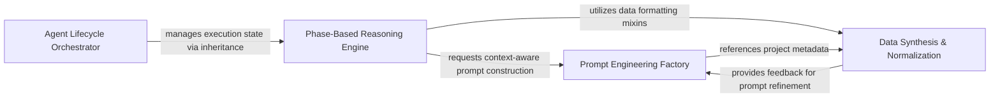

## Details

Manages the state machine and execution flow of specialized agents, handling initialization and coordinating analysis phases.

### Agent Lifecycle Orchestrator
Manages the foundational execution protocol and state transitions for agents, including LLM environment initialization and the main analysis run loop.

**Related Classes/Methods**: _None_

**Source Files:**

- [`agents/dependency_discovery.py`](https://github.com/CodeBoarding/CodeBoarding/blob/main/.codeboardingagents/dependency_discovery.py)
  - `agents.dependency_discovery.discover_dependency_files` ([L103-L159](https://github.com/CodeBoarding/CodeBoarding/blob/main/.codeboardingagents/dependency_discovery.py#L103-L159)) - Function

### Phase-Based Reasoning Engine
Implements the logic for each stage of architectural analysis, breaking down system abstraction into discrete steps like API surface identification and relationship analysis.

**Related Classes/Methods**: _None_

**Source Files:**

- [`agents/tools/base.py`](https://github.com/CodeBoarding/CodeBoarding/blob/main/.codeboardingagents/tools/base.py)
  - `agents.tools.base.BaseRepoTool.ignore_manager` ([L80-L81](https://github.com/CodeBoarding/CodeBoarding/blob/main/.codeboardingagents/tools/base.py#L80-L81)) - Method

### Prompt Engineering Factory
Constructs system and user prompts by injecting project-specific context and static analysis results into predefined templates.

**Related Classes/Methods**: _None_

**Source Files:**

- [`agents/tools/base.py`](https://github.com/CodeBoarding/CodeBoarding/blob/main/.codeboardingagents/tools/base.py)
  - `agents.tools.base.BaseRepoTool.is_subsequence` ([L87-L103](https://github.com/CodeBoarding/CodeBoarding/blob/main/.codeboardingagents/tools/base.py#L87-L103)) - Method

### Data Synthesis & Normalization
Refines and validates LLM outputs by cross-referencing with static analysis data, handling entity ID assignment and relationship indexing.

**Related Classes/Methods**: _None_

**Source Files:**

- [`agents/tools/base.py`](https://github.com/CodeBoarding/CodeBoarding/blob/main/.codeboardingagents/tools/base.py)
  - `agents.tools.base.BaseRepoTool.repo_dir` ([L76-L77](https://github.com/CodeBoarding/CodeBoarding/blob/main/.codeboardingagents/tools/base.py#L76-L77)) - Method

### [FAQ](https://github.com/CodeBoarding/GeneratedOnBoardings/tree/main?tab=readme-ov-file#faq)