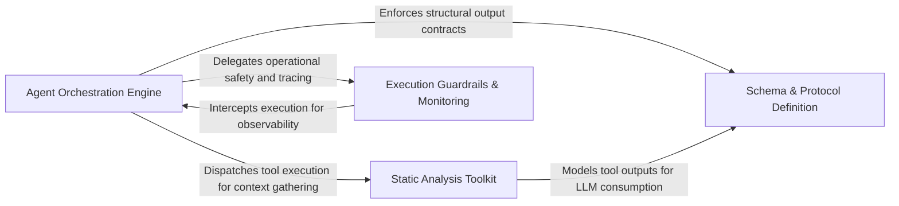

## Details

Provides the foundational execution environment for all agents, managing LLM invocation logic, retry mechanisms, and tool-based interaction with static analysis artifacts.

### Agent Orchestration Engine [[Expand]](./Agent_Orchestration_Engine.md)
The central controller for the agent's lifecycle, managing prompt generation, LLM invocation, and deterministic control loops for self-repair and validation.

**Related Classes/Methods**:

- `agents.agent.CodeBoardingAgent._invoke_repair_validate`:289-313
- `agents.agent.CodeBoardingAgent._structured_parse`:446-471
- `agents.retry.with_retries`:68-118

**Source Files:**

- [`agents/agent.py`](https://github.com/CodeBoarding/CodeBoarding/blob/main/.codeboardingagents/agent.py)
  - `agents.agent.RepairValidationResult.llm_str` ([L40-L40](https://github.com/CodeBoarding/CodeBoarding/blob/main/.codeboardingagents/agent.py#L40-L40)) - Method
  - `agents.agent.EmptyExtractorMessageError` ([L43-L44](https://github.com/CodeBoarding/CodeBoarding/blob/main/.codeboardingagents/agent.py#L43-L44)) - Class
  - `agents.agent._raise_if_auth_error` ([L47-L59](https://github.com/CodeBoarding/CodeBoarding/blob/main/.codeboardingagents/agent.py#L47-L59)) - Function
  - `agents.agent.CodeBoardingAgent._invoke` ([L128-L194](https://github.com/CodeBoarding/CodeBoarding/blob/main/.codeboardingagents/agent.py#L128-L194)) - Method
  - `agents.agent.CodeBoardingAgent._invoke.call_once` ([L143-L163](https://github.com/CodeBoarding/CodeBoarding/blob/main/.codeboardingagents/agent.py#L143-L163)) - Function
  - `agents.agent.CodeBoardingAgent._invoke.classify` ([L165-L179](https://github.com/CodeBoarding/CodeBoarding/blob/main/.codeboardingagents/agent.py#L165-L179)) - Function
  - `agents.agent.CodeBoardingAgent._invoke.on_exhausted` ([L181-L186](https://github.com/CodeBoarding/CodeBoarding/blob/main/.codeboardingagents/agent.py#L181-L186)) - Function
  - `agents.agent.CodeBoardingAgent._invoke_with_timeout` ([L196-L234](https://github.com/CodeBoarding/CodeBoarding/blob/main/.codeboardingagents/agent.py#L196-L234)) - Method
  - `agents.agent.CodeBoardingAgent._invoke_with_timeout.invoke_target` ([L204-L212](https://github.com/CodeBoarding/CodeBoarding/blob/main/.codeboardingagents/agent.py#L204-L212)) - Function
  - `agents.agent.CodeBoardingAgent._parse_invoke` ([L236-L244](https://github.com/CodeBoarding/CodeBoarding/blob/main/.codeboardingagents/agent.py#L236-L244)) - Method
  - `agents.agent.CodeBoardingAgent._repair_result` ([L246-L255](https://github.com/CodeBoarding/CodeBoarding/blob/main/.codeboardingagents/agent.py#L246-L255)) - Method
  - `agents.agent.CodeBoardingAgent._score_result` ([L257-L287](https://github.com/CodeBoarding/CodeBoarding/blob/main/.codeboardingagents/agent.py#L257-L287)) - Method
  - `agents.agent.CodeBoardingAgent._invoke_repair_validate` ([L289-L313](https://github.com/CodeBoarding/CodeBoarding/blob/main/.codeboardingagents/agent.py#L289-L313)) - Method
  - `agents.agent.CodeBoardingAgent._invoke_repair_validate.repair_candidate` ([L302-L303](https://github.com/CodeBoarding/CodeBoarding/blob/main/.codeboardingagents/agent.py#L302-L303)) - Function
  - `agents.agent.CodeBoardingAgent._invoke_validate` ([L315-L394](https://github.com/CodeBoarding/CodeBoarding/blob/main/.codeboardingagents/agent.py#L315-L394)) - Method
  - `agents.agent.CodeBoardingAgent._parse_response` ([L396-L444](https://github.com/CodeBoarding/CodeBoarding/blob/main/.codeboardingagents/agent.py#L396-L444)) - Method
  - `agents.agent.CodeBoardingAgent._parse_response.call_once` ([L411-L418](https://github.com/CodeBoarding/CodeBoarding/blob/main/.codeboardingagents/agent.py#L411-L418)) - Function
  - `agents.agent.CodeBoardingAgent._parse_response.classify` ([L420-L429](https://github.com/CodeBoarding/CodeBoarding/blob/main/.codeboardingagents/agent.py#L420-L429)) - Function
  - `agents.agent.CodeBoardingAgent._parse_response.on_exhausted` ([L431-L436](https://github.com/CodeBoarding/CodeBoarding/blob/main/.codeboardingagents/agent.py#L431-L436)) - Function
  - `agents.agent.CodeBoardingAgent._structured_parse` ([L446-L471](https://github.com/CodeBoarding/CodeBoarding/blob/main/.codeboardingagents/agent.py#L446-L471)) - Method
  - `agents.agent.CodeBoardingAgent._extractor_parse` ([L473-L492](https://github.com/CodeBoarding/CodeBoarding/blob/main/.codeboardingagents/agent.py#L473-L492)) - Method
- [`agents/retry.py`](https://github.com/CodeBoarding/CodeBoarding/blob/main/.codeboardingagents/retry.py)
  - `agents.retry.RetryAction` ([L41-L44](https://github.com/CodeBoarding/CodeBoarding/blob/main/.codeboardingagents/retry.py#L41-L44)) - Class
  - `agents.retry.RetryDecision` ([L48-L55](https://github.com/CodeBoarding/CodeBoarding/blob/main/.codeboardingagents/retry.py#L48-L55)) - Class
  - `agents.retry.default_backoff` ([L58-L61](https://github.com/CodeBoarding/CodeBoarding/blob/main/.codeboardingagents/retry.py#L58-L61)) - Function
  - `agents.retry._default_classify` ([L64-L65](https://github.com/CodeBoarding/CodeBoarding/blob/main/.codeboardingagents/retry.py#L64-L65)) - Function
  - `agents.retry.with_retries` ([L68-L118](https://github.com/CodeBoarding/CodeBoarding/blob/main/.codeboardingagents/retry.py#L68-L118)) - Function

### Static Analysis Toolkit [[Expand]](./Static_Analysis_Toolkit.md)
A unified interface that exposes static analysis results like CFGs and file structures as actionable tools for the agent.

**Related Classes/Methods**:

- `agents.tools.toolkit.CodeBoardingToolkit`:21-128
- `agents.tools.read_cfg.GetCFGTool`:8-61
- `agents.tools.read_structure.CodeStructureTool`:14-49
- `agents.tools.read_source.CodeReferenceReader`:25-85

**Source Files:**

- [`agents/agent.py`](https://github.com/CodeBoarding/CodeBoarding/blob/main/.codeboardingagents/agent.py)
  - `agents.agent.RepairValidationResult` ([L39-L40](https://github.com/CodeBoarding/CodeBoarding/blob/main/.codeboardingagents/agent.py#L39-L40)) - Class
  - `agents.agent.CodeBoardingAgent` ([L62-L492](https://github.com/CodeBoarding/CodeBoarding/blob/main/.codeboardingagents/agent.py#L62-L492)) - Class
  - `agents.agent.CodeBoardingAgent.__init__` ([L63-L86](https://github.com/CodeBoarding/CodeBoarding/blob/main/.codeboardingagents/agent.py#L63-L86)) - Method
  - `agents.agent.CodeBoardingAgent.read_source_reference` ([L89-L90](https://github.com/CodeBoarding/CodeBoarding/blob/main/.codeboardingagents/agent.py#L89-L90)) - Method
  - `agents.agent.CodeBoardingAgent.read_packages_tool` ([L93-L94](https://github.com/CodeBoarding/CodeBoarding/blob/main/.codeboardingagents/agent.py#L93-L94)) - Method
  - `agents.agent.CodeBoardingAgent.read_structure_tool` ([L97-L98](https://github.com/CodeBoarding/CodeBoarding/blob/main/.codeboardingagents/agent.py#L97-L98)) - Method
  - `agents.agent.CodeBoardingAgent.read_file_structure` ([L101-L102](https://github.com/CodeBoarding/CodeBoarding/blob/main/.codeboardingagents/agent.py#L101-L102)) - Method
  - `agents.agent.CodeBoardingAgent.read_cfg_tool` ([L105-L106](https://github.com/CodeBoarding/CodeBoarding/blob/main/.codeboardingagents/agent.py#L105-L106)) - Method
  - `agents.agent.CodeBoardingAgent.read_method_invocations_tool` ([L109-L110](https://github.com/CodeBoarding/CodeBoarding/blob/main/.codeboardingagents/agent.py#L109-L110)) - Method
  - `agents.agent.CodeBoardingAgent.component_bridge_edges_tool` ([L113-L114](https://github.com/CodeBoarding/CodeBoarding/blob/main/.codeboardingagents/agent.py#L113-L114)) - Method
  - `agents.agent.CodeBoardingAgent.read_file_tool` ([L117-L118](https://github.com/CodeBoarding/CodeBoarding/blob/main/.codeboardingagents/agent.py#L117-L118)) - Method
  - `agents.agent.CodeBoardingAgent.read_docs` ([L121-L122](https://github.com/CodeBoarding/CodeBoarding/blob/main/.codeboardingagents/agent.py#L121-L122)) - Method
  - `agents.agent.CodeBoardingAgent.external_deps_tool` ([L125-L126](https://github.com/CodeBoarding/CodeBoarding/blob/main/.codeboardingagents/agent.py#L125-L126)) - Method
- [`agents/tools/base.py`](https://github.com/CodeBoarding/CodeBoarding/blob/main/.codeboardingagents/tools/base.py)
  - `agents.tools.base.RepoContext` ([L13-L61](https://github.com/CodeBoarding/CodeBoarding/blob/main/.codeboardingagents/tools/base.py#L13-L61)) - Class
- [`agents/tools/component_bridge_edges.py`](https://github.com/CodeBoarding/CodeBoarding/blob/main/.codeboardingagents/tools/component_bridge_edges.py)
  - `agents.tools.component_bridge_edges.ComponentBridgeEdgesTool` ([L20-L84](https://github.com/CodeBoarding/CodeBoarding/blob/main/.codeboardingagents/tools/component_bridge_edges.py#L20-L84)) - Class
- [`agents/tools/get_external_deps.py`](https://github.com/CodeBoarding/CodeBoarding/blob/main/.codeboardingagents/tools/get_external_deps.py)
  - `agents.tools.get_external_deps.ExternalDepsTool` ([L15-L47](https://github.com/CodeBoarding/CodeBoarding/blob/main/.codeboardingagents/tools/get_external_deps.py#L15-L47)) - Class
- [`agents/tools/get_method_invocations.py`](https://github.com/CodeBoarding/CodeBoarding/blob/main/.codeboardingagents/tools/get_method_invocations.py)
  - `agents.tools.get_method_invocations.MethodInvocationsTool` ([L14-L47](https://github.com/CodeBoarding/CodeBoarding/blob/main/.codeboardingagents/tools/get_method_invocations.py#L14-L47)) - Class
- [`agents/tools/list_git_changes.py`](https://github.com/CodeBoarding/CodeBoarding/blob/main/.codeboardingagents/tools/list_git_changes.py)
  - `agents.tools.list_git_changes.ListGitChangesTool` ([L10-L27](https://github.com/CodeBoarding/CodeBoarding/blob/main/.codeboardingagents/tools/list_git_changes.py#L10-L27)) - Class
  - `agents.tools.list_git_changes.ListGitChangesTool._run` ([L16-L27](https://github.com/CodeBoarding/CodeBoarding/blob/main/.codeboardingagents/tools/list_git_changes.py#L16-L27)) - Method
- [`agents/tools/read_cfg.py`](https://github.com/CodeBoarding/CodeBoarding/blob/main/.codeboardingagents/tools/read_cfg.py)
  - `agents.tools.read_cfg.GetCFGTool` ([L8-L61](https://github.com/CodeBoarding/CodeBoarding/blob/main/.codeboardingagents/tools/read_cfg.py#L8-L61)) - Class
- [`agents/tools/read_docs.py`](https://github.com/CodeBoarding/CodeBoarding/blob/main/.codeboardingagents/tools/read_docs.py)
  - `agents.tools.read_docs.ReadDocsTool` ([L22-L132](https://github.com/CodeBoarding/CodeBoarding/blob/main/.codeboardingagents/tools/read_docs.py#L22-L132)) - Class
- [`agents/tools/read_file.py`](https://github.com/CodeBoarding/CodeBoarding/blob/main/.codeboardingagents/tools/read_file.py)
  - `agents.tools.read_file.ReadFileTool` ([L19-L90](https://github.com/CodeBoarding/CodeBoarding/blob/main/.codeboardingagents/tools/read_file.py#L19-L90)) - Class
- [`agents/tools/read_file_structure.py`](https://github.com/CodeBoarding/CodeBoarding/blob/main/.codeboardingagents/tools/read_file_structure.py)
  - `agents.tools.read_file_structure.FileStructureTool` ([L22-L101](https://github.com/CodeBoarding/CodeBoarding/blob/main/.codeboardingagents/tools/read_file_structure.py#L22-L101)) - Class
- [`agents/tools/read_packages.py`](https://github.com/CodeBoarding/CodeBoarding/blob/main/.codeboardingagents/tools/read_packages.py)
  - `agents.tools.read_packages.PackageRelationsTool` ([L26-L60](https://github.com/CodeBoarding/CodeBoarding/blob/main/.codeboardingagents/tools/read_packages.py#L26-L60)) - Class
- [`agents/tools/read_source.py`](https://github.com/CodeBoarding/CodeBoarding/blob/main/.codeboardingagents/tools/read_source.py)
  - `agents.tools.read_source.CodeReferenceReader` ([L25-L85](https://github.com/CodeBoarding/CodeBoarding/blob/main/.codeboardingagents/tools/read_source.py#L25-L85)) - Class
- [`agents/tools/read_structure.py`](https://github.com/CodeBoarding/CodeBoarding/blob/main/.codeboardingagents/tools/read_structure.py)
  - `agents.tools.read_structure.CodeStructureTool` ([L14-L49](https://github.com/CodeBoarding/CodeBoarding/blob/main/.codeboardingagents/tools/read_structure.py#L14-L49)) - Class
- [`agents/tools/toolkit.py`](https://github.com/CodeBoarding/CodeBoarding/blob/main/.codeboardingagents/tools/toolkit.py)
  - `agents.tools.toolkit.CodeBoardingToolkit` ([L21-L128](https://github.com/CodeBoarding/CodeBoarding/blob/main/.codeboardingagents/tools/toolkit.py#L21-L128)) - Class
  - `agents.tools.toolkit.CodeBoardingToolkit.__init__` ([L27-L29](https://github.com/CodeBoarding/CodeBoarding/blob/main/.codeboardingagents/tools/toolkit.py#L27-L29)) - Method
  - `agents.tools.toolkit.CodeBoardingToolkit.read_source_reference` ([L32-L35](https://github.com/CodeBoarding/CodeBoarding/blob/main/.codeboardingagents/tools/toolkit.py#L32-L35)) - Method
  - `agents.tools.toolkit.CodeBoardingToolkit.read_packages` ([L38-L41](https://github.com/CodeBoarding/CodeBoarding/blob/main/.codeboardingagents/tools/toolkit.py#L38-L41)) - Method
  - `agents.tools.toolkit.CodeBoardingToolkit.read_structure` ([L44-L47](https://github.com/CodeBoarding/CodeBoarding/blob/main/.codeboardingagents/tools/toolkit.py#L44-L47)) - Method
  - `agents.tools.toolkit.CodeBoardingToolkit.read_file_structure` ([L50-L53](https://github.com/CodeBoarding/CodeBoarding/blob/main/.codeboardingagents/tools/toolkit.py#L50-L53)) - Method
  - `agents.tools.toolkit.CodeBoardingToolkit.read_cfg` ([L56-L59](https://github.com/CodeBoarding/CodeBoarding/blob/main/.codeboardingagents/tools/toolkit.py#L56-L59)) - Method
  - `agents.tools.toolkit.CodeBoardingToolkit.read_method_invocations` ([L62-L65](https://github.com/CodeBoarding/CodeBoarding/blob/main/.codeboardingagents/tools/toolkit.py#L62-L65)) - Method
  - `agents.tools.toolkit.CodeBoardingToolkit.component_bridge_edges` ([L68-L71](https://github.com/CodeBoarding/CodeBoarding/blob/main/.codeboardingagents/tools/toolkit.py#L68-L71)) - Method
  - `agents.tools.toolkit.CodeBoardingToolkit.read_file` ([L74-L77](https://github.com/CodeBoarding/CodeBoarding/blob/main/.codeboardingagents/tools/toolkit.py#L74-L77)) - Method
  - `agents.tools.toolkit.CodeBoardingToolkit.read_docs` ([L80-L83](https://github.com/CodeBoarding/CodeBoarding/blob/main/.codeboardingagents/tools/toolkit.py#L80-L83)) - Method
  - `agents.tools.toolkit.CodeBoardingToolkit.external_deps` ([L86-L89](https://github.com/CodeBoarding/CodeBoarding/blob/main/.codeboardingagents/tools/toolkit.py#L86-L89)) - Method
  - `agents.tools.toolkit.CodeBoardingToolkit.list_git_changes` ([L92-L95](https://github.com/CodeBoarding/CodeBoarding/blob/main/.codeboardingagents/tools/toolkit.py#L92-L95)) - Method
  - `agents.tools.toolkit.CodeBoardingToolkit.get_agent_tools` ([L97-L108](https://github.com/CodeBoarding/CodeBoarding/blob/main/.codeboardingagents/tools/toolkit.py#L97-L108)) - Method
  - `agents.tools.toolkit.CodeBoardingToolkit.get_all_tools` ([L110-L128](https://github.com/CodeBoarding/CodeBoarding/blob/main/.codeboardingagents/tools/toolkit.py#L110-L128)) - Method

### Schema & Protocol Definition [[Expand]](./Schema_Protocol_Definition.md)
Defines structural contracts for LLM communication using Pydantic models to ensure predictable inputs and outputs.

**Related Classes/Methods**:

- `agents.agent_responses.LLMBaseModel.model_json_schema`:107-129

**Source Files:**

- [`agents/agent_responses.py`](https://github.com/CodeBoarding/CodeBoarding/blob/main/.codeboardingagents/agent_responses.py)
  - `agents.agent_responses.LLMBaseModel.llm_str` ([L28-L29](https://github.com/CodeBoarding/CodeBoarding/blob/main/.codeboardingagents/agent_responses.py#L28-L29)) - Method
  - `agents.agent_responses.LLMBaseModel._is_field_hidden` ([L32-L38](https://github.com/CodeBoarding/CodeBoarding/blob/main/.codeboardingagents/agent_responses.py#L32-L38)) - Method
  - `agents.agent_responses.LLMBaseModel._excluded_fields` ([L41-L50](https://github.com/CodeBoarding/CodeBoarding/blob/main/.codeboardingagents/agent_responses.py#L41-L50)) - Method
  - `agents.agent_responses.LLMBaseModel._resolve_excluded_by_title` ([L53-L72](https://github.com/CodeBoarding/CodeBoarding/blob/main/.codeboardingagents/agent_responses.py#L53-L72)) - Method
  - `agents.agent_responses.LLMBaseModel._resolve_excluded_by_title.walk` ([L57-L69](https://github.com/CodeBoarding/CodeBoarding/blob/main/.codeboardingagents/agent_responses.py#L57-L69)) - Function
  - `agents.agent_responses.LLMBaseModel._extractor_fields` ([L75-L94](https://github.com/CodeBoarding/CodeBoarding/blob/main/.codeboardingagents/agent_responses.py#L75-L94)) - Method
  - `agents.agent_responses.LLMBaseModel.extractor_str` ([L97-L104](https://github.com/CodeBoarding/CodeBoarding/blob/main/.codeboardingagents/agent_responses.py#L97-L104)) - Method
  - `agents.agent_responses.LLMBaseModel.model_json_schema` ([L107-L129](https://github.com/CodeBoarding/CodeBoarding/blob/main/.codeboardingagents/agent_responses.py#L107-L129)) - Method

### Execution Guardrails & Monitoring [[Expand]](./Execution_Guardrails_Monitoring.md)
Manages operational safety, including authentication, execution timeouts, and tracing hooks for observability.

**Related Classes/Methods**:

- `agents.llm_errors.detect_auth_error`:95-125
- `monitoring.context.trace.decorator`:169-171

**Source Files:**

- [`agents/llm_errors.py`](https://github.com/CodeBoarding/CodeBoarding/blob/main/.codeboardingagents/llm_errors.py)
  - `agents.llm_errors.LLMAuthError` ([L55-L70](https://github.com/CodeBoarding/CodeBoarding/blob/main/.codeboardingagents/llm_errors.py#L55-L70)) - Class
  - `agents.llm_errors.LLMAuthError.__init__` ([L66-L70](https://github.com/CodeBoarding/CodeBoarding/blob/main/.codeboardingagents/llm_errors.py#L66-L70)) - Method
  - `agents.llm_errors._status_code` ([L73-L82](https://github.com/CodeBoarding/CodeBoarding/blob/main/.codeboardingagents/llm_errors.py#L73-L82)) - Function
  - `agents.llm_errors._is_auth_failure` ([L85-L92](https://github.com/CodeBoarding/CodeBoarding/blob/main/.codeboardingagents/llm_errors.py#L85-L92)) - Function
  - `agents.llm_errors.detect_auth_error` ([L95-L125](https://github.com/CodeBoarding/CodeBoarding/blob/main/.codeboardingagents/llm_errors.py#L95-L125)) - Function
- [`monitoring/context.py`](https://github.com/CodeBoarding/CodeBoarding/blob/main/.codeboardingmonitoring/context.py)
  - `monitoring.context.trace._create_wrapper` ([L139-L161](https://github.com/CodeBoarding/CodeBoarding/blob/main/.codeboardingmonitoring/context.py#L139-L161)) - Function
  - `monitoring.context.trace._create_wrapper.wrapper` ([L141-L159](https://github.com/CodeBoarding/CodeBoarding/blob/main/.codeboardingmonitoring/context.py#L141-L159)) - Function
  - `monitoring.context.trace.decorator` ([L169-L171](https://github.com/CodeBoarding/CodeBoarding/blob/main/.codeboardingmonitoring/context.py#L169-L171)) - Function

### [FAQ](https://github.com/CodeBoarding/GeneratedOnBoardings/tree/main?tab=readme-ov-file#faq)