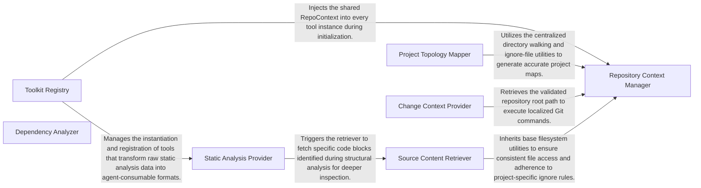

## Details

Provides a set of specialized tools that allow the LLM Agent Core to interact with the codebase, query static analysis results, and perform specific actions within the project context.

### Toolkit Registry
Acts as the central factory and lifecycle manager for the subsystem; it discovers available tools and provides a unified get_all_tools interface for external agent orchestration.

**Related Classes/Methods**:

- <a href="https://github.com/CodeBoarding/CodeBoarding/blob/main/.codeboardingagents/tools/__init__.py" target="_blank" rel="noopener noreferrer">`agents.tools.registry.ToolkitRegistry`</a>

### Repository Context Manager
Provides the foundational state and shared logic for all tools, including filesystem pathing, ignore‑file management, and result caching.

**Related Classes/Methods**:

- <a href="https://github.com/CodeBoarding/CodeBoarding/blob/main/.codeboardingagents/tools/base.py" target="_blank" rel="noopener noreferrer">`agents.tools.base.RepoContext`</a>
- <a href="https://github.com/CodeBoarding/CodeBoarding/blob/main/.codeboardingagents/tools/base.py" target="_blank" rel="noopener noreferrer">`agents.tools.base.BaseRepoTool`</a>

### Static Analysis Provider
Interfaces with the static analysis engine to extract high‑level architectural data, including Control Flow Graphs (CFGs), class hierarchies, and method invocation chains.

**Related Classes/Methods**:

- <a href="https://github.com/CodeBoarding/CodeBoarding/blob/main/.codeboardingagents/tools/read_source.py" target="_blank" rel="noopener noreferrer">`agents.tools.read_source.GetCFGTool`</a>
- <a href="https://github.com/CodeBoarding/CodeBoarding/blob/main/.codeboardingagents/tools/read_source.py" target="_blank" rel="noopener noreferrer">`agents.tools.read_source.CodeStructureTool`</a>

### Source Content Retriever
Performs granular retrieval of raw code and documentation; it can read entire files or extract specific code blocks based on fully‑qualified identifiers.

**Related Classes/Methods**:

- <a href="https://github.com/CodeBoarding/CodeBoarding/blob/main/.codeboardingagents/tools/read_source.py" target="_blank" rel="noopener noreferrer">`agents.tools.read_source.ReadFileTool`</a>
- <a href="https://github.com/CodeBoarding/CodeBoarding/blob/main/.codeboardingagents/tools/read_source.py" target="_blank" rel="noopener noreferrer">`agents.tools.read_source.CodeReferenceReader`</a>

### Project Topology Mapper
Maps the physical and logical layout of the project, generating directory trees and identifying package‑level relationships and imports.

**Related Classes/Methods**:

- <a href="https://github.com/CodeBoarding/CodeBoarding/blob/main/.codeboardingagents/tools/read_source.py" target="_blank" rel="noopener noreferrer">`agents.tools.read_source.FileStructureTool`</a>
- <a href="https://github.com/CodeBoarding/CodeBoarding/blob/main/.codeboardingagents/tools/read_source.py" target="_blank" rel="noopener noreferrer">`agents.tools.read_source.PackageRelationsTool`</a>

### Change Context Provider
Wraps Git operations to provide incremental change data, allowing agents to focus their analysis on modified code sections rather than the entire codebase.

**Related Classes/Methods**:

- <a href="https://github.com/CodeBoarding/CodeBoarding/blob/main/.codeboardingagents/tools/read_git_diff.py" target="_blank" rel="noopener noreferrer">`agents.tools.git_tools.ReadDiffTool`</a>

### Dependency Analyzer
Scans and parses project manifests (e.g., pyproject.toml) to identify external libraries and the broader ecosystem the project relies on.

**Related Classes/Methods**:

- <a href="https://github.com/CodeBoarding/CodeBoarding/blob/main/.codeboardingagents/tools/external_deps.py" target="_blank" rel="noopener noreferrer">`agents.tools.dependency_tools.DependencyAnalyzer`</a>

### [FAQ](https://github.com/CodeBoarding/GeneratedOnBoardings/tree/main?tab=readme-ov-file#faq)