```mermaid
graph LR
    Toolkit_Orchestrator["Toolkit Orchestrator"]
    Repository_Context_Manager["Repository Context Manager"]
    Structural_Topology_Analyzer["Structural Topology Analyzer"]
    Logic_Flow_Analyzer["Logic & Flow Analyzer"]
    Source_Code_Provider["Source Code Provider"]
    Evolution_Dependency_Analyzer["Evolution & Dependency Analyzer"]
    Documentation_Provider["Documentation Provider"]
    Toolkit_Orchestrator -- "injects shared RepoContext into" --> Repository_Context_Manager
    Repository_Context_Manager -- "provides resolved file paths and ignore‑pattern filtering for directory walking" --> Structural_Topology_Analyzer
    Structural_Topology_Analyzer -- "identifies specific class/method signatures to be targeted for CFG extraction" --> Logic_Flow_Analyzer
    Logic_Flow_Analyzer -- "provides specific line numbers or node references for targeted code retrieval" --> Source_Code_Provider
    Structural_Topology_Analyzer -- "supplies file paths discovered during tree traversal for full‑file reading" --> Source_Code_Provider
    Evolution_Dependency_Analyzer -- "supplies historical change data to enrich the agent's current session context" --> Toolkit_Orchestrator
    Documentation_Provider -- "supplies narrative design intent to guide high‑level planning" --> Toolkit_Orchestrator
    Repository_Context_Manager -- "ensures file I/O operations respect repository boundaries and encoding settings" --> Source_Code_Provider
```

## Details

Provides a set of specialized tools that allow the LLM Agent Core to interact with the codebase, query static analysis results, and perform specific actions within the project context.

### Toolkit Orchestrator
Acts as the central registry and factory; it instantiates the suite of tools and injects the shared repository context, exposing a unified interface to the LLM planner.

**Related Classes/Methods**:

- <a href="https://github.com/CodeBoarding/CodeBoarding/blob/main/.codeboardingagents/tools/toolkit.py#L19-L116" target="_blank" rel="noopener noreferrer">`CodeBoardingToolkit`:19-116</a>

### Repository Context Manager
Manages the foundational execution state, including repository discovery, file‑system walking, ignore patterns (e.g., .gitignore), and path resolution.

**Related Classes/Methods**:

- <a href="https://github.com/CodeBoarding/CodeBoarding/blob/main/.codeboardingagents/tools/base.py#L10-L54" target="_blank" rel="noopener noreferrer">`RepoContext`:10-54</a>
- <a href="https://github.com/CodeBoarding/CodeBoarding/blob/main/.codeboardingagents/tools/base.py#L57-L96" target="_blank" rel="noopener noreferrer">`BaseRepoTool`:57-96</a>

### Structural Topology Analyzer
Maps the high‑level organization of the project, providing the agent with directory trees, package hierarchies, and class relationships.

**Related Classes/Methods**:

- <a href="https://github.com/CodeBoarding/CodeBoarding/blob/main/.codeboardingagents/tools/read_file_structure.py#L22-L102" target="_blank" rel="noopener noreferrer">`FileStructureTool`:22-102</a>
- <a href="https://github.com/CodeBoarding/CodeBoarding/blob/main/.codeboardingagents/tools/read_packages.py#L26-L60" target="_blank" rel="noopener noreferrer">`PackageRelationsTool`:26-60</a>
- <a href="https://github.com/CodeBoarding/CodeBoarding/blob/main/.codeboardingagents/tools/read_source.py" target="_blank" rel="noopener noreferrer">`CodeStructureTool`</a>

### Logic & Flow Analyzer
Extracts behavioral data by generating Control Flow Graphs (CFG) and tracing method invocation chains across the codebase.

**Related Classes/Methods**:

- <a href="https://github.com/CodeBoarding/CodeBoarding/blob/main/.codeboardingagents/tools/read_cfg.py#L8-L60" target="_blank" rel="noopener noreferrer">`GetCFGTool`:8-60</a>
- <a href="https://github.com/CodeBoarding/CodeBoarding/blob/main/.codeboardingagents/tools/get_method_invocations.py#L14-L47" target="_blank" rel="noopener noreferrer">`MethodInvocationsTool`:14-47</a>

### Source Code Provider
Retrieves raw source code or specific code nodes (classes/functions) once the agent has identified target areas via structural or logic analysis.

**Related Classes/Methods**:

- <a href="https://github.com/CodeBoarding/CodeBoarding/blob/main/.codeboardingagents/tools/read_source.py" target="_blank" rel="noopener noreferrer">`ReadFileTool`</a>
- <a href="https://github.com/CodeBoarding/CodeBoarding/blob/main/.codeboardingagents/tools/read_source.py" target="_blank" rel="noopener noreferrer">`GetSourceCodeTool`</a>

### Evolution & Dependency Analyzer
Provides temporal and environmental context by analyzing Git history (diffs) and external library requirements.

**Related Classes/Methods**:

- <a href="https://github.com/CodeBoarding/CodeBoarding/blob/main/.codeboardingagents/tools/external_deps.py" target="_blank" rel="noopener noreferrer">`GitDiffTool`</a>
- <a href="https://github.com/CodeBoarding/CodeBoarding/blob/main/.codeboardingagents/tools/external_deps.py" target="_blank" rel="noopener noreferrer">`PackageDependenciesTool`</a>

### Documentation Provider
Discovers and parses project‑level documentation (READMEs, Markdown) to capture high‑level design intent and developer instructions.

**Related Classes/Methods**:

- <a href="https://github.com/CodeBoarding/CodeBoarding/blob/main/.codeboardingagents/tools/read_docs.py" target="_blank" rel="noopener noreferrer">`ReadDocTool`</a>
- <a href="https://github.com/CodeBoarding/CodeBoarding/blob/main/.codeboardingagents/tools/read_docs.py" target="_blank" rel="noopener noreferrer">`SearchDocsTool`</a>

### [FAQ](https://github.com/CodeBoarding/GeneratedOnBoardings/tree/main?tab=readme-ov-file#faq)