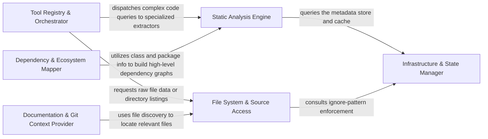

## Details

Provides a set of specialized tools that allow the LLM Agent Core to interact with the codebase, query static analysis results, and perform specific actions within the project context.

### Tool Registry & Orchestrator
Acts as the central factory and dispatcher; it aggregates all specialized tools into a unified interface, managing tool registration and lifecycle for the LLM Agent.

**Related Classes/Methods**:

- `repos.codeboarding.tools.ToolRegistry`
- `repos.codeboarding.tools.AgentToolFactory`
- `repos.codeboarding.tools.ToolDispatcher`

### Static Analysis Engine
Extracts high-level code intelligence, including Control Flow Graphs (CFG), class hierarchies, and method signatures to provide structural understanding.

**Related Classes/Methods**:

- `repos.codeboarding.tools.GetCFGTool`
- `repos.codeboarding.tools.CodeStructureTool`
- `repos.codeboarding.analysis.ClassHierarchyAnalyzer`

### File System & Source Access
Provides low-level access to the project's physical structure, enabling directory exploration and granular file content retrieval.

**Related Classes/Methods**:

- `repos.codeboarding.tools.ReadFileTool`
- `repos.codeboarding.tools.DirectoryTreeGenerator`
- `repos.codeboarding.tools.FileSystemExplorer`

### Dependency & Ecosystem Mapper
Maps internal package relationships and identifies external library dependencies to define the project's architectural boundaries.

**Related Classes/Methods**:

- `repos.codeboarding.tools.DependencyMapperTool`
- `repos.codeboarding.analysis.PackageRelationshipAnalyzer`
- `repos.codeboarding.analysis.ExternalLibraryScanner`

### Documentation & Git Context Provider
Retrieves non-code context, such as Markdown documentation and Git diffs, to provide historical grounding and design intent.

**Related Classes/Methods**:

- `repos.codeboarding.tools.MarkdownDocTool`
- `repos.codeboarding.tools.GitDiffTool`
- `repos.codeboarding.tools.ContextRetriever`

### Infrastructure & State Manager
Manages repository-level state, including the DuckDB metadata store, caching mechanisms, and global ignore-pattern enforcement.

**Related Classes/Methods**: _None_

### [FAQ](https://github.com/CodeBoarding/GeneratedOnBoardings/tree/main?tab=readme-ov-file#faq)