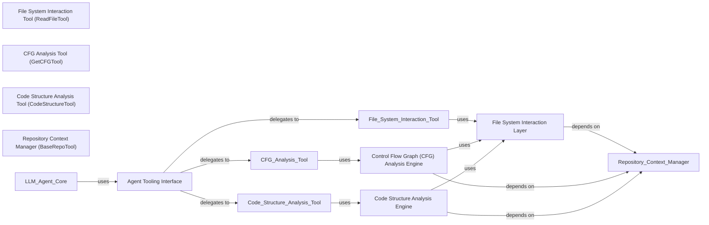

## Details

Provides a set of specialized tools that allow the LLM Agent Core to interact with the codebase, query static analysis results, and perform specific actions within the project context.

### Agent Tooling Interface [[Expand]](./Agent_Tooling_Interface.md)
Primary facade for the LLM Agent Core, aggregating and exposing all code analysis and interaction tools. It orchestrates and delegates requests from the agent to the appropriate specialized tools.

**Related Classes/Methods**:

- <a href="https://github.com/CodeBoarding/CodeBoarding/blob/main/.codeboardingagents/tools/read_source.py" target="_blank" rel="noopener noreferrer">`repos.codeboarding.tools.CodeBoardingToolkit`</a>
- <a href="https://github.com/CodeBoarding/CodeBoarding/blob/main/.codeboardingagents/tools/read_source.py" target="_blank" rel="noopener noreferrer">`repos.codeboarding.tools.ReadFileTool`</a>
- <a href="https://github.com/CodeBoarding/CodeBoarding/blob/main/.codeboardingagents/tools/read_source.py" target="_blank" rel="noopener noreferrer">`repos.codeboarding.tools.GetCFGTool`</a>
- <a href="https://github.com/CodeBoarding/CodeBoarding/blob/main/.codeboardingagents/tools/read_source.py" target="_blank" rel="noopener noreferrer">`repos.codeboarding.tools.CodeStructureTool`</a>

### File System Interaction Tool (ReadFileTool) [[Expand]](./File_System_Interaction_Tool_ReadFileTool_.md)
Specialized tool that enables the LLM Agent Core to read specific file contents from the repository, providing direct access to source code. It serves as an interface to the underlying File System Interaction Layer.

**Related Classes/Methods**: _None_

### CFG Analysis Tool (GetCFGTool) [[Expand]](./CFG_Analysis_Tool_GetCFGTool_.md)
Tool that provides the LLM Agent Core with the capability to query and retrieve Control Flow Graph (CFG) data, offering insights into execution paths and program logic. It acts as an interface to the CFG Analysis Engine.

**Related Classes/Methods**: _None_

### Code Structure Analysis Tool (CodeStructureTool) [[Expand]](./Code_Structure_Analysis_Tool_CodeStructureTool_.md)
Allows the LLM Agent Core to access high‑level code structure information, such as class hierarchies, package relationships, and source snippets. It interfaces with the Code Structure Analysis Engine.

**Related Classes/Methods**: _None_

### File System Interaction Layer
Provides raw, low‑level access to the repository, including reading file contents, traversing directory structures, and handling file‑related operations. It is the foundational layer for accessing source code.

**Related Classes/Methods**: _None_

### Control Flow Graph (CFG) Analysis Engine
Core engine responsible for generating, processing, and querying control flow graphs and method invocation data. It performs detailed static analysis of execution paths and program logic.

**Related Classes/Methods**: _None_

### Code Structure Analysis Engine
Engine that interprets and extracts high‑level code structure, including source snippets, external dependencies, package relationships, and class hierarchies. It provides the structural understanding of the codebase.

**Related Classes/Methods**: _None_

### Repository Context Manager (BaseRepoTool) [[Expand]](./Repository_Context_Manager_BaseRepoTool_.md)
Supplies shared utilities such as file caching, .gitignore handling, and path resolution. It ensures consistent and optimized repository interaction across all analysis components, acting as a foundational service.

**Related Classes/Methods**:

- <a href="https://github.com/CodeBoarding/CodeBoarding/blob/main/.codeboardingagents/tools/read_source.py" target="_blank" rel="noopener noreferrer">`repos.codeboarding.tools.BaseRepoTool`</a>
- <a href="https://github.com/CodeBoarding/CodeBoarding/blob/main/.codeboardingagents/tools/read_source.py" target="_blank" rel="noopener noreferrer">`repos.codeboarding.repo_context.FileCache`</a>
- <a href="https://github.com/CodeBoarding/CodeBoarding/blob/main/.codeboardingagents/tools/read_source.py" target="_blank" rel="noopener noreferrer">`repos.codeboarding.repo_context.GitignoreHandler`</a>

### [FAQ](https://github.com/CodeBoarding/GeneratedOnBoardings/tree/main?tab=readme-ov-file#faq)