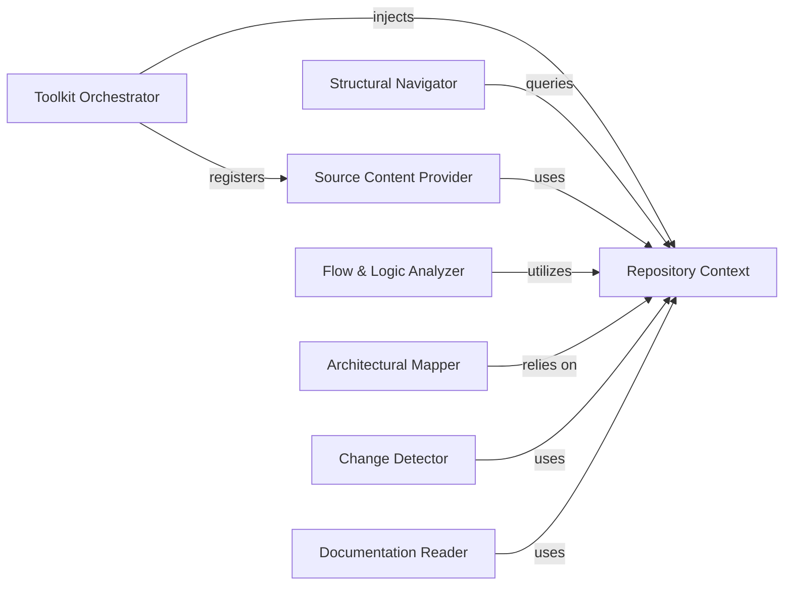

```mermaid
graph LR
    Toolkit_Orchestrator["Toolkit Orchestrator"]
    Repository_Context["Repository Context"]
    Structural_Navigator["Structural Navigator"]
    Source_Content_Provider["Source Content Provider"]
    Flow_Logic_Analyzer["Flow & Logic Analyzer"]
    Architectural_Mapper["Architectural Mapper"]
    Change_Detector["Change Detector"]
    Documentation_Reader["Documentation Reader"]
    Toolkit_Orchestrator -- "injects" --> Repository_Context
    Structural_Navigator -- "queries" --> Repository_Context
    Source_Content_Provider -- "uses" --> Repository_Context
    Flow_Logic_Analyzer -- "utilizes" --> Repository_Context
    Architectural_Mapper -- "relies on" --> Repository_Context
    Change_Detector -- "uses" --> Repository_Context
    Documentation_Reader -- "uses" --> Repository_Context
    Toolkit_Orchestrator -- "registers" --> Source_Content_Provider
```

## Details

Provides a set of specialized tools that allow the LLM Agent Core to interact with the codebase, query static analysis results, and perform specific actions within the project context.

### Toolkit Orchestrator
The central registry and factory that instantiates tools and exposes them to agents via a unified interface.

**Related Classes/Methods**:

- `agents.tools.factory.ToolkitOrchestrator`

### Repository Context
A shared-state container providing the repository root, ignore patterns, and handles to the static analysis engine.

**Related Classes/Methods**: _None_

### Structural Navigator
Generates hierarchical tree views of the directory layout, respecting .gitignore to provide a high-level project map.

**Related Classes/Methods**:

- `agents.tools.read_source.StructuralNavigator`

### Source Content Provider
Supplies raw file content and symbol-aware source extraction for specific classes or functions.

**Related Classes/Methods**:

- `agents.tools.read_source.SourceContentProvider`

### Flow & Logic Analyzer
Traces execution paths, generates Control Flow Graphs (CFGs), and maps method-level call relationships.

**Related Classes/Methods**:

- `agents.tools.read_source.FlowLogicAnalyzer`

### Architectural Mapper
Extracts high-level structural metadata, including class inheritance hierarchies and package-level dependencies.

**Related Classes/Methods**:

- `agents.tools.read_source.ArchitecturalMapper`

### Change Detector
Performs delta-analysis by reading Git diffs, allowing agents to focus on incremental code changes.

**Related Classes/Methods**:

- `agents.tools.git_tools.ChangeDetector`

### Documentation Reader
Specifically targets and extracts content from project documentation (READMEs, /docs) for contextual grounding.

**Related Classes/Methods**:

- `agents.tools.doc_tools.DocumentationReader`

### [FAQ](https://github.com/CodeBoarding/GeneratedOnBoardings/tree/main?tab=readme-ov-file#faq)