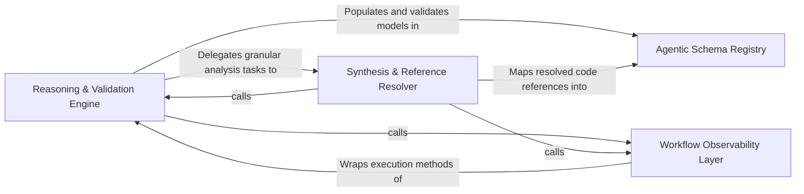

## Details

Implements the primary reasoning logic through specialized agents that perform hierarchical abstraction and detailed synthesis.

### Reasoning & Validation Engine
Orchestrates the high-level reasoning workflows, managing the lifecycle of abstraction and incremental analysis while ensuring architectural models are complete and sound.

**Related Classes/Methods**:

- `agents.abstraction_agent.AbstractionAgent`:38-177
- `agents.incremental_agent.IncrementalAgent`:50-241
- `agents.validation.validate_cluster_coverage`:81-145
- `agents.validation.score_validation_results`:58-78

**Source Files:**

- [`agents/abstraction_agent.py`](https://github.com/CodeBoarding/CodeBoarding/blob/main/.codeboardingagents/abstraction_agent.py)
  - `agents.abstraction_agent.AbstractionAgent.__init__` ([L39-L62](https://github.com/CodeBoarding/CodeBoarding/blob/main/.codeboardingagents/abstraction_agent.py#L39-L62)) - Method
  - `agents.abstraction_agent.AbstractionAgent.step_clusters_grouping` ([L65-L105](https://github.com/CodeBoarding/CodeBoarding/blob/main/.codeboardingagents/abstraction_agent.py#L65-L105)) - Method
  - `agents.abstraction_agent.AbstractionAgent.step_final_analysis` ([L108-L151](https://github.com/CodeBoarding/CodeBoarding/blob/main/.codeboardingagents/abstraction_agent.py#L108-L151)) - Method
  - `agents.abstraction_agent.AbstractionAgent.run` ([L153-L177](https://github.com/CodeBoarding/CodeBoarding/blob/main/.codeboardingagents/abstraction_agent.py#L153-L177)) - Method
- [`agents/agent_responses.py`](https://github.com/CodeBoarding/CodeBoarding/blob/main/.codeboardingagents/agent_responses.py)
  - `agents.agent_responses.LLMBaseModel` ([L15-L120](https://github.com/CodeBoarding/CodeBoarding/blob/main/.codeboardingagents/agent_responses.py#L15-L120)) - Class
  - `agents.agent_responses.ClustersComponent` ([L180-L228](https://github.com/CodeBoarding/CodeBoarding/blob/main/.codeboardingagents/agent_responses.py#L180-L228)) - Class
  - `agents.agent_responses.ClusterAnalysis` ([L231-L243](https://github.com/CodeBoarding/CodeBoarding/blob/main/.codeboardingagents/agent_responses.py#L231-L243)) - Class
  - `agents.agent_responses.assign_component_ids` ([L370-L413](https://github.com/CodeBoarding/CodeBoarding/blob/main/.codeboardingagents/agent_responses.py#L370-L413)) - Function
  - `agents.agent_responses.iter_components` ([L416-L424](https://github.com/CodeBoarding/CodeBoarding/blob/main/.codeboardingagents/agent_responses.py#L416-L424)) - Function
  - `agents.agent_responses.CFGComponent` ([L439-L455](https://github.com/CodeBoarding/CodeBoarding/blob/main/.codeboardingagents/agent_responses.py#L439-L455)) - Class
  - `agents.agent_responses.CFGAnalysisInsights` ([L458-L470](https://github.com/CodeBoarding/CodeBoarding/blob/main/.codeboardingagents/agent_responses.py#L458-L470)) - Class
  - `agents.agent_responses.ExpandComponent` ([L473-L480](https://github.com/CodeBoarding/CodeBoarding/blob/main/.codeboardingagents/agent_responses.py#L473-L480)) - Class
  - `agents.agent_responses.ValidationInsights` ([L483-L493](https://github.com/CodeBoarding/CodeBoarding/blob/main/.codeboardingagents/agent_responses.py#L483-L493)) - Class
  - `agents.agent_responses.UpdateAnalysis` ([L496-L505](https://github.com/CodeBoarding/CodeBoarding/blob/main/.codeboardingagents/agent_responses.py#L496-L505)) - Class
  - `agents.agent_responses.MetaAnalysisInsights` ([L508-L534](https://github.com/CodeBoarding/CodeBoarding/blob/main/.codeboardingagents/agent_responses.py#L508-L534)) - Class
  - `agents.agent_responses.MetaAnalysisInsights.llm_str` ([L524-L534](https://github.com/CodeBoarding/CodeBoarding/blob/main/.codeboardingagents/agent_responses.py#L524-L534)) - Method
  - `agents.agent_responses.FileClassification` ([L537-L544](https://github.com/CodeBoarding/CodeBoarding/blob/main/.codeboardingagents/agent_responses.py#L537-L544)) - Class
  - `agents.agent_responses.ComponentFiles` ([L547-L559](https://github.com/CodeBoarding/CodeBoarding/blob/main/.codeboardingagents/agent_responses.py#L547-L559)) - Class
  - `agents.agent_responses.ScopeRelations` ([L562-L570](https://github.com/CodeBoarding/CodeBoarding/blob/main/.codeboardingagents/agent_responses.py#L562-L570)) - Class
  - `agents.agent_responses.FilePath` ([L573-L587](https://github.com/CodeBoarding/CodeBoarding/blob/main/.codeboardingagents/agent_responses.py#L573-L587)) - Class
- [`agents/incremental_agent.py`](https://github.com/CodeBoarding/CodeBoarding/blob/main/.codeboardingagents/incremental_agent.py)
  - `agents.incremental_agent.IncrementalAgent.__init__` ([L53-L82](https://github.com/CodeBoarding/CodeBoarding/blob/main/.codeboardingagents/incremental_agent.py#L53-L82)) - Method
  - `agents.incremental_agent.IncrementalAgent.run` ([L85-L148](https://github.com/CodeBoarding/CodeBoarding/blob/main/.codeboardingagents/incremental_agent.py#L85-L148)) - Method
  - `agents.incremental_agent.IncrementalAgent.generate_scope_relations` ([L151-L212](https://github.com/CodeBoarding/CodeBoarding/blob/main/.codeboardingagents/incremental_agent.py#L151-L212)) - Method
  - `agents.incremental_agent.IncrementalAgent.generate_all_scope_relations` ([L215-L241](https://github.com/CodeBoarding/CodeBoarding/blob/main/.codeboardingagents/incremental_agent.py#L215-L241)) - Method
  - `agents.incremental_agent._format_existing_components` ([L244-L275](https://github.com/CodeBoarding/CodeBoarding/blob/main/.codeboardingagents/incremental_agent.py#L244-L275)) - Function
  - `agents.incremental_agent._format_component_line` ([L278-L283](https://github.com/CodeBoarding/CodeBoarding/blob/main/.codeboardingagents/incremental_agent.py#L278-L283)) - Function
  - `agents.incremental_agent.Verdict` ([L289-L299](https://github.com/CodeBoarding/CodeBoarding/blob/main/.codeboardingagents/incremental_agent.py#L289-L299)) - Class
  - `agents.incremental_agent._log_routing_summary` ([L308-L318](https://github.com/CodeBoarding/CodeBoarding/blob/main/.codeboardingagents/incremental_agent.py#L308-L318)) - Function
  - `agents.incremental_agent._log_scope_relations_summary` ([L336-L341](https://github.com/CodeBoarding/CodeBoarding/blob/main/.codeboardingagents/incremental_agent.py#L336-L341)) - Function
- [`agents/validation.py`](https://github.com/CodeBoarding/CodeBoarding/blob/main/.codeboardingagents/validation.py)
  - `agents.validation.ValidationContext` ([L32-L47](https://github.com/CodeBoarding/CodeBoarding/blob/main/.codeboardingagents/validation.py#L32-L47)) - Class
  - `agents.validation.ValidationResult` ([L51-L55](https://github.com/CodeBoarding/CodeBoarding/blob/main/.codeboardingagents/validation.py#L51-L55)) - Class
  - `agents.validation.score_validation_results` ([L58-L78](https://github.com/CodeBoarding/CodeBoarding/blob/main/.codeboardingagents/validation.py#L58-L78)) - Function
  - `agents.validation.validate_cluster_coverage` ([L81-L145](https://github.com/CodeBoarding/CodeBoarding/blob/main/.codeboardingagents/validation.py#L81-L145)) - Function
  - `agents.validation.validate_existing_component_ids` ([L148-L180](https://github.com/CodeBoarding/CodeBoarding/blob/main/.codeboardingagents/validation.py#L148-L180)) - Function
  - `agents.validation._normalize_group_name` ([L183-L190](https://github.com/CodeBoarding/CodeBoarding/blob/main/.codeboardingagents/validation.py#L183-L190)) - Function
  - `agents.validation._fuzzy_match_group_name` ([L193-L211](https://github.com/CodeBoarding/CodeBoarding/blob/main/.codeboardingagents/validation.py#L193-L211)) - Function
  - `agents.validation._auto_correct_group_names` ([L214-L260](https://github.com/CodeBoarding/CodeBoarding/blob/main/.codeboardingagents/validation.py#L214-L260)) - Function
  - `agents.validation.validate_group_name_coverage` ([L263-L355](https://github.com/CodeBoarding/CodeBoarding/blob/main/.codeboardingagents/validation.py#L263-L355)) - Function
  - `agents.validation.validate_key_entities` ([L358-L447](https://github.com/CodeBoarding/CodeBoarding/blob/main/.codeboardingagents/validation.py#L358-L447)) - Function
  - `agents.validation.validate_relation_component_names` ([L513-L554](https://github.com/CodeBoarding/CodeBoarding/blob/main/.codeboardingagents/validation.py#L513-L554)) - Function
  - `agents.validation.validate_scope_relation_names` ([L557-L583](https://github.com/CodeBoarding/CodeBoarding/blob/main/.codeboardingagents/validation.py#L557-L583)) - Function

### Synthesis & Reference Resolver
Performs deep-dive analysis into specific code components to extract implementation details and resolve symbol references.

**Related Classes/Methods**:

- `agents.details_agent.DetailsAgent`:37-249
- `static_analyzer.reference_resolve_mixin.ReferenceResolverMixin`:12-191
- `agents.agent_responses.AnalysisInsights`:342-367

**Source Files:**

- [`agents/agent_responses.py`](https://github.com/CodeBoarding/CodeBoarding/blob/main/.codeboardingagents/agent_responses.py)
  - `agents.agent_responses.Component.llm_str` ([L329-L339](https://github.com/CodeBoarding/CodeBoarding/blob/main/.codeboardingagents/agent_responses.py#L329-L339)) - Method
  - `agents.agent_responses.AnalysisInsights.llm_str` ([L357-L363](https://github.com/CodeBoarding/CodeBoarding/blob/main/.codeboardingagents/agent_responses.py#L357-L363)) - Method
  - `agents.agent_responses.AnalysisInsights.file_to_component` ([L365-L367](https://github.com/CodeBoarding/CodeBoarding/blob/main/.codeboardingagents/agent_responses.py#L365-L367)) - Method
- [`agents/details_agent.py`](https://github.com/CodeBoarding/CodeBoarding/blob/main/.codeboardingagents/details_agent.py)
  - `agents.details_agent.DetailsAgent.step_clusters_grouping` ([L68-L125](https://github.com/CodeBoarding/CodeBoarding/blob/main/.codeboardingagents/details_agent.py#L68-L125)) - Method
  - `agents.details_agent.DetailsAgent.step_final_analysis` ([L128-L195](https://github.com/CodeBoarding/CodeBoarding/blob/main/.codeboardingagents/details_agent.py#L128-L195)) - Method
  - `agents.details_agent.DetailsAgent.run` ([L197-L249](https://github.com/CodeBoarding/CodeBoarding/blob/main/.codeboardingagents/details_agent.py#L197-L249)) - Method
- [`static_analyzer/reference_resolve_mixin.py`](https://github.com/CodeBoarding/CodeBoarding/blob/main/.codeboardingstatic_analyzer/reference_resolve_mixin.py)
  - `static_analyzer.reference_resolve_mixin.ReferenceResolverMixin` ([L12-L191](https://github.com/CodeBoarding/CodeBoarding/blob/main/.codeboardingstatic_analyzer/reference_resolve_mixin.py#L12-L191)) - Class
  - `static_analyzer.reference_resolve_mixin.ReferenceResolverMixin.__init__` ([L15-L17](https://github.com/CodeBoarding/CodeBoarding/blob/main/.codeboardingstatic_analyzer/reference_resolve_mixin.py#L15-L17)) - Method
  - `static_analyzer.reference_resolve_mixin.ReferenceResolverMixin.fix_source_code_reference_lines` ([L19-L39](https://github.com/CodeBoarding/CodeBoarding/blob/main/.codeboardingstatic_analyzer/reference_resolve_mixin.py#L19-L39)) - Method
  - `static_analyzer.reference_resolve_mixin.ReferenceResolverMixin._remove_unresolved_references` ([L168-L183](https://github.com/CodeBoarding/CodeBoarding/blob/main/.codeboardingstatic_analyzer/reference_resolve_mixin.py#L168-L183)) - Method
  - `static_analyzer.reference_resolve_mixin.ReferenceResolverMixin._relative_paths` ([L185-L191](https://github.com/CodeBoarding/CodeBoarding/blob/main/.codeboardingstatic_analyzer/reference_resolve_mixin.py#L185-L191)) - Method

### Agentic Schema Registry
Defines the formal contract for communication between agents using structured Pydantic models for serializing analysis results.

**Related Classes/Methods**:

- `agents.agent_responses.CFGAnalysisInsights`:458-470
- `agents.agent_responses.ClusterAnalysis`:231-243
- `agents.agent_responses.Relation`:165-177
- `agents.agent_responses.MetaAnalysisInsights`:508-534

**Source Files:**

- [`agents/agent_responses.py`](https://github.com/CodeBoarding/CodeBoarding/blob/main/.codeboardingagents/agent_responses.py)
  - `agents.agent_responses.Relation.llm_str` ([L176-L177](https://github.com/CodeBoarding/CodeBoarding/blob/main/.codeboardingagents/agent_responses.py#L176-L177)) - Method
  - `agents.agent_responses.ClustersComponent.llm_str` ([L226-L228](https://github.com/CodeBoarding/CodeBoarding/blob/main/.codeboardingagents/agent_responses.py#L226-L228)) - Method
  - `agents.agent_responses.ClusterAnalysis.llm_str` ([L238-L243](https://github.com/CodeBoarding/CodeBoarding/blob/main/.codeboardingagents/agent_responses.py#L238-L243)) - Method
  - `agents.agent_responses.CFGComponent.llm_str` ([L448-L455](https://github.com/CodeBoarding/CodeBoarding/blob/main/.codeboardingagents/agent_responses.py#L448-L455)) - Method
  - `agents.agent_responses.CFGAnalysisInsights.llm_str` ([L464-L470](https://github.com/CodeBoarding/CodeBoarding/blob/main/.codeboardingagents/agent_responses.py#L464-L470)) - Method
  - `agents.agent_responses.ScopeRelations.llm_str` ([L567-L570](https://github.com/CodeBoarding/CodeBoarding/blob/main/.codeboardingagents/agent_responses.py#L567-L570)) - Method

### Workflow Observability Layer
Captures the execution trace of the agentic reasoning process to facilitate debugging and transparency.

**Related Classes/Methods**:

- `monitoring.context.trace`:131-173

**Source Files:**

- [`monitoring/context.py`](https://github.com/CodeBoarding/CodeBoarding/blob/main/.codeboardingmonitoring/context.py)
  - `monitoring.context.trace` ([L131-L173](https://github.com/CodeBoarding/CodeBoarding/blob/main/.codeboardingmonitoring/context.py#L131-L173)) - Function
  - `monitoring.context.trace._create_wrapper` ([L139-L161](https://github.com/CodeBoarding/CodeBoarding/blob/main/.codeboardingmonitoring/context.py#L139-L161)) - Function
  - `monitoring.context.trace._create_wrapper.wrapper` ([L141-L159](https://github.com/CodeBoarding/CodeBoarding/blob/main/.codeboardingmonitoring/context.py#L141-L159)) - Function
  - `monitoring.context.trace.decorator` ([L169-L171](https://github.com/CodeBoarding/CodeBoarding/blob/main/.codeboardingmonitoring/context.py#L169-L171)) - Function

### [FAQ](https://github.com/CodeBoarding/GeneratedOnBoardings/tree/main?tab=readme-ov-file#faq)