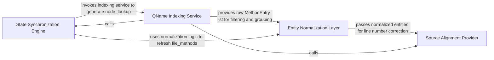

## Details

Provides runtime lookup and deduplication services for agents, ensuring that QNames are resolved to the correct nodes in the current analysis state.

### State Synchronization Engine
Maintains the agent's context during incremental analysis by identifying and refreshing scopes that need updates.

**Related Classes/Methods**:

- `agents.incremental_agent.repopulate_touched_scopes`:556-592
- `agents.incremental_agent._refresh_component_file_methods`:615-675

**Source Files:**

- [`agents/incremental_agent.py`](https://github.com/CodeBoarding/CodeBoarding/blob/main/.codeboardingagents/incremental_agent.py)
  - `agents.incremental_agent._build_node_lookup` ([L595-L612](https://github.com/CodeBoarding/CodeBoarding/blob/main/.codeboardingagents/incremental_agent.py#L595-L612)) - Function
  - `agents.incremental_agent._pick_file_for_qname` ([L678-L696](https://github.com/CodeBoarding/CodeBoarding/blob/main/.codeboardingagents/incremental_agent.py#L678-L696)) - Function
  - `agents.incremental_agent._dedup_methods` ([L699-L707](https://github.com/CodeBoarding/CodeBoarding/blob/main/.codeboardingagents/incremental_agent.py#L699-L707)) - Function

### QName Indexing Service
Constructs the primary mapping between abstract Qualified Names and their structural metadata.

**Related Classes/Methods**:

- `agents.incremental_agent._build_node_lookup`:595-612

**Source Files:**

- [`agents/incremental_agent.py`](https://github.com/CodeBoarding/CodeBoarding/blob/main/.codeboardingagents/incremental_agent.py)
  - `agents.incremental_agent.repopulate_touched_scopes` ([L556-L592](https://github.com/CodeBoarding/CodeBoarding/blob/main/.codeboardingagents/incremental_agent.py#L556-L592)) - Function
  - `agents.incremental_agent._refresh_component_file_methods` ([L615-L675](https://github.com/CodeBoarding/CodeBoarding/blob/main/.codeboardingagents/incremental_agent.py#L615-L675)) - Function
- [`diagram_analysis/cluster_delta.py`](https://github.com/CodeBoarding/CodeBoarding/blob/main/.codeboardingdiagram_analysis/cluster_delta.py)
  - `diagram_analysis.cluster_delta._delta_for_language._old_file` ([L133-L138](https://github.com/CodeBoarding/CodeBoarding/blob/main/.codeboardingdiagram_analysis/cluster_delta.py#L133-L138)) - Function
- [`diagram_analysis/diagram_generator.py`](https://github.com/CodeBoarding/CodeBoarding/blob/main/.codeboardingdiagram_analysis/diagram_generator.py)
  - `diagram_analysis.diagram_generator.DiagramGenerator._collect_method_entries_from_static_analysis` ([L503-L533](https://github.com/CodeBoarding/CodeBoarding/blob/main/.codeboardingdiagram_analysis/diagram_generator.py#L503-L533)) - Method

### Entity Normalization Layer
Ensures a clean, non-redundant view of the codebase by deduplicating methods and resolving path ambiguities.

**Related Classes/Methods**:

- `agents.incremental_agent._dedup_methods`:699-707
- `agents.incremental_agent._pick_file_for_qname`:678-696

**Source Files:**

- [`diagram_analysis/io_utils.py`](https://github.com/CodeBoarding/CodeBoarding/blob/main/.codeboardingdiagram_analysis/io_utils.py)
  - `diagram_analysis.io_utils.normalize_repo_path` ([L37-L53](https://github.com/CodeBoarding/CodeBoarding/blob/main/.codeboardingdiagram_analysis/io_utils.py#L37-L53)) - Function
- [`static_analyzer/node.py`](https://github.com/CodeBoarding/CodeBoarding/blob/main/.codeboardingstatic_analyzer/node.py)
  - `static_analyzer.node.Node.__hash__` ([L65-L66](https://github.com/CodeBoarding/CodeBoarding/blob/main/.codeboardingstatic_analyzer/node.py#L65-L66)) - Method
  - `static_analyzer.node.Node.__repr__` ([L68-L69](https://github.com/CodeBoarding/CodeBoarding/blob/main/.codeboardingstatic_analyzer/node.py#L68-L69)) - Method

### Source Alignment Provider
Bridges the gap between abstract analysis results and physical source code by validating and adjusting line references.

**Related Classes/Methods**: _None_

**Source Files:**

- [`static_analyzer/node.py`](https://github.com/CodeBoarding/CodeBoarding/blob/main/.codeboardingstatic_analyzer/node.py)
  - `static_analyzer.node.Node.is_callable` ([L33-L35](https://github.com/CodeBoarding/CodeBoarding/blob/main/.codeboardingstatic_analyzer/node.py#L33-L35)) - Method
  - `static_analyzer.node.Node.is_callback_or_anonymous` ([L48-L57](https://github.com/CodeBoarding/CodeBoarding/blob/main/.codeboardingstatic_analyzer/node.py#L48-L57)) - Method

### [FAQ](https://github.com/CodeBoarding/GeneratedOnBoardings/tree/main?tab=readme-ov-file#faq)