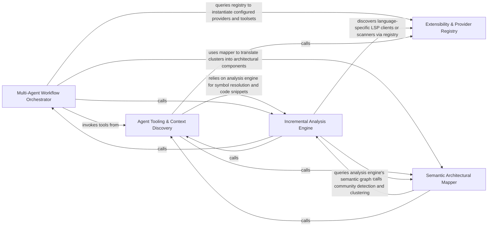

## Details

The reasoning core that runs multi-agent workflows (abstraction and details agents) using specialized tooling to interpret static analysis into architectural components.

### Multi-Agent Workflow Orchestrator
Manages the multi-agent execution flow and reasoning logic, coordinating the Abstraction phase (identifying high-level components) and the Details phase (populating method-level specifics), and validating LLM outputs against the codebase.

**Related Classes/Methods**:

- `agents.abstraction_agent.AbstractionAgent`:38-165
- `agents.details_agent.DetailsAgent`:37-239
- `agents.agent.CodeBoardingAgent`:34-417

**Source Files:**

- [`agents/abstraction_agent.py`](https://github.com/CodeBoarding/CodeBoarding/blob/main/.codeboardingagents/abstraction_agent.py)
  - `agents.abstraction_agent.AbstractionAgent.step_clusters_grouping` ([L65-L93](https://github.com/CodeBoarding/CodeBoarding/blob/main/.codeboardingagents/abstraction_agent.py#L65-L93)) - Method
  - `agents.abstraction_agent.AbstractionAgent.step_final_analysis` ([L96-L139](https://github.com/CodeBoarding/CodeBoarding/blob/main/.codeboardingagents/abstraction_agent.py#L96-L139)) - Method
  - `agents.abstraction_agent.AbstractionAgent.run` ([L141-L165](https://github.com/CodeBoarding/CodeBoarding/blob/main/.codeboardingagents/abstraction_agent.py#L141-L165)) - Method
- [`agents/agent.py`](https://github.com/CodeBoarding/CodeBoarding/blob/main/.codeboardingagents/agent.py)
  - `agents.agent.EmptyExtractorMessageError` ([L30-L31](https://github.com/CodeBoarding/CodeBoarding/blob/main/.codeboardingagents/agent.py#L30-L31)) - Class
  - `agents.agent.CodeBoardingAgent._invoke` ([L96-L178](https://github.com/CodeBoarding/CodeBoarding/blob/main/.codeboardingagents/agent.py#L96-L178)) - Method
  - `agents.agent.CodeBoardingAgent._invoke_with_timeout` ([L180-L218](https://github.com/CodeBoarding/CodeBoarding/blob/main/.codeboardingagents/agent.py#L180-L218)) - Method
  - `agents.agent.CodeBoardingAgent._invoke_with_timeout.invoke_target` ([L188-L196](https://github.com/CodeBoarding/CodeBoarding/blob/main/.codeboardingagents/agent.py#L188-L196)) - Function
  - `agents.agent.CodeBoardingAgent._parse_invoke` ([L220-L223](https://github.com/CodeBoarding/CodeBoarding/blob/main/.codeboardingagents/agent.py#L220-L223)) - Method
  - `agents.agent.CodeBoardingAgent._score_result` ([L225-L250](https://github.com/CodeBoarding/CodeBoarding/blob/main/.codeboardingagents/agent.py#L225-L250)) - Method
  - `agents.agent.CodeBoardingAgent._validation_invoke` ([L252-L336](https://github.com/CodeBoarding/CodeBoarding/blob/main/.codeboardingagents/agent.py#L252-L336)) - Method
  - `agents.agent.CodeBoardingAgent._parse_response` ([L338-L392](https://github.com/CodeBoarding/CodeBoarding/blob/main/.codeboardingagents/agent.py#L338-L392)) - Method
  - `agents.agent.CodeBoardingAgent._try_parse` ([L394-L417](https://github.com/CodeBoarding/CodeBoarding/blob/main/.codeboardingagents/agent.py#L394-L417)) - Method
- [`agents/agent_responses.py`](https://github.com/CodeBoarding/CodeBoarding/blob/main/.codeboardingagents/agent_responses.py)
  - `agents.agent_responses.SourceCodeReference.llm_str` ([L69-L77](https://github.com/CodeBoarding/CodeBoarding/blob/main/.codeboardingagents/agent_responses.py#L69-L77)) - Method
  - `agents.agent_responses.Relation.llm_str` ([L101-L102](https://github.com/CodeBoarding/CodeBoarding/blob/main/.codeboardingagents/agent_responses.py#L101-L102)) - Method
  - `agents.agent_responses.ClustersComponent.llm_str` ([L118-L120](https://github.com/CodeBoarding/CodeBoarding/blob/main/.codeboardingagents/agent_responses.py#L118-L120)) - Method
  - `agents.agent_responses.ClusterAnalysis.llm_str` ([L130-L135](https://github.com/CodeBoarding/CodeBoarding/blob/main/.codeboardingagents/agent_responses.py#L130-L135)) - Method
  - `agents.agent_responses.Component.llm_str` ([L230-L240](https://github.com/CodeBoarding/CodeBoarding/blob/main/.codeboardingagents/agent_responses.py#L230-L240)) - Method
  - `agents.agent_responses.AnalysisInsights.llm_str` ([L257-L263](https://github.com/CodeBoarding/CodeBoarding/blob/main/.codeboardingagents/agent_responses.py#L257-L263)) - Method
  - `agents.agent_responses.assign_component_ids` ([L270-L296](https://github.com/CodeBoarding/CodeBoarding/blob/main/.codeboardingagents/agent_responses.py#L270-L296)) - Function
  - `agents.agent_responses.CFGComponent.llm_str` ([L308-L315](https://github.com/CodeBoarding/CodeBoarding/blob/main/.codeboardingagents/agent_responses.py#L308-L315)) - Method
  - `agents.agent_responses.CFGAnalysisInsights.llm_str` ([L324-L330](https://github.com/CodeBoarding/CodeBoarding/blob/main/.codeboardingagents/agent_responses.py#L324-L330)) - Method
  - `agents.agent_responses.MetaAnalysisInsights.llm_str` ([L384-L394](https://github.com/CodeBoarding/CodeBoarding/blob/main/.codeboardingagents/agent_responses.py#L384-L394)) - Method
- [`agents/cluster_methods_mixin.py`](https://github.com/CodeBoarding/CodeBoarding/blob/main/.codeboardingagents/cluster_methods_mixin.py)
  - `agents.cluster_methods_mixin.ClusterMethodsMixin._build_cluster_string` ([L59-L102](https://github.com/CodeBoarding/CodeBoarding/blob/main/.codeboardingagents/cluster_methods_mixin.py#L59-L102)) - Method
  - `agents.cluster_methods_mixin.ClusterMethodsMixin._ensure_unique_key_entities` ([L104-L151](https://github.com/CodeBoarding/CodeBoarding/blob/main/.codeboardingagents/cluster_methods_mixin.py#L104-L151)) - Method
  - `agents.cluster_methods_mixin.ClusterMethodsMixin._resolve_cluster_ids_from_groups` ([L153-L168](https://github.com/CodeBoarding/CodeBoarding/blob/main/.codeboardingagents/cluster_methods_mixin.py#L153-L168)) - Method
  - `agents.cluster_methods_mixin.ClusterMethodsMixin.build_static_relations` ([L615-L633](https://github.com/CodeBoarding/CodeBoarding/blob/main/.codeboardingagents/cluster_methods_mixin.py#L615-L633)) - Method
- [`agents/constants.py`](https://github.com/CodeBoarding/CodeBoarding/blob/main/.codeboardingagents/constants.py)
  - `agents.constants.LLMDefaults` ([L4-L7](https://github.com/CodeBoarding/CodeBoarding/blob/main/.codeboardingagents/constants.py#L4-L7)) - Class
  - `agents.constants.FileStructureConfig` ([L10-L13](https://github.com/CodeBoarding/CodeBoarding/blob/main/.codeboardingagents/constants.py#L10-L13)) - Class
- [`agents/details_agent.py`](https://github.com/CodeBoarding/CodeBoarding/blob/main/.codeboardingagents/details_agent.py)
  - `agents.details_agent.DetailsAgent.step_clusters_grouping` ([L68-L115](https://github.com/CodeBoarding/CodeBoarding/blob/main/.codeboardingagents/details_agent.py#L68-L115)) - Method
  - `agents.details_agent.DetailsAgent.step_final_analysis` ([L118-L185](https://github.com/CodeBoarding/CodeBoarding/blob/main/.codeboardingagents/details_agent.py#L118-L185)) - Method
  - `agents.details_agent.DetailsAgent.run` ([L187-L239](https://github.com/CodeBoarding/CodeBoarding/blob/main/.codeboardingagents/details_agent.py#L187-L239)) - Method
- [`agents/validation.py`](https://github.com/CodeBoarding/CodeBoarding/blob/main/.codeboardingagents/validation.py)
  - `agents.validation.ValidationContext` ([L32-L46](https://github.com/CodeBoarding/CodeBoarding/blob/main/.codeboardingagents/validation.py#L32-L46)) - Class
  - `agents.validation.ValidationResult` ([L50-L54](https://github.com/CodeBoarding/CodeBoarding/blob/main/.codeboardingagents/validation.py#L50-L54)) - Class
  - `agents.validation.score_validation_results` ([L57-L77](https://github.com/CodeBoarding/CodeBoarding/blob/main/.codeboardingagents/validation.py#L57-L77)) - Function
  - `agents.validation.validate_cluster_coverage` ([L80-L144](https://github.com/CodeBoarding/CodeBoarding/blob/main/.codeboardingagents/validation.py#L80-L144)) - Function
  - `agents.validation._normalize_group_name` ([L147-L154](https://github.com/CodeBoarding/CodeBoarding/blob/main/.codeboardingagents/validation.py#L147-L154)) - Function
  - `agents.validation._fuzzy_match_group_name` ([L157-L175](https://github.com/CodeBoarding/CodeBoarding/blob/main/.codeboardingagents/validation.py#L157-L175)) - Function
  - `agents.validation._auto_correct_group_names` ([L178-L224](https://github.com/CodeBoarding/CodeBoarding/blob/main/.codeboardingagents/validation.py#L178-L224)) - Function
  - `agents.validation.validate_group_name_coverage` ([L227-L319](https://github.com/CodeBoarding/CodeBoarding/blob/main/.codeboardingagents/validation.py#L227-L319)) - Function
  - `agents.validation.validate_key_entities` ([L322-L428](https://github.com/CodeBoarding/CodeBoarding/blob/main/.codeboardingagents/validation.py#L322-L428)) - Function
  - `agents.validation.validate_file_classifications` ([L431-L491](https://github.com/CodeBoarding/CodeBoarding/blob/main/.codeboardingagents/validation.py#L431-L491)) - Function
  - `agents.validation.validate_relation_component_names` ([L494-L535](https://github.com/CodeBoarding/CodeBoarding/blob/main/.codeboardingagents/validation.py#L494-L535)) - Function
- [`diagram_analysis/diagram_generator.py`](https://github.com/CodeBoarding/CodeBoarding/blob/main/.codeboardingdiagram_analysis/diagram_generator.py)
  - `diagram_analysis.diagram_generator.DiagramGenerator` ([L42-L455](https://github.com/CodeBoarding/CodeBoarding/blob/main/.codeboardingdiagram_analysis/diagram_generator.py#L42-L455)) - Class
  - `diagram_analysis.diagram_generator.DiagramGenerator.__init__` ([L43-L81](https://github.com/CodeBoarding/CodeBoarding/blob/main/.codeboardingdiagram_analysis/diagram_generator.py#L43-L81)) - Method
  - `diagram_analysis.diagram_generator.DiagramGenerator._resolve_method_level_changes` ([L83-L100](https://github.com/CodeBoarding/CodeBoarding/blob/main/.codeboardingdiagram_analysis/diagram_generator.py#L83-L100)) - Method
  - `diagram_analysis.diagram_generator.DiagramGenerator._apply_method_diff_statuses` ([L102-L117](https://github.com/CodeBoarding/CodeBoarding/blob/main/.codeboardingdiagram_analysis/diagram_generator.py#L102-L117)) - Method
  - `diagram_analysis.diagram_generator.DiagramGenerator._sync_component_statuses_from_files_index` ([L120-L133](https://github.com/CodeBoarding/CodeBoarding/blob/main/.codeboardingdiagram_analysis/diagram_generator.py#L120-L133)) - Method
  - `diagram_analysis.diagram_generator.DiagramGenerator.process_component` ([L135-L153](https://github.com/CodeBoarding/CodeBoarding/blob/main/.codeboardingdiagram_analysis/diagram_generator.py#L135-L153)) - Method
  - `diagram_analysis.diagram_generator.DiagramGenerator._write_file_coverage` ([L186-L202](https://github.com/CodeBoarding/CodeBoarding/blob/main/.codeboardingdiagram_analysis/diagram_generator.py#L186-L202)) - Method
  - `diagram_analysis.diagram_generator.DiagramGenerator._generate_subcomponents` ([L321-L396](https://github.com/CodeBoarding/CodeBoarding/blob/main/.codeboardingdiagram_analysis/diagram_generator.py#L321-L396)) - Method
  - `diagram_analysis.diagram_generator.DiagramGenerator._generate_subcomponents.submit_component` ([L338-L342](https://github.com/CodeBoarding/CodeBoarding/blob/main/.codeboardingdiagram_analysis/diagram_generator.py#L338-L342)) - Function
  - `diagram_analysis.diagram_generator.DiagramGenerator.generate_analysis` ([L398-L451](https://github.com/CodeBoarding/CodeBoarding/blob/main/.codeboardingdiagram_analysis/diagram_generator.py#L398-L451)) - Method
  - `diagram_analysis.diagram_generator.DiagramGenerator.generate_analysis_smart` ([L453-L455](https://github.com/CodeBoarding/CodeBoarding/blob/main/.codeboardingdiagram_analysis/diagram_generator.py#L453-L455)) - Method
- [`static_analyzer/cluster_helpers.py`](https://github.com/CodeBoarding/CodeBoarding/blob/main/.codeboardingstatic_analyzer/cluster_helpers.py)
  - `static_analyzer.cluster_helpers.get_all_cluster_ids` ([L456-L469](https://github.com/CodeBoarding/CodeBoarding/blob/main/.codeboardingstatic_analyzer/cluster_helpers.py#L456-L469)) - Function
- [`static_analyzer/graph.py`](https://github.com/CodeBoarding/CodeBoarding/blob/main/.codeboardingstatic_analyzer/graph.py)
  - `static_analyzer.graph.ClusterResult.get_cluster_ids` ([L39-L40](https://github.com/CodeBoarding/CodeBoarding/blob/main/.codeboardingstatic_analyzer/graph.py#L39-L40)) - Method
  - `static_analyzer.graph.Edge.__init__` ([L53-L55](https://github.com/CodeBoarding/CodeBoarding/blob/main/.codeboardingstatic_analyzer/graph.py#L53-L55)) - Method
  - `static_analyzer.graph.Edge.__repr__` ([L63-L64](https://github.com/CodeBoarding/CodeBoarding/blob/main/.codeboardingstatic_analyzer/graph.py#L63-L64)) - Method
  - `static_analyzer.graph.CallGraph.__init__` ([L68-L90](https://github.com/CodeBoarding/CodeBoarding/blob/main/.codeboardingstatic_analyzer/graph.py#L68-L90)) - Method
  - `static_analyzer.graph.CallGraph.__str__` ([L573-L578](https://github.com/CodeBoarding/CodeBoarding/blob/main/.codeboardingstatic_analyzer/graph.py#L573-L578)) - Method

### Agent Tooling & Context Discovery
Provides agent-facing tools and repository context: reading source, traversing file structures, and identifying changes (git diffs), exposing a unified interface so agents can inspect and retrieve code and metadata.

**Related Classes/Methods**:

- `agents.tools.toolkit.CodeBoardingToolkit`:20-119
- `agents.tools.read_source.CodeReferenceReader`:25-85
- `agents.tools.base.RepoContext`:10-54

**Source Files:**

- [`agents/abstraction_agent.py`](https://github.com/CodeBoarding/CodeBoarding/blob/main/.codeboardingagents/abstraction_agent.py)
  - `agents.abstraction_agent.AbstractionAgent.__init__` ([L39-L62](https://github.com/CodeBoarding/CodeBoarding/blob/main/.codeboardingagents/abstraction_agent.py#L39-L62)) - Method
- [`agents/agent.py`](https://github.com/CodeBoarding/CodeBoarding/blob/main/.codeboardingagents/agent.py)
  - `agents.agent.CodeBoardingAgent` ([L34-L417](https://github.com/CodeBoarding/CodeBoarding/blob/main/.codeboardingagents/agent.py#L34-L417)) - Class
  - `agents.agent.CodeBoardingAgent.__init__` ([L35-L58](https://github.com/CodeBoarding/CodeBoarding/blob/main/.codeboardingagents/agent.py#L35-L58)) - Method
  - `agents.agent.CodeBoardingAgent.read_source_reference` ([L61-L62](https://github.com/CodeBoarding/CodeBoarding/blob/main/.codeboardingagents/agent.py#L61-L62)) - Method
  - `agents.agent.CodeBoardingAgent.read_packages_tool` ([L65-L66](https://github.com/CodeBoarding/CodeBoarding/blob/main/.codeboardingagents/agent.py#L65-L66)) - Method
  - `agents.agent.CodeBoardingAgent.read_structure_tool` ([L69-L70](https://github.com/CodeBoarding/CodeBoarding/blob/main/.codeboardingagents/agent.py#L69-L70)) - Method
  - `agents.agent.CodeBoardingAgent.read_file_structure` ([L73-L74](https://github.com/CodeBoarding/CodeBoarding/blob/main/.codeboardingagents/agent.py#L73-L74)) - Method
  - `agents.agent.CodeBoardingAgent.read_cfg_tool` ([L77-L78](https://github.com/CodeBoarding/CodeBoarding/blob/main/.codeboardingagents/agent.py#L77-L78)) - Method
  - `agents.agent.CodeBoardingAgent.read_method_invocations_tool` ([L81-L82](https://github.com/CodeBoarding/CodeBoarding/blob/main/.codeboardingagents/agent.py#L81-L82)) - Method
  - `agents.agent.CodeBoardingAgent.read_file_tool` ([L85-L86](https://github.com/CodeBoarding/CodeBoarding/blob/main/.codeboardingagents/agent.py#L85-L86)) - Method
  - `agents.agent.CodeBoardingAgent.read_docs` ([L89-L90](https://github.com/CodeBoarding/CodeBoarding/blob/main/.codeboardingagents/agent.py#L89-L90)) - Method
  - `agents.agent.CodeBoardingAgent.external_deps_tool` ([L93-L94](https://github.com/CodeBoarding/CodeBoarding/blob/main/.codeboardingagents/agent.py#L93-L94)) - Method
- [`agents/dependency_discovery.py`](https://github.com/CodeBoarding/CodeBoarding/blob/main/.codeboardingagents/dependency_discovery.py)
  - `agents.dependency_discovery.Ecosystem` ([L12-L17](https://github.com/CodeBoarding/CodeBoarding/blob/main/.codeboardingagents/dependency_discovery.py#L12-L17)) - Class
  - `agents.dependency_discovery.FileRole` ([L20-L23](https://github.com/CodeBoarding/CodeBoarding/blob/main/.codeboardingagents/dependency_discovery.py#L20-L23)) - Class
  - `agents.dependency_discovery.DependencyFileSpec` ([L27-L30](https://github.com/CodeBoarding/CodeBoarding/blob/main/.codeboardingagents/dependency_discovery.py#L27-L30)) - Class
  - `agents.dependency_discovery.DiscoveredDependencyFile` ([L98-L100](https://github.com/CodeBoarding/CodeBoarding/blob/main/.codeboardingagents/dependency_discovery.py#L98-L100)) - Class
  - `agents.dependency_discovery.discover_dependency_files` ([L103-L159](https://github.com/CodeBoarding/CodeBoarding/blob/main/.codeboardingagents/dependency_discovery.py#L103-L159)) - Function
  - `agents.dependency_discovery.discover_dependency_files._walk` ([L127-L150](https://github.com/CodeBoarding/CodeBoarding/blob/main/.codeboardingagents/dependency_discovery.py#L127-L150)) - Function
- [`agents/details_agent.py`](https://github.com/CodeBoarding/CodeBoarding/blob/main/.codeboardingagents/details_agent.py)
  - `agents.details_agent.DetailsAgent.__init__` ([L38-L65](https://github.com/CodeBoarding/CodeBoarding/blob/main/.codeboardingagents/details_agent.py#L38-L65)) - Method
- [`agents/tools/base.py`](https://github.com/CodeBoarding/CodeBoarding/blob/main/.codeboardingagents/tools/base.py)
  - `agents.tools.base.RepoContext` ([L10-L54](https://github.com/CodeBoarding/CodeBoarding/blob/main/.codeboardingagents/tools/base.py#L10-L54)) - Class
  - `agents.tools.base.RepoContext.Config` ([L22-L23](https://github.com/CodeBoarding/CodeBoarding/blob/main/.codeboardingagents/tools/base.py#L22-L23)) - Class
  - `agents.tools.base.RepoContext.get_files` ([L25-L29](https://github.com/CodeBoarding/CodeBoarding/blob/main/.codeboardingagents/tools/base.py#L25-L29)) - Method
  - `agents.tools.base.RepoContext.get_directories` ([L31-L35](https://github.com/CodeBoarding/CodeBoarding/blob/main/.codeboardingagents/tools/base.py#L31-L35)) - Method
  - `agents.tools.base.RepoContext._ensure_cache` ([L37-L40](https://github.com/CodeBoarding/CodeBoarding/blob/main/.codeboardingagents/tools/base.py#L37-L40)) - Method
  - `agents.tools.base.RepoContext._perform_walk` ([L42-L54](https://github.com/CodeBoarding/CodeBoarding/blob/main/.codeboardingagents/tools/base.py#L42-L54)) - Method
  - `agents.tools.base.BaseRepoTool` ([L57-L96](https://github.com/CodeBoarding/CodeBoarding/blob/main/.codeboardingagents/tools/base.py#L57-L96)) - Class
  - `agents.tools.base.BaseRepoTool.Config` ([L65-L66](https://github.com/CodeBoarding/CodeBoarding/blob/main/.codeboardingagents/tools/base.py#L65-L66)) - Class
  - `agents.tools.base.BaseRepoTool.repo_dir` ([L69-L70](https://github.com/CodeBoarding/CodeBoarding/blob/main/.codeboardingagents/tools/base.py#L69-L70)) - Method
  - `agents.tools.base.BaseRepoTool.ignore_manager` ([L73-L74](https://github.com/CodeBoarding/CodeBoarding/blob/main/.codeboardingagents/tools/base.py#L73-L74)) - Method
  - `agents.tools.base.BaseRepoTool.static_analysis` ([L77-L78](https://github.com/CodeBoarding/CodeBoarding/blob/main/.codeboardingagents/tools/base.py#L77-L78)) - Method
  - `agents.tools.base.BaseRepoTool.is_subsequence` ([L80-L96](https://github.com/CodeBoarding/CodeBoarding/blob/main/.codeboardingagents/tools/base.py#L80-L96)) - Method
- [`agents/tools/get_external_deps.py`](https://github.com/CodeBoarding/CodeBoarding/blob/main/.codeboardingagents/tools/get_external_deps.py)
  - `agents.tools.get_external_deps.ExternalDepsInput` ([L11-L12](https://github.com/CodeBoarding/CodeBoarding/blob/main/.codeboardingagents/tools/get_external_deps.py#L11-L12)) - Class
  - `agents.tools.get_external_deps.ExternalDepsTool` ([L15-L47](https://github.com/CodeBoarding/CodeBoarding/blob/main/.codeboardingagents/tools/get_external_deps.py#L15-L47)) - Class
  - `agents.tools.get_external_deps.ExternalDepsTool._run` ([L24-L47](https://github.com/CodeBoarding/CodeBoarding/blob/main/.codeboardingagents/tools/get_external_deps.py#L24-L47)) - Method
- [`agents/tools/get_method_invocations.py`](https://github.com/CodeBoarding/CodeBoarding/blob/main/.codeboardingagents/tools/get_method_invocations.py)
  - `agents.tools.get_method_invocations.MethodInvocationsInput` ([L10-L11](https://github.com/CodeBoarding/CodeBoarding/blob/main/.codeboardingagents/tools/get_method_invocations.py#L10-L11)) - Class
  - `agents.tools.get_method_invocations.MethodInvocationsTool` ([L14-L47](https://github.com/CodeBoarding/CodeBoarding/blob/main/.codeboardingagents/tools/get_method_invocations.py#L14-L47)) - Class
  - `agents.tools.get_method_invocations.MethodInvocationsTool._run` ([L25-L47](https://github.com/CodeBoarding/CodeBoarding/blob/main/.codeboardingagents/tools/get_method_invocations.py#L25-L47)) - Method
- [`agents/tools/read_cfg.py`](https://github.com/CodeBoarding/CodeBoarding/blob/main/.codeboardingagents/tools/read_cfg.py)
  - `agents.tools.read_cfg.GetCFGTool` ([L8-L61](https://github.com/CodeBoarding/CodeBoarding/blob/main/.codeboardingagents/tools/read_cfg.py#L8-L61)) - Class
  - `agents.tools.read_cfg.GetCFGTool._run` ([L18-L37](https://github.com/CodeBoarding/CodeBoarding/blob/main/.codeboardingagents/tools/read_cfg.py#L18-L37)) - Method
  - `agents.tools.read_cfg.GetCFGTool.component_cfg` ([L39-L61](https://github.com/CodeBoarding/CodeBoarding/blob/main/.codeboardingagents/tools/read_cfg.py#L39-L61)) - Method
- [`agents/tools/read_docs.py`](https://github.com/CodeBoarding/CodeBoarding/blob/main/.codeboardingagents/tools/read_docs.py)
  - `agents.tools.read_docs.ReadDocsFile` ([L10-L19](https://github.com/CodeBoarding/CodeBoarding/blob/main/.codeboardingagents/tools/read_docs.py#L10-L19)) - Class
  - `agents.tools.read_docs.ReadDocsTool` ([L22-L132](https://github.com/CodeBoarding/CodeBoarding/blob/main/.codeboardingagents/tools/read_docs.py#L22-L132)) - Class
  - `agents.tools.read_docs.ReadDocsTool.cached_files` ([L36-L49](https://github.com/CodeBoarding/CodeBoarding/blob/main/.codeboardingagents/tools/read_docs.py#L36-L49)) - Method
  - `agents.tools.read_docs.ReadDocsTool._run` ([L51-L132](https://github.com/CodeBoarding/CodeBoarding/blob/main/.codeboardingagents/tools/read_docs.py#L51-L132)) - Method
- [`agents/tools/read_file.py`](https://github.com/CodeBoarding/CodeBoarding/blob/main/.codeboardingagents/tools/read_file.py)
  - `agents.tools.read_file.ReadFileInput` ([L10-L16](https://github.com/CodeBoarding/CodeBoarding/blob/main/.codeboardingagents/tools/read_file.py#L10-L16)) - Class
  - `agents.tools.read_file.ReadFileTool` ([L19-L90](https://github.com/CodeBoarding/CodeBoarding/blob/main/.codeboardingagents/tools/read_file.py#L19-L90)) - Class
  - `agents.tools.read_file.ReadFileTool.cached_files` ([L31-L33](https://github.com/CodeBoarding/CodeBoarding/blob/main/.codeboardingagents/tools/read_file.py#L31-L33)) - Method
  - `agents.tools.read_file.ReadFileTool._run` ([L35-L90](https://github.com/CodeBoarding/CodeBoarding/blob/main/.codeboardingagents/tools/read_file.py#L35-L90)) - Method
- [`agents/tools/read_file_structure.py`](https://github.com/CodeBoarding/CodeBoarding/blob/main/.codeboardingagents/tools/read_file_structure.py)
  - `agents.tools.read_file_structure.DirInput` ([L12-L19](https://github.com/CodeBoarding/CodeBoarding/blob/main/.codeboardingagents/tools/read_file_structure.py#L12-L19)) - Class
  - `agents.tools.read_file_structure.FileStructureTool` ([L22-L101](https://github.com/CodeBoarding/CodeBoarding/blob/main/.codeboardingagents/tools/read_file_structure.py#L22-L101)) - Class
  - `agents.tools.read_file_structure.FileStructureTool.cached_dirs` ([L34-L37](https://github.com/CodeBoarding/CodeBoarding/blob/main/.codeboardingagents/tools/read_file_structure.py#L34-L37)) - Method
  - `agents.tools.read_file_structure.FileStructureTool._run` ([L39-L101](https://github.com/CodeBoarding/CodeBoarding/blob/main/.codeboardingagents/tools/read_file_structure.py#L39-L101)) - Method
  - `agents.tools.read_file_structure.get_tree_string` ([L104-L155](https://github.com/CodeBoarding/CodeBoarding/blob/main/.codeboardingagents/tools/read_file_structure.py#L104-L155)) - Function
- [`agents/tools/read_git_diff.py`](https://github.com/CodeBoarding/CodeBoarding/blob/main/.codeboardingagents/tools/read_git_diff.py)
  - `agents.tools.read_git_diff.ReadDiffInput` ([L10-L19](https://github.com/CodeBoarding/CodeBoarding/blob/main/.codeboardingagents/tools/read_git_diff.py#L10-L19)) - Class
  - `agents.tools.read_git_diff.ReadDiffTool` ([L22-L131](https://github.com/CodeBoarding/CodeBoarding/blob/main/.codeboardingagents/tools/read_git_diff.py#L22-L131)) - Class
  - `agents.tools.read_git_diff.ReadDiffTool.__init__` ([L34-L38](https://github.com/CodeBoarding/CodeBoarding/blob/main/.codeboardingagents/tools/read_git_diff.py#L34-L38)) - Method
  - `agents.tools.read_git_diff.ReadDiffTool._run` ([L40-L131](https://github.com/CodeBoarding/CodeBoarding/blob/main/.codeboardingagents/tools/read_git_diff.py#L40-L131)) - Method
- [`agents/tools/read_packages.py`](https://github.com/CodeBoarding/CodeBoarding/blob/main/.codeboardingagents/tools/read_packages.py)
  - `agents.tools.read_packages.PackageInput` ([L9-L15](https://github.com/CodeBoarding/CodeBoarding/blob/main/.codeboardingagents/tools/read_packages.py#L9-L15)) - Class
  - `agents.tools.read_packages.NoRootPackageFoundError` ([L18-L23](https://github.com/CodeBoarding/CodeBoarding/blob/main/.codeboardingagents/tools/read_packages.py#L18-L23)) - Class
  - `agents.tools.read_packages.NoRootPackageFoundError.__init__` ([L21-L23](https://github.com/CodeBoarding/CodeBoarding/blob/main/.codeboardingagents/tools/read_packages.py#L21-L23)) - Method
  - `agents.tools.read_packages.PackageRelationsTool` ([L26-L60](https://github.com/CodeBoarding/CodeBoarding/blob/main/.codeboardingagents/tools/read_packages.py#L26-L60)) - Class
  - `agents.tools.read_packages.PackageRelationsTool._run` ([L38-L60](https://github.com/CodeBoarding/CodeBoarding/blob/main/.codeboardingagents/tools/read_packages.py#L38-L60)) - Method
- [`agents/tools/read_source.py`](https://github.com/CodeBoarding/CodeBoarding/blob/main/.codeboardingagents/tools/read_source.py)
  - `agents.tools.read_source.ModuleInput` ([L12-L22](https://github.com/CodeBoarding/CodeBoarding/blob/main/.codeboardingagents/tools/read_source.py#L12-L22)) - Class
  - `agents.tools.read_source.CodeReferenceReader` ([L25-L85](https://github.com/CodeBoarding/CodeBoarding/blob/main/.codeboardingagents/tools/read_source.py#L25-L85)) - Class
  - `agents.tools.read_source.CodeReferenceReader._run` ([L37-L72](https://github.com/CodeBoarding/CodeBoarding/blob/main/.codeboardingagents/tools/read_source.py#L37-L72)) - Method
  - `agents.tools.read_source.CodeReferenceReader.read_file` ([L75-L85](https://github.com/CodeBoarding/CodeBoarding/blob/main/.codeboardingagents/tools/read_source.py#L75-L85)) - Method
- [`agents/tools/read_structure.py`](https://github.com/CodeBoarding/CodeBoarding/blob/main/.codeboardingagents/tools/read_structure.py)
  - `agents.tools.read_structure.ClassQualifiedName` ([L10-L11](https://github.com/CodeBoarding/CodeBoarding/blob/main/.codeboardingagents/tools/read_structure.py#L10-L11)) - Class
  - `agents.tools.read_structure.CodeStructureTool` ([L14-L49](https://github.com/CodeBoarding/CodeBoarding/blob/main/.codeboardingagents/tools/read_structure.py#L14-L49)) - Class
  - `agents.tools.read_structure.CodeStructureTool._run` ([L26-L49](https://github.com/CodeBoarding/CodeBoarding/blob/main/.codeboardingagents/tools/read_structure.py#L26-L49)) - Method
- [`agents/tools/toolkit.py`](https://github.com/CodeBoarding/CodeBoarding/blob/main/.codeboardingagents/tools/toolkit.py)
  - `agents.tools.toolkit.CodeBoardingToolkit` ([L20-L119](https://github.com/CodeBoarding/CodeBoarding/blob/main/.codeboardingagents/tools/toolkit.py#L20-L119)) - Class
  - `agents.tools.toolkit.CodeBoardingToolkit.__init__` ([L26-L28](https://github.com/CodeBoarding/CodeBoarding/blob/main/.codeboardingagents/tools/toolkit.py#L26-L28)) - Method
  - `agents.tools.toolkit.CodeBoardingToolkit.read_source_reference` ([L31-L34](https://github.com/CodeBoarding/CodeBoarding/blob/main/.codeboardingagents/tools/toolkit.py#L31-L34)) - Method
  - `agents.tools.toolkit.CodeBoardingToolkit.read_packages` ([L37-L40](https://github.com/CodeBoarding/CodeBoarding/blob/main/.codeboardingagents/tools/toolkit.py#L37-L40)) - Method
  - `agents.tools.toolkit.CodeBoardingToolkit.read_structure` ([L43-L46](https://github.com/CodeBoarding/CodeBoarding/blob/main/.codeboardingagents/tools/toolkit.py#L43-L46)) - Method
  - `agents.tools.toolkit.CodeBoardingToolkit.read_file_structure` ([L49-L52](https://github.com/CodeBoarding/CodeBoarding/blob/main/.codeboardingagents/tools/toolkit.py#L49-L52)) - Method
  - `agents.tools.toolkit.CodeBoardingToolkit.read_cfg` ([L55-L58](https://github.com/CodeBoarding/CodeBoarding/blob/main/.codeboardingagents/tools/toolkit.py#L55-L58)) - Method
  - `agents.tools.toolkit.CodeBoardingToolkit.read_method_invocations` ([L61-L64](https://github.com/CodeBoarding/CodeBoarding/blob/main/.codeboardingagents/tools/toolkit.py#L61-L64)) - Method
  - `agents.tools.toolkit.CodeBoardingToolkit.read_file` ([L67-L70](https://github.com/CodeBoarding/CodeBoarding/blob/main/.codeboardingagents/tools/toolkit.py#L67-L70)) - Method
  - `agents.tools.toolkit.CodeBoardingToolkit.read_docs` ([L73-L76](https://github.com/CodeBoarding/CodeBoarding/blob/main/.codeboardingagents/tools/toolkit.py#L73-L76)) - Method
  - `agents.tools.toolkit.CodeBoardingToolkit.external_deps` ([L79-L82](https://github.com/CodeBoarding/CodeBoarding/blob/main/.codeboardingagents/tools/toolkit.py#L79-L82)) - Method
  - `agents.tools.toolkit.CodeBoardingToolkit.get_read_diff_tool` ([L84-L89](https://github.com/CodeBoarding/CodeBoarding/blob/main/.codeboardingagents/tools/toolkit.py#L84-L89)) - Method
  - `agents.tools.toolkit.CodeBoardingToolkit.get_agent_tools` ([L91-L101](https://github.com/CodeBoarding/CodeBoarding/blob/main/.codeboardingagents/tools/toolkit.py#L91-L101)) - Method
  - `agents.tools.toolkit.CodeBoardingToolkit.get_all_tools` ([L103-L119](https://github.com/CodeBoarding/CodeBoarding/blob/main/.codeboardingagents/tools/toolkit.py#L103-L119)) - Method
- [`static_analyzer/analysis_result.py`](https://github.com/CodeBoarding/CodeBoarding/blob/main/.codeboardingstatic_analyzer/analysis_result.py)
  - `static_analyzer.analysis_result._strip_java_generics` ([L38-L89](https://github.com/CodeBoarding/CodeBoarding/blob/main/.codeboardingstatic_analyzer/analysis_result.py#L38-L89)) - Function
  - `static_analyzer.analysis_result._strip_java_generics._replace_in_parens` ([L72-L78](https://github.com/CodeBoarding/CodeBoarding/blob/main/.codeboardingstatic_analyzer/analysis_result.py#L72-L78)) - Function
  - `static_analyzer.analysis_result._strip_java_generics._replace_in_parens._subst` ([L75-L76](https://github.com/CodeBoarding/CodeBoarding/blob/main/.codeboardingstatic_analyzer/analysis_result.py#L75-L76)) - Function
  - `static_analyzer.analysis_result._reference_key` ([L92-L120](https://github.com/CodeBoarding/CodeBoarding/blob/main/.codeboardingstatic_analyzer/analysis_result.py#L92-L120)) - Function
  - `static_analyzer.analysis_result.StaticAnalysisResults.get_cfg` ([L316-L325](https://github.com/CodeBoarding/CodeBoarding/blob/main/.codeboardingstatic_analyzer/analysis_result.py#L316-L325)) - Method
  - `static_analyzer.analysis_result.StaticAnalysisResults.get_hierarchy` ([L327-L343](https://github.com/CodeBoarding/CodeBoarding/blob/main/.codeboardingstatic_analyzer/analysis_result.py#L327-L343)) - Method
  - `static_analyzer.analysis_result.StaticAnalysisResults.get_package_dependencies` ([L345-L354](https://github.com/CodeBoarding/CodeBoarding/blob/main/.codeboardingstatic_analyzer/analysis_result.py#L345-L354)) - Method
  - `static_analyzer.analysis_result.StaticAnalysisResults.get_reference` ([L356-L385](https://github.com/CodeBoarding/CodeBoarding/blob/main/.codeboardingstatic_analyzer/analysis_result.py#L356-L385)) - Method
  - `static_analyzer.analysis_result.StaticAnalysisResults.get_loose_reference` ([L387-L403](https://github.com/CodeBoarding/CodeBoarding/blob/main/.codeboardingstatic_analyzer/analysis_result.py#L387-L403)) - Method
  - `static_analyzer.analysis_result.StaticAnalysisResults.get_languages` ([L405-L411](https://github.com/CodeBoarding/CodeBoarding/blob/main/.codeboardingstatic_analyzer/analysis_result.py#L405-L411)) - Method
- [`static_analyzer/cluster_helpers.py`](https://github.com/CodeBoarding/CodeBoarding/blob/main/.codeboardingstatic_analyzer/cluster_helpers.py)
  - `static_analyzer.cluster_helpers.build_cluster_results_for_languages` ([L38-L55](https://github.com/CodeBoarding/CodeBoarding/blob/main/.codeboardingstatic_analyzer/cluster_helpers.py#L38-L55)) - Function
  - `static_analyzer.cluster_helpers.build_all_cluster_results` ([L58-L94](https://github.com/CodeBoarding/CodeBoarding/blob/main/.codeboardingstatic_analyzer/cluster_helpers.py#L58-L94)) - Function
- [`static_analyzer/graph.py`](https://github.com/CodeBoarding/CodeBoarding/blob/main/.codeboardingstatic_analyzer/graph.py)
  - `static_analyzer.graph.CallGraph.llm_str` ([L580-L601](https://github.com/CodeBoarding/CodeBoarding/blob/main/.codeboardingstatic_analyzer/graph.py#L580-L601)) - Method
  - `static_analyzer.graph.CallGraph._llm_str_class_level` ([L630-L675](https://github.com/CodeBoarding/CodeBoarding/blob/main/.codeboardingstatic_analyzer/graph.py#L630-L675)) - Method

### Semantic Architectural Mapper
Converts the raw call/semantic graph from static analysis into logical architectural components using community detection (e.g., Louvain) and provides mixins to help agents map clusters to human-readable component definitions.

**Related Classes/Methods**:

- `static_analyzer.graph.CallGraph`:67-675
- `agents.cluster_methods_mixin.ClusterMethodsMixin`:37-633

**Source Files:**

- [`agents/agent_responses.py`](https://github.com/CodeBoarding/CodeBoarding/blob/main/.codeboardingagents/agent_responses.py)
  - `agents.agent_responses.LLMBaseModel` ([L14-L45](https://github.com/CodeBoarding/CodeBoarding/blob/main/.codeboardingagents/agent_responses.py#L14-L45)) - Class
  - `agents.agent_responses.LLMBaseModel.llm_str` ([L18-L19](https://github.com/CodeBoarding/CodeBoarding/blob/main/.codeboardingagents/agent_responses.py#L18-L19)) - Method
  - `agents.agent_responses.LLMBaseModel.extractor_str` ([L22-L45](https://github.com/CodeBoarding/CodeBoarding/blob/main/.codeboardingagents/agent_responses.py#L22-L45)) - Method
  - `agents.agent_responses.SourceCodeReference` ([L48-L87](https://github.com/CodeBoarding/CodeBoarding/blob/main/.codeboardingagents/agent_responses.py#L48-L87)) - Class
  - `agents.agent_responses.SourceCodeReference.__str__` ([L79-L87](https://github.com/CodeBoarding/CodeBoarding/blob/main/.codeboardingagents/agent_responses.py#L79-L87)) - Method
  - `agents.agent_responses.Relation` ([L90-L102](https://github.com/CodeBoarding/CodeBoarding/blob/main/.codeboardingagents/agent_responses.py#L90-L102)) - Class
  - `agents.agent_responses.ClustersComponent` ([L105-L120](https://github.com/CodeBoarding/CodeBoarding/blob/main/.codeboardingagents/agent_responses.py#L105-L120)) - Class
  - `agents.agent_responses.ClusterAnalysis` ([L123-L135](https://github.com/CodeBoarding/CodeBoarding/blob/main/.codeboardingagents/agent_responses.py#L123-L135)) - Class
  - `agents.agent_responses.MethodEntry` ([L138-L166](https://github.com/CodeBoarding/CodeBoarding/blob/main/.codeboardingagents/agent_responses.py#L138-L166)) - Class
  - `agents.agent_responses.MethodEntry.__hash__` ([L150-L151](https://github.com/CodeBoarding/CodeBoarding/blob/main/.codeboardingagents/agent_responses.py#L150-L151)) - Method
  - `agents.agent_responses.MethodEntry.__eq__` ([L153-L156](https://github.com/CodeBoarding/CodeBoarding/blob/main/.codeboardingagents/agent_responses.py#L153-L156)) - Method
  - `agents.agent_responses.MethodEntry.from_method_change` ([L159-L166](https://github.com/CodeBoarding/CodeBoarding/blob/main/.codeboardingagents/agent_responses.py#L159-L166)) - Method
  - `agents.agent_responses.FileMethodGroup` ([L169-L180](https://github.com/CodeBoarding/CodeBoarding/blob/main/.codeboardingagents/agent_responses.py#L169-L180)) - Class
  - `agents.agent_responses.FileEntry` ([L183-L193](https://github.com/CodeBoarding/CodeBoarding/blob/main/.codeboardingagents/agent_responses.py#L183-L193)) - Class
  - `agents.agent_responses.Component` ([L196-L240](https://github.com/CodeBoarding/CodeBoarding/blob/main/.codeboardingagents/agent_responses.py#L196-L240)) - Class
  - `agents.agent_responses.AnalysisInsights` ([L243-L267](https://github.com/CodeBoarding/CodeBoarding/blob/main/.codeboardingagents/agent_responses.py#L243-L267)) - Class
  - `agents.agent_responses.AnalysisInsights.file_to_component` ([L265-L267](https://github.com/CodeBoarding/CodeBoarding/blob/main/.codeboardingagents/agent_responses.py#L265-L267)) - Method
  - `agents.agent_responses.CFGComponent` ([L299-L315](https://github.com/CodeBoarding/CodeBoarding/blob/main/.codeboardingagents/agent_responses.py#L299-L315)) - Class
  - `agents.agent_responses.CFGAnalysisInsights` ([L318-L330](https://github.com/CodeBoarding/CodeBoarding/blob/main/.codeboardingagents/agent_responses.py#L318-L330)) - Class
  - `agents.agent_responses.ExpandComponent` ([L333-L340](https://github.com/CodeBoarding/CodeBoarding/blob/main/.codeboardingagents/agent_responses.py#L333-L340)) - Class
  - `agents.agent_responses.ExpandComponent.llm_str` ([L339-L340](https://github.com/CodeBoarding/CodeBoarding/blob/main/.codeboardingagents/agent_responses.py#L339-L340)) - Method
  - `agents.agent_responses.ValidationInsights` ([L343-L353](https://github.com/CodeBoarding/CodeBoarding/blob/main/.codeboardingagents/agent_responses.py#L343-L353)) - Class
  - `agents.agent_responses.ValidationInsights.llm_str` ([L352-L353](https://github.com/CodeBoarding/CodeBoarding/blob/main/.codeboardingagents/agent_responses.py#L352-L353)) - Method
  - `agents.agent_responses.UpdateAnalysis` ([L356-L365](https://github.com/CodeBoarding/CodeBoarding/blob/main/.codeboardingagents/agent_responses.py#L356-L365)) - Class
  - `agents.agent_responses.UpdateAnalysis.llm_str` ([L364-L365](https://github.com/CodeBoarding/CodeBoarding/blob/main/.codeboardingagents/agent_responses.py#L364-L365)) - Method
  - `agents.agent_responses.MetaAnalysisInsights` ([L368-L394](https://github.com/CodeBoarding/CodeBoarding/blob/main/.codeboardingagents/agent_responses.py#L368-L394)) - Class
  - `agents.agent_responses.FileClassification` ([L397-L404](https://github.com/CodeBoarding/CodeBoarding/blob/main/.codeboardingagents/agent_responses.py#L397-L404)) - Class
  - `agents.agent_responses.FileClassification.llm_str` ([L403-L404](https://github.com/CodeBoarding/CodeBoarding/blob/main/.codeboardingagents/agent_responses.py#L403-L404)) - Method
  - `agents.agent_responses.ComponentFiles` ([L407-L419](https://github.com/CodeBoarding/CodeBoarding/blob/main/.codeboardingagents/agent_responses.py#L407-L419)) - Class
  - `agents.agent_responses.ComponentFiles.llm_str` ([L414-L419](https://github.com/CodeBoarding/CodeBoarding/blob/main/.codeboardingagents/agent_responses.py#L414-L419)) - Method
  - `agents.agent_responses.FilePath` ([L422-L436](https://github.com/CodeBoarding/CodeBoarding/blob/main/.codeboardingagents/agent_responses.py#L422-L436)) - Class
  - `agents.agent_responses.FilePath.llm_str` ([L435-L436](https://github.com/CodeBoarding/CodeBoarding/blob/main/.codeboardingagents/agent_responses.py#L435-L436)) - Method
- [`agents/cluster_methods_mixin.py`](https://github.com/CodeBoarding/CodeBoarding/blob/main/.codeboardingagents/cluster_methods_mixin.py)
  - `agents.cluster_methods_mixin.ClusterMethodsMixin` ([L37-L633](https://github.com/CodeBoarding/CodeBoarding/blob/main/.codeboardingagents/cluster_methods_mixin.py#L37-L633)) - Class
  - `agents.cluster_methods_mixin.ClusterMethodsMixin._expand_to_method_level_clusters` ([L170-L224](https://github.com/CodeBoarding/CodeBoarding/blob/main/.codeboardingagents/cluster_methods_mixin.py#L170-L224)) - Method
  - `agents.cluster_methods_mixin.ClusterMethodsMixin._create_strict_component_subgraph` ([L226-L305](https://github.com/CodeBoarding/CodeBoarding/blob/main/.codeboardingagents/cluster_methods_mixin.py#L226-L305)) - Method
  - `agents.cluster_methods_mixin.ClusterMethodsMixin._collect_all_cfg_nodes` ([L307-L324](https://github.com/CodeBoarding/CodeBoarding/blob/main/.codeboardingagents/cluster_methods_mixin.py#L307-L324)) - Method
  - `agents.cluster_methods_mixin.ClusterMethodsMixin._build_undirected_graphs` ([L326-L344](https://github.com/CodeBoarding/CodeBoarding/blob/main/.codeboardingagents/cluster_methods_mixin.py#L326-L344)) - Method
  - `agents.cluster_methods_mixin.ClusterMethodsMixin._find_nearest_cluster` ([L346-L383](https://github.com/CodeBoarding/CodeBoarding/blob/main/.codeboardingagents/cluster_methods_mixin.py#L346-L383)) - Method
  - `agents.cluster_methods_mixin.ClusterMethodsMixin._build_file_methods_from_nodes` ([L385-L431](https://github.com/CodeBoarding/CodeBoarding/blob/main/.codeboardingagents/cluster_methods_mixin.py#L385-L431)) - Method
  - `agents.cluster_methods_mixin.ClusterMethodsMixin._build_file_methods_from_nodes._is_more_specific` ([L394-L404](https://github.com/CodeBoarding/CodeBoarding/blob/main/.codeboardingagents/cluster_methods_mixin.py#L394-L404)) - Function
  - `agents.cluster_methods_mixin.ClusterMethodsMixin._build_cluster_to_component_map` ([L433-L439](https://github.com/CodeBoarding/CodeBoarding/blob/main/.codeboardingagents/cluster_methods_mixin.py#L433-L439)) - Method
  - `agents.cluster_methods_mixin.ClusterMethodsMixin._build_node_to_cluster_map` ([L441-L450](https://github.com/CodeBoarding/CodeBoarding/blob/main/.codeboardingagents/cluster_methods_mixin.py#L441-L450)) - Method
  - `agents.cluster_methods_mixin.ClusterMethodsMixin._validate_cluster_coverage` ([L452-L460](https://github.com/CodeBoarding/CodeBoarding/blob/main/.codeboardingagents/cluster_methods_mixin.py#L452-L460)) - Method
  - `agents.cluster_methods_mixin.ClusterMethodsMixin._find_component_by_file` ([L462-L478](https://github.com/CodeBoarding/CodeBoarding/blob/main/.codeboardingagents/cluster_methods_mixin.py#L462-L478)) - Method
  - `agents.cluster_methods_mixin.ClusterMethodsMixin._assign_nodes_to_components` ([L480-L545](https://github.com/CodeBoarding/CodeBoarding/blob/main/.codeboardingagents/cluster_methods_mixin.py#L480-L545)) - Method
  - `agents.cluster_methods_mixin.ClusterMethodsMixin._log_node_coverage` ([L547-L551](https://github.com/CodeBoarding/CodeBoarding/blob/main/.codeboardingagents/cluster_methods_mixin.py#L547-L551)) - Method
  - `agents.cluster_methods_mixin.ClusterMethodsMixin._build_files_index` ([L553-L571](https://github.com/CodeBoarding/CodeBoarding/blob/main/.codeboardingagents/cluster_methods_mixin.py#L553-L571)) - Method
  - `agents.cluster_methods_mixin.ClusterMethodsMixin.populate_file_methods` ([L573-L613](https://github.com/CodeBoarding/CodeBoarding/blob/main/.codeboardingagents/cluster_methods_mixin.py#L573-L613)) - Method
- [`static_analyzer/cluster_helpers.py`](https://github.com/CodeBoarding/CodeBoarding/blob/main/.codeboardingstatic_analyzer/cluster_helpers.py)
  - `static_analyzer.cluster_helpers.enforce_cross_language_budget` ([L97-L137](https://github.com/CodeBoarding/CodeBoarding/blob/main/.codeboardingstatic_analyzer/cluster_helpers.py#L97-L137)) - Function
  - `static_analyzer.cluster_helpers._build_node_to_cluster_lookup` ([L145-L151](https://github.com/CodeBoarding/CodeBoarding/blob/main/.codeboardingstatic_analyzer/cluster_helpers.py#L145-L151)) - Function
  - `static_analyzer.cluster_helpers._build_meta_graph` ([L154-L178](https://github.com/CodeBoarding/CodeBoarding/blob/main/.codeboardingstatic_analyzer/cluster_helpers.py#L154-L178)) - Function
  - `static_analyzer.cluster_helpers._detect_communities` ([L186-L217](https://github.com/CodeBoarding/CodeBoarding/blob/main/.codeboardingstatic_analyzer/cluster_helpers.py#L186-L217)) - Function
  - `static_analyzer.cluster_helpers._community_files` ([L225-L230](https://github.com/CodeBoarding/CodeBoarding/blob/main/.codeboardingstatic_analyzer/cluster_helpers.py#L225-L230)) - Function
  - `static_analyzer.cluster_helpers._find_nearest_by_graph_distance` ([L233-L266](https://github.com/CodeBoarding/CodeBoarding/blob/main/.codeboardingstatic_analyzer/cluster_helpers.py#L233-L266)) - Function
  - `static_analyzer.cluster_helpers._find_nearest_by_file_overlap` ([L269-L290](https://github.com/CodeBoarding/CodeBoarding/blob/main/.codeboardingstatic_analyzer/cluster_helpers.py#L269-L290)) - Function
  - `static_analyzer.cluster_helpers.reindex_cluster_result` ([L293-L321](https://github.com/CodeBoarding/CodeBoarding/blob/main/.codeboardingstatic_analyzer/cluster_helpers.py#L293-L321)) - Function
  - `static_analyzer.cluster_helpers._absorb_small_communities` ([L324-L356](https://github.com/CodeBoarding/CodeBoarding/blob/main/.codeboardingstatic_analyzer/cluster_helpers.py#L324-L356)) - Function
  - `static_analyzer.cluster_helpers._build_merged_cluster_result` ([L364-L402](https://github.com/CodeBoarding/CodeBoarding/blob/main/.codeboardingstatic_analyzer/cluster_helpers.py#L364-L402)) - Function
  - `static_analyzer.cluster_helpers.merge_clusters` ([L410-L448](https://github.com/CodeBoarding/CodeBoarding/blob/main/.codeboardingstatic_analyzer/cluster_helpers.py#L410-L448)) - Function
- [`static_analyzer/graph.py`](https://github.com/CodeBoarding/CodeBoarding/blob/main/.codeboardingstatic_analyzer/graph.py)
  - `static_analyzer.graph.ClusterResult` ([L31-L49](https://github.com/CodeBoarding/CodeBoarding/blob/main/.codeboardingstatic_analyzer/graph.py#L31-L49)) - Class
  - `static_analyzer.graph.ClusterResult.get_clusters_for_file` ([L45-L46](https://github.com/CodeBoarding/CodeBoarding/blob/main/.codeboardingstatic_analyzer/graph.py#L45-L46)) - Method
  - `static_analyzer.graph.CallGraph.to_networkx` ([L156-L168](https://github.com/CodeBoarding/CodeBoarding/blob/main/.codeboardingstatic_analyzer/graph.py#L156-L168)) - Method
  - `static_analyzer.graph.CallGraph.cluster` ([L170-L232](https://github.com/CodeBoarding/CodeBoarding/blob/main/.codeboardingstatic_analyzer/graph.py#L170-L232)) - Method
  - `static_analyzer.graph.CallGraph.to_cluster_string` ([L261-L302](https://github.com/CodeBoarding/CodeBoarding/blob/main/.codeboardingstatic_analyzer/graph.py#L261-L302)) - Method
  - `static_analyzer.graph.CallGraph._get_abstract_node_name` ([L304-L314](https://github.com/CodeBoarding/CodeBoarding/blob/main/.codeboardingstatic_analyzer/graph.py#L304-L314)) - Method
  - `static_analyzer.graph.CallGraph._cluster_with_algorithm` ([L316-L332](https://github.com/CodeBoarding/CodeBoarding/blob/main/.codeboardingstatic_analyzer/graph.py#L316-L332)) - Method
  - `static_analyzer.graph.CallGraph._score_clustering` ([L334-L365](https://github.com/CodeBoarding/CodeBoarding/blob/main/.codeboardingstatic_analyzer/graph.py#L334-L365)) - Method
  - `static_analyzer.graph.CallGraph._cluster_at_level` ([L367-L387](https://github.com/CodeBoarding/CodeBoarding/blob/main/.codeboardingstatic_analyzer/graph.py#L367-L387)) - Method
  - `static_analyzer.graph.CallGraph._try_all_algorithms` ([L389-L406](https://github.com/CodeBoarding/CodeBoarding/blob/main/.codeboardingstatic_analyzer/graph.py#L389-L406)) - Method
  - `static_analyzer.graph.CallGraph._map_candidates_to_original` ([L408-L432](https://github.com/CodeBoarding/CodeBoarding/blob/main/.codeboardingstatic_analyzer/graph.py#L408-L432)) - Method
  - `static_analyzer.graph.CallGraph._coverage` ([L434-L439](https://github.com/CodeBoarding/CodeBoarding/blob/main/.codeboardingstatic_analyzer/graph.py#L434-L439)) - Method
  - `static_analyzer.graph.CallGraph._build_result` ([L441-L472](https://github.com/CodeBoarding/CodeBoarding/blob/main/.codeboardingstatic_analyzer/graph.py#L441-L472)) - Method
  - `static_analyzer.graph.CallGraph.__cluster_str` ([L475-L550](https://github.com/CodeBoarding/CodeBoarding/blob/main/.codeboardingstatic_analyzer/graph.py#L475-L550)) - Method
  - `static_analyzer.graph.CallGraph.__non_cluster_str` ([L553-L571](https://github.com/CodeBoarding/CodeBoarding/blob/main/.codeboardingstatic_analyzer/graph.py#L553-L571)) - Method

### Incremental Analysis Engine
Performs static analysis and manages the resulting semantic graph with support for incremental updates and caching so the Agentic Intelligence layer processes only changed or relevant code, improving performance on large repositories.

**Related Classes/Methods**:

- `static_analyzer.incremental_orchestrator.IncrementalAnalysisOrchestrator`:31-644
- `static_analyzer.analysis_cache.AnalysisCacheManager`:33-761

**Source Files:**

- [`agents/abstraction_agent.py`](https://github.com/CodeBoarding/CodeBoarding/blob/main/.codeboardingagents/abstraction_agent.py)
  - `agents.abstraction_agent.AbstractionAgent` ([L38-L165](https://github.com/CodeBoarding/CodeBoarding/blob/main/.codeboardingagents/abstraction_agent.py#L38-L165)) - Class
- [`agents/details_agent.py`](https://github.com/CodeBoarding/CodeBoarding/blob/main/.codeboardingagents/details_agent.py)
  - `agents.details_agent.DetailsAgent` ([L37-L239](https://github.com/CodeBoarding/CodeBoarding/blob/main/.codeboardingagents/details_agent.py#L37-L239)) - Class
- [`agents/validation.py`](https://github.com/CodeBoarding/CodeBoarding/blob/main/.codeboardingagents/validation.py)
  - `agents.validation._build_cluster_edge_lookup` ([L538-L565](https://github.com/CodeBoarding/CodeBoarding/blob/main/.codeboardingagents/validation.py#L538-L565)) - Function
  - `agents.validation._check_edge_between_cluster_sets` ([L568-L606](https://github.com/CodeBoarding/CodeBoarding/blob/main/.codeboardingagents/validation.py#L568-L606)) - Function
- [`diagram_analysis/diagram_generator.py`](https://github.com/CodeBoarding/CodeBoarding/blob/main/.codeboardingdiagram_analysis/diagram_generator.py)
  - `diagram_analysis.diagram_generator.DiagramGenerator._run_health_report` ([L155-L173](https://github.com/CodeBoarding/CodeBoarding/blob/main/.codeboardingdiagram_analysis/diagram_generator.py#L155-L173)) - Method
  - `diagram_analysis.diagram_generator.DiagramGenerator._build_file_coverage` ([L175-L184](https://github.com/CodeBoarding/CodeBoarding/blob/main/.codeboardingdiagram_analysis/diagram_generator.py#L175-L184)) - Method
  - `diagram_analysis.diagram_generator.DiagramGenerator._get_static_from_injected_analyzer` ([L204-L212](https://github.com/CodeBoarding/CodeBoarding/blob/main/.codeboardingdiagram_analysis/diagram_generator.py#L204-L212)) - Method
  - `diagram_analysis.diagram_generator.DiagramGenerator.pre_analysis` ([L214-L319](https://github.com/CodeBoarding/CodeBoarding/blob/main/.codeboardingdiagram_analysis/diagram_generator.py#L214-L319)) - Method
  - `diagram_analysis.diagram_generator.DiagramGenerator.pre_analysis.get_static_with_injected_analyzer` ([L229-L231](https://github.com/CodeBoarding/CodeBoarding/blob/main/.codeboardingdiagram_analysis/diagram_generator.py#L229-L231)) - Function
  - `diagram_analysis.diagram_generator.DiagramGenerator.pre_analysis.get_static_with_new_analyzer` ([L233-L237](https://github.com/CodeBoarding/CodeBoarding/blob/main/.codeboardingdiagram_analysis/diagram_generator.py#L233-L237)) - Function
- [`diagram_analysis/version.py`](https://github.com/CodeBoarding/CodeBoarding/blob/main/.codeboardingdiagram_analysis/version.py)
  - `diagram_analysis.version.Version` ([L4-L6](https://github.com/CodeBoarding/CodeBoarding/blob/main/.codeboardingdiagram_analysis/version.py#L4-L6)) - Class
- [`static_analyzer/__init__.py`](https://github.com/CodeBoarding/CodeBoarding/blob/main/.codeboardingstatic_analyzer/__init__.py)
  - `static_analyzer.__init__._create_engine_configs` ([L33-L114](https://github.com/CodeBoarding/CodeBoarding/blob/main/.codeboardingstatic_analyzer/__init__.py#L33-L114)) - Function
  - `static_analyzer.__init__._lang_to_adapter_name` ([L117-L132](https://github.com/CodeBoarding/CodeBoarding/blob/main/.codeboardingstatic_analyzer/__init__.py#L117-L132)) - Function
  - `static_analyzer.__init__.StaticAnalyzer` ([L135-L661](https://github.com/CodeBoarding/CodeBoarding/blob/main/.codeboardingstatic_analyzer/__init__.py#L135-L661)) - Class
  - `static_analyzer.__init__.StaticAnalyzer.__init__` ([L138-L146](https://github.com/CodeBoarding/CodeBoarding/blob/main/.codeboardingstatic_analyzer/__init__.py#L138-L146)) - Method
  - `static_analyzer.__init__.StaticAnalyzer.__enter__` ([L148-L150](https://github.com/CodeBoarding/CodeBoarding/blob/main/.codeboardingstatic_analyzer/__init__.py#L148-L150)) - Method
  - `static_analyzer.__init__.StaticAnalyzer.__exit__` ([L152-L153](https://github.com/CodeBoarding/CodeBoarding/blob/main/.codeboardingstatic_analyzer/__init__.py#L152-L153)) - Method
  - `static_analyzer.__init__.StaticAnalyzer.start_clients` ([L155-L246](https://github.com/CodeBoarding/CodeBoarding/blob/main/.codeboardingstatic_analyzer/__init__.py#L155-L246)) - Method
  - `static_analyzer.__init__.StaticAnalyzer.stop_clients` ([L248-L259](https://github.com/CodeBoarding/CodeBoarding/blob/main/.codeboardingstatic_analyzer/__init__.py#L248-L259)) - Method
  - `static_analyzer.__init__.StaticAnalyzer.collect_fresh_diagnostics` ([L261-L273](https://github.com/CodeBoarding/CodeBoarding/blob/main/.codeboardingstatic_analyzer/__init__.py#L261-L273)) - Method
  - `static_analyzer.__init__.StaticAnalyzer.get_diagnostics_generation` ([L275-L277](https://github.com/CodeBoarding/CodeBoarding/blob/main/.codeboardingstatic_analyzer/__init__.py#L275-L277)) - Method
  - `static_analyzer.__init__.StaticAnalyzer.load_from_disk_cache` ([L279-L299](https://github.com/CodeBoarding/CodeBoarding/blob/main/.codeboardingstatic_analyzer/__init__.py#L279-L299)) - Method
  - `static_analyzer.__init__.StaticAnalyzer.notify_file_changed` ([L301-L317](https://github.com/CodeBoarding/CodeBoarding/blob/main/.codeboardingstatic_analyzer/__init__.py#L301-L317)) - Method
  - `static_analyzer.__init__.StaticAnalyzer.get_file_symbols` ([L319-L342](https://github.com/CodeBoarding/CodeBoarding/blob/main/.codeboardingstatic_analyzer/__init__.py#L319-L342)) - Method
  - `static_analyzer.__init__.StaticAnalyzer.get_adapter_for_file` ([L344-L350](https://github.com/CodeBoarding/CodeBoarding/blob/main/.codeboardingstatic_analyzer/__init__.py#L344-L350)) - Method
  - `static_analyzer.__init__.StaticAnalyzer.discover_file_dependencies` ([L352-L399](https://github.com/CodeBoarding/CodeBoarding/blob/main/.codeboardingstatic_analyzer/__init__.py#L352-L399)) - Method
  - `static_analyzer.__init__.StaticAnalyzer.analyze` ([L401-L528](https://github.com/CodeBoarding/CodeBoarding/blob/main/.codeboardingstatic_analyzer/__init__.py#L401-L528)) - Method
  - `static_analyzer.__init__.StaticAnalyzer._run_full_analysis` ([L530-L564](https://github.com/CodeBoarding/CodeBoarding/blob/main/.codeboardingstatic_analyzer/__init__.py#L530-L564)) - Method
  - `static_analyzer.__init__.StaticAnalyzer._save_initial_cache` ([L566-L582](https://github.com/CodeBoarding/CodeBoarding/blob/main/.codeboardingstatic_analyzer/__init__.py#L566-L582)) - Method
  - `static_analyzer.__init__.StaticAnalyzer.analyze_with_cluster_changes` ([L584-L647](https://github.com/CodeBoarding/CodeBoarding/blob/main/.codeboardingstatic_analyzer/__init__.py#L584-L647)) - Method
  - `static_analyzer.__init__.StaticAnalyzer._dict_to_static_results` ([L649-L661](https://github.com/CodeBoarding/CodeBoarding/blob/main/.codeboardingstatic_analyzer/__init__.py#L649-L661)) - Method
  - `static_analyzer.__init__.get_static_analysis` ([L664-L684](https://github.com/CodeBoarding/CodeBoarding/blob/main/.codeboardingstatic_analyzer/__init__.py#L664-L684)) - Function
- [`static_analyzer/analysis_cache.py`](https://github.com/CodeBoarding/CodeBoarding/blob/main/.codeboardingstatic_analyzer/analysis_cache.py)
  - `static_analyzer.analysis_cache.AnalysisCacheMetadata` ([L25-L30](https://github.com/CodeBoarding/CodeBoarding/blob/main/.codeboardingstatic_analyzer/analysis_cache.py#L25-L30)) - Class
  - `static_analyzer.analysis_cache.AnalysisCacheManager` ([L33-L761](https://github.com/CodeBoarding/CodeBoarding/blob/main/.codeboardingstatic_analyzer/analysis_cache.py#L33-L761)) - Class
  - `static_analyzer.analysis_cache.AnalysisCacheManager.__init__` ([L41-L48](https://github.com/CodeBoarding/CodeBoarding/blob/main/.codeboardingstatic_analyzer/analysis_cache.py#L41-L48)) - Method
  - `static_analyzer.analysis_cache.AnalysisCacheManager._to_relative_path` ([L50-L51](https://github.com/CodeBoarding/CodeBoarding/blob/main/.codeboardingstatic_analyzer/analysis_cache.py#L50-L51)) - Method
  - `static_analyzer.analysis_cache.AnalysisCacheManager._to_absolute_path` ([L53-L54](https://github.com/CodeBoarding/CodeBoarding/blob/main/.codeboardingstatic_analyzer/analysis_cache.py#L53-L54)) - Method
  - `static_analyzer.analysis_cache.AnalysisCacheManager.save_cache` ([L56-L125](https://github.com/CodeBoarding/CodeBoarding/blob/main/.codeboardingstatic_analyzer/analysis_cache.py#L56-L125)) - Method
  - `static_analyzer.analysis_cache.AnalysisCacheManager.load_cache` ([L127-L181](https://github.com/CodeBoarding/CodeBoarding/blob/main/.codeboardingstatic_analyzer/analysis_cache.py#L127-L181)) - Method
  - `static_analyzer.analysis_cache.AnalysisCacheManager.invalidate_files` ([L183-L334](https://github.com/CodeBoarding/CodeBoarding/blob/main/.codeboardingstatic_analyzer/analysis_cache.py#L183-L334)) - Method
  - `static_analyzer.analysis_cache.AnalysisCacheManager._validate_no_dangling_references` ([L336-L398](https://github.com/CodeBoarding/CodeBoarding/blob/main/.codeboardingstatic_analyzer/analysis_cache.py#L336-L398)) - Method
  - `static_analyzer.analysis_cache.AnalysisCacheManager.merge_results` ([L400-L485](https://github.com/CodeBoarding/CodeBoarding/blob/main/.codeboardingstatic_analyzer/analysis_cache.py#L400-L485)) - Method
  - `static_analyzer.analysis_cache.AnalysisCacheManager._serialize_call_graph` ([L487-L504](https://github.com/CodeBoarding/CodeBoarding/blob/main/.codeboardingstatic_analyzer/analysis_cache.py#L487-L504)) - Method
  - `static_analyzer.analysis_cache.AnalysisCacheManager._deserialize_call_graph` ([L506-L531](https://github.com/CodeBoarding/CodeBoarding/blob/main/.codeboardingstatic_analyzer/analysis_cache.py#L506-L531)) - Method
  - `static_analyzer.analysis_cache.AnalysisCacheManager._serialize_class_hierarchies` ([L533-L541](https://github.com/CodeBoarding/CodeBoarding/blob/main/.codeboardingstatic_analyzer/analysis_cache.py#L533-L541)) - Method
  - `static_analyzer.analysis_cache.AnalysisCacheManager._deserialize_class_hierarchies` ([L543-L551](https://github.com/CodeBoarding/CodeBoarding/blob/main/.codeboardingstatic_analyzer/analysis_cache.py#L543-L551)) - Method
  - `static_analyzer.analysis_cache.AnalysisCacheManager._serialize_package_relations` ([L553-L561](https://github.com/CodeBoarding/CodeBoarding/blob/main/.codeboardingstatic_analyzer/analysis_cache.py#L553-L561)) - Method
  - `static_analyzer.analysis_cache.AnalysisCacheManager._deserialize_package_relations` ([L563-L571](https://github.com/CodeBoarding/CodeBoarding/blob/main/.codeboardingstatic_analyzer/analysis_cache.py#L563-L571)) - Method
  - `static_analyzer.analysis_cache.AnalysisCacheManager._serialize_references` ([L573-L584](https://github.com/CodeBoarding/CodeBoarding/blob/main/.codeboardingstatic_analyzer/analysis_cache.py#L573-L584)) - Method
  - `static_analyzer.analysis_cache.AnalysisCacheManager._deserialize_references` ([L586-L597](https://github.com/CodeBoarding/CodeBoarding/blob/main/.codeboardingstatic_analyzer/analysis_cache.py#L586-L597)) - Method
  - `static_analyzer.analysis_cache.AnalysisCacheManager._serialize_diagnostics` ([L599-L616](https://github.com/CodeBoarding/CodeBoarding/blob/main/.codeboardingstatic_analyzer/analysis_cache.py#L599-L616)) - Method
  - `static_analyzer.analysis_cache.AnalysisCacheManager._deserialize_diagnostics` ([L618-L623](https://github.com/CodeBoarding/CodeBoarding/blob/main/.codeboardingstatic_analyzer/analysis_cache.py#L618-L623)) - Method
  - `static_analyzer.analysis_cache.AnalysisCacheManager._validate_cache_structure` ([L625-L649](https://github.com/CodeBoarding/CodeBoarding/blob/main/.codeboardingstatic_analyzer/analysis_cache.py#L625-L649)) - Method
  - `static_analyzer.analysis_cache.AnalysisCacheManager._serialize_cluster_results` ([L651-L667](https://github.com/CodeBoarding/CodeBoarding/blob/main/.codeboardingstatic_analyzer/analysis_cache.py#L651-L667)) - Method
  - `static_analyzer.analysis_cache.AnalysisCacheManager._deserialize_cluster_results` ([L669-L687](https://github.com/CodeBoarding/CodeBoarding/blob/main/.codeboardingstatic_analyzer/analysis_cache.py#L669-L687)) - Method
  - `static_analyzer.analysis_cache.AnalysisCacheManager.save_cache_with_clusters` ([L689-L727](https://github.com/CodeBoarding/CodeBoarding/blob/main/.codeboardingstatic_analyzer/analysis_cache.py#L689-L727)) - Method
  - `static_analyzer.analysis_cache.AnalysisCacheManager.load_cache_with_clusters` ([L729-L761](https://github.com/CodeBoarding/CodeBoarding/blob/main/.codeboardingstatic_analyzer/analysis_cache.py#L729-L761)) - Method
- [`static_analyzer/analysis_result.py`](https://github.com/CodeBoarding/CodeBoarding/blob/main/.codeboardingstatic_analyzer/analysis_result.py)
  - `static_analyzer.analysis_result.StaticAnalysisCache` ([L123-L223](https://github.com/CodeBoarding/CodeBoarding/blob/main/.codeboardingstatic_analyzer/analysis_result.py#L123-L223)) - Class
  - `static_analyzer.analysis_result.StaticAnalysisCache.__init__` ([L124-L126](https://github.com/CodeBoarding/CodeBoarding/blob/main/.codeboardingstatic_analyzer/analysis_result.py#L124-L126)) - Method
  - `static_analyzer.analysis_result.StaticAnalysisCache._to_relative` ([L128-L129](https://github.com/CodeBoarding/CodeBoarding/blob/main/.codeboardingstatic_analyzer/analysis_result.py#L128-L129)) - Method
  - `static_analyzer.analysis_result.StaticAnalysisCache._to_absolute` ([L131-L132](https://github.com/CodeBoarding/CodeBoarding/blob/main/.codeboardingstatic_analyzer/analysis_result.py#L131-L132)) - Method
  - `static_analyzer.analysis_result.StaticAnalysisCache._relativize` ([L134-L160](https://github.com/CodeBoarding/CodeBoarding/blob/main/.codeboardingstatic_analyzer/analysis_result.py#L134-L160)) - Method
  - `static_analyzer.analysis_result.StaticAnalysisCache._absolutize` ([L162-L187](https://github.com/CodeBoarding/CodeBoarding/blob/main/.codeboardingstatic_analyzer/analysis_result.py#L162-L187)) - Method
  - `static_analyzer.analysis_result.StaticAnalysisCache.get` ([L189-L203](https://github.com/CodeBoarding/CodeBoarding/blob/main/.codeboardingstatic_analyzer/analysis_result.py#L189-L203)) - Method
  - `static_analyzer.analysis_result.StaticAnalysisCache.save` ([L205-L223](https://github.com/CodeBoarding/CodeBoarding/blob/main/.codeboardingstatic_analyzer/analysis_result.py#L205-L223)) - Method
  - `static_analyzer.analysis_result.StaticAnalysisResults` ([L226-L450](https://github.com/CodeBoarding/CodeBoarding/blob/main/.codeboardingstatic_analyzer/analysis_result.py#L226-L450)) - Class
  - `static_analyzer.analysis_result.StaticAnalysisResults.__init__` ([L227-L229](https://github.com/CodeBoarding/CodeBoarding/blob/main/.codeboardingstatic_analyzer/analysis_result.py#L227-L229)) - Method
  - `static_analyzer.analysis_result.StaticAnalysisResults.add_class_hierarchy` ([L231-L252](https://github.com/CodeBoarding/CodeBoarding/blob/main/.codeboardingstatic_analyzer/analysis_result.py#L231-L252)) - Method
  - `static_analyzer.analysis_result.StaticAnalysisResults.add_cfg` ([L254-L277](https://github.com/CodeBoarding/CodeBoarding/blob/main/.codeboardingstatic_analyzer/analysis_result.py#L254-L277)) - Method
  - `static_analyzer.analysis_result.StaticAnalysisResults.add_package_dependencies` ([L279-L295](https://github.com/CodeBoarding/CodeBoarding/blob/main/.codeboardingstatic_analyzer/analysis_result.py#L279-L295)) - Method
  - `static_analyzer.analysis_result.StaticAnalysisResults.add_references` ([L297-L314](https://github.com/CodeBoarding/CodeBoarding/blob/main/.codeboardingstatic_analyzer/analysis_result.py#L297-L314)) - Method
  - `static_analyzer.analysis_result.StaticAnalysisResults.add_source_files` ([L413-L428](https://github.com/CodeBoarding/CodeBoarding/blob/main/.codeboardingstatic_analyzer/analysis_result.py#L413-L428)) - Method
  - `static_analyzer.analysis_result.StaticAnalysisResults.get_source_files` ([L430-L439](https://github.com/CodeBoarding/CodeBoarding/blob/main/.codeboardingstatic_analyzer/analysis_result.py#L430-L439)) - Method
  - `static_analyzer.analysis_result.StaticAnalysisResults.get_all_source_files` ([L441-L450](https://github.com/CodeBoarding/CodeBoarding/blob/main/.codeboardingstatic_analyzer/analysis_result.py#L441-L450)) - Method
- [`static_analyzer/cluster_helpers.py`](https://github.com/CodeBoarding/CodeBoarding/blob/main/.codeboardingstatic_analyzer/cluster_helpers.py)
  - `static_analyzer.cluster_helpers.get_files_for_cluster_ids` ([L472-L487](https://github.com/CodeBoarding/CodeBoarding/blob/main/.codeboardingstatic_analyzer/cluster_helpers.py#L472-L487)) - Function
- [`static_analyzer/engine/result_converter.py`](https://github.com/CodeBoarding/CodeBoarding/blob/main/.codeboardingstatic_analyzer/engine/result_converter.py)
  - `static_analyzer.engine.result_converter.convert_to_codeboarding_format` ([L17-L122](https://github.com/CodeBoarding/CodeBoarding/blob/main/.codeboardingstatic_analyzer/engine/result_converter.py#L17-L122)) - Function
  - `static_analyzer.engine.result_converter._map_symbol_kind` ([L125-L134](https://github.com/CodeBoarding/CodeBoarding/blob/main/.codeboardingstatic_analyzer/engine/result_converter.py#L125-L134)) - Function
- [`static_analyzer/graph.py`](https://github.com/CodeBoarding/CodeBoarding/blob/main/.codeboardingstatic_analyzer/graph.py)
  - `static_analyzer.graph.LocationKey` ([L20-L27](https://github.com/CodeBoarding/CodeBoarding/blob/main/.codeboardingstatic_analyzer/graph.py#L20-L27)) - Class
  - `static_analyzer.graph.ClusterResult.get_files_for_cluster` ([L42-L43](https://github.com/CodeBoarding/CodeBoarding/blob/main/.codeboardingstatic_analyzer/graph.py#L42-L43)) - Method
  - `static_analyzer.graph.ClusterResult.get_nodes_for_cluster` ([L48-L49](https://github.com/CodeBoarding/CodeBoarding/blob/main/.codeboardingstatic_analyzer/graph.py#L48-L49)) - Method
  - `static_analyzer.graph.Edge` ([L52-L64](https://github.com/CodeBoarding/CodeBoarding/blob/main/.codeboardingstatic_analyzer/graph.py#L52-L64)) - Class
  - `static_analyzer.graph.Edge.get_source` ([L57-L58](https://github.com/CodeBoarding/CodeBoarding/blob/main/.codeboardingstatic_analyzer/graph.py#L57-L58)) - Method
  - `static_analyzer.graph.Edge.get_destination` ([L60-L61](https://github.com/CodeBoarding/CodeBoarding/blob/main/.codeboardingstatic_analyzer/graph.py#L60-L61)) - Method
  - `static_analyzer.graph.CallGraph` ([L67-L675](https://github.com/CodeBoarding/CodeBoarding/blob/main/.codeboardingstatic_analyzer/graph.py#L67-L675)) - Class
  - `static_analyzer.graph.CallGraph.add_node` ([L92-L129](https://github.com/CodeBoarding/CodeBoarding/blob/main/.codeboardingstatic_analyzer/graph.py#L92-L129)) - Method
  - `static_analyzer.graph.CallGraph.has_node` ([L131-L133](https://github.com/CodeBoarding/CodeBoarding/blob/main/.codeboardingstatic_analyzer/graph.py#L131-L133)) - Method
  - `static_analyzer.graph.CallGraph._resolve_name` ([L135-L137](https://github.com/CodeBoarding/CodeBoarding/blob/main/.codeboardingstatic_analyzer/graph.py#L135-L137)) - Method
  - `static_analyzer.graph.CallGraph.add_edge` ([L139-L154](https://github.com/CodeBoarding/CodeBoarding/blob/main/.codeboardingstatic_analyzer/graph.py#L139-L154)) - Method
  - `static_analyzer.graph.CallGraph.filter_by_files` ([L234-L259](https://github.com/CodeBoarding/CodeBoarding/blob/main/.codeboardingstatic_analyzer/graph.py#L234-L259)) - Method
  - `static_analyzer.graph.CallGraph._llm_str_detailed` ([L603-L628](https://github.com/CodeBoarding/CodeBoarding/blob/main/.codeboardingstatic_analyzer/graph.py#L603-L628)) - Method
- [`static_analyzer/incremental_orchestrator.py`](https://github.com/CodeBoarding/CodeBoarding/blob/main/.codeboardingstatic_analyzer/incremental_orchestrator.py)
  - `static_analyzer.incremental_orchestrator.IncrementalAnalysisOrchestrator` ([L31-L644](https://github.com/CodeBoarding/CodeBoarding/blob/main/.codeboardingstatic_analyzer/incremental_orchestrator.py#L31-L644)) - Class
  - `static_analyzer.incremental_orchestrator.IncrementalAnalysisOrchestrator.__init__` ([L39-L43](https://github.com/CodeBoarding/CodeBoarding/blob/main/.codeboardingstatic_analyzer/incremental_orchestrator.py#L39-L43)) - Method
  - `static_analyzer.incremental_orchestrator.IncrementalAnalysisOrchestrator.run_incremental_analysis` ([L45-L144](https://github.com/CodeBoarding/CodeBoarding/blob/main/.codeboardingstatic_analyzer/incremental_orchestrator.py#L45-L144)) - Method
  - `static_analyzer.incremental_orchestrator.IncrementalAnalysisOrchestrator._perform_full_analysis_and_cache` ([L146-L220](https://github.com/CodeBoarding/CodeBoarding/blob/main/.codeboardingstatic_analyzer/incremental_orchestrator.py#L146-L220)) - Method
  - `static_analyzer.incremental_orchestrator.IncrementalAnalysisOrchestrator._perform_incremental_update` ([L222-L392](https://github.com/CodeBoarding/CodeBoarding/blob/main/.codeboardingstatic_analyzer/incremental_orchestrator.py#L222-L392)) - Method
  - `static_analyzer.incremental_orchestrator.IncrementalAnalysisOrchestrator._merge_cluster_results_with_mappings` ([L394-L488](https://github.com/CodeBoarding/CodeBoarding/blob/main/.codeboardingstatic_analyzer/incremental_orchestrator.py#L394-L488)) - Method
  - `static_analyzer.incremental_orchestrator.IncrementalAnalysisOrchestrator._compute_cluster_results` ([L490-L514](https://github.com/CodeBoarding/CodeBoarding/blob/main/.codeboardingstatic_analyzer/incremental_orchestrator.py#L490-L514)) - Method
  - `static_analyzer.incremental_orchestrator.IncrementalAnalysisOrchestrator._match_clusters_to_original` ([L516-L595](https://github.com/CodeBoarding/CodeBoarding/blob/main/.codeboardingstatic_analyzer/incremental_orchestrator.py#L516-L595)) - Method
  - `static_analyzer.incremental_orchestrator.IncrementalAnalysisOrchestrator._remap_cluster_ids_in_analysis` ([L597-L644](https://github.com/CodeBoarding/CodeBoarding/blob/main/.codeboardingstatic_analyzer/incremental_orchestrator.py#L597-L644)) - Method

### Extensibility & Provider Registry
Central registry and management layer for registering and discovering LLM providers and specialized analysis tools, keeping the subsystem decoupled from any specific model or scanner implementations.

**Related Classes/Methods**:

- `core.registry.Registry`:12-46

**Source Files:**

- [`core/__init__.py`](https://github.com/CodeBoarding/CodeBoarding/blob/main/.codeboardingcore/__init__.py)
  - `core.__init__.Registries` ([L29-L37](https://github.com/CodeBoarding/CodeBoarding/blob/main/.codeboardingcore/__init__.py#L29-L37)) - Class
  - `core.__init__.Registries.__init__` ([L35-L37](https://github.com/CodeBoarding/CodeBoarding/blob/main/.codeboardingcore/__init__.py#L35-L37)) - Method
  - `core.__init__.get_registries` ([L43-L48](https://github.com/CodeBoarding/CodeBoarding/blob/main/.codeboardingcore/__init__.py#L43-L48)) - Function
  - `core.__init__.reset_registries` ([L51-L54](https://github.com/CodeBoarding/CodeBoarding/blob/main/.codeboardingcore/__init__.py#L51-L54)) - Function
  - `core.__init__.run_plugin_health_checks` ([L57-L73](https://github.com/CodeBoarding/CodeBoarding/blob/main/.codeboardingcore/__init__.py#L57-L73)) - Function
  - `core.__init__.load_plugin_tools` ([L76-L88](https://github.com/CodeBoarding/CodeBoarding/blob/main/.codeboardingcore/__init__.py#L76-L88)) - Function
- [`core/registry.py`](https://github.com/CodeBoarding/CodeBoarding/blob/main/.codeboardingcore/registry.py)
  - `core.registry.DuplicateRegistrationError` ([L8-L9](https://github.com/CodeBoarding/CodeBoarding/blob/main/.codeboardingcore/registry.py#L8-L9)) - Class
  - `core.registry.Registry` ([L12-L46](https://github.com/CodeBoarding/CodeBoarding/blob/main/.codeboardingcore/registry.py#L12-L46)) - Class
  - `core.registry.Registry.__init__` ([L20-L22](https://github.com/CodeBoarding/CodeBoarding/blob/main/.codeboardingcore/registry.py#L20-L22)) - Method
  - `core.registry.Registry.register` ([L24-L29](https://github.com/CodeBoarding/CodeBoarding/blob/main/.codeboardingcore/registry.py#L24-L29)) - Method
  - `core.registry.Registry.get` ([L31-L33](https://github.com/CodeBoarding/CodeBoarding/blob/main/.codeboardingcore/registry.py#L31-L33)) - Method
  - `core.registry.Registry.all` ([L35-L37](https://github.com/CodeBoarding/CodeBoarding/blob/main/.codeboardingcore/registry.py#L35-L37)) - Method
  - `core.registry.Registry.__len__` ([L39-L40](https://github.com/CodeBoarding/CodeBoarding/blob/main/.codeboardingcore/registry.py#L39-L40)) - Method
  - `core.registry.Registry.__contains__` ([L42-L43](https://github.com/CodeBoarding/CodeBoarding/blob/main/.codeboardingcore/registry.py#L42-L43)) - Method
  - `core.registry.Registry.__repr__` ([L45-L46](https://github.com/CodeBoarding/CodeBoarding/blob/main/.codeboardingcore/registry.py#L45-L46)) - Method

### [FAQ](https://github.com/CodeBoarding/GeneratedOnBoardings/tree/main?tab=readme-ov-file#faq)