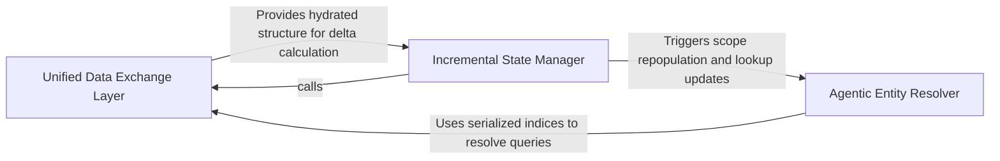

## Details

Bridges the technical graph engine and AI agents by transforming data into optimized formats.

### Unified Data Exchange Layer [[Expand]](./Unified_Data_Exchange_Layer.md)
Bridges the gap between the static analysis engine and the agentic layer by serializing graph data into a structured, hierarchical JSON format.

**Related Classes/Methods**:

- `diagram_analysis.analysis_json.build_unified_analysis_json`:360-402
- `diagram_analysis.analysis_json.UnifiedAnalysisJson`:119-137
- `diagram_analysis.analysis_json.parse_unified_analysis`:405-431
- `agents.cluster_methods_mixin.ClusterMethodsMixin`:64-853

**Source Files:**

- [`agents/agent_responses.py`](https://github.com/CodeBoarding/CodeBoarding/blob/main/.codeboardingagents/agent_responses.py)
  - `agents.agent_responses.MethodEntry` ([L246-L270](https://github.com/CodeBoarding/CodeBoarding/blob/main/.codeboardingagents/agent_responses.py#L246-L270)) - Class
  - `agents.agent_responses.FileMethodGroup` ([L273-L280](https://github.com/CodeBoarding/CodeBoarding/blob/main/.codeboardingagents/agent_responses.py#L273-L280)) - Class
  - `agents.agent_responses.FileEntry` ([L283-L289](https://github.com/CodeBoarding/CodeBoarding/blob/main/.codeboardingagents/agent_responses.py#L283-L289)) - Class
- [`agents/cluster_methods_mixin.py`](https://github.com/CodeBoarding/CodeBoarding/blob/main/.codeboardingagents/cluster_methods_mixin.py)
  - `agents.cluster_methods_mixin.ClusterMethodsMixin._build_file_methods_from_nodes` ([L564-L610](https://github.com/CodeBoarding/CodeBoarding/blob/main/.codeboardingagents/cluster_methods_mixin.py#L564-L610)) - Method
  - `agents.cluster_methods_mixin.ClusterMethodsMixin._build_file_methods_from_nodes._is_more_specific` ([L573-L583](https://github.com/CodeBoarding/CodeBoarding/blob/main/.codeboardingagents/cluster_methods_mixin.py#L573-L583)) - Function
  - `agents.cluster_methods_mixin.ClusterMethodsMixin.build_files_index` ([L732-L750](https://github.com/CodeBoarding/CodeBoarding/blob/main/.codeboardingagents/cluster_methods_mixin.py#L732-L750)) - Method
- [`diagram_analysis/analysis_json.py`](https://github.com/CodeBoarding/CodeBoarding/blob/main/.codeboardingdiagram_analysis/analysis_json.py)
  - `diagram_analysis.analysis_json.RelationJson` ([L20-L26](https://github.com/CodeBoarding/CodeBoarding/blob/main/.codeboardingdiagram_analysis/analysis_json.py#L20-L26)) - Class
  - `diagram_analysis.analysis_json.ComponentJson` ([L29-L53](https://github.com/CodeBoarding/CodeBoarding/blob/main/.codeboardingdiagram_analysis/analysis_json.py#L29-L53)) - Class
  - `diagram_analysis.analysis_json.FileCoverageSummary` ([L61-L67](https://github.com/CodeBoarding/CodeBoarding/blob/main/.codeboardingdiagram_analysis/analysis_json.py#L61-L67)) - Class
  - `diagram_analysis.analysis_json.AnalysisMetadata` ([L78-L88](https://github.com/CodeBoarding/CodeBoarding/blob/main/.codeboardingdiagram_analysis/analysis_json.py#L78-L88)) - Class
  - `diagram_analysis.analysis_json.MethodIndexEntry` ([L91-L96](https://github.com/CodeBoarding/CodeBoarding/blob/main/.codeboardingdiagram_analysis/analysis_json.py#L91-L96)) - Class
  - `diagram_analysis.analysis_json.ComponentFileMethodGroupJson` ([L99-L104](https://github.com/CodeBoarding/CodeBoarding/blob/main/.codeboardingdiagram_analysis/analysis_json.py#L99-L104)) - Class
  - `diagram_analysis.analysis_json.FileEntryJson` ([L107-L116](https://github.com/CodeBoarding/CodeBoarding/blob/main/.codeboardingdiagram_analysis/analysis_json.py#L107-L116)) - Class
  - `diagram_analysis.analysis_json.UnifiedAnalysisJson` ([L119-L137](https://github.com/CodeBoarding/CodeBoarding/blob/main/.codeboardingdiagram_analysis/analysis_json.py#L119-L137)) - Class
  - `diagram_analysis.analysis_json._build_files_index_from_analysis` ([L140-L142](https://github.com/CodeBoarding/CodeBoarding/blob/main/.codeboardingdiagram_analysis/analysis_json.py#L140-L142)) - Function
  - `diagram_analysis.analysis_json._method_key` ([L145-L146](https://github.com/CodeBoarding/CodeBoarding/blob/main/.codeboardingdiagram_analysis/analysis_json.py#L145-L146)) - Function
  - `diagram_analysis.analysis_json._to_method_qualified_name` ([L149-L150](https://github.com/CodeBoarding/CodeBoarding/blob/main/.codeboardingdiagram_analysis/analysis_json.py#L149-L150)) - Function
  - `diagram_analysis.analysis_json._to_component_file_method_refs` ([L153-L165](https://github.com/CodeBoarding/CodeBoarding/blob/main/.codeboardingdiagram_analysis/analysis_json.py#L153-L165)) - Function
  - `diagram_analysis.analysis_json._build_methods_index_from_files` ([L180-L191](https://github.com/CodeBoarding/CodeBoarding/blob/main/.codeboardingdiagram_analysis/analysis_json.py#L180-L191)) - Function
  - `diagram_analysis.analysis_json._build_file_entry_json_from_files` ([L194-L200](https://github.com/CodeBoarding/CodeBoarding/blob/main/.codeboardingdiagram_analysis/analysis_json.py#L194-L200)) - Function
  - `diagram_analysis.analysis_json._hydrate_component_methods_from_refs` ([L203-L234](https://github.com/CodeBoarding/CodeBoarding/blob/main/.codeboardingdiagram_analysis/analysis_json.py#L203-L234)) - Function
  - `diagram_analysis.analysis_json._relation_to_json` ([L237-L247](https://github.com/CodeBoarding/CodeBoarding/blob/main/.codeboardingdiagram_analysis/analysis_json.py#L237-L247)) - Function
  - `diagram_analysis.analysis_json.from_component_to_json_component` ([L250-L288](https://github.com/CodeBoarding/CodeBoarding/blob/main/.codeboardingdiagram_analysis/analysis_json.py#L250-L288)) - Function
  - `diagram_analysis.analysis_json.from_analysis_to_json` ([L291-L313](https://github.com/CodeBoarding/CodeBoarding/blob/main/.codeboardingdiagram_analysis/analysis_json.py#L291-L313)) - Function
  - `diagram_analysis.analysis_json._compute_depth_level` ([L316-L357](https://github.com/CodeBoarding/CodeBoarding/blob/main/.codeboardingdiagram_analysis/analysis_json.py#L316-L357)) - Function
  - `diagram_analysis.analysis_json._compute_depth_level.get_depth` ([L327-L337](https://github.com/CodeBoarding/CodeBoarding/blob/main/.codeboardingdiagram_analysis/analysis_json.py#L327-L337)) - Function
  - `diagram_analysis.analysis_json.build_unified_analysis_json` ([L360-L402](https://github.com/CodeBoarding/CodeBoarding/blob/main/.codeboardingdiagram_analysis/analysis_json.py#L360-L402)) - Function
  - `diagram_analysis.analysis_json.parse_unified_analysis` ([L405-L431](https://github.com/CodeBoarding/CodeBoarding/blob/main/.codeboardingdiagram_analysis/analysis_json.py#L405-L431)) - Function
  - `diagram_analysis.analysis_json._reconstruct_files_index` ([L434-L456](https://github.com/CodeBoarding/CodeBoarding/blob/main/.codeboardingdiagram_analysis/analysis_json.py#L434-L456)) - Function

### Incremental State Manager [[Expand]](./Incremental_State_Manager.md)
Handles the Delta Stitching logic that allows the agent's mental model of the code to evolve over time by mapping new fragments to existing component IDs.

**Related Classes/Methods**:

- `agents.incremental_agent.stitch_delta`:381-487
- `diagram_analysis.cluster_delta.ClusterDelta`:46-66
- `agents.agent_responses.Component`:292-339
- `agents.incremental_agent._propagate_clusters_to_ancestors`:354-378

**Source Files:**

- [`agents/agent_responses.py`](https://github.com/CodeBoarding/CodeBoarding/blob/main/.codeboardingagents/agent_responses.py)
  - `agents.agent_responses.SourceCodeReference` ([L123-L162](https://github.com/CodeBoarding/CodeBoarding/blob/main/.codeboardingagents/agent_responses.py#L123-L162)) - Class
  - `agents.agent_responses.Relation` ([L165-L177](https://github.com/CodeBoarding/CodeBoarding/blob/main/.codeboardingagents/agent_responses.py#L165-L177)) - Class
  - `agents.agent_responses.Component` ([L292-L339](https://github.com/CodeBoarding/CodeBoarding/blob/main/.codeboardingagents/agent_responses.py#L292-L339)) - Class
  - `agents.agent_responses.AnalysisInsights` ([L342-L367](https://github.com/CodeBoarding/CodeBoarding/blob/main/.codeboardingagents/agent_responses.py#L342-L367)) - Class
- [`agents/incremental_agent.py`](https://github.com/CodeBoarding/CodeBoarding/blob/main/.codeboardingagents/incremental_agent.py)
  - `agents.incremental_agent._classify_verdict` ([L302-L305](https://github.com/CodeBoarding/CodeBoarding/blob/main/.codeboardingagents/incremental_agent.py#L302-L305)) - Function
  - `agents.incremental_agent._log_stitch_summary` ([L321-L333](https://github.com/CodeBoarding/CodeBoarding/blob/main/.codeboardingagents/incremental_agent.py#L321-L333)) - Function
  - `agents.incremental_agent._ancestor_ids` ([L344-L351](https://github.com/CodeBoarding/CodeBoarding/blob/main/.codeboardingagents/incremental_agent.py#L344-L351)) - Function
  - `agents.incremental_agent._propagate_clusters_to_ancestors` ([L354-L378](https://github.com/CodeBoarding/CodeBoarding/blob/main/.codeboardingagents/incremental_agent.py#L354-L378)) - Function
  - `agents.incremental_agent.stitch_delta` ([L381-L487](https://github.com/CodeBoarding/CodeBoarding/blob/main/.codeboardingagents/incremental_agent.py#L381-L487)) - Function
  - `agents.incremental_agent._attach_new_components` ([L490-L516](https://github.com/CodeBoarding/CodeBoarding/blob/main/.codeboardingagents/incremental_agent.py#L490-L516)) - Function
  - `agents.incremental_agent._scope_for_parent` ([L519-L536](https://github.com/CodeBoarding/CodeBoarding/blob/main/.codeboardingagents/incremental_agent.py#L519-L536)) - Function
  - `agents.incremental_agent._parent_id_for_scope` ([L539-L550](https://github.com/CodeBoarding/CodeBoarding/blob/main/.codeboardingagents/incremental_agent.py#L539-L550)) - Function
- [`diagram_analysis/analysis_json.py`](https://github.com/CodeBoarding/CodeBoarding/blob/main/.codeboardingdiagram_analysis/analysis_json.py)
  - `diagram_analysis.analysis_json._method_refs_to_placeholders` ([L168-L177](https://github.com/CodeBoarding/CodeBoarding/blob/main/.codeboardingdiagram_analysis/analysis_json.py#L168-L177)) - Function
  - `diagram_analysis.analysis_json._extract_analysis_recursive` ([L468-L541](https://github.com/CodeBoarding/CodeBoarding/blob/main/.codeboardingdiagram_analysis/analysis_json.py#L468-L541)) - Function
- [`diagram_analysis/cluster_delta.py`](https://github.com/CodeBoarding/CodeBoarding/blob/main/.codeboardingdiagram_analysis/cluster_delta.py)
  - `diagram_analysis.cluster_delta.ClusterDelta.all_dropped_cluster_ids` ([L56-L57](https://github.com/CodeBoarding/CodeBoarding/blob/main/.codeboardingdiagram_analysis/cluster_delta.py#L56-L57)) - Method
  - `diagram_analysis.cluster_delta.ClusterDelta.merged_cluster_id_remap` ([L62-L66](https://github.com/CodeBoarding/CodeBoarding/blob/main/.codeboardingdiagram_analysis/cluster_delta.py#L62-L66)) - Method
- [`static_analyzer/cluster_relations.py`](https://github.com/CodeBoarding/CodeBoarding/blob/main/.codeboardingstatic_analyzer/cluster_relations.py)
  - `static_analyzer.cluster_relations.merge_relations` ([L86-L175](https://github.com/CodeBoarding/CodeBoarding/blob/main/.codeboardingstatic_analyzer/cluster_relations.py#L86-L175)) - Function

### Agentic Entity Resolver [[Expand]](./Agentic_Entity_Resolver.md)
Provides runtime lookup and deduplication services for agents, ensuring that QNames are resolved to the correct nodes in the current analysis state.

**Related Classes/Methods**:

- `agents.incremental_agent.repopulate_touched_scopes`:556-592
- `agents.incremental_agent._build_node_lookup`:595-612
- `agents.incremental_agent._dedup_methods`:699-707

**Source Files:**

- [`agents/incremental_agent.py`](https://github.com/CodeBoarding/CodeBoarding/blob/main/.codeboardingagents/incremental_agent.py)
  - `agents.incremental_agent.repopulate_touched_scopes` ([L556-L592](https://github.com/CodeBoarding/CodeBoarding/blob/main/.codeboardingagents/incremental_agent.py#L556-L592)) - Function
  - `agents.incremental_agent._build_node_lookup` ([L595-L612](https://github.com/CodeBoarding/CodeBoarding/blob/main/.codeboardingagents/incremental_agent.py#L595-L612)) - Function
  - `agents.incremental_agent._refresh_component_file_methods` ([L615-L675](https://github.com/CodeBoarding/CodeBoarding/blob/main/.codeboardingagents/incremental_agent.py#L615-L675)) - Function
  - `agents.incremental_agent._pick_file_for_qname` ([L678-L696](https://github.com/CodeBoarding/CodeBoarding/blob/main/.codeboardingagents/incremental_agent.py#L678-L696)) - Function
  - `agents.incremental_agent._dedup_methods` ([L699-L707](https://github.com/CodeBoarding/CodeBoarding/blob/main/.codeboardingagents/incremental_agent.py#L699-L707)) - Function
- [`diagram_analysis/cluster_delta.py`](https://github.com/CodeBoarding/CodeBoarding/blob/main/.codeboardingdiagram_analysis/cluster_delta.py)
  - `diagram_analysis.cluster_delta._delta_for_language._old_file` ([L133-L138](https://github.com/CodeBoarding/CodeBoarding/blob/main/.codeboardingdiagram_analysis/cluster_delta.py#L133-L138)) - Function
- [`diagram_analysis/diagram_generator.py`](https://github.com/CodeBoarding/CodeBoarding/blob/main/.codeboardingdiagram_analysis/diagram_generator.py)
  - `diagram_analysis.diagram_generator.DiagramGenerator._collect_method_entries_from_static_analysis` ([L503-L533](https://github.com/CodeBoarding/CodeBoarding/blob/main/.codeboardingdiagram_analysis/diagram_generator.py#L503-L533)) - Method
- [`diagram_analysis/io_utils.py`](https://github.com/CodeBoarding/CodeBoarding/blob/main/.codeboardingdiagram_analysis/io_utils.py)
  - `diagram_analysis.io_utils.normalize_repo_path` ([L37-L53](https://github.com/CodeBoarding/CodeBoarding/blob/main/.codeboardingdiagram_analysis/io_utils.py#L37-L53)) - Function
- [`static_analyzer/node.py`](https://github.com/CodeBoarding/CodeBoarding/blob/main/.codeboardingstatic_analyzer/node.py)
  - `static_analyzer.node.Node.is_callable` ([L33-L35](https://github.com/CodeBoarding/CodeBoarding/blob/main/.codeboardingstatic_analyzer/node.py#L33-L35)) - Method
  - `static_analyzer.node.Node.is_callback_or_anonymous` ([L48-L57](https://github.com/CodeBoarding/CodeBoarding/blob/main/.codeboardingstatic_analyzer/node.py#L48-L57)) - Method
  - `static_analyzer.node.Node.__hash__` ([L65-L66](https://github.com/CodeBoarding/CodeBoarding/blob/main/.codeboardingstatic_analyzer/node.py#L65-L66)) - Method
  - `static_analyzer.node.Node.__repr__` ([L68-L69](https://github.com/CodeBoarding/CodeBoarding/blob/main/.codeboardingstatic_analyzer/node.py#L68-L69)) - Method

### [FAQ](https://github.com/CodeBoarding/GeneratedOnBoardings/tree/main?tab=readme-ov-file#faq)