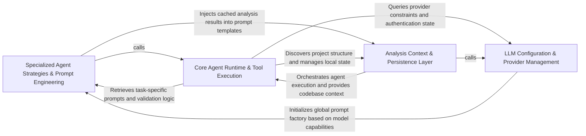

## Details

Manages the core agent lifecycle, LLM configuration, and the discovery of project dependencies to provide context for the analysis agents.

### Specialized Agent Strategies & Prompt Engineering [[Expand]](./Specialized_Agent_Strategies_Prompt_Engineering.md)
Implements the concrete logic for different analysis stages and manages provider-specific prompt templates using a factory pattern.

**Related Classes/Methods**:

- `agents.prompts.prompt_factory.PromptFactory`:52-90
- `agents.prompts.abstract_prompt_factory.AbstractPromptFactory`:10-61

**Source Files:**

- [`agents/abstraction_agent.py`](https://github.com/CodeBoarding/CodeBoarding/blob/main/.codeboardingagents/abstraction_agent.py)
  - `agents.abstraction_agent.AbstractionAgent.__init__` ([L45-L80](https://github.com/CodeBoarding/CodeBoarding/blob/main/.codeboardingagents/abstraction_agent.py#L45-L80)) - Method
- [`agents/details_agent.py`](https://github.com/CodeBoarding/CodeBoarding/blob/main/.codeboardingagents/details_agent.py)
  - `agents.details_agent.DetailsAgent.__init__` ([L46-L84](https://github.com/CodeBoarding/CodeBoarding/blob/main/.codeboardingagents/details_agent.py#L46-L84)) - Method
- [`agents/incremental_agent.py`](https://github.com/CodeBoarding/CodeBoarding/blob/main/.codeboardingagents/incremental_agent.py)
  - `agents.incremental_agent.IncrementalAgent.__init__` ([L63-L99](https://github.com/CodeBoarding/CodeBoarding/blob/main/.codeboardingagents/incremental_agent.py#L63-L99)) - Method
- [`agents/prompts/__init__.py`](https://github.com/CodeBoarding/CodeBoarding/blob/main/.codeboardingagents/prompts/__init__.py)
  - `agents.prompts.__init__.__getattr__` ([L37-L49](https://github.com/CodeBoarding/CodeBoarding/blob/main/.codeboardingagents/prompts/__init__.py#L37-L49)) - Function
- [`agents/prompts/abstract_prompt_factory.py`](https://github.com/CodeBoarding/CodeBoarding/blob/main/.codeboardingagents/prompts/abstract_prompt_factory.py)
  - `agents.prompts.abstract_prompt_factory.AbstractPromptFactory` ([L10-L61](https://github.com/CodeBoarding/CodeBoarding/blob/main/.codeboardingagents/prompts/abstract_prompt_factory.py#L10-L61)) - Class
  - `agents.prompts.abstract_prompt_factory.AbstractPromptFactory.get_system_message` ([L14-L15](https://github.com/CodeBoarding/CodeBoarding/blob/main/.codeboardingagents/prompts/abstract_prompt_factory.py#L14-L15)) - Method
  - `agents.prompts.abstract_prompt_factory.AbstractPromptFactory.get_final_analysis_message` ([L18-L19](https://github.com/CodeBoarding/CodeBoarding/blob/main/.codeboardingagents/prompts/abstract_prompt_factory.py#L18-L19)) - Method
  - `agents.prompts.abstract_prompt_factory.AbstractPromptFactory.get_planner_system_message` ([L22-L23](https://github.com/CodeBoarding/CodeBoarding/blob/main/.codeboardingagents/prompts/abstract_prompt_factory.py#L22-L23)) - Method
  - `agents.prompts.abstract_prompt_factory.AbstractPromptFactory.get_expansion_prompt` ([L26-L27](https://github.com/CodeBoarding/CodeBoarding/blob/main/.codeboardingagents/prompts/abstract_prompt_factory.py#L26-L27)) - Method
  - `agents.prompts.abstract_prompt_factory.AbstractPromptFactory.get_system_meta_analysis_message` ([L30-L31](https://github.com/CodeBoarding/CodeBoarding/blob/main/.codeboardingagents/prompts/abstract_prompt_factory.py#L30-L31)) - Method
  - `agents.prompts.abstract_prompt_factory.AbstractPromptFactory.get_meta_information_prompt` ([L34-L35](https://github.com/CodeBoarding/CodeBoarding/blob/main/.codeboardingagents/prompts/abstract_prompt_factory.py#L34-L35)) - Method
  - `agents.prompts.abstract_prompt_factory.AbstractPromptFactory.get_file_classification_message` ([L38-L39](https://github.com/CodeBoarding/CodeBoarding/blob/main/.codeboardingagents/prompts/abstract_prompt_factory.py#L38-L39)) - Method
  - `agents.prompts.abstract_prompt_factory.AbstractPromptFactory.get_validation_feedback_message` ([L42-L43](https://github.com/CodeBoarding/CodeBoarding/blob/main/.codeboardingagents/prompts/abstract_prompt_factory.py#L42-L43)) - Method
  - `agents.prompts.abstract_prompt_factory.AbstractPromptFactory.get_system_details_message` ([L46-L47](https://github.com/CodeBoarding/CodeBoarding/blob/main/.codeboardingagents/prompts/abstract_prompt_factory.py#L46-L47)) - Method
  - `agents.prompts.abstract_prompt_factory.AbstractPromptFactory.get_details_message` ([L50-L51](https://github.com/CodeBoarding/CodeBoarding/blob/main/.codeboardingagents/prompts/abstract_prompt_factory.py#L50-L51)) - Method
  - `agents.prompts.abstract_prompt_factory.AbstractPromptFactory.get_scope_relations_message` ([L54-L55](https://github.com/CodeBoarding/CodeBoarding/blob/main/.codeboardingagents/prompts/abstract_prompt_factory.py#L54-L55)) - Method
  - `agents.prompts.abstract_prompt_factory.AbstractPromptFactory.get_api_surfaces_message` ([L57-L58](https://github.com/CodeBoarding/CodeBoarding/blob/main/.codeboardingagents/prompts/abstract_prompt_factory.py#L57-L58)) - Method
  - `agents.prompts.abstract_prompt_factory.AbstractPromptFactory.get_relation_analysis_message` ([L60-L61](https://github.com/CodeBoarding/CodeBoarding/blob/main/.codeboardingagents/prompts/abstract_prompt_factory.py#L60-L61)) - Method
- [`agents/prompts/claude_prompts.py`](https://github.com/CodeBoarding/CodeBoarding/blob/main/.codeboardingagents/prompts/claude_prompts.py)
  - `agents.prompts.claude_prompts.ClaudePromptFactory` ([L232-L266](https://github.com/CodeBoarding/CodeBoarding/blob/main/.codeboardingagents/prompts/claude_prompts.py#L232-L266)) - Class
  - `agents.prompts.claude_prompts.ClaudePromptFactory.get_system_message` ([L235-L236](https://github.com/CodeBoarding/CodeBoarding/blob/main/.codeboardingagents/prompts/claude_prompts.py#L235-L236)) - Method
  - `agents.prompts.claude_prompts.ClaudePromptFactory.get_final_analysis_message` ([L238-L239](https://github.com/CodeBoarding/CodeBoarding/blob/main/.codeboardingagents/prompts/claude_prompts.py#L238-L239)) - Method
  - `agents.prompts.claude_prompts.ClaudePromptFactory.get_planner_system_message` ([L241-L242](https://github.com/CodeBoarding/CodeBoarding/blob/main/.codeboardingagents/prompts/claude_prompts.py#L241-L242)) - Method
  - `agents.prompts.claude_prompts.ClaudePromptFactory.get_expansion_prompt` ([L244-L245](https://github.com/CodeBoarding/CodeBoarding/blob/main/.codeboardingagents/prompts/claude_prompts.py#L244-L245)) - Method
  - `agents.prompts.claude_prompts.ClaudePromptFactory.get_system_meta_analysis_message` ([L247-L248](https://github.com/CodeBoarding/CodeBoarding/blob/main/.codeboardingagents/prompts/claude_prompts.py#L247-L248)) - Method
  - `agents.prompts.claude_prompts.ClaudePromptFactory.get_meta_information_prompt` ([L250-L251](https://github.com/CodeBoarding/CodeBoarding/blob/main/.codeboardingagents/prompts/claude_prompts.py#L250-L251)) - Method
  - `agents.prompts.claude_prompts.ClaudePromptFactory.get_file_classification_message` ([L253-L254](https://github.com/CodeBoarding/CodeBoarding/blob/main/.codeboardingagents/prompts/claude_prompts.py#L253-L254)) - Method
  - `agents.prompts.claude_prompts.ClaudePromptFactory.get_validation_feedback_message` ([L256-L257](https://github.com/CodeBoarding/CodeBoarding/blob/main/.codeboardingagents/prompts/claude_prompts.py#L256-L257)) - Method
  - `agents.prompts.claude_prompts.ClaudePromptFactory.get_system_details_message` ([L259-L260](https://github.com/CodeBoarding/CodeBoarding/blob/main/.codeboardingagents/prompts/claude_prompts.py#L259-L260)) - Method
  - `agents.prompts.claude_prompts.ClaudePromptFactory.get_scope_relations_message` ([L262-L263](https://github.com/CodeBoarding/CodeBoarding/blob/main/.codeboardingagents/prompts/claude_prompts.py#L262-L263)) - Method
  - `agents.prompts.claude_prompts.ClaudePromptFactory.get_details_message` ([L265-L266](https://github.com/CodeBoarding/CodeBoarding/blob/main/.codeboardingagents/prompts/claude_prompts.py#L265-L266)) - Method
- [`agents/prompts/deepseek_prompts.py`](https://github.com/CodeBoarding/CodeBoarding/blob/main/.codeboardingagents/prompts/deepseek_prompts.py)
  - `agents.prompts.deepseek_prompts.DeepSeekPromptFactory` ([L241-L275](https://github.com/CodeBoarding/CodeBoarding/blob/main/.codeboardingagents/prompts/deepseek_prompts.py#L241-L275)) - Class
  - `agents.prompts.deepseek_prompts.DeepSeekPromptFactory.get_system_message` ([L244-L245](https://github.com/CodeBoarding/CodeBoarding/blob/main/.codeboardingagents/prompts/deepseek_prompts.py#L244-L245)) - Method
  - `agents.prompts.deepseek_prompts.DeepSeekPromptFactory.get_final_analysis_message` ([L247-L248](https://github.com/CodeBoarding/CodeBoarding/blob/main/.codeboardingagents/prompts/deepseek_prompts.py#L247-L248)) - Method
  - `agents.prompts.deepseek_prompts.DeepSeekPromptFactory.get_planner_system_message` ([L250-L251](https://github.com/CodeBoarding/CodeBoarding/blob/main/.codeboardingagents/prompts/deepseek_prompts.py#L250-L251)) - Method
  - `agents.prompts.deepseek_prompts.DeepSeekPromptFactory.get_expansion_prompt` ([L253-L254](https://github.com/CodeBoarding/CodeBoarding/blob/main/.codeboardingagents/prompts/deepseek_prompts.py#L253-L254)) - Method
  - `agents.prompts.deepseek_prompts.DeepSeekPromptFactory.get_system_meta_analysis_message` ([L256-L257](https://github.com/CodeBoarding/CodeBoarding/blob/main/.codeboardingagents/prompts/deepseek_prompts.py#L256-L257)) - Method
  - `agents.prompts.deepseek_prompts.DeepSeekPromptFactory.get_meta_information_prompt` ([L259-L260](https://github.com/CodeBoarding/CodeBoarding/blob/main/.codeboardingagents/prompts/deepseek_prompts.py#L259-L260)) - Method
  - `agents.prompts.deepseek_prompts.DeepSeekPromptFactory.get_file_classification_message` ([L262-L263](https://github.com/CodeBoarding/CodeBoarding/blob/main/.codeboardingagents/prompts/deepseek_prompts.py#L262-L263)) - Method
  - `agents.prompts.deepseek_prompts.DeepSeekPromptFactory.get_validation_feedback_message` ([L265-L266](https://github.com/CodeBoarding/CodeBoarding/blob/main/.codeboardingagents/prompts/deepseek_prompts.py#L265-L266)) - Method
  - `agents.prompts.deepseek_prompts.DeepSeekPromptFactory.get_system_details_message` ([L268-L269](https://github.com/CodeBoarding/CodeBoarding/blob/main/.codeboardingagents/prompts/deepseek_prompts.py#L268-L269)) - Method
  - `agents.prompts.deepseek_prompts.DeepSeekPromptFactory.get_details_message` ([L271-L272](https://github.com/CodeBoarding/CodeBoarding/blob/main/.codeboardingagents/prompts/deepseek_prompts.py#L271-L272)) - Method
  - `agents.prompts.deepseek_prompts.DeepSeekPromptFactory.get_scope_relations_message` ([L274-L275](https://github.com/CodeBoarding/CodeBoarding/blob/main/.codeboardingagents/prompts/deepseek_prompts.py#L274-L275)) - Method
- [`agents/prompts/gemini_flash_prompts.py`](https://github.com/CodeBoarding/CodeBoarding/blob/main/.codeboardingagents/prompts/gemini_flash_prompts.py)
  - `agents.prompts.gemini_flash_prompts.GeminiFlashPromptFactory` ([L214-L248](https://github.com/CodeBoarding/CodeBoarding/blob/main/.codeboardingagents/prompts/gemini_flash_prompts.py#L214-L248)) - Class
  - `agents.prompts.gemini_flash_prompts.GeminiFlashPromptFactory.get_system_message` ([L217-L218](https://github.com/CodeBoarding/CodeBoarding/blob/main/.codeboardingagents/prompts/gemini_flash_prompts.py#L217-L218)) - Method
  - `agents.prompts.gemini_flash_prompts.GeminiFlashPromptFactory.get_final_analysis_message` ([L220-L221](https://github.com/CodeBoarding/CodeBoarding/blob/main/.codeboardingagents/prompts/gemini_flash_prompts.py#L220-L221)) - Method
  - `agents.prompts.gemini_flash_prompts.GeminiFlashPromptFactory.get_planner_system_message` ([L223-L224](https://github.com/CodeBoarding/CodeBoarding/blob/main/.codeboardingagents/prompts/gemini_flash_prompts.py#L223-L224)) - Method
  - `agents.prompts.gemini_flash_prompts.GeminiFlashPromptFactory.get_expansion_prompt` ([L226-L227](https://github.com/CodeBoarding/CodeBoarding/blob/main/.codeboardingagents/prompts/gemini_flash_prompts.py#L226-L227)) - Method
  - `agents.prompts.gemini_flash_prompts.GeminiFlashPromptFactory.get_system_meta_analysis_message` ([L229-L230](https://github.com/CodeBoarding/CodeBoarding/blob/main/.codeboardingagents/prompts/gemini_flash_prompts.py#L229-L230)) - Method
  - `agents.prompts.gemini_flash_prompts.GeminiFlashPromptFactory.get_meta_information_prompt` ([L232-L233](https://github.com/CodeBoarding/CodeBoarding/blob/main/.codeboardingagents/prompts/gemini_flash_prompts.py#L232-L233)) - Method
  - `agents.prompts.gemini_flash_prompts.GeminiFlashPromptFactory.get_file_classification_message` ([L235-L236](https://github.com/CodeBoarding/CodeBoarding/blob/main/.codeboardingagents/prompts/gemini_flash_prompts.py#L235-L236)) - Method
  - `agents.prompts.gemini_flash_prompts.GeminiFlashPromptFactory.get_validation_feedback_message` ([L238-L239](https://github.com/CodeBoarding/CodeBoarding/blob/main/.codeboardingagents/prompts/gemini_flash_prompts.py#L238-L239)) - Method
  - `agents.prompts.gemini_flash_prompts.GeminiFlashPromptFactory.get_system_details_message` ([L241-L242](https://github.com/CodeBoarding/CodeBoarding/blob/main/.codeboardingagents/prompts/gemini_flash_prompts.py#L241-L242)) - Method
  - `agents.prompts.gemini_flash_prompts.GeminiFlashPromptFactory.get_details_message` ([L244-L245](https://github.com/CodeBoarding/CodeBoarding/blob/main/.codeboardingagents/prompts/gemini_flash_prompts.py#L244-L245)) - Method
  - `agents.prompts.gemini_flash_prompts.GeminiFlashPromptFactory.get_scope_relations_message` ([L247-L248](https://github.com/CodeBoarding/CodeBoarding/blob/main/.codeboardingagents/prompts/gemini_flash_prompts.py#L247-L248)) - Method
- [`agents/prompts/glm_prompts.py`](https://github.com/CodeBoarding/CodeBoarding/blob/main/.codeboardingagents/prompts/glm_prompts.py)
  - `agents.prompts.glm_prompts.GLMPromptFactory` ([L258-L292](https://github.com/CodeBoarding/CodeBoarding/blob/main/.codeboardingagents/prompts/glm_prompts.py#L258-L292)) - Class
  - `agents.prompts.glm_prompts.GLMPromptFactory.get_system_message` ([L261-L262](https://github.com/CodeBoarding/CodeBoarding/blob/main/.codeboardingagents/prompts/glm_prompts.py#L261-L262)) - Method
  - `agents.prompts.glm_prompts.GLMPromptFactory.get_final_analysis_message` ([L264-L265](https://github.com/CodeBoarding/CodeBoarding/blob/main/.codeboardingagents/prompts/glm_prompts.py#L264-L265)) - Method
  - `agents.prompts.glm_prompts.GLMPromptFactory.get_planner_system_message` ([L267-L268](https://github.com/CodeBoarding/CodeBoarding/blob/main/.codeboardingagents/prompts/glm_prompts.py#L267-L268)) - Method
  - `agents.prompts.glm_prompts.GLMPromptFactory.get_expansion_prompt` ([L270-L271](https://github.com/CodeBoarding/CodeBoarding/blob/main/.codeboardingagents/prompts/glm_prompts.py#L270-L271)) - Method
  - `agents.prompts.glm_prompts.GLMPromptFactory.get_system_meta_analysis_message` ([L273-L274](https://github.com/CodeBoarding/CodeBoarding/blob/main/.codeboardingagents/prompts/glm_prompts.py#L273-L274)) - Method
  - `agents.prompts.glm_prompts.GLMPromptFactory.get_meta_information_prompt` ([L276-L277](https://github.com/CodeBoarding/CodeBoarding/blob/main/.codeboardingagents/prompts/glm_prompts.py#L276-L277)) - Method
  - `agents.prompts.glm_prompts.GLMPromptFactory.get_file_classification_message` ([L279-L280](https://github.com/CodeBoarding/CodeBoarding/blob/main/.codeboardingagents/prompts/glm_prompts.py#L279-L280)) - Method
  - `agents.prompts.glm_prompts.GLMPromptFactory.get_validation_feedback_message` ([L282-L283](https://github.com/CodeBoarding/CodeBoarding/blob/main/.codeboardingagents/prompts/glm_prompts.py#L282-L283)) - Method
  - `agents.prompts.glm_prompts.GLMPromptFactory.get_system_details_message` ([L285-L286](https://github.com/CodeBoarding/CodeBoarding/blob/main/.codeboardingagents/prompts/glm_prompts.py#L285-L286)) - Method
  - `agents.prompts.glm_prompts.GLMPromptFactory.get_details_message` ([L288-L289](https://github.com/CodeBoarding/CodeBoarding/blob/main/.codeboardingagents/prompts/glm_prompts.py#L288-L289)) - Method
  - `agents.prompts.glm_prompts.GLMPromptFactory.get_scope_relations_message` ([L291-L292](https://github.com/CodeBoarding/CodeBoarding/blob/main/.codeboardingagents/prompts/glm_prompts.py#L291-L292)) - Method
- [`agents/prompts/gpt_prompts.py`](https://github.com/CodeBoarding/CodeBoarding/blob/main/.codeboardingagents/prompts/gpt_prompts.py)
  - `agents.prompts.gpt_prompts.GPTPromptFactory` ([L276-L310](https://github.com/CodeBoarding/CodeBoarding/blob/main/.codeboardingagents/prompts/gpt_prompts.py#L276-L310)) - Class
  - `agents.prompts.gpt_prompts.GPTPromptFactory.get_system_message` ([L279-L280](https://github.com/CodeBoarding/CodeBoarding/blob/main/.codeboardingagents/prompts/gpt_prompts.py#L279-L280)) - Method
  - `agents.prompts.gpt_prompts.GPTPromptFactory.get_final_analysis_message` ([L282-L283](https://github.com/CodeBoarding/CodeBoarding/blob/main/.codeboardingagents/prompts/gpt_prompts.py#L282-L283)) - Method
  - `agents.prompts.gpt_prompts.GPTPromptFactory.get_planner_system_message` ([L285-L286](https://github.com/CodeBoarding/CodeBoarding/blob/main/.codeboardingagents/prompts/gpt_prompts.py#L285-L286)) - Method
  - `agents.prompts.gpt_prompts.GPTPromptFactory.get_expansion_prompt` ([L288-L289](https://github.com/CodeBoarding/CodeBoarding/blob/main/.codeboardingagents/prompts/gpt_prompts.py#L288-L289)) - Method
  - `agents.prompts.gpt_prompts.GPTPromptFactory.get_system_meta_analysis_message` ([L291-L292](https://github.com/CodeBoarding/CodeBoarding/blob/main/.codeboardingagents/prompts/gpt_prompts.py#L291-L292)) - Method
  - `agents.prompts.gpt_prompts.GPTPromptFactory.get_meta_information_prompt` ([L294-L295](https://github.com/CodeBoarding/CodeBoarding/blob/main/.codeboardingagents/prompts/gpt_prompts.py#L294-L295)) - Method
  - `agents.prompts.gpt_prompts.GPTPromptFactory.get_file_classification_message` ([L297-L298](https://github.com/CodeBoarding/CodeBoarding/blob/main/.codeboardingagents/prompts/gpt_prompts.py#L297-L298)) - Method
  - `agents.prompts.gpt_prompts.GPTPromptFactory.get_validation_feedback_message` ([L300-L301](https://github.com/CodeBoarding/CodeBoarding/blob/main/.codeboardingagents/prompts/gpt_prompts.py#L300-L301)) - Method
  - `agents.prompts.gpt_prompts.GPTPromptFactory.get_system_details_message` ([L303-L304](https://github.com/CodeBoarding/CodeBoarding/blob/main/.codeboardingagents/prompts/gpt_prompts.py#L303-L304)) - Method
  - `agents.prompts.gpt_prompts.GPTPromptFactory.get_details_message` ([L306-L307](https://github.com/CodeBoarding/CodeBoarding/blob/main/.codeboardingagents/prompts/gpt_prompts.py#L306-L307)) - Method
  - `agents.prompts.gpt_prompts.GPTPromptFactory.get_scope_relations_message` ([L309-L310](https://github.com/CodeBoarding/CodeBoarding/blob/main/.codeboardingagents/prompts/gpt_prompts.py#L309-L310)) - Method
- [`agents/prompts/kimi_prompts.py`](https://github.com/CodeBoarding/CodeBoarding/blob/main/.codeboardingagents/prompts/kimi_prompts.py)
  - `agents.prompts.kimi_prompts.KimiPromptFactory` ([L240-L274](https://github.com/CodeBoarding/CodeBoarding/blob/main/.codeboardingagents/prompts/kimi_prompts.py#L240-L274)) - Class
  - `agents.prompts.kimi_prompts.KimiPromptFactory.get_system_message` ([L243-L244](https://github.com/CodeBoarding/CodeBoarding/blob/main/.codeboardingagents/prompts/kimi_prompts.py#L243-L244)) - Method
  - `agents.prompts.kimi_prompts.KimiPromptFactory.get_final_analysis_message` ([L246-L247](https://github.com/CodeBoarding/CodeBoarding/blob/main/.codeboardingagents/prompts/kimi_prompts.py#L246-L247)) - Method
  - `agents.prompts.kimi_prompts.KimiPromptFactory.get_planner_system_message` ([L249-L250](https://github.com/CodeBoarding/CodeBoarding/blob/main/.codeboardingagents/prompts/kimi_prompts.py#L249-L250)) - Method
  - `agents.prompts.kimi_prompts.KimiPromptFactory.get_expansion_prompt` ([L252-L253](https://github.com/CodeBoarding/CodeBoarding/blob/main/.codeboardingagents/prompts/kimi_prompts.py#L252-L253)) - Method
  - `agents.prompts.kimi_prompts.KimiPromptFactory.get_system_meta_analysis_message` ([L255-L256](https://github.com/CodeBoarding/CodeBoarding/blob/main/.codeboardingagents/prompts/kimi_prompts.py#L255-L256)) - Method
  - `agents.prompts.kimi_prompts.KimiPromptFactory.get_meta_information_prompt` ([L258-L259](https://github.com/CodeBoarding/CodeBoarding/blob/main/.codeboardingagents/prompts/kimi_prompts.py#L258-L259)) - Method
  - `agents.prompts.kimi_prompts.KimiPromptFactory.get_file_classification_message` ([L261-L262](https://github.com/CodeBoarding/CodeBoarding/blob/main/.codeboardingagents/prompts/kimi_prompts.py#L261-L262)) - Method
  - `agents.prompts.kimi_prompts.KimiPromptFactory.get_validation_feedback_message` ([L264-L265](https://github.com/CodeBoarding/CodeBoarding/blob/main/.codeboardingagents/prompts/kimi_prompts.py#L264-L265)) - Method
  - `agents.prompts.kimi_prompts.KimiPromptFactory.get_system_details_message` ([L267-L268](https://github.com/CodeBoarding/CodeBoarding/blob/main/.codeboardingagents/prompts/kimi_prompts.py#L267-L268)) - Method
  - `agents.prompts.kimi_prompts.KimiPromptFactory.get_details_message` ([L270-L271](https://github.com/CodeBoarding/CodeBoarding/blob/main/.codeboardingagents/prompts/kimi_prompts.py#L270-L271)) - Method
  - `agents.prompts.kimi_prompts.KimiPromptFactory.get_scope_relations_message` ([L273-L274](https://github.com/CodeBoarding/CodeBoarding/blob/main/.codeboardingagents/prompts/kimi_prompts.py#L273-L274)) - Method
- [`agents/prompts/prompt_factory.py`](https://github.com/CodeBoarding/CodeBoarding/blob/main/.codeboardingagents/prompts/prompt_factory.py)
  - `agents.prompts.prompt_factory.PromptFactory` ([L52-L90](https://github.com/CodeBoarding/CodeBoarding/blob/main/.codeboardingagents/prompts/prompt_factory.py#L52-L90)) - Class
  - `agents.prompts.prompt_factory.PromptFactory.__init__` ([L55-L57](https://github.com/CodeBoarding/CodeBoarding/blob/main/.codeboardingagents/prompts/prompt_factory.py#L55-L57)) - Method
  - `agents.prompts.prompt_factory.PromptFactory._create_prompt_factory` ([L59-L82](https://github.com/CodeBoarding/CodeBoarding/blob/main/.codeboardingagents/prompts/prompt_factory.py#L59-L82)) - Method
  - `agents.prompts.prompt_factory.PromptFactory.get_prompt` ([L84-L90](https://github.com/CodeBoarding/CodeBoarding/blob/main/.codeboardingagents/prompts/prompt_factory.py#L84-L90)) - Method
  - `agents.prompts.prompt_factory.initialize_global_factory` ([L97-L102](https://github.com/CodeBoarding/CodeBoarding/blob/main/.codeboardingagents/prompts/prompt_factory.py#L97-L102)) - Function
  - `agents.prompts.prompt_factory.get_global_factory` ([L105-L112](https://github.com/CodeBoarding/CodeBoarding/blob/main/.codeboardingagents/prompts/prompt_factory.py#L105-L112)) - Function
  - `agents.prompts.prompt_factory.get_prompt` ([L115-L117](https://github.com/CodeBoarding/CodeBoarding/blob/main/.codeboardingagents/prompts/prompt_factory.py#L115-L117)) - Function
  - `agents.prompts.prompt_factory.format_project_system_message` ([L120-L130](https://github.com/CodeBoarding/CodeBoarding/blob/main/.codeboardingagents/prompts/prompt_factory.py#L120-L130)) - Function
  - `agents.prompts.prompt_factory.get_system_message` ([L134-L135](https://github.com/CodeBoarding/CodeBoarding/blob/main/.codeboardingagents/prompts/prompt_factory.py#L134-L135)) - Function
  - `agents.prompts.prompt_factory.get_final_analysis_message` ([L138-L139](https://github.com/CodeBoarding/CodeBoarding/blob/main/.codeboardingagents/prompts/prompt_factory.py#L138-L139)) - Function
  - `agents.prompts.prompt_factory.get_planner_system_message` ([L142-L143](https://github.com/CodeBoarding/CodeBoarding/blob/main/.codeboardingagents/prompts/prompt_factory.py#L142-L143)) - Function
  - `agents.prompts.prompt_factory.get_expansion_prompt` ([L146-L147](https://github.com/CodeBoarding/CodeBoarding/blob/main/.codeboardingagents/prompts/prompt_factory.py#L146-L147)) - Function
  - `agents.prompts.prompt_factory.get_system_meta_analysis_message` ([L150-L151](https://github.com/CodeBoarding/CodeBoarding/blob/main/.codeboardingagents/prompts/prompt_factory.py#L150-L151)) - Function
  - `agents.prompts.prompt_factory.get_meta_information_prompt` ([L154-L155](https://github.com/CodeBoarding/CodeBoarding/blob/main/.codeboardingagents/prompts/prompt_factory.py#L154-L155)) - Function
  - `agents.prompts.prompt_factory.get_file_classification_message` ([L158-L159](https://github.com/CodeBoarding/CodeBoarding/blob/main/.codeboardingagents/prompts/prompt_factory.py#L158-L159)) - Function
  - `agents.prompts.prompt_factory.get_validation_feedback_message` ([L162-L163](https://github.com/CodeBoarding/CodeBoarding/blob/main/.codeboardingagents/prompts/prompt_factory.py#L162-L163)) - Function
  - `agents.prompts.prompt_factory.get_system_details_message` ([L166-L167](https://github.com/CodeBoarding/CodeBoarding/blob/main/.codeboardingagents/prompts/prompt_factory.py#L166-L167)) - Function
  - `agents.prompts.prompt_factory.get_details_message` ([L170-L171](https://github.com/CodeBoarding/CodeBoarding/blob/main/.codeboardingagents/prompts/prompt_factory.py#L170-L171)) - Function
  - `agents.prompts.prompt_factory.get_scope_relations_message` ([L174-L175](https://github.com/CodeBoarding/CodeBoarding/blob/main/.codeboardingagents/prompts/prompt_factory.py#L174-L175)) - Function
  - `agents.prompts.prompt_factory.get_api_surfaces_message` ([L178-L179](https://github.com/CodeBoarding/CodeBoarding/blob/main/.codeboardingagents/prompts/prompt_factory.py#L178-L179)) - Function
  - `agents.prompts.prompt_factory.get_relation_analysis_message` ([L182-L183](https://github.com/CodeBoarding/CodeBoarding/blob/main/.codeboardingagents/prompts/prompt_factory.py#L182-L183)) - Function

### Core Agent Runtime & Tool Execution [[Expand]](./Core_Agent_Runtime_Tool_Execution.md)
Provides the base execution environment for agents, including the primary loop, error handling, and filesystem/git interaction tools.

**Related Classes/Methods**:

- `agents.agent.CodeBoardingAgent`:62-492
- `agents.retry.with_retries`:68-118
- `agents.llm_errors.LLMAuthError`:55-70
- `agents.agent.RepairValidationResult`:39-40

**Source Files:**

- [`agents/agent.py`](https://github.com/CodeBoarding/CodeBoarding/blob/main/.codeboardingagents/agent.py)
  - `agents.agent.RepairValidationResult` ([L39-L40](https://github.com/CodeBoarding/CodeBoarding/blob/main/.codeboardingagents/agent.py#L39-L40)) - Class
  - `agents.agent.RepairValidationResult.llm_str` ([L40-L40](https://github.com/CodeBoarding/CodeBoarding/blob/main/.codeboardingagents/agent.py#L40-L40)) - Method
  - `agents.agent.EmptyExtractorMessageError` ([L43-L44](https://github.com/CodeBoarding/CodeBoarding/blob/main/.codeboardingagents/agent.py#L43-L44)) - Class
  - `agents.agent._raise_if_auth_error` ([L47-L59](https://github.com/CodeBoarding/CodeBoarding/blob/main/.codeboardingagents/agent.py#L47-L59)) - Function
  - `agents.agent.CodeBoardingAgent` ([L62-L492](https://github.com/CodeBoarding/CodeBoarding/blob/main/.codeboardingagents/agent.py#L62-L492)) - Class
  - `agents.agent.CodeBoardingAgent.__init__` ([L63-L86](https://github.com/CodeBoarding/CodeBoarding/blob/main/.codeboardingagents/agent.py#L63-L86)) - Method
  - `agents.agent.CodeBoardingAgent.read_source_reference` ([L89-L90](https://github.com/CodeBoarding/CodeBoarding/blob/main/.codeboardingagents/agent.py#L89-L90)) - Method
  - `agents.agent.CodeBoardingAgent.read_packages_tool` ([L93-L94](https://github.com/CodeBoarding/CodeBoarding/blob/main/.codeboardingagents/agent.py#L93-L94)) - Method
  - `agents.agent.CodeBoardingAgent.read_structure_tool` ([L97-L98](https://github.com/CodeBoarding/CodeBoarding/blob/main/.codeboardingagents/agent.py#L97-L98)) - Method
  - `agents.agent.CodeBoardingAgent.read_file_structure` ([L101-L102](https://github.com/CodeBoarding/CodeBoarding/blob/main/.codeboardingagents/agent.py#L101-L102)) - Method
  - `agents.agent.CodeBoardingAgent.read_cfg_tool` ([L105-L106](https://github.com/CodeBoarding/CodeBoarding/blob/main/.codeboardingagents/agent.py#L105-L106)) - Method
  - `agents.agent.CodeBoardingAgent.read_method_invocations_tool` ([L109-L110](https://github.com/CodeBoarding/CodeBoarding/blob/main/.codeboardingagents/agent.py#L109-L110)) - Method
  - `agents.agent.CodeBoardingAgent.component_bridge_edges_tool` ([L113-L114](https://github.com/CodeBoarding/CodeBoarding/blob/main/.codeboardingagents/agent.py#L113-L114)) - Method
  - `agents.agent.CodeBoardingAgent.read_file_tool` ([L117-L118](https://github.com/CodeBoarding/CodeBoarding/blob/main/.codeboardingagents/agent.py#L117-L118)) - Method
  - `agents.agent.CodeBoardingAgent.read_docs` ([L121-L122](https://github.com/CodeBoarding/CodeBoarding/blob/main/.codeboardingagents/agent.py#L121-L122)) - Method
  - `agents.agent.CodeBoardingAgent.external_deps_tool` ([L125-L126](https://github.com/CodeBoarding/CodeBoarding/blob/main/.codeboardingagents/agent.py#L125-L126)) - Method
  - `agents.agent.CodeBoardingAgent._invoke` ([L128-L194](https://github.com/CodeBoarding/CodeBoarding/blob/main/.codeboardingagents/agent.py#L128-L194)) - Method
  - `agents.agent.CodeBoardingAgent._invoke.call_once` ([L143-L163](https://github.com/CodeBoarding/CodeBoarding/blob/main/.codeboardingagents/agent.py#L143-L163)) - Function
  - `agents.agent.CodeBoardingAgent._invoke.classify` ([L165-L179](https://github.com/CodeBoarding/CodeBoarding/blob/main/.codeboardingagents/agent.py#L165-L179)) - Function
  - `agents.agent.CodeBoardingAgent._invoke.on_exhausted` ([L181-L186](https://github.com/CodeBoarding/CodeBoarding/blob/main/.codeboardingagents/agent.py#L181-L186)) - Function
  - `agents.agent.CodeBoardingAgent._invoke_with_timeout` ([L196-L234](https://github.com/CodeBoarding/CodeBoarding/blob/main/.codeboardingagents/agent.py#L196-L234)) - Method
  - `agents.agent.CodeBoardingAgent._invoke_with_timeout.invoke_target` ([L204-L212](https://github.com/CodeBoarding/CodeBoarding/blob/main/.codeboardingagents/agent.py#L204-L212)) - Function
  - `agents.agent.CodeBoardingAgent._parse_invoke` ([L236-L244](https://github.com/CodeBoarding/CodeBoarding/blob/main/.codeboardingagents/agent.py#L236-L244)) - Method
  - `agents.agent.CodeBoardingAgent._repair_result` ([L246-L255](https://github.com/CodeBoarding/CodeBoarding/blob/main/.codeboardingagents/agent.py#L246-L255)) - Method
  - `agents.agent.CodeBoardingAgent._score_result` ([L257-L287](https://github.com/CodeBoarding/CodeBoarding/blob/main/.codeboardingagents/agent.py#L257-L287)) - Method
  - `agents.agent.CodeBoardingAgent._invoke_repair_validate` ([L289-L313](https://github.com/CodeBoarding/CodeBoarding/blob/main/.codeboardingagents/agent.py#L289-L313)) - Method
  - `agents.agent.CodeBoardingAgent._invoke_repair_validate.repair_candidate` ([L302-L303](https://github.com/CodeBoarding/CodeBoarding/blob/main/.codeboardingagents/agent.py#L302-L303)) - Function
  - `agents.agent.CodeBoardingAgent._invoke_validate` ([L315-L394](https://github.com/CodeBoarding/CodeBoarding/blob/main/.codeboardingagents/agent.py#L315-L394)) - Method
  - `agents.agent.CodeBoardingAgent._parse_response` ([L396-L444](https://github.com/CodeBoarding/CodeBoarding/blob/main/.codeboardingagents/agent.py#L396-L444)) - Method
  - `agents.agent.CodeBoardingAgent._parse_response.call_once` ([L411-L418](https://github.com/CodeBoarding/CodeBoarding/blob/main/.codeboardingagents/agent.py#L411-L418)) - Function
  - `agents.agent.CodeBoardingAgent._parse_response.classify` ([L420-L429](https://github.com/CodeBoarding/CodeBoarding/blob/main/.codeboardingagents/agent.py#L420-L429)) - Function
  - `agents.agent.CodeBoardingAgent._parse_response.on_exhausted` ([L431-L436](https://github.com/CodeBoarding/CodeBoarding/blob/main/.codeboardingagents/agent.py#L431-L436)) - Function
  - `agents.agent.CodeBoardingAgent._structured_parse` ([L446-L471](https://github.com/CodeBoarding/CodeBoarding/blob/main/.codeboardingagents/agent.py#L446-L471)) - Method
  - `agents.agent.CodeBoardingAgent._extractor_parse` ([L473-L492](https://github.com/CodeBoarding/CodeBoarding/blob/main/.codeboardingagents/agent.py#L473-L492)) - Method
- [`agents/llm_errors.py`](https://github.com/CodeBoarding/CodeBoarding/blob/main/.codeboardingagents/llm_errors.py)
  - `agents.llm_errors.LLMAuthError` ([L55-L70](https://github.com/CodeBoarding/CodeBoarding/blob/main/.codeboardingagents/llm_errors.py#L55-L70)) - Class
  - `agents.llm_errors.LLMAuthError.__init__` ([L66-L70](https://github.com/CodeBoarding/CodeBoarding/blob/main/.codeboardingagents/llm_errors.py#L66-L70)) - Method
  - `agents.llm_errors._status_code` ([L73-L82](https://github.com/CodeBoarding/CodeBoarding/blob/main/.codeboardingagents/llm_errors.py#L73-L82)) - Function
  - `agents.llm_errors._is_auth_failure` ([L85-L92](https://github.com/CodeBoarding/CodeBoarding/blob/main/.codeboardingagents/llm_errors.py#L85-L92)) - Function
  - `agents.llm_errors.detect_auth_error` ([L95-L125](https://github.com/CodeBoarding/CodeBoarding/blob/main/.codeboardingagents/llm_errors.py#L95-L125)) - Function
- [`agents/meta_agent.py`](https://github.com/CodeBoarding/CodeBoarding/blob/main/.codeboardingagents/meta_agent.py)
  - `agents.meta_agent.MetaAgent.__init__` ([L20-L48](https://github.com/CodeBoarding/CodeBoarding/blob/main/.codeboardingagents/meta_agent.py#L20-L48)) - Method
- [`agents/retry.py`](https://github.com/CodeBoarding/CodeBoarding/blob/main/.codeboardingagents/retry.py)
  - `agents.retry.RetryAction` ([L41-L44](https://github.com/CodeBoarding/CodeBoarding/blob/main/.codeboardingagents/retry.py#L41-L44)) - Class
  - `agents.retry.RetryDecision` ([L48-L55](https://github.com/CodeBoarding/CodeBoarding/blob/main/.codeboardingagents/retry.py#L48-L55)) - Class
  - `agents.retry.default_backoff` ([L58-L61](https://github.com/CodeBoarding/CodeBoarding/blob/main/.codeboardingagents/retry.py#L58-L61)) - Function
  - `agents.retry._default_classify` ([L64-L65](https://github.com/CodeBoarding/CodeBoarding/blob/main/.codeboardingagents/retry.py#L64-L65)) - Function
  - `agents.retry.with_retries` ([L68-L118](https://github.com/CodeBoarding/CodeBoarding/blob/main/.codeboardingagents/retry.py#L68-L118)) - Function
- [`agents/tools/base.py`](https://github.com/CodeBoarding/CodeBoarding/blob/main/.codeboardingagents/tools/base.py)
  - `agents.tools.base.RepoContext` ([L13-L61](https://github.com/CodeBoarding/CodeBoarding/blob/main/.codeboardingagents/tools/base.py#L13-L61)) - Class
  - `agents.tools.base.RepoContext.Config` ([L29-L30](https://github.com/CodeBoarding/CodeBoarding/blob/main/.codeboardingagents/tools/base.py#L29-L30)) - Class
  - `agents.tools.base.RepoContext.get_files` ([L32-L36](https://github.com/CodeBoarding/CodeBoarding/blob/main/.codeboardingagents/tools/base.py#L32-L36)) - Method
  - `agents.tools.base.RepoContext.get_directories` ([L38-L42](https://github.com/CodeBoarding/CodeBoarding/blob/main/.codeboardingagents/tools/base.py#L38-L42)) - Method
  - `agents.tools.base.RepoContext._ensure_cache` ([L44-L47](https://github.com/CodeBoarding/CodeBoarding/blob/main/.codeboardingagents/tools/base.py#L44-L47)) - Method
  - `agents.tools.base.RepoContext._perform_walk` ([L49-L61](https://github.com/CodeBoarding/CodeBoarding/blob/main/.codeboardingagents/tools/base.py#L49-L61)) - Method
  - `agents.tools.base.BaseRepoTool` ([L64-L103](https://github.com/CodeBoarding/CodeBoarding/blob/main/.codeboardingagents/tools/base.py#L64-L103)) - Class
  - `agents.tools.base.BaseRepoTool.Config` ([L72-L73](https://github.com/CodeBoarding/CodeBoarding/blob/main/.codeboardingagents/tools/base.py#L72-L73)) - Class
  - `agents.tools.base.BaseRepoTool.repo_dir` ([L76-L77](https://github.com/CodeBoarding/CodeBoarding/blob/main/.codeboardingagents/tools/base.py#L76-L77)) - Method
  - `agents.tools.base.BaseRepoTool.ignore_manager` ([L80-L81](https://github.com/CodeBoarding/CodeBoarding/blob/main/.codeboardingagents/tools/base.py#L80-L81)) - Method
  - `agents.tools.base.BaseRepoTool.is_subsequence` ([L87-L103](https://github.com/CodeBoarding/CodeBoarding/blob/main/.codeboardingagents/tools/base.py#L87-L103)) - Method
- [`agents/tools/get_external_deps.py`](https://github.com/CodeBoarding/CodeBoarding/blob/main/.codeboardingagents/tools/get_external_deps.py)
  - `agents.tools.get_external_deps.ExternalDepsInput` ([L11-L12](https://github.com/CodeBoarding/CodeBoarding/blob/main/.codeboardingagents/tools/get_external_deps.py#L11-L12)) - Class
  - `agents.tools.get_external_deps.ExternalDepsTool` ([L15-L47](https://github.com/CodeBoarding/CodeBoarding/blob/main/.codeboardingagents/tools/get_external_deps.py#L15-L47)) - Class
  - `agents.tools.get_external_deps.ExternalDepsTool._run` ([L24-L47](https://github.com/CodeBoarding/CodeBoarding/blob/main/.codeboardingagents/tools/get_external_deps.py#L24-L47)) - Method
- [`agents/tools/get_method_invocations.py`](https://github.com/CodeBoarding/CodeBoarding/blob/main/.codeboardingagents/tools/get_method_invocations.py)
  - `agents.tools.get_method_invocations.MethodInvocationsInput` ([L10-L11](https://github.com/CodeBoarding/CodeBoarding/blob/main/.codeboardingagents/tools/get_method_invocations.py#L10-L11)) - Class
  - `agents.tools.get_method_invocations.MethodInvocationsTool` ([L14-L47](https://github.com/CodeBoarding/CodeBoarding/blob/main/.codeboardingagents/tools/get_method_invocations.py#L14-L47)) - Class
- [`agents/tools/list_git_changes.py`](https://github.com/CodeBoarding/CodeBoarding/blob/main/.codeboardingagents/tools/list_git_changes.py)
  - `agents.tools.list_git_changes.ListGitChangesTool` ([L10-L27](https://github.com/CodeBoarding/CodeBoarding/blob/main/.codeboardingagents/tools/list_git_changes.py#L10-L27)) - Class
  - `agents.tools.list_git_changes.ListGitChangesTool._run` ([L16-L27](https://github.com/CodeBoarding/CodeBoarding/blob/main/.codeboardingagents/tools/list_git_changes.py#L16-L27)) - Method
- [`agents/tools/read_cfg.py`](https://github.com/CodeBoarding/CodeBoarding/blob/main/.codeboardingagents/tools/read_cfg.py)
  - `agents.tools.read_cfg.GetCFGTool` ([L8-L61](https://github.com/CodeBoarding/CodeBoarding/blob/main/.codeboardingagents/tools/read_cfg.py#L8-L61)) - Class
- [`agents/tools/read_docs.py`](https://github.com/CodeBoarding/CodeBoarding/blob/main/.codeboardingagents/tools/read_docs.py)
  - `agents.tools.read_docs.ReadDocsFile` ([L10-L19](https://github.com/CodeBoarding/CodeBoarding/blob/main/.codeboardingagents/tools/read_docs.py#L10-L19)) - Class
  - `agents.tools.read_docs.ReadDocsTool` ([L22-L132](https://github.com/CodeBoarding/CodeBoarding/blob/main/.codeboardingagents/tools/read_docs.py#L22-L132)) - Class
  - `agents.tools.read_docs.ReadDocsTool.cached_files` ([L36-L49](https://github.com/CodeBoarding/CodeBoarding/blob/main/.codeboardingagents/tools/read_docs.py#L36-L49)) - Method
  - `agents.tools.read_docs.ReadDocsTool._run` ([L51-L132](https://github.com/CodeBoarding/CodeBoarding/blob/main/.codeboardingagents/tools/read_docs.py#L51-L132)) - Method
- [`agents/tools/read_file.py`](https://github.com/CodeBoarding/CodeBoarding/blob/main/.codeboardingagents/tools/read_file.py)
  - `agents.tools.read_file.ReadFileInput` ([L10-L16](https://github.com/CodeBoarding/CodeBoarding/blob/main/.codeboardingagents/tools/read_file.py#L10-L16)) - Class
  - `agents.tools.read_file.ReadFileTool` ([L19-L90](https://github.com/CodeBoarding/CodeBoarding/blob/main/.codeboardingagents/tools/read_file.py#L19-L90)) - Class
  - `agents.tools.read_file.ReadFileTool.cached_files` ([L31-L33](https://github.com/CodeBoarding/CodeBoarding/blob/main/.codeboardingagents/tools/read_file.py#L31-L33)) - Method
  - `agents.tools.read_file.ReadFileTool._run` ([L35-L90](https://github.com/CodeBoarding/CodeBoarding/blob/main/.codeboardingagents/tools/read_file.py#L35-L90)) - Method
- [`agents/tools/read_file_structure.py`](https://github.com/CodeBoarding/CodeBoarding/blob/main/.codeboardingagents/tools/read_file_structure.py)
  - `agents.tools.read_file_structure.DirInput` ([L12-L19](https://github.com/CodeBoarding/CodeBoarding/blob/main/.codeboardingagents/tools/read_file_structure.py#L12-L19)) - Class
  - `agents.tools.read_file_structure.FileStructureTool` ([L22-L101](https://github.com/CodeBoarding/CodeBoarding/blob/main/.codeboardingagents/tools/read_file_structure.py#L22-L101)) - Class
  - `agents.tools.read_file_structure.FileStructureTool.cached_dirs` ([L34-L37](https://github.com/CodeBoarding/CodeBoarding/blob/main/.codeboardingagents/tools/read_file_structure.py#L34-L37)) - Method
  - `agents.tools.read_file_structure.FileStructureTool._run` ([L39-L101](https://github.com/CodeBoarding/CodeBoarding/blob/main/.codeboardingagents/tools/read_file_structure.py#L39-L101)) - Method
  - `agents.tools.read_file_structure.get_tree_string` ([L104-L155](https://github.com/CodeBoarding/CodeBoarding/blob/main/.codeboardingagents/tools/read_file_structure.py#L104-L155)) - Function
- [`agents/tools/read_packages.py`](https://github.com/CodeBoarding/CodeBoarding/blob/main/.codeboardingagents/tools/read_packages.py)
  - `agents.tools.read_packages.PackageInput` ([L9-L15](https://github.com/CodeBoarding/CodeBoarding/blob/main/.codeboardingagents/tools/read_packages.py#L9-L15)) - Class
  - `agents.tools.read_packages.PackageRelationsTool` ([L26-L60](https://github.com/CodeBoarding/CodeBoarding/blob/main/.codeboardingagents/tools/read_packages.py#L26-L60)) - Class
- [`agents/tools/read_source.py`](https://github.com/CodeBoarding/CodeBoarding/blob/main/.codeboardingagents/tools/read_source.py)
  - `agents.tools.read_source.ModuleInput` ([L12-L22](https://github.com/CodeBoarding/CodeBoarding/blob/main/.codeboardingagents/tools/read_source.py#L12-L22)) - Class
  - `agents.tools.read_source.CodeReferenceReader` ([L25-L85](https://github.com/CodeBoarding/CodeBoarding/blob/main/.codeboardingagents/tools/read_source.py#L25-L85)) - Class
  - `agents.tools.read_source.CodeReferenceReader.read_file` ([L75-L85](https://github.com/CodeBoarding/CodeBoarding/blob/main/.codeboardingagents/tools/read_source.py#L75-L85)) - Method
- [`agents/tools/read_structure.py`](https://github.com/CodeBoarding/CodeBoarding/blob/main/.codeboardingagents/tools/read_structure.py)
  - `agents.tools.read_structure.ClassQualifiedName` ([L10-L11](https://github.com/CodeBoarding/CodeBoarding/blob/main/.codeboardingagents/tools/read_structure.py#L10-L11)) - Class
  - `agents.tools.read_structure.CodeStructureTool` ([L14-L49](https://github.com/CodeBoarding/CodeBoarding/blob/main/.codeboardingagents/tools/read_structure.py#L14-L49)) - Class
- [`agents/tools/toolkit.py`](https://github.com/CodeBoarding/CodeBoarding/blob/main/.codeboardingagents/tools/toolkit.py)
  - `agents.tools.toolkit.CodeBoardingToolkit` ([L21-L128](https://github.com/CodeBoarding/CodeBoarding/blob/main/.codeboardingagents/tools/toolkit.py#L21-L128)) - Class
  - `agents.tools.toolkit.CodeBoardingToolkit.__init__` ([L27-L29](https://github.com/CodeBoarding/CodeBoarding/blob/main/.codeboardingagents/tools/toolkit.py#L27-L29)) - Method
  - `agents.tools.toolkit.CodeBoardingToolkit.read_source_reference` ([L32-L35](https://github.com/CodeBoarding/CodeBoarding/blob/main/.codeboardingagents/tools/toolkit.py#L32-L35)) - Method
  - `agents.tools.toolkit.CodeBoardingToolkit.read_packages` ([L38-L41](https://github.com/CodeBoarding/CodeBoarding/blob/main/.codeboardingagents/tools/toolkit.py#L38-L41)) - Method
  - `agents.tools.toolkit.CodeBoardingToolkit.read_structure` ([L44-L47](https://github.com/CodeBoarding/CodeBoarding/blob/main/.codeboardingagents/tools/toolkit.py#L44-L47)) - Method
  - `agents.tools.toolkit.CodeBoardingToolkit.read_file_structure` ([L50-L53](https://github.com/CodeBoarding/CodeBoarding/blob/main/.codeboardingagents/tools/toolkit.py#L50-L53)) - Method
  - `agents.tools.toolkit.CodeBoardingToolkit.read_cfg` ([L56-L59](https://github.com/CodeBoarding/CodeBoarding/blob/main/.codeboardingagents/tools/toolkit.py#L56-L59)) - Method
  - `agents.tools.toolkit.CodeBoardingToolkit.read_method_invocations` ([L62-L65](https://github.com/CodeBoarding/CodeBoarding/blob/main/.codeboardingagents/tools/toolkit.py#L62-L65)) - Method
  - `agents.tools.toolkit.CodeBoardingToolkit.component_bridge_edges` ([L68-L71](https://github.com/CodeBoarding/CodeBoarding/blob/main/.codeboardingagents/tools/toolkit.py#L68-L71)) - Method
  - `agents.tools.toolkit.CodeBoardingToolkit.read_file` ([L74-L77](https://github.com/CodeBoarding/CodeBoarding/blob/main/.codeboardingagents/tools/toolkit.py#L74-L77)) - Method
  - `agents.tools.toolkit.CodeBoardingToolkit.read_docs` ([L80-L83](https://github.com/CodeBoarding/CodeBoarding/blob/main/.codeboardingagents/tools/toolkit.py#L80-L83)) - Method
  - `agents.tools.toolkit.CodeBoardingToolkit.external_deps` ([L86-L89](https://github.com/CodeBoarding/CodeBoarding/blob/main/.codeboardingagents/tools/toolkit.py#L86-L89)) - Method
  - `agents.tools.toolkit.CodeBoardingToolkit.list_git_changes` ([L92-L95](https://github.com/CodeBoarding/CodeBoarding/blob/main/.codeboardingagents/tools/toolkit.py#L92-L95)) - Method
  - `agents.tools.toolkit.CodeBoardingToolkit.get_agent_tools` ([L97-L108](https://github.com/CodeBoarding/CodeBoarding/blob/main/.codeboardingagents/tools/toolkit.py#L97-L108)) - Method
  - `agents.tools.toolkit.CodeBoardingToolkit.get_all_tools` ([L110-L128](https://github.com/CodeBoarding/CodeBoarding/blob/main/.codeboardingagents/tools/toolkit.py#L110-L128)) - Method
- [`agents/validation.py`](https://github.com/CodeBoarding/CodeBoarding/blob/main/.codeboardingagents/validation.py)
  - `agents.validation._effective_validation_score` ([L72-L76](https://github.com/CodeBoarding/CodeBoarding/blob/main/.codeboardingagents/validation.py#L72-L76)) - Function
  - `agents.validation.score_validation_results` ([L79-L98](https://github.com/CodeBoarding/CodeBoarding/blob/main/.codeboardingagents/validation.py#L79-L98)) - Function

### LLM Configuration & Provider Management [[Expand]](./LLM_Configuration_Provider_Management.md)
Manages the selection, initialization, and capability mapping of LLM providers, ensuring adherence to model-specific constraints.

**Related Classes/Methods**:

- `agents.llm_config.LLMConfig`:84-140
- `agents.llm_config.initialize_agent_llm`:425-428
- `agents.llm_config.get_current_agent_context_window`:431-445

**Source Files:**

- [`agents/llm_config.py`](https://github.com/CodeBoarding/CodeBoarding/blob/main/.codeboardingagents/llm_config.py)
  - `agents.llm_config._model_accepts_temperature` ([L39-L42](https://github.com/CodeBoarding/CodeBoarding/blob/main/.codeboardingagents/llm_config.py#L39-L42)) - Function
  - `agents.llm_config.LLMConfig` ([L84-L140](https://github.com/CodeBoarding/CodeBoarding/blob/main/.codeboardingagents/llm_config.py#L84-L140)) - Class
  - `agents.llm_config.LLMConfig.get_api_key` ([L119-L120](https://github.com/CodeBoarding/CodeBoarding/blob/main/.codeboardingagents/llm_config.py#L119-L120)) - Method
  - `agents.llm_config.LLMConfig.has_real_api_key` ([L122-L128](https://github.com/CodeBoarding/CodeBoarding/blob/main/.codeboardingagents/llm_config.py#L122-L128)) - Method
  - `agents.llm_config.LLMConfig.is_selected_by_env` ([L130-L132](https://github.com/CodeBoarding/CodeBoarding/blob/main/.codeboardingagents/llm_config.py#L130-L132)) - Method
  - `agents.llm_config.LLMConfig.get_resolved_extra_args` ([L134-L140](https://github.com/CodeBoarding/CodeBoarding/blob/main/.codeboardingagents/llm_config.py#L134-L140)) - Method
  - `agents.llm_config._all_selection_envs` ([L318-L319](https://github.com/CodeBoarding/CodeBoarding/blob/main/.codeboardingagents/llm_config.py#L318-L319)) - Function
  - `agents.llm_config._unselected_key_hints` ([L322-L329](https://github.com/CodeBoarding/CodeBoarding/blob/main/.codeboardingagents/llm_config.py#L322-L329)) - Function
  - `agents.llm_config.selected_providers` ([L332-L334](https://github.com/CodeBoarding/CodeBoarding/blob/main/.codeboardingagents/llm_config.py#L332-L334)) - Function
  - `agents.llm_config._initialize_llm` ([L337-L373](https://github.com/CodeBoarding/CodeBoarding/blob/main/.codeboardingagents/llm_config.py#L337-L373)) - Function
  - `agents.llm_config._resolve_selected_provider` ([L376-L385](https://github.com/CodeBoarding/CodeBoarding/blob/main/.codeboardingagents/llm_config.py#L376-L385)) - Function
  - `agents.llm_config.LLMConfigError` ([L388-L389](https://github.com/CodeBoarding/CodeBoarding/blob/main/.codeboardingagents/llm_config.py#L388-L389)) - Class
  - `agents.llm_config.validate_api_key_provided` ([L392-L422](https://github.com/CodeBoarding/CodeBoarding/blob/main/.codeboardingagents/llm_config.py#L392-L422)) - Function
  - `agents.llm_config.initialize_agent_llm` ([L425-L428](https://github.com/CodeBoarding/CodeBoarding/blob/main/.codeboardingagents/llm_config.py#L425-L428)) - Function
  - `agents.llm_config.get_current_agent_context_window` ([L431-L445](https://github.com/CodeBoarding/CodeBoarding/blob/main/.codeboardingagents/llm_config.py#L431-L445)) - Function
  - `agents.llm_config.get_current_agent_model_ref` ([L448-L454](https://github.com/CodeBoarding/CodeBoarding/blob/main/.codeboardingagents/llm_config.py#L448-L454)) - Function
  - `agents.llm_config.current_provider_key_context` ([L457-L471](https://github.com/CodeBoarding/CodeBoarding/blob/main/.codeboardingagents/llm_config.py#L457-L471)) - Function
  - `agents.llm_config.initialize_parsing_llm` ([L474-L476](https://github.com/CodeBoarding/CodeBoarding/blob/main/.codeboardingagents/llm_config.py#L474-L476)) - Function
  - `agents.llm_config.initialize_llms` ([L479-L482](https://github.com/CodeBoarding/CodeBoarding/blob/main/.codeboardingagents/llm_config.py#L479-L482)) - Function
- [`agents/model_capabilities.py`](https://github.com/CodeBoarding/CodeBoarding/blob/main/.codeboardingagents/model_capabilities.py)
  - `agents.model_capabilities.ContextWindow` ([L24-L27](https://github.com/CodeBoarding/CodeBoarding/blob/main/.codeboardingagents/model_capabilities.py#L24-L27)) - Class
  - `agents.model_capabilities.get_context_window` ([L30-L44](https://github.com/CodeBoarding/CodeBoarding/blob/main/.codeboardingagents/model_capabilities.py#L30-L44)) - Function
  - `agents.model_capabilities._resolve_env` ([L47-L61](https://github.com/CodeBoarding/CodeBoarding/blob/main/.codeboardingagents/model_capabilities.py#L47-L61)) - Function
  - `agents.model_capabilities._resolve_user_config` ([L64-L70](https://github.com/CodeBoarding/CodeBoarding/blob/main/.codeboardingagents/model_capabilities.py#L64-L70)) - Function
  - `agents.model_capabilities._user_context_window_override` ([L74-L79](https://github.com/CodeBoarding/CodeBoarding/blob/main/.codeboardingagents/model_capabilities.py#L74-L79)) - Function
  - `agents.model_capabilities._resolve_ollama` ([L82-L91](https://github.com/CodeBoarding/CodeBoarding/blob/main/.codeboardingagents/model_capabilities.py#L82-L91)) - Function
  - `agents.model_capabilities._ollama_show` ([L94-L124](https://github.com/CodeBoarding/CodeBoarding/blob/main/.codeboardingagents/model_capabilities.py#L94-L124)) - Function
  - `agents.model_capabilities._parse_num_ctx` ([L127-L130](https://github.com/CodeBoarding/CodeBoarding/blob/main/.codeboardingagents/model_capabilities.py#L127-L130)) - Function
  - `agents.model_capabilities._resolve_modelsdev` ([L133-L145](https://github.com/CodeBoarding/CodeBoarding/blob/main/.codeboardingagents/model_capabilities.py#L133-L145)) - Function
  - `agents.model_capabilities._resolve_litellm` ([L148-L159](https://github.com/CodeBoarding/CodeBoarding/blob/main/.codeboardingagents/model_capabilities.py#L148-L159)) - Function
  - `agents.model_capabilities._resolve_openrouter` ([L162-L171](https://github.com/CodeBoarding/CodeBoarding/blob/main/.codeboardingagents/model_capabilities.py#L162-L171)) - Function
  - `agents.model_capabilities._openrouter_id` ([L174-L180](https://github.com/CodeBoarding/CodeBoarding/blob/main/.codeboardingagents/model_capabilities.py#L174-L180)) - Function
  - `agents.model_capabilities._load` ([L184-L203](https://github.com/CodeBoarding/CodeBoarding/blob/main/.codeboardingagents/model_capabilities.py#L184-L203)) - Function
  - `agents.model_capabilities._read_cache` ([L206-L213](https://github.com/CodeBoarding/CodeBoarding/blob/main/.codeboardingagents/model_capabilities.py#L206-L213)) - Function
  - `agents.model_capabilities._normalize` ([L216-L221](https://github.com/CodeBoarding/CodeBoarding/blob/main/.codeboardingagents/model_capabilities.py#L216-L221)) - Function
- [`agents/prompts/prompt_factory.py`](https://github.com/CodeBoarding/CodeBoarding/blob/main/.codeboardingagents/prompts/prompt_factory.py)
  - `agents.prompts.prompt_factory.LLMType` ([L23-L49](https://github.com/CodeBoarding/CodeBoarding/blob/main/.codeboardingagents/prompts/prompt_factory.py#L23-L49)) - Class
  - `agents.prompts.prompt_factory.LLMType.from_model_name` ([L33-L49](https://github.com/CodeBoarding/CodeBoarding/blob/main/.codeboardingagents/prompts/prompt_factory.py#L33-L49)) - Method
- [`monitoring/callbacks.py`](https://github.com/CodeBoarding/CodeBoarding/blob/main/.codeboardingmonitoring/callbacks.py)
  - `monitoring.callbacks.MonitoringCallback` ([L16-L163](https://github.com/CodeBoarding/CodeBoarding/blob/main/.codeboardingmonitoring/callbacks.py#L16-L163)) - Class
  - `monitoring.callbacks.MonitoringCallback.__init__` ([L21-L26](https://github.com/CodeBoarding/CodeBoarding/blob/main/.codeboardingmonitoring/callbacks.py#L21-L26)) - Method
  - `monitoring.callbacks.MonitoringCallback.model_name` ([L33-L35](https://github.com/CodeBoarding/CodeBoarding/blob/main/.codeboardingmonitoring/callbacks.py#L33-L35)) - Method
  - `monitoring.callbacks.MonitoringCallback.stats` ([L38-L41](https://github.com/CodeBoarding/CodeBoarding/blob/main/.codeboardingmonitoring/callbacks.py#L38-L41)) - Method
  - `monitoring.callbacks.MonitoringCallback.on_llm_end` ([L43-L62](https://github.com/CodeBoarding/CodeBoarding/blob/main/.codeboardingmonitoring/callbacks.py#L43-L62)) - Method
  - `monitoring.callbacks.MonitoringCallback.on_tool_start` ([L64-L79](https://github.com/CodeBoarding/CodeBoarding/blob/main/.codeboardingmonitoring/callbacks.py#L64-L79)) - Method
  - `monitoring.callbacks.MonitoringCallback.on_tool_end` ([L81-L89](https://github.com/CodeBoarding/CodeBoarding/blob/main/.codeboardingmonitoring/callbacks.py#L81-L89)) - Method
  - `monitoring.callbacks.MonitoringCallback.on_tool_error` ([L91-L104](https://github.com/CodeBoarding/CodeBoarding/blob/main/.codeboardingmonitoring/callbacks.py#L91-L104)) - Method
  - `monitoring.callbacks.MonitoringCallback._extract_usage` ([L106-L163](https://github.com/CodeBoarding/CodeBoarding/blob/main/.codeboardingmonitoring/callbacks.py#L106-L163)) - Method
  - `monitoring.callbacks.MonitoringCallback._extract_usage._coerce_int` ([L107-L111](https://github.com/CodeBoarding/CodeBoarding/blob/main/.codeboardingmonitoring/callbacks.py#L107-L111)) - Function
  - `monitoring.callbacks.MonitoringCallback._extract_usage._extract_usage_from_mapping` ([L113-L131](https://github.com/CodeBoarding/CodeBoarding/blob/main/.codeboardingmonitoring/callbacks.py#L113-L131)) - Function
- [`monitoring/context.py`](https://github.com/CodeBoarding/CodeBoarding/blob/main/.codeboardingmonitoring/context.py)
  - `monitoring.context.monitor_execution` ([L19-L128](https://github.com/CodeBoarding/CodeBoarding/blob/main/.codeboardingmonitoring/context.py#L19-L128)) - Function
  - `monitoring.context.monitor_execution.DummyContext` ([L32-L37](https://github.com/CodeBoarding/CodeBoarding/blob/main/.codeboardingmonitoring/context.py#L32-L37)) - Class
  - `monitoring.context.monitor_execution.DummyContext.step` ([L33-L34](https://github.com/CodeBoarding/CodeBoarding/blob/main/.codeboardingmonitoring/context.py#L33-L34)) - Method
  - `monitoring.context.monitor_execution.DummyContext.end_step` ([L36-L37](https://github.com/CodeBoarding/CodeBoarding/blob/main/.codeboardingmonitoring/context.py#L36-L37)) - Method
  - `monitoring.context.monitor_execution.MonitorContext` ([L73-L91](https://github.com/CodeBoarding/CodeBoarding/blob/main/.codeboardingmonitoring/context.py#L73-L91)) - Class
  - `monitoring.context.monitor_execution.MonitorContext.__init__` ([L74-L75](https://github.com/CodeBoarding/CodeBoarding/blob/main/.codeboardingmonitoring/context.py#L74-L75)) - Method
  - `monitoring.context.monitor_execution.MonitorContext.step` ([L77-L81](https://github.com/CodeBoarding/CodeBoarding/blob/main/.codeboardingmonitoring/context.py#L77-L81)) - Method
  - `monitoring.context.monitor_execution.MonitorContext.end_step` ([L83-L87](https://github.com/CodeBoarding/CodeBoarding/blob/main/.codeboardingmonitoring/context.py#L83-L87)) - Method
  - `monitoring.context.monitor_execution.MonitorContext.close` ([L89-L91](https://github.com/CodeBoarding/CodeBoarding/blob/main/.codeboardingmonitoring/context.py#L89-L91)) - Method
- [`monitoring/mixin.py`](https://github.com/CodeBoarding/CodeBoarding/blob/main/.codeboardingmonitoring/mixin.py)
  - `monitoring.mixin.MonitoringMixin` ([L5-L16](https://github.com/CodeBoarding/CodeBoarding/blob/main/.codeboardingmonitoring/mixin.py#L5-L16)) - Class
  - `monitoring.mixin.MonitoringMixin.__init__` ([L6-L12](https://github.com/CodeBoarding/CodeBoarding/blob/main/.codeboardingmonitoring/mixin.py#L6-L12)) - Method
  - `monitoring.mixin.MonitoringMixin.get_monitoring_results` ([L14-L16](https://github.com/CodeBoarding/CodeBoarding/blob/main/.codeboardingmonitoring/mixin.py#L14-L16)) - Method
- [`monitoring/stats.py`](https://github.com/CodeBoarding/CodeBoarding/blob/main/.codeboardingmonitoring/stats.py)
  - `monitoring.stats.RunStats` ([L10-L59](https://github.com/CodeBoarding/CodeBoarding/blob/main/.codeboardingmonitoring/stats.py#L10-L59)) - Class
  - `monitoring.stats.RunStats.__init__` ([L13-L15](https://github.com/CodeBoarding/CodeBoarding/blob/main/.codeboardingmonitoring/stats.py#L13-L15)) - Method
  - `monitoring.stats.RunStats.reset` ([L17-L26](https://github.com/CodeBoarding/CodeBoarding/blob/main/.codeboardingmonitoring/stats.py#L17-L26)) - Method
  - `monitoring.stats.RunStats.merge` ([L28-L39](https://github.com/CodeBoarding/CodeBoarding/blob/main/.codeboardingmonitoring/stats.py#L28-L39)) - Method
  - `monitoring.stats.RunStats.to_dict` ([L41-L59](https://github.com/CodeBoarding/CodeBoarding/blob/main/.codeboardingmonitoring/stats.py#L41-L59)) - Method
- [`monitoring/writers.py`](https://github.com/CodeBoarding/CodeBoarding/blob/main/.codeboardingmonitoring/writers.py)
  - `monitoring.writers.StreamingStatsWriter` ([L18-L172](https://github.com/CodeBoarding/CodeBoarding/blob/main/.codeboardingmonitoring/writers.py#L18-L172)) - Class
  - `monitoring.writers.StreamingStatsWriter.__init__` ([L24-L44](https://github.com/CodeBoarding/CodeBoarding/blob/main/.codeboardingmonitoring/writers.py#L24-L44)) - Method
  - `monitoring.writers.StreamingStatsWriter.llm_usage_file` ([L47-L48](https://github.com/CodeBoarding/CodeBoarding/blob/main/.codeboardingmonitoring/writers.py#L47-L48)) - Method
  - `monitoring.writers.StreamingStatsWriter.__enter__` ([L50-L52](https://github.com/CodeBoarding/CodeBoarding/blob/main/.codeboardingmonitoring/writers.py#L50-L52)) - Method
  - `monitoring.writers.StreamingStatsWriter.__exit__` ([L54-L56](https://github.com/CodeBoarding/CodeBoarding/blob/main/.codeboardingmonitoring/writers.py#L54-L56)) - Method
  - `monitoring.writers.StreamingStatsWriter.start` ([L58-L68](https://github.com/CodeBoarding/CodeBoarding/blob/main/.codeboardingmonitoring/writers.py#L58-L68)) - Method
  - `monitoring.writers.StreamingStatsWriter.stop` ([L70-L82](https://github.com/CodeBoarding/CodeBoarding/blob/main/.codeboardingmonitoring/writers.py#L70-L82)) - Method
  - `monitoring.writers.StreamingStatsWriter._loop` ([L84-L88](https://github.com/CodeBoarding/CodeBoarding/blob/main/.codeboardingmonitoring/writers.py#L84-L88)) - Method
  - `monitoring.writers.StreamingStatsWriter._stream_token_usage` ([L90-L114](https://github.com/CodeBoarding/CodeBoarding/blob/main/.codeboardingmonitoring/writers.py#L90-L114)) - Method
  - `monitoring.writers.StreamingStatsWriter._save_llm_usage` ([L116-L137](https://github.com/CodeBoarding/CodeBoarding/blob/main/.codeboardingmonitoring/writers.py#L116-L137)) - Method
  - `monitoring.writers.StreamingStatsWriter._save_run_metadata` ([L139-L172](https://github.com/CodeBoarding/CodeBoarding/blob/main/.codeboardingmonitoring/writers.py#L139-L172)) - Method
- [`telemetry/events.py`](https://github.com/CodeBoarding/CodeBoarding/blob/main/.codeboardingtelemetry/events.py)
  - `telemetry.events._token_usage` ([L58-L70](https://github.com/CodeBoarding/CodeBoarding/blob/main/.codeboardingtelemetry/events.py#L58-L70)) - Function
- [`telemetry/schemas.py`](https://github.com/CodeBoarding/CodeBoarding/blob/main/.codeboardingtelemetry/schemas.py)
  - `telemetry.schemas.TokenSnapshot` ([L63-L67](https://github.com/CodeBoarding/CodeBoarding/blob/main/.codeboardingtelemetry/schemas.py#L63-L67)) - Class
- [`utils.py`](https://github.com/CodeBoarding/CodeBoarding/blob/main/.codeboardingutils.py)
  - `utils.get_cache_dir` ([L38-L45](https://github.com/CodeBoarding/CodeBoarding/blob/main/.codeboardingutils.py#L38-L45)) - Function

### Analysis Context & Persistence Layer [[Expand]](./Analysis_Context_Persistence_Layer.md)
Handles project-level dependency discovery and result caching to support incremental analysis and cross-file insights.

**Related Classes/Methods**:

- `agents.meta_agent.MetaAgent`:18-66
- `agents.dependency_discovery.discover_dependency_files`:103-159
- `caching.details_cache.FinalAnalysisCache`:18-34
- `utils.fingerprint_file`:67-75

**Source Files:**

- [`agents/agent_responses.py`](https://github.com/CodeBoarding/CodeBoarding/blob/main/.codeboardingagents/agent_responses.py)
  - `agents.agent_responses.MetaAnalysisInsights` ([L687-L713](https://github.com/CodeBoarding/CodeBoarding/blob/main/.codeboardingagents/agent_responses.py#L687-L713)) - Class
  - `agents.agent_responses.MetaAnalysisInsights.llm_str` ([L703-L713](https://github.com/CodeBoarding/CodeBoarding/blob/main/.codeboardingagents/agent_responses.py#L703-L713)) - Method
- [`agents/dependency_discovery.py`](https://github.com/CodeBoarding/CodeBoarding/blob/main/.codeboardingagents/dependency_discovery.py)
  - `agents.dependency_discovery.Ecosystem` ([L12-L17](https://github.com/CodeBoarding/CodeBoarding/blob/main/.codeboardingagents/dependency_discovery.py#L12-L17)) - Class
  - `agents.dependency_discovery.FileRole` ([L20-L23](https://github.com/CodeBoarding/CodeBoarding/blob/main/.codeboardingagents/dependency_discovery.py#L20-L23)) - Class
  - `agents.dependency_discovery.DependencyFileSpec` ([L27-L30](https://github.com/CodeBoarding/CodeBoarding/blob/main/.codeboardingagents/dependency_discovery.py#L27-L30)) - Class
  - `agents.dependency_discovery.DiscoveredDependencyFile` ([L98-L100](https://github.com/CodeBoarding/CodeBoarding/blob/main/.codeboardingagents/dependency_discovery.py#L98-L100)) - Class
  - `agents.dependency_discovery.discover_dependency_files` ([L103-L159](https://github.com/CodeBoarding/CodeBoarding/blob/main/.codeboardingagents/dependency_discovery.py#L103-L159)) - Function
  - `agents.dependency_discovery.discover_dependency_files._walk` ([L127-L150](https://github.com/CodeBoarding/CodeBoarding/blob/main/.codeboardingagents/dependency_discovery.py#L127-L150)) - Function
- [`agents/meta_agent.py`](https://github.com/CodeBoarding/CodeBoarding/blob/main/.codeboardingagents/meta_agent.py)
  - `agents.meta_agent.MetaAgent` ([L18-L66](https://github.com/CodeBoarding/CodeBoarding/blob/main/.codeboardingagents/meta_agent.py#L18-L66)) - Class
  - `agents.meta_agent.MetaAgent.analyze_project_metadata` ([L51-L66](https://github.com/CodeBoarding/CodeBoarding/blob/main/.codeboardingagents/meta_agent.py#L51-L66)) - Method
- [`caching/cache.py`](https://github.com/CodeBoarding/CodeBoarding/blob/main/.codeboardingcaching/cache.py)
  - `caching.cache.BaseCache` ([L30-L268](https://github.com/CodeBoarding/CodeBoarding/blob/main/.codeboardingcaching/cache.py#L30-L268)) - Class
  - `caching.cache.BaseCache.__init__` ([L36-L63](https://github.com/CodeBoarding/CodeBoarding/blob/main/.codeboardingcaching/cache.py#L36-L63)) - Method
  - `caching.cache.BaseCache._open_sqlite` ([L65-L73](https://github.com/CodeBoarding/CodeBoarding/blob/main/.codeboardingcaching/cache.py#L65-L73)) - Method
  - `caching.cache.BaseCache._configure_sqlite_connection` ([L76-L83](https://github.com/CodeBoarding/CodeBoarding/blob/main/.codeboardingcaching/cache.py#L76-L83)) - Method
  - `caching.cache.BaseCache._open_sqlite_unlocked` ([L85-L119](https://github.com/CodeBoarding/CodeBoarding/blob/main/.codeboardingcaching/cache.py#L85-L119)) - Method
  - `caching.cache.BaseCache._reset_if_incompatible_schema` ([L121-L135](https://github.com/CodeBoarding/CodeBoarding/blob/main/.codeboardingcaching/cache.py#L121-L135)) - Method
  - `caching.cache.BaseCache.signature` ([L137-L139](https://github.com/CodeBoarding/CodeBoarding/blob/main/.codeboardingcaching/cache.py#L137-L139)) - Method
  - `caching.cache.BaseCache._lookup` ([L141-L157](https://github.com/CodeBoarding/CodeBoarding/blob/main/.codeboardingcaching/cache.py#L141-L157)) - Method
  - `caching.cache.BaseCache._upsert_conn` ([L159-L174](https://github.com/CodeBoarding/CodeBoarding/blob/main/.codeboardingcaching/cache.py#L159-L174)) - Method
  - `caching.cache.BaseCache._clear_conn` ([L176-L183](https://github.com/CodeBoarding/CodeBoarding/blob/main/.codeboardingcaching/cache.py#L176-L183)) - Method
  - `caching.cache.BaseCache.load` ([L185-L197](https://github.com/CodeBoarding/CodeBoarding/blob/main/.codeboardingcaching/cache.py#L185-L197)) - Method
  - `caching.cache.BaseCache.store` ([L199-L216](https://github.com/CodeBoarding/CodeBoarding/blob/main/.codeboardingcaching/cache.py#L199-L216)) - Method
  - `caching.cache.BaseCache.clear` ([L218-L229](https://github.com/CodeBoarding/CodeBoarding/blob/main/.codeboardingcaching/cache.py#L218-L229)) - Method
  - `caching.cache.BaseCache.load_most_recent_run` ([L231-L257](https://github.com/CodeBoarding/CodeBoarding/blob/main/.codeboardingcaching/cache.py#L231-L257)) - Method
  - `caching.cache.BaseCache.close` ([L259-L268](https://github.com/CodeBoarding/CodeBoarding/blob/main/.codeboardingcaching/cache.py#L259-L268)) - Method
  - `caching.cache.ModelSettings` ([L271-L310](https://github.com/CodeBoarding/CodeBoarding/blob/main/.codeboardingcaching/cache.py#L271-L310)) - Class
  - `caching.cache.ModelSettings.canonical_json` ([L284-L286](https://github.com/CodeBoarding/CodeBoarding/blob/main/.codeboardingcaching/cache.py#L284-L286)) - Method
  - `caching.cache.ModelSettings.signature` ([L288-L289](https://github.com/CodeBoarding/CodeBoarding/blob/main/.codeboardingcaching/cache.py#L288-L289)) - Method
  - `caching.cache.ModelSettings.from_chat_model` ([L292-L310](https://github.com/CodeBoarding/CodeBoarding/blob/main/.codeboardingcaching/cache.py#L292-L310)) - Method
- [`caching/details_cache.py`](https://github.com/CodeBoarding/CodeBoarding/blob/main/.codeboardingcaching/details_cache.py)
  - `caching.details_cache.DetailsCacheKey` ([L12-L15](https://github.com/CodeBoarding/CodeBoarding/blob/main/.codeboardingcaching/details_cache.py#L12-L15)) - Class
  - `caching.details_cache.FinalAnalysisCache` ([L18-L34](https://github.com/CodeBoarding/CodeBoarding/blob/main/.codeboardingcaching/details_cache.py#L18-L34)) - Class
  - `caching.details_cache.FinalAnalysisCache.__init__` ([L24-L30](https://github.com/CodeBoarding/CodeBoarding/blob/main/.codeboardingcaching/details_cache.py#L24-L30)) - Method
  - `caching.details_cache.FinalAnalysisCache.build_key` ([L33-L34](https://github.com/CodeBoarding/CodeBoarding/blob/main/.codeboardingcaching/details_cache.py#L33-L34)) - Method
  - `caching.details_cache.prune_details_caches` ([L37-L38](https://github.com/CodeBoarding/CodeBoarding/blob/main/.codeboardingcaching/details_cache.py#L37-L38)) - Function
- [`caching/meta_cache.py`](https://github.com/CodeBoarding/CodeBoarding/blob/main/.codeboardingcaching/meta_cache.py)
  - `caching.meta_cache.MetaCacheKey` ([L29-L37](https://github.com/CodeBoarding/CodeBoarding/blob/main/.codeboardingcaching/meta_cache.py#L29-L37)) - Class
  - `caching.meta_cache.MetaCache` ([L40-L111](https://github.com/CodeBoarding/CodeBoarding/blob/main/.codeboardingcaching/meta_cache.py#L40-L111)) - Class
  - `caching.meta_cache.MetaCache.__init__` ([L46-L55](https://github.com/CodeBoarding/CodeBoarding/blob/main/.codeboardingcaching/meta_cache.py#L46-L55)) - Method
  - `caching.meta_cache.MetaCache.discover_metadata_files` ([L57-L69](https://github.com/CodeBoarding/CodeBoarding/blob/main/.codeboardingcaching/meta_cache.py#L57-L69)) - Method
  - `caching.meta_cache.MetaCache.build_key` ([L71-L94](https://github.com/CodeBoarding/CodeBoarding/blob/main/.codeboardingcaching/meta_cache.py#L71-L94)) - Method
  - `caching.meta_cache.MetaCache._compute_metadata_content_hash` ([L96-L111](https://github.com/CodeBoarding/CodeBoarding/blob/main/.codeboardingcaching/meta_cache.py#L96-L111)) - Method
- [`diagram_analysis/run_context.py`](https://github.com/CodeBoarding/CodeBoarding/blob/main/.codeboardingdiagram_analysis/run_context.py)
  - `diagram_analysis.run_context._load_existing_run_id` ([L59-L71](https://github.com/CodeBoarding/CodeBoarding/blob/main/.codeboardingdiagram_analysis/run_context.py#L59-L71)) - Function
- [`utils.py`](https://github.com/CodeBoarding/CodeBoarding/blob/main/.codeboardingutils.py)
  - `utils.fingerprint_file` ([L67-L75](https://github.com/CodeBoarding/CodeBoarding/blob/main/.codeboardingutils.py#L67-L75)) - Function

### [FAQ](https://github.com/CodeBoarding/GeneratedOnBoardings/tree/main?tab=readme-ov-file#faq)