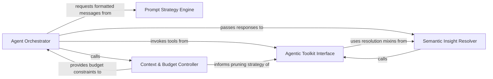

## Details

AI-driven intelligence layer using multi-agent strategies to interpret code clusters and generate architectural patterns.

### Agent Orchestrator
The central control plane that manages the lifecycle of architectural analysis using a Top-Down Reasoning pattern.

**Related Classes/Methods**:

- `agents.agent.CodeBoardingAgent`:35-428
- `agents.meta_agent.MetaAgent`:18-66
- `agents.abstraction_agent.AbstractionAgent`:38-177
- `agents.details_agent.DetailsAgent`:37-251

**Source Files:**

- [`agents/abstraction_agent.py`](https://github.com/CodeBoarding/CodeBoarding/blob/main/.codeboardingagents/abstraction_agent.py)
  - `agents.abstraction_agent.AbstractionAgent.__init__` ([L45-L89](https://github.com/CodeBoarding/CodeBoarding/blob/main/.codeboardingagents/abstraction_agent.py#L45-L89)) - Method
  - `agents.abstraction_agent.AbstractionAgent.step_clusters_grouping` ([L92-L132](https://github.com/CodeBoarding/CodeBoarding/blob/main/.codeboardingagents/abstraction_agent.py#L92-L132)) - Method
  - `agents.abstraction_agent.AbstractionAgent.step_final_analysis` ([L135-L180](https://github.com/CodeBoarding/CodeBoarding/blob/main/.codeboardingagents/abstraction_agent.py#L135-L180)) - Method
  - `agents.abstraction_agent.AbstractionAgent.run` ([L245-L272](https://github.com/CodeBoarding/CodeBoarding/blob/main/.codeboardingagents/abstraction_agent.py#L245-L272)) - Method
- [`agents/agent.py`](https://github.com/CodeBoarding/CodeBoarding/blob/main/.codeboardingagents/agent.py)
  - `agents.agent.EmptyExtractorMessageError` ([L31-L32](https://github.com/CodeBoarding/CodeBoarding/blob/main/.codeboardingagents/agent.py#L31-L32)) - Class
  - `agents.agent.CodeBoardingAgent` ([L35-L432](https://github.com/CodeBoarding/CodeBoarding/blob/main/.codeboardingagents/agent.py#L35-L432)) - Class
  - `agents.agent.CodeBoardingAgent.__init__` ([L36-L59](https://github.com/CodeBoarding/CodeBoarding/blob/main/.codeboardingagents/agent.py#L36-L59)) - Method
  - `agents.agent.CodeBoardingAgent.read_source_reference` ([L62-L63](https://github.com/CodeBoarding/CodeBoarding/blob/main/.codeboardingagents/agent.py#L62-L63)) - Method
  - `agents.agent.CodeBoardingAgent.read_packages_tool` ([L66-L67](https://github.com/CodeBoarding/CodeBoarding/blob/main/.codeboardingagents/agent.py#L66-L67)) - Method
  - `agents.agent.CodeBoardingAgent.read_structure_tool` ([L70-L71](https://github.com/CodeBoarding/CodeBoarding/blob/main/.codeboardingagents/agent.py#L70-L71)) - Method
  - `agents.agent.CodeBoardingAgent.read_file_structure` ([L74-L75](https://github.com/CodeBoarding/CodeBoarding/blob/main/.codeboardingagents/agent.py#L74-L75)) - Method
  - `agents.agent.CodeBoardingAgent.read_cfg_tool` ([L78-L79](https://github.com/CodeBoarding/CodeBoarding/blob/main/.codeboardingagents/agent.py#L78-L79)) - Method
  - `agents.agent.CodeBoardingAgent.read_method_invocations_tool` ([L82-L83](https://github.com/CodeBoarding/CodeBoarding/blob/main/.codeboardingagents/agent.py#L82-L83)) - Method
  - `agents.agent.CodeBoardingAgent.read_file_tool` ([L90-L91](https://github.com/CodeBoarding/CodeBoarding/blob/main/.codeboardingagents/agent.py#L90-L91)) - Method
  - `agents.agent.CodeBoardingAgent.read_docs` ([L94-L95](https://github.com/CodeBoarding/CodeBoarding/blob/main/.codeboardingagents/agent.py#L94-L95)) - Method
  - `agents.agent.CodeBoardingAgent.external_deps_tool` ([L98-L99](https://github.com/CodeBoarding/CodeBoarding/blob/main/.codeboardingagents/agent.py#L98-L99)) - Method
  - `agents.agent.CodeBoardingAgent._invoke` ([L101-L166](https://github.com/CodeBoarding/CodeBoarding/blob/main/.codeboardingagents/agent.py#L101-L166)) - Method
  - `agents.agent.CodeBoardingAgent._invoke.call_once` ([L116-L136](https://github.com/CodeBoarding/CodeBoarding/blob/main/.codeboardingagents/agent.py#L116-L136)) - Function
  - `agents.agent.CodeBoardingAgent._invoke.classify` ([L138-L151](https://github.com/CodeBoarding/CodeBoarding/blob/main/.codeboardingagents/agent.py#L138-L151)) - Function
  - `agents.agent.CodeBoardingAgent._invoke.on_exhausted` ([L153-L158](https://github.com/CodeBoarding/CodeBoarding/blob/main/.codeboardingagents/agent.py#L153-L158)) - Function
  - `agents.agent.CodeBoardingAgent._invoke_with_timeout` ([L168-L206](https://github.com/CodeBoarding/CodeBoarding/blob/main/.codeboardingagents/agent.py#L168-L206)) - Method
  - `agents.agent.CodeBoardingAgent._invoke_with_timeout.invoke_target` ([L176-L184](https://github.com/CodeBoarding/CodeBoarding/blob/main/.codeboardingagents/agent.py#L176-L184)) - Function
  - `agents.agent.CodeBoardingAgent._parse_invoke` ([L208-L211](https://github.com/CodeBoarding/CodeBoarding/blob/main/.codeboardingagents/agent.py#L208-L211)) - Method
  - `agents.agent.CodeBoardingAgent._score_result` ([L213-L238](https://github.com/CodeBoarding/CodeBoarding/blob/main/.codeboardingagents/agent.py#L213-L238)) - Method
  - `agents.agent.CodeBoardingAgent._validation_invoke` ([L240-L335](https://github.com/CodeBoarding/CodeBoarding/blob/main/.codeboardingagents/agent.py#L240-L335)) - Method
  - `agents.agent.CodeBoardingAgent._parse_response` ([L337-L384](https://github.com/CodeBoarding/CodeBoarding/blob/main/.codeboardingagents/agent.py#L337-L384)) - Method
  - `agents.agent.CodeBoardingAgent._parse_response.call_once` ([L352-L359](https://github.com/CodeBoarding/CodeBoarding/blob/main/.codeboardingagents/agent.py#L352-L359)) - Function
  - `agents.agent.CodeBoardingAgent._parse_response.classify` ([L361-L369](https://github.com/CodeBoarding/CodeBoarding/blob/main/.codeboardingagents/agent.py#L361-L369)) - Function
  - `agents.agent.CodeBoardingAgent._parse_response.on_exhausted` ([L371-L376](https://github.com/CodeBoarding/CodeBoarding/blob/main/.codeboardingagents/agent.py#L371-L376)) - Function
  - `agents.agent.CodeBoardingAgent._structured_parse` ([L386-L411](https://github.com/CodeBoarding/CodeBoarding/blob/main/.codeboardingagents/agent.py#L386-L411)) - Method
  - `agents.agent.CodeBoardingAgent._extractor_parse` ([L413-L432](https://github.com/CodeBoarding/CodeBoarding/blob/main/.codeboardingagents/agent.py#L413-L432)) - Method
- [`agents/agent_responses.py`](https://github.com/CodeBoarding/CodeBoarding/blob/main/.codeboardingagents/agent_responses.py)
  - `agents.agent_responses.LLMBaseModel` ([L24-L129](https://github.com/CodeBoarding/CodeBoarding/blob/main/.codeboardingagents/agent_responses.py#L24-L129)) - Class
  - `agents.agent_responses.LLMBaseModel.llm_str` ([L28-L29](https://github.com/CodeBoarding/CodeBoarding/blob/main/.codeboardingagents/agent_responses.py#L28-L29)) - Method
  - `agents.agent_responses.LLMBaseModel._is_field_hidden` ([L32-L38](https://github.com/CodeBoarding/CodeBoarding/blob/main/.codeboardingagents/agent_responses.py#L32-L38)) - Method
  - `agents.agent_responses.LLMBaseModel._excluded_fields` ([L41-L50](https://github.com/CodeBoarding/CodeBoarding/blob/main/.codeboardingagents/agent_responses.py#L41-L50)) - Method
  - `agents.agent_responses.LLMBaseModel._resolve_excluded_by_title` ([L53-L72](https://github.com/CodeBoarding/CodeBoarding/blob/main/.codeboardingagents/agent_responses.py#L53-L72)) - Method
  - `agents.agent_responses.LLMBaseModel._resolve_excluded_by_title.walk` ([L57-L69](https://github.com/CodeBoarding/CodeBoarding/blob/main/.codeboardingagents/agent_responses.py#L57-L69)) - Function
  - `agents.agent_responses.LLMBaseModel._extractor_fields` ([L75-L94](https://github.com/CodeBoarding/CodeBoarding/blob/main/.codeboardingagents/agent_responses.py#L75-L94)) - Method
  - `agents.agent_responses.LLMBaseModel.extractor_str` ([L97-L104](https://github.com/CodeBoarding/CodeBoarding/blob/main/.codeboardingagents/agent_responses.py#L97-L104)) - Method
  - `agents.agent_responses.LLMBaseModel.model_json_schema` ([L107-L129](https://github.com/CodeBoarding/CodeBoarding/blob/main/.codeboardingagents/agent_responses.py#L107-L129)) - Method
  - `agents.agent_responses.SourceCodeReference.__str__` ([L163-L171](https://github.com/CodeBoarding/CodeBoarding/blob/main/.codeboardingagents/agent_responses.py#L163-L171)) - Method
  - `agents.agent_responses.ClustersComponent` ([L382-L430](https://github.com/CodeBoarding/CodeBoarding/blob/main/.codeboardingagents/agent_responses.py#L382-L430)) - Class
  - `agents.agent_responses.ClustersComponent.llm_str` ([L428-L430](https://github.com/CodeBoarding/CodeBoarding/blob/main/.codeboardingagents/agent_responses.py#L428-L430)) - Method
  - `agents.agent_responses.ClusterAnalysis` ([L433-L445](https://github.com/CodeBoarding/CodeBoarding/blob/main/.codeboardingagents/agent_responses.py#L433-L445)) - Class
  - `agents.agent_responses.ClusterAnalysis.llm_str` ([L440-L445](https://github.com/CodeBoarding/CodeBoarding/blob/main/.codeboardingagents/agent_responses.py#L440-L445)) - Method
  - `agents.agent_responses.assign_component_ids` ([L605-L636](https://github.com/CodeBoarding/CodeBoarding/blob/main/.codeboardingagents/agent_responses.py#L605-L636)) - Function
  - `agents.agent_responses.CFGComponent` ([L678-L694](https://github.com/CodeBoarding/CodeBoarding/blob/main/.codeboardingagents/agent_responses.py#L678-L694)) - Class
  - `agents.agent_responses.CFGAnalysisInsights` ([L697-L709](https://github.com/CodeBoarding/CodeBoarding/blob/main/.codeboardingagents/agent_responses.py#L697-L709)) - Class
  - `agents.agent_responses.ExpandComponent` ([L712-L719](https://github.com/CodeBoarding/CodeBoarding/blob/main/.codeboardingagents/agent_responses.py#L712-L719)) - Class
  - `agents.agent_responses.ExpandComponent.llm_str` ([L718-L719](https://github.com/CodeBoarding/CodeBoarding/blob/main/.codeboardingagents/agent_responses.py#L718-L719)) - Method
  - `agents.agent_responses.ValidationInsights` ([L722-L732](https://github.com/CodeBoarding/CodeBoarding/blob/main/.codeboardingagents/agent_responses.py#L722-L732)) - Class
  - `agents.agent_responses.ValidationInsights.llm_str` ([L731-L732](https://github.com/CodeBoarding/CodeBoarding/blob/main/.codeboardingagents/agent_responses.py#L731-L732)) - Method
  - `agents.agent_responses.UpdateAnalysis` ([L735-L744](https://github.com/CodeBoarding/CodeBoarding/blob/main/.codeboardingagents/agent_responses.py#L735-L744)) - Class
  - `agents.agent_responses.UpdateAnalysis.llm_str` ([L743-L744](https://github.com/CodeBoarding/CodeBoarding/blob/main/.codeboardingagents/agent_responses.py#L743-L744)) - Method
  - `agents.agent_responses.MetaAnalysisInsights` ([L747-L773](https://github.com/CodeBoarding/CodeBoarding/blob/main/.codeboardingagents/agent_responses.py#L747-L773)) - Class
  - `agents.agent_responses.MetaAnalysisInsights.llm_str` ([L763-L773](https://github.com/CodeBoarding/CodeBoarding/blob/main/.codeboardingagents/agent_responses.py#L763-L773)) - Method
  - `agents.agent_responses.FileClassification` ([L776-L783](https://github.com/CodeBoarding/CodeBoarding/blob/main/.codeboardingagents/agent_responses.py#L776-L783)) - Class
  - `agents.agent_responses.FileClassification.llm_str` ([L782-L783](https://github.com/CodeBoarding/CodeBoarding/blob/main/.codeboardingagents/agent_responses.py#L782-L783)) - Method
  - `agents.agent_responses.ComponentFiles` ([L786-L798](https://github.com/CodeBoarding/CodeBoarding/blob/main/.codeboardingagents/agent_responses.py#L786-L798)) - Class
  - `agents.agent_responses.ComponentFiles.llm_str` ([L793-L798](https://github.com/CodeBoarding/CodeBoarding/blob/main/.codeboardingagents/agent_responses.py#L793-L798)) - Method
  - `agents.agent_responses.ScopeRelations` ([L801-L809](https://github.com/CodeBoarding/CodeBoarding/blob/main/.codeboardingagents/agent_responses.py#L801-L809)) - Class
  - `agents.agent_responses.ScopeOperationAction` ([L812-L817](https://github.com/CodeBoarding/CodeBoarding/blob/main/.codeboardingagents/agent_responses.py#L812-L817)) - Class
  - `agents.agent_responses.ScopedClusterRef` ([L820-L829](https://github.com/CodeBoarding/CodeBoarding/blob/main/.codeboardingagents/agent_responses.py#L820-L829)) - Class
  - `agents.agent_responses.ScopeOperation` ([L832-L851](https://github.com/CodeBoarding/CodeBoarding/blob/main/.codeboardingagents/agent_responses.py#L832-L851)) - Class
  - `agents.agent_responses.ScopeUpdateDecision` ([L854-L862](https://github.com/CodeBoarding/CodeBoarding/blob/main/.codeboardingagents/agent_responses.py#L854-L862)) - Class
  - `agents.agent_responses.FilePath` ([L865-L879](https://github.com/CodeBoarding/CodeBoarding/blob/main/.codeboardingagents/agent_responses.py#L865-L879)) - Class
  - `agents.agent_responses.FilePath.llm_str` ([L878-L879](https://github.com/CodeBoarding/CodeBoarding/blob/main/.codeboardingagents/agent_responses.py#L878-L879)) - Method
- [`agents/details_agent.py`](https://github.com/CodeBoarding/CodeBoarding/blob/main/.codeboardingagents/details_agent.py)
  - `agents.details_agent.DetailsAgent.__init__` ([L48-L96](https://github.com/CodeBoarding/CodeBoarding/blob/main/.codeboardingagents/details_agent.py#L48-L96)) - Method
  - `agents.details_agent.DetailsAgent.step_clusters_grouping` ([L99-L156](https://github.com/CodeBoarding/CodeBoarding/blob/main/.codeboardingagents/details_agent.py#L99-L156)) - Method
  - `agents.details_agent.DetailsAgent.step_final_analysis` ([L159-L233](https://github.com/CodeBoarding/CodeBoarding/blob/main/.codeboardingagents/details_agent.py#L159-L233)) - Method
  - `agents.details_agent.DetailsAgent.run` ([L299-L363](https://github.com/CodeBoarding/CodeBoarding/blob/main/.codeboardingagents/details_agent.py#L299-L363)) - Method
- [`agents/incremental_agent.py`](https://github.com/CodeBoarding/CodeBoarding/blob/main/.codeboardingagents/incremental_agent.py)
  - `agents.incremental_agent.IncrementalAgent.__init__` ([L44-L58](https://github.com/CodeBoarding/CodeBoarding/blob/main/.codeboardingagents/incremental_agent.py#L44-L58)) - Method
  - `agents.incremental_agent.IncrementalAgent.generate_scope_relations` ([L201-L252](https://github.com/CodeBoarding/CodeBoarding/blob/main/.codeboardingagents/incremental_agent.py#L201-L252)) - Method
  - `agents.incremental_agent.IncrementalAgent.generate_all_scope_relations` ([L255-L275](https://github.com/CodeBoarding/CodeBoarding/blob/main/.codeboardingagents/incremental_agent.py#L255-L275)) - Method
  - `agents.incremental_agent._log_scope_relations_summary` ([L278-L283](https://github.com/CodeBoarding/CodeBoarding/blob/main/.codeboardingagents/incremental_agent.py#L278-L283)) - Function
- [`agents/incremental_planning_agent.py`](https://github.com/CodeBoarding/CodeBoarding/blob/main/.codeboardingagents/incremental_planning_agent.py)
  - `agents.incremental_planning_agent.ScopeOperationValidationContext` ([L41-L44](https://github.com/CodeBoarding/CodeBoarding/blob/main/.codeboardingagents/incremental_planning_agent.py#L41-L44)) - Class
  - `agents.incremental_planning_agent.IncrementalPlanningAgent.__init__` ([L50-L80](https://github.com/CodeBoarding/CodeBoarding/blob/main/.codeboardingagents/incremental_planning_agent.py#L50-L80)) - Method
  - `agents.incremental_planning_agent.IncrementalPlanningAgent.decide_scope_update` ([L82-L118](https://github.com/CodeBoarding/CodeBoarding/blob/main/.codeboardingagents/incremental_planning_agent.py#L82-L118)) - Method
  - `agents.incremental_planning_agent.validate_scope_update_decision` ([L134-L166](https://github.com/CodeBoarding/CodeBoarding/blob/main/.codeboardingagents/incremental_planning_agent.py#L134-L166)) - Function
  - `agents.incremental_planning_agent._cluster_ref_from_scoped_ref` ([L169-L170](https://github.com/CodeBoarding/CodeBoarding/blob/main/.codeboardingagents/incremental_planning_agent.py#L169-L170)) - Function
  - `agents.incremental_planning_agent.format_structural_diff` ([L173-L177](https://github.com/CodeBoarding/CodeBoarding/blob/main/.codeboardingagents/incremental_planning_agent.py#L173-L177)) - Function
  - `agents.incremental_planning_agent._format_language_diff` ([L180-L199](https://github.com/CodeBoarding/CodeBoarding/blob/main/.codeboardingagents/incremental_planning_agent.py#L180-L199)) - Function
  - `agents.incremental_planning_agent._format_member_delta` ([L202-L210](https://github.com/CodeBoarding/CodeBoarding/blob/main/.codeboardingagents/incremental_planning_agent.py#L202-L210)) - Function
  - `agents.incremental_planning_agent._format_new_cluster` ([L213-L219](https://github.com/CodeBoarding/CodeBoarding/blob/main/.codeboardingagents/incremental_planning_agent.py#L213-L219)) - Function
  - `agents.incremental_planning_agent._format_reshape` ([L222-L240](https://github.com/CodeBoarding/CodeBoarding/blob/main/.codeboardingagents/incremental_planning_agent.py#L222-L240)) - Function
  - `agents.incremental_planning_agent._actionable_new_cluster_refs` ([L243-L250](https://github.com/CodeBoarding/CodeBoarding/blob/main/.codeboardingagents/incremental_planning_agent.py#L243-L250)) - Function
  - `agents.incremental_planning_agent._format_scope_components` ([L253-L261](https://github.com/CodeBoarding/CodeBoarding/blob/main/.codeboardingagents/incremental_planning_agent.py#L253-L261)) - Function
  - `agents.incremental_planning_agent._format_component_cluster_ids` ([L264-L265](https://github.com/CodeBoarding/CodeBoarding/blob/main/.codeboardingagents/incremental_planning_agent.py#L264-L265)) - Function
  - `agents.incremental_planning_agent._format_changed_files` ([L268-L277](https://github.com/CodeBoarding/CodeBoarding/blob/main/.codeboardingagents/incremental_planning_agent.py#L268-L277)) - Function
  - `agents.incremental_planning_agent._format_cluster_ref` ([L280-L281](https://github.com/CodeBoarding/CodeBoarding/blob/main/.codeboardingagents/incremental_planning_agent.py#L280-L281)) - Function
  - `agents.incremental_planning_agent._sort_cluster_refs` ([L284-L285](https://github.com/CodeBoarding/CodeBoarding/blob/main/.codeboardingagents/incremental_planning_agent.py#L284-L285)) - Function
  - `agents.incremental_planning_agent._format_cluster_ref_list` ([L288-L291](https://github.com/CodeBoarding/CodeBoarding/blob/main/.codeboardingagents/incremental_planning_agent.py#L288-L291)) - Function
- [`agents/meta_agent.py`](https://github.com/CodeBoarding/CodeBoarding/blob/main/.codeboardingagents/meta_agent.py)
  - `agents.meta_agent.MetaAgent.__init__` ([L20-L48](https://github.com/CodeBoarding/CodeBoarding/blob/main/.codeboardingagents/meta_agent.py#L20-L48)) - Method
  - `agents.meta_agent.MetaAgent.analyze_project_metadata` ([L51-L66](https://github.com/CodeBoarding/CodeBoarding/blob/main/.codeboardingagents/meta_agent.py#L51-L66)) - Method
- [`agents/prompts/__init__.py`](https://github.com/CodeBoarding/CodeBoarding/blob/main/.codeboardingagents/prompts/__init__.py)
  - `agents.prompts.__init__.__getattr__` ([L40-L52](https://github.com/CodeBoarding/CodeBoarding/blob/main/.codeboardingagents/prompts/__init__.py#L40-L52)) - Function
- [`agents/prompts/abstract_prompt_factory.py`](https://github.com/CodeBoarding/CodeBoarding/blob/main/.codeboardingagents/prompts/abstract_prompt_factory.py)
  - `agents.prompts.abstract_prompt_factory.AbstractPromptFactory` ([L10-L77](https://github.com/CodeBoarding/CodeBoarding/blob/main/.codeboardingagents/prompts/abstract_prompt_factory.py#L10-L77)) - Class
  - `agents.prompts.abstract_prompt_factory.AbstractPromptFactory.get_system_message` ([L14-L15](https://github.com/CodeBoarding/CodeBoarding/blob/main/.codeboardingagents/prompts/abstract_prompt_factory.py#L14-L15)) - Method
  - `agents.prompts.abstract_prompt_factory.AbstractPromptFactory.get_cluster_grouping_message` ([L18-L19](https://github.com/CodeBoarding/CodeBoarding/blob/main/.codeboardingagents/prompts/abstract_prompt_factory.py#L18-L19)) - Method
  - `agents.prompts.abstract_prompt_factory.AbstractPromptFactory.get_final_analysis_message` ([L22-L23](https://github.com/CodeBoarding/CodeBoarding/blob/main/.codeboardingagents/prompts/abstract_prompt_factory.py#L22-L23)) - Method
  - `agents.prompts.abstract_prompt_factory.AbstractPromptFactory.get_planner_system_message` ([L26-L27](https://github.com/CodeBoarding/CodeBoarding/blob/main/.codeboardingagents/prompts/abstract_prompt_factory.py#L26-L27)) - Method
  - `agents.prompts.abstract_prompt_factory.AbstractPromptFactory.get_expansion_prompt` ([L30-L31](https://github.com/CodeBoarding/CodeBoarding/blob/main/.codeboardingagents/prompts/abstract_prompt_factory.py#L30-L31)) - Method
  - `agents.prompts.abstract_prompt_factory.AbstractPromptFactory.get_system_meta_analysis_message` ([L34-L35](https://github.com/CodeBoarding/CodeBoarding/blob/main/.codeboardingagents/prompts/abstract_prompt_factory.py#L34-L35)) - Method
  - `agents.prompts.abstract_prompt_factory.AbstractPromptFactory.get_meta_information_prompt` ([L38-L39](https://github.com/CodeBoarding/CodeBoarding/blob/main/.codeboardingagents/prompts/abstract_prompt_factory.py#L38-L39)) - Method
  - `agents.prompts.abstract_prompt_factory.AbstractPromptFactory.get_file_classification_message` ([L42-L43](https://github.com/CodeBoarding/CodeBoarding/blob/main/.codeboardingagents/prompts/abstract_prompt_factory.py#L42-L43)) - Method
  - `agents.prompts.abstract_prompt_factory.AbstractPromptFactory.get_validation_feedback_message` ([L46-L47](https://github.com/CodeBoarding/CodeBoarding/blob/main/.codeboardingagents/prompts/abstract_prompt_factory.py#L46-L47)) - Method
  - `agents.prompts.abstract_prompt_factory.AbstractPromptFactory.get_system_details_message` ([L50-L51](https://github.com/CodeBoarding/CodeBoarding/blob/main/.codeboardingagents/prompts/abstract_prompt_factory.py#L50-L51)) - Method
  - `agents.prompts.abstract_prompt_factory.AbstractPromptFactory.get_cfg_details_message` ([L54-L55](https://github.com/CodeBoarding/CodeBoarding/blob/main/.codeboardingagents/prompts/abstract_prompt_factory.py#L54-L55)) - Method
  - `agents.prompts.abstract_prompt_factory.AbstractPromptFactory.get_details_message` ([L58-L59](https://github.com/CodeBoarding/CodeBoarding/blob/main/.codeboardingagents/prompts/abstract_prompt_factory.py#L58-L59)) - Method
  - `agents.prompts.abstract_prompt_factory.AbstractPromptFactory.get_incremental_grouping_message` ([L62-L63](https://github.com/CodeBoarding/CodeBoarding/blob/main/.codeboardingagents/prompts/abstract_prompt_factory.py#L62-L63)) - Method
  - `agents.prompts.abstract_prompt_factory.AbstractPromptFactory.get_planning_message` ([L66-L67](https://github.com/CodeBoarding/CodeBoarding/blob/main/.codeboardingagents/prompts/abstract_prompt_factory.py#L66-L67)) - Method
  - `agents.prompts.abstract_prompt_factory.AbstractPromptFactory.get_scope_relations_message` ([L70-L71](https://github.com/CodeBoarding/CodeBoarding/blob/main/.codeboardingagents/prompts/abstract_prompt_factory.py#L70-L71)) - Method
- [`agents/prompts/prompt_factory.py`](https://github.com/CodeBoarding/CodeBoarding/blob/main/.codeboardingagents/prompts/prompt_factory.py)
  - `agents.prompts.prompt_factory.LLMType` ([L20-L46](https://github.com/CodeBoarding/CodeBoarding/blob/main/.codeboardingagents/prompts/prompt_factory.py#L20-L46)) - Class
  - `agents.prompts.prompt_factory.PromptFactory` ([L49-L99](https://github.com/CodeBoarding/CodeBoarding/blob/main/.codeboardingagents/prompts/prompt_factory.py#L49-L99)) - Class
  - `agents.prompts.prompt_factory.initialize_global_factory` ([L106-L111](https://github.com/CodeBoarding/CodeBoarding/blob/main/.codeboardingagents/prompts/prompt_factory.py#L106-L111)) - Function
  - `agents.prompts.prompt_factory.get_global_factory` ([L114-L121](https://github.com/CodeBoarding/CodeBoarding/blob/main/.codeboardingagents/prompts/prompt_factory.py#L114-L121)) - Function
  - `agents.prompts.prompt_factory.get_prompt` ([L124-L126](https://github.com/CodeBoarding/CodeBoarding/blob/main/.codeboardingagents/prompts/prompt_factory.py#L124-L126)) - Function
  - `agents.prompts.prompt_factory.get_system_message` ([L130-L131](https://github.com/CodeBoarding/CodeBoarding/blob/main/.codeboardingagents/prompts/prompt_factory.py#L130-L131)) - Function
  - `agents.prompts.prompt_factory.get_cluster_grouping_message` ([L134-L135](https://github.com/CodeBoarding/CodeBoarding/blob/main/.codeboardingagents/prompts/prompt_factory.py#L134-L135)) - Function
  - `agents.prompts.prompt_factory.get_final_analysis_message` ([L138-L139](https://github.com/CodeBoarding/CodeBoarding/blob/main/.codeboardingagents/prompts/prompt_factory.py#L138-L139)) - Function
  - `agents.prompts.prompt_factory.get_planner_system_message` ([L142-L143](https://github.com/CodeBoarding/CodeBoarding/blob/main/.codeboardingagents/prompts/prompt_factory.py#L142-L143)) - Function
  - `agents.prompts.prompt_factory.get_expansion_prompt` ([L146-L147](https://github.com/CodeBoarding/CodeBoarding/blob/main/.codeboardingagents/prompts/prompt_factory.py#L146-L147)) - Function
  - `agents.prompts.prompt_factory.get_system_meta_analysis_message` ([L150-L151](https://github.com/CodeBoarding/CodeBoarding/blob/main/.codeboardingagents/prompts/prompt_factory.py#L150-L151)) - Function
  - `agents.prompts.prompt_factory.get_meta_information_prompt` ([L154-L155](https://github.com/CodeBoarding/CodeBoarding/blob/main/.codeboardingagents/prompts/prompt_factory.py#L154-L155)) - Function
  - `agents.prompts.prompt_factory.get_file_classification_message` ([L158-L159](https://github.com/CodeBoarding/CodeBoarding/blob/main/.codeboardingagents/prompts/prompt_factory.py#L158-L159)) - Function
  - `agents.prompts.prompt_factory.get_validation_feedback_message` ([L162-L163](https://github.com/CodeBoarding/CodeBoarding/blob/main/.codeboardingagents/prompts/prompt_factory.py#L162-L163)) - Function
  - `agents.prompts.prompt_factory.get_system_details_message` ([L166-L167](https://github.com/CodeBoarding/CodeBoarding/blob/main/.codeboardingagents/prompts/prompt_factory.py#L166-L167)) - Function
  - `agents.prompts.prompt_factory.get_cfg_details_message` ([L170-L171](https://github.com/CodeBoarding/CodeBoarding/blob/main/.codeboardingagents/prompts/prompt_factory.py#L170-L171)) - Function
  - `agents.prompts.prompt_factory.get_details_message` ([L174-L175](https://github.com/CodeBoarding/CodeBoarding/blob/main/.codeboardingagents/prompts/prompt_factory.py#L174-L175)) - Function
  - `agents.prompts.prompt_factory.get_incremental_grouping_message` ([L178-L179](https://github.com/CodeBoarding/CodeBoarding/blob/main/.codeboardingagents/prompts/prompt_factory.py#L178-L179)) - Function
  - `agents.prompts.prompt_factory.get_planning_message` ([L182-L183](https://github.com/CodeBoarding/CodeBoarding/blob/main/.codeboardingagents/prompts/prompt_factory.py#L182-L183)) - Function
  - `agents.prompts.prompt_factory.get_scope_relations_message` ([L186-L187](https://github.com/CodeBoarding/CodeBoarding/blob/main/.codeboardingagents/prompts/prompt_factory.py#L186-L187)) - Function
- [`agents/retry.py`](https://github.com/CodeBoarding/CodeBoarding/blob/main/.codeboardingagents/retry.py)
  - `agents.retry.RetryAction` ([L41-L44](https://github.com/CodeBoarding/CodeBoarding/blob/main/.codeboardingagents/retry.py#L41-L44)) - Class
  - `agents.retry.RetryDecision` ([L48-L55](https://github.com/CodeBoarding/CodeBoarding/blob/main/.codeboardingagents/retry.py#L48-L55)) - Class
  - `agents.retry.default_backoff` ([L58-L61](https://github.com/CodeBoarding/CodeBoarding/blob/main/.codeboardingagents/retry.py#L58-L61)) - Function
  - `agents.retry._default_classify` ([L64-L65](https://github.com/CodeBoarding/CodeBoarding/blob/main/.codeboardingagents/retry.py#L64-L65)) - Function
  - `agents.retry.with_retries` ([L68-L118](https://github.com/CodeBoarding/CodeBoarding/blob/main/.codeboardingagents/retry.py#L68-L118)) - Function
- [`agents/tools/base.py`](https://github.com/CodeBoarding/CodeBoarding/blob/main/.codeboardingagents/tools/base.py)
  - `agents.tools.base.RepoContext` ([L13-L61](https://github.com/CodeBoarding/CodeBoarding/blob/main/.codeboardingagents/tools/base.py#L13-L61)) - Class
- [`agents/tools/toolkit.py`](https://github.com/CodeBoarding/CodeBoarding/blob/main/.codeboardingagents/tools/toolkit.py)
  - `agents.tools.toolkit.CodeBoardingToolkit` ([L21-L128](https://github.com/CodeBoarding/CodeBoarding/blob/main/.codeboardingagents/tools/toolkit.py#L21-L128)) - Class
- [`agents/validation.py`](https://github.com/CodeBoarding/CodeBoarding/blob/main/.codeboardingagents/validation.py)
  - `agents.validation.ValidationContext` ([L43-L59](https://github.com/CodeBoarding/CodeBoarding/blob/main/.codeboardingagents/validation.py#L43-L59)) - Class
  - `agents.validation.ValidationResult` ([L63-L68](https://github.com/CodeBoarding/CodeBoarding/blob/main/.codeboardingagents/validation.py#L63-L68)) - Class
  - `agents.validation.score_validation_results` ([L82-L101](https://github.com/CodeBoarding/CodeBoarding/blob/main/.codeboardingagents/validation.py#L82-L101)) - Function
  - `agents.validation.validate_cluster_coverage` ([L104-L168](https://github.com/CodeBoarding/CodeBoarding/blob/main/.codeboardingagents/validation.py#L104-L168)) - Function
  - `agents.validation.validate_existing_component_ids` ([L171-L203](https://github.com/CodeBoarding/CodeBoarding/blob/main/.codeboardingagents/validation.py#L171-L203)) - Function
  - `agents.validation._normalize_group_name` ([L206-L213](https://github.com/CodeBoarding/CodeBoarding/blob/main/.codeboardingagents/validation.py#L206-L213)) - Function
  - `agents.validation._fuzzy_match_group_name` ([L216-L234](https://github.com/CodeBoarding/CodeBoarding/blob/main/.codeboardingagents/validation.py#L216-L234)) - Function
  - `agents.validation._auto_correct_group_names` ([L237-L283](https://github.com/CodeBoarding/CodeBoarding/blob/main/.codeboardingagents/validation.py#L237-L283)) - Function
  - `agents.validation.validate_group_name_coverage` ([L286-L378](https://github.com/CodeBoarding/CodeBoarding/blob/main/.codeboardingagents/validation.py#L286-L378)) - Function
  - `agents.validation.validate_key_entities` ([L381-L470](https://github.com/CodeBoarding/CodeBoarding/blob/main/.codeboardingagents/validation.py#L381-L470)) - Function
  - `agents.validation.validate_relation_component_names` ([L536-L584](https://github.com/CodeBoarding/CodeBoarding/blob/main/.codeboardingagents/validation.py#L536-L584)) - Function
  - `agents.validation.validate_scope_relation_names` ([L719-L745](https://github.com/CodeBoarding/CodeBoarding/blob/main/.codeboardingagents/validation.py#L719-L745)) - Function
- [`caching/cache.py`](https://github.com/CodeBoarding/CodeBoarding/blob/main/.codeboardingcaching/cache.py)
  - `caching.cache.BaseCache.__init__` ([L36-L63](https://github.com/CodeBoarding/CodeBoarding/blob/main/.codeboardingcaching/cache.py#L36-L63)) - Method
  - `caching.cache.BaseCache._open_sqlite` ([L65-L73](https://github.com/CodeBoarding/CodeBoarding/blob/main/.codeboardingcaching/cache.py#L65-L73)) - Method
  - `caching.cache.BaseCache._configure_sqlite_connection` ([L76-L83](https://github.com/CodeBoarding/CodeBoarding/blob/main/.codeboardingcaching/cache.py#L76-L83)) - Method
  - `caching.cache.BaseCache._open_sqlite_unlocked` ([L85-L119](https://github.com/CodeBoarding/CodeBoarding/blob/main/.codeboardingcaching/cache.py#L85-L119)) - Method
  - `caching.cache.BaseCache._reset_if_incompatible_schema` ([L121-L135](https://github.com/CodeBoarding/CodeBoarding/blob/main/.codeboardingcaching/cache.py#L121-L135)) - Method
  - `caching.cache.BaseCache.signature` ([L137-L139](https://github.com/CodeBoarding/CodeBoarding/blob/main/.codeboardingcaching/cache.py#L137-L139)) - Method
  - `caching.cache.BaseCache._lookup` ([L141-L157](https://github.com/CodeBoarding/CodeBoarding/blob/main/.codeboardingcaching/cache.py#L141-L157)) - Method
  - `caching.cache.BaseCache._upsert_conn` ([L159-L174](https://github.com/CodeBoarding/CodeBoarding/blob/main/.codeboardingcaching/cache.py#L159-L174)) - Method
  - `caching.cache.BaseCache._clear_conn` ([L176-L183](https://github.com/CodeBoarding/CodeBoarding/blob/main/.codeboardingcaching/cache.py#L176-L183)) - Method
  - `caching.cache.BaseCache.load` ([L185-L197](https://github.com/CodeBoarding/CodeBoarding/blob/main/.codeboardingcaching/cache.py#L185-L197)) - Method
  - `caching.cache.BaseCache.store` ([L199-L216](https://github.com/CodeBoarding/CodeBoarding/blob/main/.codeboardingcaching/cache.py#L199-L216)) - Method
  - `caching.cache.BaseCache.clear` ([L218-L229](https://github.com/CodeBoarding/CodeBoarding/blob/main/.codeboardingcaching/cache.py#L218-L229)) - Method
  - `caching.cache.BaseCache.load_most_recent_run` ([L231-L257](https://github.com/CodeBoarding/CodeBoarding/blob/main/.codeboardingcaching/cache.py#L231-L257)) - Method
- [`caching/details_cache.py`](https://github.com/CodeBoarding/CodeBoarding/blob/main/.codeboardingcaching/details_cache.py)
  - `caching.details_cache.DetailsCacheKey` ([L12-L15](https://github.com/CodeBoarding/CodeBoarding/blob/main/.codeboardingcaching/details_cache.py#L12-L15)) - Class
  - `caching.details_cache.FinalAnalysisCache` ([L18-L34](https://github.com/CodeBoarding/CodeBoarding/blob/main/.codeboardingcaching/details_cache.py#L18-L34)) - Class
  - `caching.details_cache.FinalAnalysisCache.__init__` ([L24-L30](https://github.com/CodeBoarding/CodeBoarding/blob/main/.codeboardingcaching/details_cache.py#L24-L30)) - Method
  - `caching.details_cache.FinalAnalysisCache.build_key` ([L33-L34](https://github.com/CodeBoarding/CodeBoarding/blob/main/.codeboardingcaching/details_cache.py#L33-L34)) - Method
  - `caching.details_cache.ClusterCache` ([L37-L53](https://github.com/CodeBoarding/CodeBoarding/blob/main/.codeboardingcaching/details_cache.py#L37-L53)) - Class
  - `caching.details_cache.ClusterCache.__init__` ([L43-L49](https://github.com/CodeBoarding/CodeBoarding/blob/main/.codeboardingcaching/details_cache.py#L43-L49)) - Method
  - `caching.details_cache.ClusterCache.build_key` ([L52-L53](https://github.com/CodeBoarding/CodeBoarding/blob/main/.codeboardingcaching/details_cache.py#L52-L53)) - Method
  - `caching.details_cache.prune_details_caches` ([L56-L58](https://github.com/CodeBoarding/CodeBoarding/blob/main/.codeboardingcaching/details_cache.py#L56-L58)) - Function
- [`caching/meta_cache.py`](https://github.com/CodeBoarding/CodeBoarding/blob/main/.codeboardingcaching/meta_cache.py)
  - `caching.meta_cache.MetaCache` ([L40-L111](https://github.com/CodeBoarding/CodeBoarding/blob/main/.codeboardingcaching/meta_cache.py#L40-L111)) - Class
  - `caching.meta_cache.MetaCache.__init__` ([L46-L55](https://github.com/CodeBoarding/CodeBoarding/blob/main/.codeboardingcaching/meta_cache.py#L46-L55)) - Method
- [`diagram_analysis/run_context.py`](https://github.com/CodeBoarding/CodeBoarding/blob/main/.codeboardingdiagram_analysis/run_context.py)
  - `diagram_analysis.run_context.RunContext` ([L22-L49](https://github.com/CodeBoarding/CodeBoarding/blob/main/.codeboardingdiagram_analysis/run_context.py#L22-L49)) - Class
  - `diagram_analysis.run_context._load_existing_run_id` ([L52-L69](https://github.com/CodeBoarding/CodeBoarding/blob/main/.codeboardingdiagram_analysis/run_context.py#L52-L69)) - Function
- [`monitoring/context.py`](https://github.com/CodeBoarding/CodeBoarding/blob/main/.codeboardingmonitoring/context.py)
  - `monitoring.context.monitor_execution.DummyContext.end_step` ([L36-L37](https://github.com/CodeBoarding/CodeBoarding/blob/main/.codeboardingmonitoring/context.py#L36-L37)) - Method
  - `monitoring.context.monitor_execution.MonitorContext.__init__` ([L74-L75](https://github.com/CodeBoarding/CodeBoarding/blob/main/.codeboardingmonitoring/context.py#L74-L75)) - Method
  - `monitoring.context.trace` ([L131-L173](https://github.com/CodeBoarding/CodeBoarding/blob/main/.codeboardingmonitoring/context.py#L131-L173)) - Function
  - `monitoring.context.trace._create_wrapper` ([L139-L161](https://github.com/CodeBoarding/CodeBoarding/blob/main/.codeboardingmonitoring/context.py#L139-L161)) - Function
  - `monitoring.context.trace._create_wrapper.wrapper` ([L141-L159](https://github.com/CodeBoarding/CodeBoarding/blob/main/.codeboardingmonitoring/context.py#L141-L159)) - Function
  - `monitoring.context.trace.decorator` ([L169-L171](https://github.com/CodeBoarding/CodeBoarding/blob/main/.codeboardingmonitoring/context.py#L169-L171)) - Function

### Prompt Strategy Engine
A model-agnostic interface using the Factory pattern to generate optimized prompts for various LLM providers.

**Related Classes/Methods**:

- `agents.prompts.prompt_factory.PromptFactory`:49-99
- `agents.prompts.abstract_prompt_factory.AbstractPromptFactory`:10-71
- `agents.prompts.claude_prompts.ClaudePromptFactory`:436-491

**Source Files:**

- [`agents/prompts/claude_prompts.py`](https://github.com/CodeBoarding/CodeBoarding/blob/main/.codeboardingagents/prompts/claude_prompts.py)
  - `agents.prompts.claude_prompts.ClaudePromptFactory` ([L436-L491](https://github.com/CodeBoarding/CodeBoarding/blob/main/.codeboardingagents/prompts/claude_prompts.py#L436-L491)) - Class
  - `agents.prompts.claude_prompts.ClaudePromptFactory.get_system_message` ([L439-L440](https://github.com/CodeBoarding/CodeBoarding/blob/main/.codeboardingagents/prompts/claude_prompts.py#L439-L440)) - Method
  - `agents.prompts.claude_prompts.ClaudePromptFactory.get_cluster_grouping_message` ([L442-L443](https://github.com/CodeBoarding/CodeBoarding/blob/main/.codeboardingagents/prompts/claude_prompts.py#L442-L443)) - Method
  - `agents.prompts.claude_prompts.ClaudePromptFactory.get_final_analysis_message` ([L445-L446](https://github.com/CodeBoarding/CodeBoarding/blob/main/.codeboardingagents/prompts/claude_prompts.py#L445-L446)) - Method
  - `agents.prompts.claude_prompts.ClaudePromptFactory.get_planner_system_message` ([L448-L449](https://github.com/CodeBoarding/CodeBoarding/blob/main/.codeboardingagents/prompts/claude_prompts.py#L448-L449)) - Method
  - `agents.prompts.claude_prompts.ClaudePromptFactory.get_expansion_prompt` ([L451-L452](https://github.com/CodeBoarding/CodeBoarding/blob/main/.codeboardingagents/prompts/claude_prompts.py#L451-L452)) - Method
  - `agents.prompts.claude_prompts.ClaudePromptFactory.get_validator_system_message` ([L454-L455](https://github.com/CodeBoarding/CodeBoarding/blob/main/.codeboardingagents/prompts/claude_prompts.py#L454-L455)) - Method
  - `agents.prompts.claude_prompts.ClaudePromptFactory.get_component_validation_component` ([L457-L458](https://github.com/CodeBoarding/CodeBoarding/blob/main/.codeboardingagents/prompts/claude_prompts.py#L457-L458)) - Method
  - `agents.prompts.claude_prompts.ClaudePromptFactory.get_relationships_validation` ([L460-L461](https://github.com/CodeBoarding/CodeBoarding/blob/main/.codeboardingagents/prompts/claude_prompts.py#L460-L461)) - Method
  - `agents.prompts.claude_prompts.ClaudePromptFactory.get_system_meta_analysis_message` ([L463-L464](https://github.com/CodeBoarding/CodeBoarding/blob/main/.codeboardingagents/prompts/claude_prompts.py#L463-L464)) - Method
  - `agents.prompts.claude_prompts.ClaudePromptFactory.get_meta_information_prompt` ([L466-L467](https://github.com/CodeBoarding/CodeBoarding/blob/main/.codeboardingagents/prompts/claude_prompts.py#L466-L467)) - Method
  - `agents.prompts.claude_prompts.ClaudePromptFactory.get_file_classification_message` ([L469-L470](https://github.com/CodeBoarding/CodeBoarding/blob/main/.codeboardingagents/prompts/claude_prompts.py#L469-L470)) - Method
  - `agents.prompts.claude_prompts.ClaudePromptFactory.get_validation_feedback_message` ([L472-L473](https://github.com/CodeBoarding/CodeBoarding/blob/main/.codeboardingagents/prompts/claude_prompts.py#L472-L473)) - Method
  - `agents.prompts.claude_prompts.ClaudePromptFactory.get_system_details_message` ([L475-L476](https://github.com/CodeBoarding/CodeBoarding/blob/main/.codeboardingagents/prompts/claude_prompts.py#L475-L476)) - Method
  - `agents.prompts.claude_prompts.ClaudePromptFactory.get_cfg_details_message` ([L478-L479](https://github.com/CodeBoarding/CodeBoarding/blob/main/.codeboardingagents/prompts/claude_prompts.py#L478-L479)) - Method
  - `agents.prompts.claude_prompts.ClaudePromptFactory.get_incremental_grouping_message` ([L481-L482](https://github.com/CodeBoarding/CodeBoarding/blob/main/.codeboardingagents/prompts/claude_prompts.py#L481-L482)) - Method
  - `agents.prompts.claude_prompts.ClaudePromptFactory.get_planning_message` ([L484-L485](https://github.com/CodeBoarding/CodeBoarding/blob/main/.codeboardingagents/prompts/claude_prompts.py#L484-L485)) - Method
  - `agents.prompts.claude_prompts.ClaudePromptFactory.get_scope_relations_message` ([L487-L488](https://github.com/CodeBoarding/CodeBoarding/blob/main/.codeboardingagents/prompts/claude_prompts.py#L487-L488)) - Method
  - `agents.prompts.claude_prompts.ClaudePromptFactory.get_details_message` ([L490-L491](https://github.com/CodeBoarding/CodeBoarding/blob/main/.codeboardingagents/prompts/claude_prompts.py#L490-L491)) - Method
- [`agents/prompts/deepseek_prompts.py`](https://github.com/CodeBoarding/CodeBoarding/blob/main/.codeboardingagents/prompts/deepseek_prompts.py)
  - `agents.prompts.deepseek_prompts.DeepSeekPromptFactory` ([L439-L494](https://github.com/CodeBoarding/CodeBoarding/blob/main/.codeboardingagents/prompts/deepseek_prompts.py#L439-L494)) - Class
  - `agents.prompts.deepseek_prompts.DeepSeekPromptFactory.get_system_message` ([L442-L443](https://github.com/CodeBoarding/CodeBoarding/blob/main/.codeboardingagents/prompts/deepseek_prompts.py#L442-L443)) - Method
  - `agents.prompts.deepseek_prompts.DeepSeekPromptFactory.get_cluster_grouping_message` ([L445-L446](https://github.com/CodeBoarding/CodeBoarding/blob/main/.codeboardingagents/prompts/deepseek_prompts.py#L445-L446)) - Method
  - `agents.prompts.deepseek_prompts.DeepSeekPromptFactory.get_final_analysis_message` ([L448-L449](https://github.com/CodeBoarding/CodeBoarding/blob/main/.codeboardingagents/prompts/deepseek_prompts.py#L448-L449)) - Method
  - `agents.prompts.deepseek_prompts.DeepSeekPromptFactory.get_planner_system_message` ([L451-L452](https://github.com/CodeBoarding/CodeBoarding/blob/main/.codeboardingagents/prompts/deepseek_prompts.py#L451-L452)) - Method
  - `agents.prompts.deepseek_prompts.DeepSeekPromptFactory.get_expansion_prompt` ([L454-L455](https://github.com/CodeBoarding/CodeBoarding/blob/main/.codeboardingagents/prompts/deepseek_prompts.py#L454-L455)) - Method
  - `agents.prompts.deepseek_prompts.DeepSeekPromptFactory.get_validator_system_message` ([L457-L458](https://github.com/CodeBoarding/CodeBoarding/blob/main/.codeboardingagents/prompts/deepseek_prompts.py#L457-L458)) - Method
  - `agents.prompts.deepseek_prompts.DeepSeekPromptFactory.get_component_validation_component` ([L460-L461](https://github.com/CodeBoarding/CodeBoarding/blob/main/.codeboardingagents/prompts/deepseek_prompts.py#L460-L461)) - Method
  - `agents.prompts.deepseek_prompts.DeepSeekPromptFactory.get_relationships_validation` ([L463-L464](https://github.com/CodeBoarding/CodeBoarding/blob/main/.codeboardingagents/prompts/deepseek_prompts.py#L463-L464)) - Method
  - `agents.prompts.deepseek_prompts.DeepSeekPromptFactory.get_system_meta_analysis_message` ([L466-L467](https://github.com/CodeBoarding/CodeBoarding/blob/main/.codeboardingagents/prompts/deepseek_prompts.py#L466-L467)) - Method
  - `agents.prompts.deepseek_prompts.DeepSeekPromptFactory.get_meta_information_prompt` ([L469-L470](https://github.com/CodeBoarding/CodeBoarding/blob/main/.codeboardingagents/prompts/deepseek_prompts.py#L469-L470)) - Method
  - `agents.prompts.deepseek_prompts.DeepSeekPromptFactory.get_file_classification_message` ([L472-L473](https://github.com/CodeBoarding/CodeBoarding/blob/main/.codeboardingagents/prompts/deepseek_prompts.py#L472-L473)) - Method
  - `agents.prompts.deepseek_prompts.DeepSeekPromptFactory.get_validation_feedback_message` ([L475-L476](https://github.com/CodeBoarding/CodeBoarding/blob/main/.codeboardingagents/prompts/deepseek_prompts.py#L475-L476)) - Method
  - `agents.prompts.deepseek_prompts.DeepSeekPromptFactory.get_system_details_message` ([L478-L479](https://github.com/CodeBoarding/CodeBoarding/blob/main/.codeboardingagents/prompts/deepseek_prompts.py#L478-L479)) - Method
  - `agents.prompts.deepseek_prompts.DeepSeekPromptFactory.get_cfg_details_message` ([L481-L482](https://github.com/CodeBoarding/CodeBoarding/blob/main/.codeboardingagents/prompts/deepseek_prompts.py#L481-L482)) - Method
  - `agents.prompts.deepseek_prompts.DeepSeekPromptFactory.get_details_message` ([L484-L485](https://github.com/CodeBoarding/CodeBoarding/blob/main/.codeboardingagents/prompts/deepseek_prompts.py#L484-L485)) - Method
  - `agents.prompts.deepseek_prompts.DeepSeekPromptFactory.get_incremental_grouping_message` ([L487-L488](https://github.com/CodeBoarding/CodeBoarding/blob/main/.codeboardingagents/prompts/deepseek_prompts.py#L487-L488)) - Method
  - `agents.prompts.deepseek_prompts.DeepSeekPromptFactory.get_planning_message` ([L490-L491](https://github.com/CodeBoarding/CodeBoarding/blob/main/.codeboardingagents/prompts/deepseek_prompts.py#L490-L491)) - Method
  - `agents.prompts.deepseek_prompts.DeepSeekPromptFactory.get_scope_relations_message` ([L493-L494](https://github.com/CodeBoarding/CodeBoarding/blob/main/.codeboardingagents/prompts/deepseek_prompts.py#L493-L494)) - Method
- [`agents/prompts/gemini_flash_prompts.py`](https://github.com/CodeBoarding/CodeBoarding/blob/main/.codeboardingagents/prompts/gemini_flash_prompts.py)
  - `agents.prompts.gemini_flash_prompts.GeminiFlashPromptFactory` ([L392-L447](https://github.com/CodeBoarding/CodeBoarding/blob/main/.codeboardingagents/prompts/gemini_flash_prompts.py#L392-L447)) - Class
  - `agents.prompts.gemini_flash_prompts.GeminiFlashPromptFactory.get_system_message` ([L395-L396](https://github.com/CodeBoarding/CodeBoarding/blob/main/.codeboardingagents/prompts/gemini_flash_prompts.py#L395-L396)) - Method
  - `agents.prompts.gemini_flash_prompts.GeminiFlashPromptFactory.get_cluster_grouping_message` ([L398-L399](https://github.com/CodeBoarding/CodeBoarding/blob/main/.codeboardingagents/prompts/gemini_flash_prompts.py#L398-L399)) - Method
  - `agents.prompts.gemini_flash_prompts.GeminiFlashPromptFactory.get_final_analysis_message` ([L401-L402](https://github.com/CodeBoarding/CodeBoarding/blob/main/.codeboardingagents/prompts/gemini_flash_prompts.py#L401-L402)) - Method
  - `agents.prompts.gemini_flash_prompts.GeminiFlashPromptFactory.get_planner_system_message` ([L404-L405](https://github.com/CodeBoarding/CodeBoarding/blob/main/.codeboardingagents/prompts/gemini_flash_prompts.py#L404-L405)) - Method
  - `agents.prompts.gemini_flash_prompts.GeminiFlashPromptFactory.get_expansion_prompt` ([L407-L408](https://github.com/CodeBoarding/CodeBoarding/blob/main/.codeboardingagents/prompts/gemini_flash_prompts.py#L407-L408)) - Method
  - `agents.prompts.gemini_flash_prompts.GeminiFlashPromptFactory.get_validator_system_message` ([L410-L411](https://github.com/CodeBoarding/CodeBoarding/blob/main/.codeboardingagents/prompts/gemini_flash_prompts.py#L410-L411)) - Method
  - `agents.prompts.gemini_flash_prompts.GeminiFlashPromptFactory.get_component_validation_component` ([L413-L414](https://github.com/CodeBoarding/CodeBoarding/blob/main/.codeboardingagents/prompts/gemini_flash_prompts.py#L413-L414)) - Method
  - `agents.prompts.gemini_flash_prompts.GeminiFlashPromptFactory.get_relationships_validation` ([L416-L417](https://github.com/CodeBoarding/CodeBoarding/blob/main/.codeboardingagents/prompts/gemini_flash_prompts.py#L416-L417)) - Method
  - `agents.prompts.gemini_flash_prompts.GeminiFlashPromptFactory.get_system_meta_analysis_message` ([L419-L420](https://github.com/CodeBoarding/CodeBoarding/blob/main/.codeboardingagents/prompts/gemini_flash_prompts.py#L419-L420)) - Method
  - `agents.prompts.gemini_flash_prompts.GeminiFlashPromptFactory.get_meta_information_prompt` ([L422-L423](https://github.com/CodeBoarding/CodeBoarding/blob/main/.codeboardingagents/prompts/gemini_flash_prompts.py#L422-L423)) - Method
  - `agents.prompts.gemini_flash_prompts.GeminiFlashPromptFactory.get_file_classification_message` ([L425-L426](https://github.com/CodeBoarding/CodeBoarding/blob/main/.codeboardingagents/prompts/gemini_flash_prompts.py#L425-L426)) - Method
  - `agents.prompts.gemini_flash_prompts.GeminiFlashPromptFactory.get_validation_feedback_message` ([L428-L429](https://github.com/CodeBoarding/CodeBoarding/blob/main/.codeboardingagents/prompts/gemini_flash_prompts.py#L428-L429)) - Method
  - `agents.prompts.gemini_flash_prompts.GeminiFlashPromptFactory.get_system_details_message` ([L431-L432](https://github.com/CodeBoarding/CodeBoarding/blob/main/.codeboardingagents/prompts/gemini_flash_prompts.py#L431-L432)) - Method
  - `agents.prompts.gemini_flash_prompts.GeminiFlashPromptFactory.get_cfg_details_message` ([L434-L435](https://github.com/CodeBoarding/CodeBoarding/blob/main/.codeboardingagents/prompts/gemini_flash_prompts.py#L434-L435)) - Method
  - `agents.prompts.gemini_flash_prompts.GeminiFlashPromptFactory.get_details_message` ([L437-L438](https://github.com/CodeBoarding/CodeBoarding/blob/main/.codeboardingagents/prompts/gemini_flash_prompts.py#L437-L438)) - Method
  - `agents.prompts.gemini_flash_prompts.GeminiFlashPromptFactory.get_incremental_grouping_message` ([L440-L441](https://github.com/CodeBoarding/CodeBoarding/blob/main/.codeboardingagents/prompts/gemini_flash_prompts.py#L440-L441)) - Method
  - `agents.prompts.gemini_flash_prompts.GeminiFlashPromptFactory.get_planning_message` ([L443-L444](https://github.com/CodeBoarding/CodeBoarding/blob/main/.codeboardingagents/prompts/gemini_flash_prompts.py#L443-L444)) - Method
  - `agents.prompts.gemini_flash_prompts.GeminiFlashPromptFactory.get_scope_relations_message` ([L446-L447](https://github.com/CodeBoarding/CodeBoarding/blob/main/.codeboardingagents/prompts/gemini_flash_prompts.py#L446-L447)) - Method
- [`agents/prompts/glm_prompts.py`](https://github.com/CodeBoarding/CodeBoarding/blob/main/.codeboardingagents/prompts/glm_prompts.py)
  - `agents.prompts.glm_prompts.GLMPromptFactory` ([L470-L525](https://github.com/CodeBoarding/CodeBoarding/blob/main/.codeboardingagents/prompts/glm_prompts.py#L470-L525)) - Class
  - `agents.prompts.glm_prompts.GLMPromptFactory.get_system_message` ([L473-L474](https://github.com/CodeBoarding/CodeBoarding/blob/main/.codeboardingagents/prompts/glm_prompts.py#L473-L474)) - Method
  - `agents.prompts.glm_prompts.GLMPromptFactory.get_cluster_grouping_message` ([L476-L477](https://github.com/CodeBoarding/CodeBoarding/blob/main/.codeboardingagents/prompts/glm_prompts.py#L476-L477)) - Method
  - `agents.prompts.glm_prompts.GLMPromptFactory.get_final_analysis_message` ([L479-L480](https://github.com/CodeBoarding/CodeBoarding/blob/main/.codeboardingagents/prompts/glm_prompts.py#L479-L480)) - Method
  - `agents.prompts.glm_prompts.GLMPromptFactory.get_planner_system_message` ([L482-L483](https://github.com/CodeBoarding/CodeBoarding/blob/main/.codeboardingagents/prompts/glm_prompts.py#L482-L483)) - Method
  - `agents.prompts.glm_prompts.GLMPromptFactory.get_expansion_prompt` ([L485-L486](https://github.com/CodeBoarding/CodeBoarding/blob/main/.codeboardingagents/prompts/glm_prompts.py#L485-L486)) - Method
  - `agents.prompts.glm_prompts.GLMPromptFactory.get_validator_system_message` ([L488-L489](https://github.com/CodeBoarding/CodeBoarding/blob/main/.codeboardingagents/prompts/glm_prompts.py#L488-L489)) - Method
  - `agents.prompts.glm_prompts.GLMPromptFactory.get_component_validation_component` ([L491-L492](https://github.com/CodeBoarding/CodeBoarding/blob/main/.codeboardingagents/prompts/glm_prompts.py#L491-L492)) - Method
  - `agents.prompts.glm_prompts.GLMPromptFactory.get_relationships_validation` ([L494-L495](https://github.com/CodeBoarding/CodeBoarding/blob/main/.codeboardingagents/prompts/glm_prompts.py#L494-L495)) - Method
  - `agents.prompts.glm_prompts.GLMPromptFactory.get_system_meta_analysis_message` ([L497-L498](https://github.com/CodeBoarding/CodeBoarding/blob/main/.codeboardingagents/prompts/glm_prompts.py#L497-L498)) - Method
  - `agents.prompts.glm_prompts.GLMPromptFactory.get_meta_information_prompt` ([L500-L501](https://github.com/CodeBoarding/CodeBoarding/blob/main/.codeboardingagents/prompts/glm_prompts.py#L500-L501)) - Method
  - `agents.prompts.glm_prompts.GLMPromptFactory.get_file_classification_message` ([L503-L504](https://github.com/CodeBoarding/CodeBoarding/blob/main/.codeboardingagents/prompts/glm_prompts.py#L503-L504)) - Method
  - `agents.prompts.glm_prompts.GLMPromptFactory.get_validation_feedback_message` ([L506-L507](https://github.com/CodeBoarding/CodeBoarding/blob/main/.codeboardingagents/prompts/glm_prompts.py#L506-L507)) - Method
  - `agents.prompts.glm_prompts.GLMPromptFactory.get_system_details_message` ([L509-L510](https://github.com/CodeBoarding/CodeBoarding/blob/main/.codeboardingagents/prompts/glm_prompts.py#L509-L510)) - Method
  - `agents.prompts.glm_prompts.GLMPromptFactory.get_cfg_details_message` ([L512-L513](https://github.com/CodeBoarding/CodeBoarding/blob/main/.codeboardingagents/prompts/glm_prompts.py#L512-L513)) - Method
  - `agents.prompts.glm_prompts.GLMPromptFactory.get_details_message` ([L515-L516](https://github.com/CodeBoarding/CodeBoarding/blob/main/.codeboardingagents/prompts/glm_prompts.py#L515-L516)) - Method
  - `agents.prompts.glm_prompts.GLMPromptFactory.get_incremental_grouping_message` ([L518-L519](https://github.com/CodeBoarding/CodeBoarding/blob/main/.codeboardingagents/prompts/glm_prompts.py#L518-L519)) - Method
  - `agents.prompts.glm_prompts.GLMPromptFactory.get_planning_message` ([L521-L522](https://github.com/CodeBoarding/CodeBoarding/blob/main/.codeboardingagents/prompts/glm_prompts.py#L521-L522)) - Method
  - `agents.prompts.glm_prompts.GLMPromptFactory.get_scope_relations_message` ([L524-L525](https://github.com/CodeBoarding/CodeBoarding/blob/main/.codeboardingagents/prompts/glm_prompts.py#L524-L525)) - Method
- [`agents/prompts/gpt_prompts.py`](https://github.com/CodeBoarding/CodeBoarding/blob/main/.codeboardingagents/prompts/gpt_prompts.py)
  - `agents.prompts.gpt_prompts.GPTPromptFactory` ([L500-L555](https://github.com/CodeBoarding/CodeBoarding/blob/main/.codeboardingagents/prompts/gpt_prompts.py#L500-L555)) - Class
  - `agents.prompts.gpt_prompts.GPTPromptFactory.get_system_message` ([L503-L504](https://github.com/CodeBoarding/CodeBoarding/blob/main/.codeboardingagents/prompts/gpt_prompts.py#L503-L504)) - Method
  - `agents.prompts.gpt_prompts.GPTPromptFactory.get_cluster_grouping_message` ([L506-L507](https://github.com/CodeBoarding/CodeBoarding/blob/main/.codeboardingagents/prompts/gpt_prompts.py#L506-L507)) - Method
  - `agents.prompts.gpt_prompts.GPTPromptFactory.get_final_analysis_message` ([L509-L510](https://github.com/CodeBoarding/CodeBoarding/blob/main/.codeboardingagents/prompts/gpt_prompts.py#L509-L510)) - Method
  - `agents.prompts.gpt_prompts.GPTPromptFactory.get_planner_system_message` ([L512-L513](https://github.com/CodeBoarding/CodeBoarding/blob/main/.codeboardingagents/prompts/gpt_prompts.py#L512-L513)) - Method
  - `agents.prompts.gpt_prompts.GPTPromptFactory.get_expansion_prompt` ([L515-L516](https://github.com/CodeBoarding/CodeBoarding/blob/main/.codeboardingagents/prompts/gpt_prompts.py#L515-L516)) - Method
  - `agents.prompts.gpt_prompts.GPTPromptFactory.get_validator_system_message` ([L518-L519](https://github.com/CodeBoarding/CodeBoarding/blob/main/.codeboardingagents/prompts/gpt_prompts.py#L518-L519)) - Method
  - `agents.prompts.gpt_prompts.GPTPromptFactory.get_component_validation_component` ([L521-L522](https://github.com/CodeBoarding/CodeBoarding/blob/main/.codeboardingagents/prompts/gpt_prompts.py#L521-L522)) - Method
  - `agents.prompts.gpt_prompts.GPTPromptFactory.get_relationships_validation` ([L524-L525](https://github.com/CodeBoarding/CodeBoarding/blob/main/.codeboardingagents/prompts/gpt_prompts.py#L524-L525)) - Method
  - `agents.prompts.gpt_prompts.GPTPromptFactory.get_system_meta_analysis_message` ([L527-L528](https://github.com/CodeBoarding/CodeBoarding/blob/main/.codeboardingagents/prompts/gpt_prompts.py#L527-L528)) - Method
  - `agents.prompts.gpt_prompts.GPTPromptFactory.get_meta_information_prompt` ([L530-L531](https://github.com/CodeBoarding/CodeBoarding/blob/main/.codeboardingagents/prompts/gpt_prompts.py#L530-L531)) - Method
  - `agents.prompts.gpt_prompts.GPTPromptFactory.get_file_classification_message` ([L533-L534](https://github.com/CodeBoarding/CodeBoarding/blob/main/.codeboardingagents/prompts/gpt_prompts.py#L533-L534)) - Method
  - `agents.prompts.gpt_prompts.GPTPromptFactory.get_validation_feedback_message` ([L536-L537](https://github.com/CodeBoarding/CodeBoarding/blob/main/.codeboardingagents/prompts/gpt_prompts.py#L536-L537)) - Method
  - `agents.prompts.gpt_prompts.GPTPromptFactory.get_system_details_message` ([L539-L540](https://github.com/CodeBoarding/CodeBoarding/blob/main/.codeboardingagents/prompts/gpt_prompts.py#L539-L540)) - Method
  - `agents.prompts.gpt_prompts.GPTPromptFactory.get_cfg_details_message` ([L542-L543](https://github.com/CodeBoarding/CodeBoarding/blob/main/.codeboardingagents/prompts/gpt_prompts.py#L542-L543)) - Method
  - `agents.prompts.gpt_prompts.GPTPromptFactory.get_details_message` ([L545-L546](https://github.com/CodeBoarding/CodeBoarding/blob/main/.codeboardingagents/prompts/gpt_prompts.py#L545-L546)) - Method
  - `agents.prompts.gpt_prompts.GPTPromptFactory.get_incremental_grouping_message` ([L548-L549](https://github.com/CodeBoarding/CodeBoarding/blob/main/.codeboardingagents/prompts/gpt_prompts.py#L548-L549)) - Method
  - `agents.prompts.gpt_prompts.GPTPromptFactory.get_planning_message` ([L551-L552](https://github.com/CodeBoarding/CodeBoarding/blob/main/.codeboardingagents/prompts/gpt_prompts.py#L551-L552)) - Method
  - `agents.prompts.gpt_prompts.GPTPromptFactory.get_scope_relations_message` ([L554-L555](https://github.com/CodeBoarding/CodeBoarding/blob/main/.codeboardingagents/prompts/gpt_prompts.py#L554-L555)) - Method
- [`agents/prompts/kimi_prompts.py`](https://github.com/CodeBoarding/CodeBoarding/blob/main/.codeboardingagents/prompts/kimi_prompts.py)
  - `agents.prompts.kimi_prompts.KimiPromptFactory` ([L429-L484](https://github.com/CodeBoarding/CodeBoarding/blob/main/.codeboardingagents/prompts/kimi_prompts.py#L429-L484)) - Class
  - `agents.prompts.kimi_prompts.KimiPromptFactory.get_system_message` ([L432-L433](https://github.com/CodeBoarding/CodeBoarding/blob/main/.codeboardingagents/prompts/kimi_prompts.py#L432-L433)) - Method
  - `agents.prompts.kimi_prompts.KimiPromptFactory.get_cluster_grouping_message` ([L435-L436](https://github.com/CodeBoarding/CodeBoarding/blob/main/.codeboardingagents/prompts/kimi_prompts.py#L435-L436)) - Method
  - `agents.prompts.kimi_prompts.KimiPromptFactory.get_final_analysis_message` ([L438-L439](https://github.com/CodeBoarding/CodeBoarding/blob/main/.codeboardingagents/prompts/kimi_prompts.py#L438-L439)) - Method
  - `agents.prompts.kimi_prompts.KimiPromptFactory.get_planner_system_message` ([L441-L442](https://github.com/CodeBoarding/CodeBoarding/blob/main/.codeboardingagents/prompts/kimi_prompts.py#L441-L442)) - Method
  - `agents.prompts.kimi_prompts.KimiPromptFactory.get_expansion_prompt` ([L444-L445](https://github.com/CodeBoarding/CodeBoarding/blob/main/.codeboardingagents/prompts/kimi_prompts.py#L444-L445)) - Method
  - `agents.prompts.kimi_prompts.KimiPromptFactory.get_validator_system_message` ([L447-L448](https://github.com/CodeBoarding/CodeBoarding/blob/main/.codeboardingagents/prompts/kimi_prompts.py#L447-L448)) - Method
  - `agents.prompts.kimi_prompts.KimiPromptFactory.get_component_validation_component` ([L450-L451](https://github.com/CodeBoarding/CodeBoarding/blob/main/.codeboardingagents/prompts/kimi_prompts.py#L450-L451)) - Method
  - `agents.prompts.kimi_prompts.KimiPromptFactory.get_relationships_validation` ([L453-L454](https://github.com/CodeBoarding/CodeBoarding/blob/main/.codeboardingagents/prompts/kimi_prompts.py#L453-L454)) - Method
  - `agents.prompts.kimi_prompts.KimiPromptFactory.get_system_meta_analysis_message` ([L456-L457](https://github.com/CodeBoarding/CodeBoarding/blob/main/.codeboardingagents/prompts/kimi_prompts.py#L456-L457)) - Method
  - `agents.prompts.kimi_prompts.KimiPromptFactory.get_meta_information_prompt` ([L459-L460](https://github.com/CodeBoarding/CodeBoarding/blob/main/.codeboardingagents/prompts/kimi_prompts.py#L459-L460)) - Method
  - `agents.prompts.kimi_prompts.KimiPromptFactory.get_file_classification_message` ([L462-L463](https://github.com/CodeBoarding/CodeBoarding/blob/main/.codeboardingagents/prompts/kimi_prompts.py#L462-L463)) - Method
  - `agents.prompts.kimi_prompts.KimiPromptFactory.get_validation_feedback_message` ([L465-L466](https://github.com/CodeBoarding/CodeBoarding/blob/main/.codeboardingagents/prompts/kimi_prompts.py#L465-L466)) - Method
  - `agents.prompts.kimi_prompts.KimiPromptFactory.get_system_details_message` ([L468-L469](https://github.com/CodeBoarding/CodeBoarding/blob/main/.codeboardingagents/prompts/kimi_prompts.py#L468-L469)) - Method
  - `agents.prompts.kimi_prompts.KimiPromptFactory.get_cfg_details_message` ([L471-L472](https://github.com/CodeBoarding/CodeBoarding/blob/main/.codeboardingagents/prompts/kimi_prompts.py#L471-L472)) - Method
  - `agents.prompts.kimi_prompts.KimiPromptFactory.get_details_message` ([L474-L475](https://github.com/CodeBoarding/CodeBoarding/blob/main/.codeboardingagents/prompts/kimi_prompts.py#L474-L475)) - Method
  - `agents.prompts.kimi_prompts.KimiPromptFactory.get_incremental_grouping_message` ([L477-L478](https://github.com/CodeBoarding/CodeBoarding/blob/main/.codeboardingagents/prompts/kimi_prompts.py#L477-L478)) - Method
  - `agents.prompts.kimi_prompts.KimiPromptFactory.get_planning_message` ([L480-L481](https://github.com/CodeBoarding/CodeBoarding/blob/main/.codeboardingagents/prompts/kimi_prompts.py#L480-L481)) - Method
  - `agents.prompts.kimi_prompts.KimiPromptFactory.get_scope_relations_message` ([L483-L484](https://github.com/CodeBoarding/CodeBoarding/blob/main/.codeboardingagents/prompts/kimi_prompts.py#L483-L484)) - Method
- [`agents/prompts/prompt_factory.py`](https://github.com/CodeBoarding/CodeBoarding/blob/main/.codeboardingagents/prompts/prompt_factory.py)
  - `agents.prompts.prompt_factory.PromptFactory.__init__` ([L52-L54](https://github.com/CodeBoarding/CodeBoarding/blob/main/.codeboardingagents/prompts/prompt_factory.py#L52-L54)) - Method
  - `agents.prompts.prompt_factory.PromptFactory._create_prompt_factory` ([L56-L79](https://github.com/CodeBoarding/CodeBoarding/blob/main/.codeboardingagents/prompts/prompt_factory.py#L56-L79)) - Method
  - `agents.prompts.prompt_factory.PromptFactory.get_prompt` ([L81-L87](https://github.com/CodeBoarding/CodeBoarding/blob/main/.codeboardingagents/prompts/prompt_factory.py#L81-L87)) - Method
  - `agents.prompts.prompt_factory.PromptFactory.get_all_prompts` ([L89-L99](https://github.com/CodeBoarding/CodeBoarding/blob/main/.codeboardingagents/prompts/prompt_factory.py#L89-L99)) - Method

### Context & Budget Controller
Manages Tool-Augmented Generation constraints by calculating token budgets and pruning Control Flow Graphs.

**Related Classes/Methods**:

- `agents.cluster_budget.ClusterPromptBudget`:10-21
- `static_analyzer.cfg_skip_planner.plan_skip_set`:139-214
- `agents.cluster_methods_mixin.ClusterMethodsMixin`:91-932

**Source Files:**

- [`agents/cluster_budget.py`](https://github.com/CodeBoarding/CodeBoarding/blob/main/.codeboardingagents/cluster_budget.py)
  - `agents.cluster_budget.ClusterPromptBudget` ([L10-L21](https://github.com/CodeBoarding/CodeBoarding/blob/main/.codeboardingagents/cluster_budget.py#L10-L21)) - Class
  - `agents.cluster_budget.ClusterPromptBudget.available_chars` ([L18-L21](https://github.com/CodeBoarding/CodeBoarding/blob/main/.codeboardingagents/cluster_budget.py#L18-L21)) - Method
- [`agents/cluster_methods_mixin.py`](https://github.com/CodeBoarding/CodeBoarding/blob/main/.codeboardingagents/cluster_methods_mixin.py)
  - `agents.cluster_methods_mixin._RenderedClusterString` ([L51-L54](https://github.com/CodeBoarding/CodeBoarding/blob/main/.codeboardingagents/cluster_methods_mixin.py#L51-L54)) - Class
  - `agents.cluster_methods_mixin._describe_window` ([L81-L83](https://github.com/CodeBoarding/CodeBoarding/blob/main/.codeboardingagents/cluster_methods_mixin.py#L81-L83)) - Function
  - `agents.cluster_methods_mixin._window_telemetry` ([L86-L92](https://github.com/CodeBoarding/CodeBoarding/blob/main/.codeboardingagents/cluster_methods_mixin.py#L86-L92)) - Function
  - `agents.cluster_methods_mixin.ClusterMethodsMixin._build_cluster_string` ([L117-L155](https://github.com/CodeBoarding/CodeBoarding/blob/main/.codeboardingagents/cluster_methods_mixin.py#L117-L155)) - Method
  - `agents.cluster_methods_mixin.ClusterMethodsMixin._render_cluster_string` ([L157-L191](https://github.com/CodeBoarding/CodeBoarding/blob/main/.codeboardingagents/cluster_methods_mixin.py#L157-L191)) - Method
  - `agents.cluster_methods_mixin.ClusterMethodsMixin._plan_skip_sets` ([L193-L269](https://github.com/CodeBoarding/CodeBoarding/blob/main/.codeboardingagents/cluster_methods_mixin.py#L193-L269)) - Method
  - `agents.cluster_methods_mixin.ClusterMethodsMixin._language_budget_targets` ([L272-L281](https://github.com/CodeBoarding/CodeBoarding/blob/main/.codeboardingagents/cluster_methods_mixin.py#L272-L281)) - Method
  - `agents.cluster_methods_mixin.ClusterMethodsMixin._raise_cluster_budget_error` ([L284-L303](https://github.com/CodeBoarding/CodeBoarding/blob/main/.codeboardingagents/cluster_methods_mixin.py#L284-L303)) - Method
  - `agents.cluster_methods_mixin.ClusterMethodsMixin._cluster_prompt_budget` ([L306-L308](https://github.com/CodeBoarding/CodeBoarding/blob/main/.codeboardingagents/cluster_methods_mixin.py#L306-L308)) - Method
  - `agents.cluster_methods_mixin.ClusterMethodsMixin._ensure_unique_key_entities` ([L310-L357](https://github.com/CodeBoarding/CodeBoarding/blob/main/.codeboardingagents/cluster_methods_mixin.py#L310-L357)) - Method
  - `agents.cluster_methods_mixin.ClusterMethodsMixin._resolve_cluster_ids_from_groups` ([L359-L374](https://github.com/CodeBoarding/CodeBoarding/blob/main/.codeboardingagents/cluster_methods_mixin.py#L359-L374)) - Method
  - `agents.cluster_methods_mixin.ClusterMethodsMixin.build_static_relations` ([L932-L952](https://github.com/CodeBoarding/CodeBoarding/blob/main/.codeboardingagents/cluster_methods_mixin.py#L932-L952)) - Method
  - `agents.cluster_methods_mixin.ClusterMethodsMixin.build_scope_cfg_string` ([L961-L994](https://github.com/CodeBoarding/CodeBoarding/blob/main/.codeboardingagents/cluster_methods_mixin.py#L961-L994)) - Method
- [`agents/llm_config.py`](https://github.com/CodeBoarding/CodeBoarding/blob/main/.codeboardingagents/llm_config.py)
  - `agents.llm_config._model_accepts_temperature` ([L39-L42](https://github.com/CodeBoarding/CodeBoarding/blob/main/.codeboardingagents/llm_config.py#L39-L42)) - Function
  - `agents.llm_config.LLMConfig` ([L84-L140](https://github.com/CodeBoarding/CodeBoarding/blob/main/.codeboardingagents/llm_config.py#L84-L140)) - Class
  - `agents.llm_config.LLMConfig.get_api_key` ([L119-L120](https://github.com/CodeBoarding/CodeBoarding/blob/main/.codeboardingagents/llm_config.py#L119-L120)) - Method
  - `agents.llm_config.LLMConfig.has_real_api_key` ([L122-L128](https://github.com/CodeBoarding/CodeBoarding/blob/main/.codeboardingagents/llm_config.py#L122-L128)) - Method
  - `agents.llm_config.LLMConfig.is_selected_by_env` ([L130-L132](https://github.com/CodeBoarding/CodeBoarding/blob/main/.codeboardingagents/llm_config.py#L130-L132)) - Method
  - `agents.llm_config.LLMConfig.get_resolved_extra_args` ([L134-L140](https://github.com/CodeBoarding/CodeBoarding/blob/main/.codeboardingagents/llm_config.py#L134-L140)) - Method
  - `agents.llm_config._all_selection_envs` ([L318-L319](https://github.com/CodeBoarding/CodeBoarding/blob/main/.codeboardingagents/llm_config.py#L318-L319)) - Function
  - `agents.llm_config._unselected_key_hints` ([L322-L329](https://github.com/CodeBoarding/CodeBoarding/blob/main/.codeboardingagents/llm_config.py#L322-L329)) - Function
  - `agents.llm_config.selected_providers` ([L332-L334](https://github.com/CodeBoarding/CodeBoarding/blob/main/.codeboardingagents/llm_config.py#L332-L334)) - Function
  - `agents.llm_config._initialize_llm` ([L337-L373](https://github.com/CodeBoarding/CodeBoarding/blob/main/.codeboardingagents/llm_config.py#L337-L373)) - Function
  - `agents.llm_config._resolve_selected_provider` ([L376-L385](https://github.com/CodeBoarding/CodeBoarding/blob/main/.codeboardingagents/llm_config.py#L376-L385)) - Function
  - `agents.llm_config.LLMConfigError` ([L388-L389](https://github.com/CodeBoarding/CodeBoarding/blob/main/.codeboardingagents/llm_config.py#L388-L389)) - Class
  - `agents.llm_config.validate_api_key_provided` ([L392-L422](https://github.com/CodeBoarding/CodeBoarding/blob/main/.codeboardingagents/llm_config.py#L392-L422)) - Function
  - `agents.llm_config.initialize_agent_llm` ([L425-L428](https://github.com/CodeBoarding/CodeBoarding/blob/main/.codeboardingagents/llm_config.py#L425-L428)) - Function
  - `agents.llm_config.get_current_agent_context_window` ([L431-L445](https://github.com/CodeBoarding/CodeBoarding/blob/main/.codeboardingagents/llm_config.py#L431-L445)) - Function
  - `agents.llm_config.get_current_agent_model_ref` ([L448-L454](https://github.com/CodeBoarding/CodeBoarding/blob/main/.codeboardingagents/llm_config.py#L448-L454)) - Function
  - `agents.llm_config.initialize_parsing_llm` ([L457-L459](https://github.com/CodeBoarding/CodeBoarding/blob/main/.codeboardingagents/llm_config.py#L457-L459)) - Function
  - `agents.llm_config.initialize_llms` ([L462-L465](https://github.com/CodeBoarding/CodeBoarding/blob/main/.codeboardingagents/llm_config.py#L462-L465)) - Function
  - `agents.llm_config.supports_prompt_caching` ([L468-L474](https://github.com/CodeBoarding/CodeBoarding/blob/main/.codeboardingagents/llm_config.py#L468-L474)) - Function
- [`agents/model_capabilities.py`](https://github.com/CodeBoarding/CodeBoarding/blob/main/.codeboardingagents/model_capabilities.py)
  - `agents.model_capabilities.ContextWindow` ([L24-L27](https://github.com/CodeBoarding/CodeBoarding/blob/main/.codeboardingagents/model_capabilities.py#L24-L27)) - Class
  - `agents.model_capabilities.get_context_window` ([L30-L44](https://github.com/CodeBoarding/CodeBoarding/blob/main/.codeboardingagents/model_capabilities.py#L30-L44)) - Function
  - `agents.model_capabilities._resolve_env` ([L47-L61](https://github.com/CodeBoarding/CodeBoarding/blob/main/.codeboardingagents/model_capabilities.py#L47-L61)) - Function
  - `agents.model_capabilities._resolve_user_config` ([L64-L70](https://github.com/CodeBoarding/CodeBoarding/blob/main/.codeboardingagents/model_capabilities.py#L64-L70)) - Function
  - `agents.model_capabilities._user_context_window_override` ([L74-L79](https://github.com/CodeBoarding/CodeBoarding/blob/main/.codeboardingagents/model_capabilities.py#L74-L79)) - Function
  - `agents.model_capabilities._resolve_ollama` ([L82-L91](https://github.com/CodeBoarding/CodeBoarding/blob/main/.codeboardingagents/model_capabilities.py#L82-L91)) - Function
  - `agents.model_capabilities._ollama_show` ([L94-L124](https://github.com/CodeBoarding/CodeBoarding/blob/main/.codeboardingagents/model_capabilities.py#L94-L124)) - Function
  - `agents.model_capabilities._parse_num_ctx` ([L127-L130](https://github.com/CodeBoarding/CodeBoarding/blob/main/.codeboardingagents/model_capabilities.py#L127-L130)) - Function
  - `agents.model_capabilities._resolve_modelsdev` ([L133-L145](https://github.com/CodeBoarding/CodeBoarding/blob/main/.codeboardingagents/model_capabilities.py#L133-L145)) - Function
  - `agents.model_capabilities._resolve_litellm` ([L148-L159](https://github.com/CodeBoarding/CodeBoarding/blob/main/.codeboardingagents/model_capabilities.py#L148-L159)) - Function
  - `agents.model_capabilities._resolve_openrouter` ([L162-L171](https://github.com/CodeBoarding/CodeBoarding/blob/main/.codeboardingagents/model_capabilities.py#L162-L171)) - Function
  - `agents.model_capabilities._openrouter_id` ([L174-L180](https://github.com/CodeBoarding/CodeBoarding/blob/main/.codeboardingagents/model_capabilities.py#L174-L180)) - Function
  - `agents.model_capabilities._load` ([L184-L203](https://github.com/CodeBoarding/CodeBoarding/blob/main/.codeboardingagents/model_capabilities.py#L184-L203)) - Function
  - `agents.model_capabilities._read_cache` ([L206-L213](https://github.com/CodeBoarding/CodeBoarding/blob/main/.codeboardingagents/model_capabilities.py#L206-L213)) - Function
  - `agents.model_capabilities._normalize` ([L216-L221](https://github.com/CodeBoarding/CodeBoarding/blob/main/.codeboardingagents/model_capabilities.py#L216-L221)) - Function
- [`agents/prompts/prompt_factory.py`](https://github.com/CodeBoarding/CodeBoarding/blob/main/.codeboardingagents/prompts/prompt_factory.py)
  - `agents.prompts.prompt_factory.LLMType.from_model_name` ([L30-L46](https://github.com/CodeBoarding/CodeBoarding/blob/main/.codeboardingagents/prompts/prompt_factory.py#L30-L46)) - Method
- [`monitoring/callbacks.py`](https://github.com/CodeBoarding/CodeBoarding/blob/main/.codeboardingmonitoring/callbacks.py)
  - `monitoring.callbacks.MonitoringCallback.__init__` ([L21-L26](https://github.com/CodeBoarding/CodeBoarding/blob/main/.codeboardingmonitoring/callbacks.py#L21-L26)) - Method
  - `monitoring.callbacks.MonitoringCallback.model_name` ([L33-L35](https://github.com/CodeBoarding/CodeBoarding/blob/main/.codeboardingmonitoring/callbacks.py#L33-L35)) - Method
  - `monitoring.callbacks.MonitoringCallback.stats` ([L38-L41](https://github.com/CodeBoarding/CodeBoarding/blob/main/.codeboardingmonitoring/callbacks.py#L38-L41)) - Method
  - `monitoring.callbacks.MonitoringCallback.on_llm_end` ([L43-L62](https://github.com/CodeBoarding/CodeBoarding/blob/main/.codeboardingmonitoring/callbacks.py#L43-L62)) - Method
  - `monitoring.callbacks.MonitoringCallback.on_tool_start` ([L64-L79](https://github.com/CodeBoarding/CodeBoarding/blob/main/.codeboardingmonitoring/callbacks.py#L64-L79)) - Method
  - `monitoring.callbacks.MonitoringCallback.on_tool_end` ([L81-L89](https://github.com/CodeBoarding/CodeBoarding/blob/main/.codeboardingmonitoring/callbacks.py#L81-L89)) - Method
  - `monitoring.callbacks.MonitoringCallback.on_tool_error` ([L91-L104](https://github.com/CodeBoarding/CodeBoarding/blob/main/.codeboardingmonitoring/callbacks.py#L91-L104)) - Method
  - `monitoring.callbacks.MonitoringCallback._extract_usage` ([L106-L163](https://github.com/CodeBoarding/CodeBoarding/blob/main/.codeboardingmonitoring/callbacks.py#L106-L163)) - Method
  - `monitoring.callbacks.MonitoringCallback._extract_usage._coerce_int` ([L107-L111](https://github.com/CodeBoarding/CodeBoarding/blob/main/.codeboardingmonitoring/callbacks.py#L107-L111)) - Function
  - `monitoring.callbacks.MonitoringCallback._extract_usage._extract_usage_from_mapping` ([L113-L131](https://github.com/CodeBoarding/CodeBoarding/blob/main/.codeboardingmonitoring/callbacks.py#L113-L131)) - Function
- [`static_analyzer/cfg_skip_planner.py`](https://github.com/CodeBoarding/CodeBoarding/blob/main/.codeboardingstatic_analyzer/cfg_skip_planner.py)
  - `static_analyzer.cfg_skip_planner.ContextBudgetExceededError` ([L27-L40](https://github.com/CodeBoarding/CodeBoarding/blob/main/.codeboardingstatic_analyzer/cfg_skip_planner.py#L27-L40)) - Class
  - `static_analyzer.cfg_skip_planner.ContextBudgetExceededError.__init__` ([L38-L40](https://github.com/CodeBoarding/CodeBoarding/blob/main/.codeboardingstatic_analyzer/cfg_skip_planner.py#L38-L40)) - Method
  - `static_analyzer.cfg_skip_planner._compute_peel_order` ([L43-L60](https://github.com/CodeBoarding/CodeBoarding/blob/main/.codeboardingstatic_analyzer/cfg_skip_planner.py#L43-L60)) - Function
  - `static_analyzer.cfg_skip_planner._build_allowed_skip_list` ([L63-L79](https://github.com/CodeBoarding/CodeBoarding/blob/main/.codeboardingstatic_analyzer/cfg_skip_planner.py#L63-L79)) - Function
  - `static_analyzer.cfg_skip_planner._select_high_savings_fit` ([L82-L122](https://github.com/CodeBoarding/CodeBoarding/blob/main/.codeboardingstatic_analyzer/cfg_skip_planner.py#L82-L122)) - Function
  - `static_analyzer.cfg_skip_planner._minimize_skip_set` ([L125-L136](https://github.com/CodeBoarding/CodeBoarding/blob/main/.codeboardingstatic_analyzer/cfg_skip_planner.py#L125-L136)) - Function
  - `static_analyzer.cfg_skip_planner.plan_skip_set` ([L139-L214](https://github.com/CodeBoarding/CodeBoarding/blob/main/.codeboardingstatic_analyzer/cfg_skip_planner.py#L139-L214)) - Function
- [`static_analyzer/cluster_helpers.py`](https://github.com/CodeBoarding/CodeBoarding/blob/main/.codeboardingstatic_analyzer/cluster_helpers.py)
  - `static_analyzer.cluster_helpers.get_all_cluster_ids` ([L480-L493](https://github.com/CodeBoarding/CodeBoarding/blob/main/.codeboardingstatic_analyzer/cluster_helpers.py#L480-L493)) - Function
- [`static_analyzer/cluster_relations.py`](https://github.com/CodeBoarding/CodeBoarding/blob/main/.codeboardingstatic_analyzer/cluster_relations.py)
  - `static_analyzer.cluster_relations.build_node_to_component_map` ([L33-L44](https://github.com/CodeBoarding/CodeBoarding/blob/main/.codeboardingstatic_analyzer/cluster_relations.py#L33-L44)) - Function
  - `static_analyzer.cluster_relations.merge_relations` ([L199-L292](https://github.com/CodeBoarding/CodeBoarding/blob/main/.codeboardingstatic_analyzer/cluster_relations.py#L199-L292)) - Function
- [`static_analyzer/graph.py`](https://github.com/CodeBoarding/CodeBoarding/blob/main/.codeboardingstatic_analyzer/graph.py)
  - `static_analyzer.graph.ClusterResult.get_cluster_ids` ([L61-L62](https://github.com/CodeBoarding/CodeBoarding/blob/main/.codeboardingstatic_analyzer/graph.py#L61-L62)) - Method
  - `static_analyzer.graph.ClusterResult.get_nodes_for_cluster` ([L70-L71](https://github.com/CodeBoarding/CodeBoarding/blob/main/.codeboardingstatic_analyzer/graph.py#L70-L71)) - Method
- [`user_config.py`](https://github.com/CodeBoarding/CodeBoarding/blob/main/.codeboardinguser_config.py)
  - `user_config.ProviderUserConfig` ([L88-L105](https://github.com/CodeBoarding/CodeBoarding/blob/main/.codeboardinguser_config.py#L88-L105)) - Class
  - `user_config.LLMUserConfig` ([L109-L112](https://github.com/CodeBoarding/CodeBoarding/blob/main/.codeboardinguser_config.py#L109-L112)) - Class
  - `user_config.UserConfig` ([L116-L125](https://github.com/CodeBoarding/CodeBoarding/blob/main/.codeboardinguser_config.py#L116-L125)) - Class
  - `user_config.load_user_config` ([L128-L162](https://github.com/CodeBoarding/CodeBoarding/blob/main/.codeboardinguser_config.py#L128-L162)) - Function
- [`utils.py`](https://github.com/CodeBoarding/CodeBoarding/blob/main/.codeboardingutils.py)
  - `utils.get_cache_dir` ([L38-L45](https://github.com/CodeBoarding/CodeBoarding/blob/main/.codeboardingutils.py#L38-L45)) - Function

### Agentic Toolkit Interface
Provides tools for agents to interact with static analysis results and explore repository structures.

**Related Classes/Methods**:

- `agents.tools.toolkit.CodeBoardingToolkit`:20-126
- `agents.tools.read_structure.CodeStructureTool`:14-49
- `agents.tools.read_cfg.GetCFGTool`:8-61

**Source Files:**

- [`agents/tools/base.py`](https://github.com/CodeBoarding/CodeBoarding/blob/main/.codeboardingagents/tools/base.py)
  - `agents.tools.base.BaseRepoTool.static_analysis` ([L84-L85](https://github.com/CodeBoarding/CodeBoarding/blob/main/.codeboardingagents/tools/base.py#L84-L85)) - Method
- [`agents/tools/get_external_deps.py`](https://github.com/CodeBoarding/CodeBoarding/blob/main/.codeboardingagents/tools/get_external_deps.py)
  - `agents.tools.get_external_deps.ExternalDepsTool` ([L15-L47](https://github.com/CodeBoarding/CodeBoarding/blob/main/.codeboardingagents/tools/get_external_deps.py#L15-L47)) - Class
- [`agents/tools/get_method_invocations.py`](https://github.com/CodeBoarding/CodeBoarding/blob/main/.codeboardingagents/tools/get_method_invocations.py)
  - `agents.tools.get_method_invocations.MethodInvocationsInput` ([L10-L11](https://github.com/CodeBoarding/CodeBoarding/blob/main/.codeboardingagents/tools/get_method_invocations.py#L10-L11)) - Class
  - `agents.tools.get_method_invocations.MethodInvocationsTool` ([L14-L47](https://github.com/CodeBoarding/CodeBoarding/blob/main/.codeboardingagents/tools/get_method_invocations.py#L14-L47)) - Class
  - `agents.tools.get_method_invocations.MethodInvocationsTool._run` ([L25-L47](https://github.com/CodeBoarding/CodeBoarding/blob/main/.codeboardingagents/tools/get_method_invocations.py#L25-L47)) - Method
- [`agents/tools/read_cfg.py`](https://github.com/CodeBoarding/CodeBoarding/blob/main/.codeboardingagents/tools/read_cfg.py)
  - `agents.tools.read_cfg.GetCFGTool` ([L8-L61](https://github.com/CodeBoarding/CodeBoarding/blob/main/.codeboardingagents/tools/read_cfg.py#L8-L61)) - Class
  - `agents.tools.read_cfg.GetCFGTool._run` ([L18-L37](https://github.com/CodeBoarding/CodeBoarding/blob/main/.codeboardingagents/tools/read_cfg.py#L18-L37)) - Method
  - `agents.tools.read_cfg.GetCFGTool.component_cfg` ([L39-L61](https://github.com/CodeBoarding/CodeBoarding/blob/main/.codeboardingagents/tools/read_cfg.py#L39-L61)) - Method
- [`agents/tools/read_docs.py`](https://github.com/CodeBoarding/CodeBoarding/blob/main/.codeboardingagents/tools/read_docs.py)
  - `agents.tools.read_docs.ReadDocsTool` ([L22-L132](https://github.com/CodeBoarding/CodeBoarding/blob/main/.codeboardingagents/tools/read_docs.py#L22-L132)) - Class
- [`agents/tools/read_file.py`](https://github.com/CodeBoarding/CodeBoarding/blob/main/.codeboardingagents/tools/read_file.py)
  - `agents.tools.read_file.ReadFileTool` ([L19-L90](https://github.com/CodeBoarding/CodeBoarding/blob/main/.codeboardingagents/tools/read_file.py#L19-L90)) - Class
- [`agents/tools/read_file_structure.py`](https://github.com/CodeBoarding/CodeBoarding/blob/main/.codeboardingagents/tools/read_file_structure.py)
  - `agents.tools.read_file_structure.FileStructureTool` ([L22-L101](https://github.com/CodeBoarding/CodeBoarding/blob/main/.codeboardingagents/tools/read_file_structure.py#L22-L101)) - Class
- [`agents/tools/read_packages.py`](https://github.com/CodeBoarding/CodeBoarding/blob/main/.codeboardingagents/tools/read_packages.py)
  - `agents.tools.read_packages.PackageInput` ([L9-L15](https://github.com/CodeBoarding/CodeBoarding/blob/main/.codeboardingagents/tools/read_packages.py#L9-L15)) - Class
  - `agents.tools.read_packages.NoRootPackageFoundError` ([L18-L23](https://github.com/CodeBoarding/CodeBoarding/blob/main/.codeboardingagents/tools/read_packages.py#L18-L23)) - Class
  - `agents.tools.read_packages.NoRootPackageFoundError.__init__` ([L21-L23](https://github.com/CodeBoarding/CodeBoarding/blob/main/.codeboardingagents/tools/read_packages.py#L21-L23)) - Method
  - `agents.tools.read_packages.PackageRelationsTool` ([L26-L60](https://github.com/CodeBoarding/CodeBoarding/blob/main/.codeboardingagents/tools/read_packages.py#L26-L60)) - Class
  - `agents.tools.read_packages.PackageRelationsTool._run` ([L38-L60](https://github.com/CodeBoarding/CodeBoarding/blob/main/.codeboardingagents/tools/read_packages.py#L38-L60)) - Method
- [`agents/tools/read_source.py`](https://github.com/CodeBoarding/CodeBoarding/blob/main/.codeboardingagents/tools/read_source.py)
  - `agents.tools.read_source.ModuleInput` ([L12-L22](https://github.com/CodeBoarding/CodeBoarding/blob/main/.codeboardingagents/tools/read_source.py#L12-L22)) - Class
  - `agents.tools.read_source.CodeReferenceReader` ([L25-L85](https://github.com/CodeBoarding/CodeBoarding/blob/main/.codeboardingagents/tools/read_source.py#L25-L85)) - Class
  - `agents.tools.read_source.CodeReferenceReader._run` ([L37-L72](https://github.com/CodeBoarding/CodeBoarding/blob/main/.codeboardingagents/tools/read_source.py#L37-L72)) - Method
  - `agents.tools.read_source.CodeReferenceReader.read_file` ([L75-L85](https://github.com/CodeBoarding/CodeBoarding/blob/main/.codeboardingagents/tools/read_source.py#L75-L85)) - Method
- [`agents/tools/read_structure.py`](https://github.com/CodeBoarding/CodeBoarding/blob/main/.codeboardingagents/tools/read_structure.py)
  - `agents.tools.read_structure.ClassQualifiedName` ([L10-L11](https://github.com/CodeBoarding/CodeBoarding/blob/main/.codeboardingagents/tools/read_structure.py#L10-L11)) - Class
  - `agents.tools.read_structure.CodeStructureTool` ([L14-L49](https://github.com/CodeBoarding/CodeBoarding/blob/main/.codeboardingagents/tools/read_structure.py#L14-L49)) - Class
  - `agents.tools.read_structure.CodeStructureTool._run` ([L26-L49](https://github.com/CodeBoarding/CodeBoarding/blob/main/.codeboardingagents/tools/read_structure.py#L26-L49)) - Method
- [`agents/tools/toolkit.py`](https://github.com/CodeBoarding/CodeBoarding/blob/main/.codeboardingagents/tools/toolkit.py)
  - `agents.tools.toolkit.CodeBoardingToolkit.__init__` ([L27-L29](https://github.com/CodeBoarding/CodeBoarding/blob/main/.codeboardingagents/tools/toolkit.py#L27-L29)) - Method
  - `agents.tools.toolkit.CodeBoardingToolkit.read_source_reference` ([L32-L35](https://github.com/CodeBoarding/CodeBoarding/blob/main/.codeboardingagents/tools/toolkit.py#L32-L35)) - Method
  - `agents.tools.toolkit.CodeBoardingToolkit.read_packages` ([L38-L41](https://github.com/CodeBoarding/CodeBoarding/blob/main/.codeboardingagents/tools/toolkit.py#L38-L41)) - Method
  - `agents.tools.toolkit.CodeBoardingToolkit.read_structure` ([L44-L47](https://github.com/CodeBoarding/CodeBoarding/blob/main/.codeboardingagents/tools/toolkit.py#L44-L47)) - Method
  - `agents.tools.toolkit.CodeBoardingToolkit.read_file_structure` ([L50-L53](https://github.com/CodeBoarding/CodeBoarding/blob/main/.codeboardingagents/tools/toolkit.py#L50-L53)) - Method
  - `agents.tools.toolkit.CodeBoardingToolkit.read_cfg` ([L56-L59](https://github.com/CodeBoarding/CodeBoarding/blob/main/.codeboardingagents/tools/toolkit.py#L56-L59)) - Method
  - `agents.tools.toolkit.CodeBoardingToolkit.read_method_invocations` ([L62-L65](https://github.com/CodeBoarding/CodeBoarding/blob/main/.codeboardingagents/tools/toolkit.py#L62-L65)) - Method
  - `agents.tools.toolkit.CodeBoardingToolkit.read_file` ([L74-L77](https://github.com/CodeBoarding/CodeBoarding/blob/main/.codeboardingagents/tools/toolkit.py#L74-L77)) - Method
  - `agents.tools.toolkit.CodeBoardingToolkit.read_docs` ([L80-L83](https://github.com/CodeBoarding/CodeBoarding/blob/main/.codeboardingagents/tools/toolkit.py#L80-L83)) - Method
  - `agents.tools.toolkit.CodeBoardingToolkit.external_deps` ([L86-L89](https://github.com/CodeBoarding/CodeBoarding/blob/main/.codeboardingagents/tools/toolkit.py#L86-L89)) - Method
  - `agents.tools.toolkit.CodeBoardingToolkit.list_git_changes` ([L92-L95](https://github.com/CodeBoarding/CodeBoarding/blob/main/.codeboardingagents/tools/toolkit.py#L92-L95)) - Method
  - `agents.tools.toolkit.CodeBoardingToolkit.get_agent_tools` ([L97-L108](https://github.com/CodeBoarding/CodeBoarding/blob/main/.codeboardingagents/tools/toolkit.py#L97-L108)) - Method
  - `agents.tools.toolkit.CodeBoardingToolkit.get_all_tools` ([L110-L128](https://github.com/CodeBoarding/CodeBoarding/blob/main/.codeboardingagents/tools/toolkit.py#L110-L128)) - Method
- [`static_analyzer/__init__.py`](https://github.com/CodeBoarding/CodeBoarding/blob/main/.codeboardingstatic_analyzer/__init__.py)
  - `static_analyzer.__init__.StaticAnalyzer._extract_language_dict` ([L687-L710](https://github.com/CodeBoarding/CodeBoarding/blob/main/.codeboardingstatic_analyzer/__init__.py#L687-L710)) - Method
- [`static_analyzer/analysis_result.py`](https://github.com/CodeBoarding/CodeBoarding/blob/main/.codeboardingstatic_analyzer/analysis_result.py)
  - `static_analyzer.analysis_result._strip_java_generics` ([L80-L131](https://github.com/CodeBoarding/CodeBoarding/blob/main/.codeboardingstatic_analyzer/analysis_result.py#L80-L131)) - Function
  - `static_analyzer.analysis_result._strip_java_generics._replace_in_parens` ([L114-L120](https://github.com/CodeBoarding/CodeBoarding/blob/main/.codeboardingstatic_analyzer/analysis_result.py#L114-L120)) - Function
  - `static_analyzer.analysis_result._strip_java_generics._replace_in_parens._subst` ([L117-L118](https://github.com/CodeBoarding/CodeBoarding/blob/main/.codeboardingstatic_analyzer/analysis_result.py#L117-L118)) - Function
  - `static_analyzer.analysis_result._reference_key` ([L134-L162](https://github.com/CodeBoarding/CodeBoarding/blob/main/.codeboardingstatic_analyzer/analysis_result.py#L134-L162)) - Function
  - `static_analyzer.analysis_result.StaticAnalysisResults._get_bucket` ([L182-L184](https://github.com/CodeBoarding/CodeBoarding/blob/main/.codeboardingstatic_analyzer/analysis_result.py#L182-L184)) - Method
  - `static_analyzer.analysis_result.StaticAnalysisResults.get_hierarchy` ([L221-L230](https://github.com/CodeBoarding/CodeBoarding/blob/main/.codeboardingstatic_analyzer/analysis_result.py#L221-L230)) - Method
  - `static_analyzer.analysis_result.StaticAnalysisResults.get_package_dependencies` ([L232-L237](https://github.com/CodeBoarding/CodeBoarding/blob/main/.codeboardingstatic_analyzer/analysis_result.py#L232-L237)) - Method
  - `static_analyzer.analysis_result.StaticAnalysisResults.get_reference` ([L239-L261](https://github.com/CodeBoarding/CodeBoarding/blob/main/.codeboardingstatic_analyzer/analysis_result.py#L239-L261)) - Method
  - `static_analyzer.analysis_result.StaticAnalysisResults.get_loose_reference` ([L263-L280](https://github.com/CodeBoarding/CodeBoarding/blob/main/.codeboardingstatic_analyzer/analysis_result.py#L263-L280)) - Method
  - `static_analyzer.analysis_result.StaticAnalysisResults.get_languages` ([L282-L284](https://github.com/CodeBoarding/CodeBoarding/blob/main/.codeboardingstatic_analyzer/analysis_result.py#L282-L284)) - Method
  - `static_analyzer.analysis_result.StaticAnalysisResults.resolve_across_languages` ([L286-L298](https://github.com/CodeBoarding/CodeBoarding/blob/main/.codeboardingstatic_analyzer/analysis_result.py#L286-L298)) - Method
  - `static_analyzer.analysis_result.StaticAnalysisResults.iter_reference_nodes` ([L300-L309](https://github.com/CodeBoarding/CodeBoarding/blob/main/.codeboardingstatic_analyzer/analysis_result.py#L300-L309)) - Method
- [`static_analyzer/graph.py`](https://github.com/CodeBoarding/CodeBoarding/blob/main/.codeboardingstatic_analyzer/graph.py)
  - `static_analyzer.graph.CallGraph.__str__` ([L796-L801](https://github.com/CodeBoarding/CodeBoarding/blob/main/.codeboardingstatic_analyzer/graph.py#L796-L801)) - Method
  - `static_analyzer.graph.CallGraph.llm_str` ([L803-L821](https://github.com/CodeBoarding/CodeBoarding/blob/main/.codeboardingstatic_analyzer/graph.py#L803-L821)) - Method
  - `static_analyzer.graph.CallGraph._llm_str_class_level` ([L850-L895](https://github.com/CodeBoarding/CodeBoarding/blob/main/.codeboardingstatic_analyzer/graph.py#L850-L895)) - Method

### Semantic Insight Resolver
Maps fuzzy LLM references back to exact source code locations and structures architectural data models.

**Related Classes/Methods**:

- `agents.agent_responses.AnalysisInsights`:346-371
- `agents.agent_responses.Component`:296-343

**Source Files:**

- [`agents/agent_responses.py`](https://github.com/CodeBoarding/CodeBoarding/blob/main/.codeboardingagents/agent_responses.py)
  - `agents.agent_responses.Relation.llm_str` ([L317-L318](https://github.com/CodeBoarding/CodeBoarding/blob/main/.codeboardingagents/agent_responses.py#L317-L318)) - Method
  - `agents.agent_responses.Component.llm_str` ([L489-L499](https://github.com/CodeBoarding/CodeBoarding/blob/main/.codeboardingagents/agent_responses.py#L489-L499)) - Method
  - `agents.agent_responses.AnalysisInsights.llm_str` ([L517-L523](https://github.com/CodeBoarding/CodeBoarding/blob/main/.codeboardingagents/agent_responses.py#L517-L523)) - Method
  - `agents.agent_responses.AnalysisInsights.file_to_component` ([L525-L527](https://github.com/CodeBoarding/CodeBoarding/blob/main/.codeboardingagents/agent_responses.py#L525-L527)) - Method
  - `agents.agent_responses.CFGComponent.llm_str` ([L687-L694](https://github.com/CodeBoarding/CodeBoarding/blob/main/.codeboardingagents/agent_responses.py#L687-L694)) - Method
  - `agents.agent_responses.CFGAnalysisInsights.llm_str` ([L703-L709](https://github.com/CodeBoarding/CodeBoarding/blob/main/.codeboardingagents/agent_responses.py#L703-L709)) - Method
  - `agents.agent_responses.ScopeRelations.llm_str` ([L806-L809](https://github.com/CodeBoarding/CodeBoarding/blob/main/.codeboardingagents/agent_responses.py#L806-L809)) - Method
- [`static_analyzer/graph.py`](https://github.com/CodeBoarding/CodeBoarding/blob/main/.codeboardingstatic_analyzer/graph.py)
  - `static_analyzer.graph.Edge.__init__` ([L82-L88](https://github.com/CodeBoarding/CodeBoarding/blob/main/.codeboardingstatic_analyzer/graph.py#L82-L88)) - Method
  - `static_analyzer.graph.Edge.__repr__` ([L100-L101](https://github.com/CodeBoarding/CodeBoarding/blob/main/.codeboardingstatic_analyzer/graph.py#L100-L101)) - Method

### [FAQ](https://github.com/CodeBoarding/GeneratedOnBoardings/tree/main?tab=readme-ov-file#faq)