```mermaid
graph LR
    Agent_Runtime_Tooling["Agent Runtime & Tooling"]
    Specialized_Reasoning_Agents["Specialized Reasoning Agents"]
    Prompt_Engineering_Model_Adaptation["Prompt Engineering & Model Adaptation"]
    Context_Optimization_Persistence["Context Optimization & Persistence"]
    Architectural_Schema_Serialization["Architectural Schema & Serialization"]
    Agent_Runtime_Tooling -- "validates provider configuration and auth" --> Context_Optimization_Persistence
    Agent_Runtime_Tooling -- "calls" --> Specialized_Reasoning_Agents
    Agent_Runtime_Tooling -- "calls" --> Prompt_Engineering_Model_Adaptation
    Specialized_Reasoning_Agents -- "inherits execution lifecycle and tool access" --> Agent_Runtime_Tooling
    Specialized_Reasoning_Agents -- "requests task-specific prompt templates" --> Prompt_Engineering_Model_Adaptation
    Specialized_Reasoning_Agents -- "consults token budgets and scope constraints" --> Context_Optimization_Persistence
    Specialized_Reasoning_Agents -- "produces structured architectural insights" --> Architectural_Schema_Serialization
    Prompt_Engineering_Model_Adaptation -- "extracts repository metadata for prompt injection" --> Agent_Runtime_Tooling
    Prompt_Engineering_Model_Adaptation -- "calls" --> Specialized_Reasoning_Agents
    Prompt_Engineering_Model_Adaptation -- "calls" --> Context_Optimization_Persistence
    Context_Optimization_Persistence -- "configures global factory based on model selection" --> Prompt_Engineering_Model_Adaptation
    Context_Optimization_Persistence -- "calls" --> Specialized_Reasoning_Agents
    Architectural_Schema_Serialization -- "defines schema for persistent storage" --> Context_Optimization_Persistence
    click Agent_Runtime_Tooling href "https://github.com/CodeBoarding/CodeBoarding/blob/main/.codeboarding/Agent_Runtime_Tooling.md" "Details"
    click Specialized_Reasoning_Agents href "https://github.com/CodeBoarding/CodeBoarding/blob/main/.codeboarding/Specialized_Reasoning_Agents.md" "Details"
    click Prompt_Engineering_Model_Adaptation href "https://github.com/CodeBoarding/CodeBoarding/blob/main/.codeboarding/Prompt_Engineering_Model_Adaptation.md" "Details"
    click Context_Optimization_Persistence href "https://github.com/CodeBoarding/CodeBoarding/blob/main/.codeboarding/Context_Optimization_Persistence.md" "Details"
    click Architectural_Schema_Serialization href "https://github.com/CodeBoarding/CodeBoarding/blob/main/.codeboarding/Architectural_Schema_Serialization.md" "Details"
```

## Details

The AI-Augmented layer that interprets structured graph data to generate high-level abstractions and architectural summaries.

### Agent Runtime & Tooling [[Expand]](./Agent_Runtime_Tooling.md)
Provides the foundational execution environment for all agents, managing LLM invocation logic, retry mechanisms, and tool-based interaction with static analysis artifacts.

**Related Classes/Methods**:

- `agents.agent.CodeBoardingAgent`:62-492
- `agents.tools.toolkit.CodeBoardingToolkit`:21-128
- `agents.tools.read_cfg.GetCFGTool`:8-61

**Source Files:**

- [`agents/agent.py`](https://github.com/CodeBoarding/CodeBoarding/blob/main/.codeboardingagents/agent.py)
  - `agents.agent.RepairValidationResult` ([L39-L40](https://github.com/CodeBoarding/CodeBoarding/blob/main/.codeboardingagents/agent.py#L39-L40)) - Class
  - `agents.agent.RepairValidationResult.llm_str` ([L40-L40](https://github.com/CodeBoarding/CodeBoarding/blob/main/.codeboardingagents/agent.py#L40-L40)) - Method
  - `agents.agent.EmptyExtractorMessageError` ([L43-L44](https://github.com/CodeBoarding/CodeBoarding/blob/main/.codeboardingagents/agent.py#L43-L44)) - Class
  - `agents.agent._raise_if_auth_error` ([L47-L59](https://github.com/CodeBoarding/CodeBoarding/blob/main/.codeboardingagents/agent.py#L47-L59)) - Function
  - `agents.agent.CodeBoardingAgent` ([L62-L492](https://github.com/CodeBoarding/CodeBoarding/blob/main/.codeboardingagents/agent.py#L62-L492)) - Class
  - `agents.agent.CodeBoardingAgent.__init__` ([L63-L86](https://github.com/CodeBoarding/CodeBoarding/blob/main/.codeboardingagents/agent.py#L63-L86)) - Method
  - `agents.agent.CodeBoardingAgent.read_source_reference` ([L89-L90](https://github.com/CodeBoarding/CodeBoarding/blob/main/.codeboardingagents/agent.py#L89-L90)) - Method
  - `agents.agent.CodeBoardingAgent.read_packages_tool` ([L93-L94](https://github.com/CodeBoarding/CodeBoarding/blob/main/.codeboardingagents/agent.py#L93-L94)) - Method
  - `agents.agent.CodeBoardingAgent.read_structure_tool` ([L97-L98](https://github.com/CodeBoarding/CodeBoarding/blob/main/.codeboardingagents/agent.py#L97-L98)) - Method
  - `agents.agent.CodeBoardingAgent.read_file_structure` ([L101-L102](https://github.com/CodeBoarding/CodeBoarding/blob/main/.codeboardingagents/agent.py#L101-L102)) - Method
  - `agents.agent.CodeBoardingAgent.read_cfg_tool` ([L105-L106](https://github.com/CodeBoarding/CodeBoarding/blob/main/.codeboardingagents/agent.py#L105-L106)) - Method
  - `agents.agent.CodeBoardingAgent.read_method_invocations_tool` ([L109-L110](https://github.com/CodeBoarding/CodeBoarding/blob/main/.codeboardingagents/agent.py#L109-L110)) - Method
  - `agents.agent.CodeBoardingAgent.component_bridge_edges_tool` ([L113-L114](https://github.com/CodeBoarding/CodeBoarding/blob/main/.codeboardingagents/agent.py#L113-L114)) - Method
  - `agents.agent.CodeBoardingAgent.read_file_tool` ([L117-L118](https://github.com/CodeBoarding/CodeBoarding/blob/main/.codeboardingagents/agent.py#L117-L118)) - Method
  - `agents.agent.CodeBoardingAgent.read_docs` ([L121-L122](https://github.com/CodeBoarding/CodeBoarding/blob/main/.codeboardingagents/agent.py#L121-L122)) - Method
  - `agents.agent.CodeBoardingAgent.external_deps_tool` ([L125-L126](https://github.com/CodeBoarding/CodeBoarding/blob/main/.codeboardingagents/agent.py#L125-L126)) - Method
  - `agents.agent.CodeBoardingAgent._invoke` ([L128-L194](https://github.com/CodeBoarding/CodeBoarding/blob/main/.codeboardingagents/agent.py#L128-L194)) - Method
  - `agents.agent.CodeBoardingAgent._invoke.call_once` ([L143-L163](https://github.com/CodeBoarding/CodeBoarding/blob/main/.codeboardingagents/agent.py#L143-L163)) - Function
  - `agents.agent.CodeBoardingAgent._invoke.classify` ([L165-L179](https://github.com/CodeBoarding/CodeBoarding/blob/main/.codeboardingagents/agent.py#L165-L179)) - Function
  - `agents.agent.CodeBoardingAgent._invoke.on_exhausted` ([L181-L186](https://github.com/CodeBoarding/CodeBoarding/blob/main/.codeboardingagents/agent.py#L181-L186)) - Function
  - `agents.agent.CodeBoardingAgent._invoke_with_timeout` ([L196-L234](https://github.com/CodeBoarding/CodeBoarding/blob/main/.codeboardingagents/agent.py#L196-L234)) - Method
  - `agents.agent.CodeBoardingAgent._invoke_with_timeout.invoke_target` ([L204-L212](https://github.com/CodeBoarding/CodeBoarding/blob/main/.codeboardingagents/agent.py#L204-L212)) - Function
  - `agents.agent.CodeBoardingAgent._parse_invoke` ([L236-L244](https://github.com/CodeBoarding/CodeBoarding/blob/main/.codeboardingagents/agent.py#L236-L244)) - Method
  - `agents.agent.CodeBoardingAgent._repair_result` ([L246-L255](https://github.com/CodeBoarding/CodeBoarding/blob/main/.codeboardingagents/agent.py#L246-L255)) - Method
  - `agents.agent.CodeBoardingAgent._score_result` ([L257-L287](https://github.com/CodeBoarding/CodeBoarding/blob/main/.codeboardingagents/agent.py#L257-L287)) - Method
  - `agents.agent.CodeBoardingAgent._invoke_repair_validate` ([L289-L313](https://github.com/CodeBoarding/CodeBoarding/blob/main/.codeboardingagents/agent.py#L289-L313)) - Method
  - `agents.agent.CodeBoardingAgent._invoke_repair_validate.repair_candidate` ([L302-L303](https://github.com/CodeBoarding/CodeBoarding/blob/main/.codeboardingagents/agent.py#L302-L303)) - Function
  - `agents.agent.CodeBoardingAgent._invoke_validate` ([L315-L394](https://github.com/CodeBoarding/CodeBoarding/blob/main/.codeboardingagents/agent.py#L315-L394)) - Method
  - `agents.agent.CodeBoardingAgent._parse_response` ([L396-L444](https://github.com/CodeBoarding/CodeBoarding/blob/main/.codeboardingagents/agent.py#L396-L444)) - Method
  - `agents.agent.CodeBoardingAgent._parse_response.call_once` ([L411-L418](https://github.com/CodeBoarding/CodeBoarding/blob/main/.codeboardingagents/agent.py#L411-L418)) - Function
  - `agents.agent.CodeBoardingAgent._parse_response.classify` ([L420-L429](https://github.com/CodeBoarding/CodeBoarding/blob/main/.codeboardingagents/agent.py#L420-L429)) - Function
  - `agents.agent.CodeBoardingAgent._parse_response.on_exhausted` ([L431-L436](https://github.com/CodeBoarding/CodeBoarding/blob/main/.codeboardingagents/agent.py#L431-L436)) - Function
  - `agents.agent.CodeBoardingAgent._structured_parse` ([L446-L471](https://github.com/CodeBoarding/CodeBoarding/blob/main/.codeboardingagents/agent.py#L446-L471)) - Method
  - `agents.agent.CodeBoardingAgent._extractor_parse` ([L473-L492](https://github.com/CodeBoarding/CodeBoarding/blob/main/.codeboardingagents/agent.py#L473-L492)) - Method
- [`agents/agent_responses.py`](https://github.com/CodeBoarding/CodeBoarding/blob/main/.codeboardingagents/agent_responses.py)
  - `agents.agent_responses.LLMBaseModel.llm_str` ([L28-L29](https://github.com/CodeBoarding/CodeBoarding/blob/main/.codeboardingagents/agent_responses.py#L28-L29)) - Method
  - `agents.agent_responses.LLMBaseModel._is_field_hidden` ([L32-L38](https://github.com/CodeBoarding/CodeBoarding/blob/main/.codeboardingagents/agent_responses.py#L32-L38)) - Method
  - `agents.agent_responses.LLMBaseModel._excluded_fields` ([L41-L50](https://github.com/CodeBoarding/CodeBoarding/blob/main/.codeboardingagents/agent_responses.py#L41-L50)) - Method
  - `agents.agent_responses.LLMBaseModel._resolve_excluded_by_title` ([L53-L72](https://github.com/CodeBoarding/CodeBoarding/blob/main/.codeboardingagents/agent_responses.py#L53-L72)) - Method
  - `agents.agent_responses.LLMBaseModel._resolve_excluded_by_title.walk` ([L57-L69](https://github.com/CodeBoarding/CodeBoarding/blob/main/.codeboardingagents/agent_responses.py#L57-L69)) - Function
  - `agents.agent_responses.LLMBaseModel._extractor_fields` ([L75-L94](https://github.com/CodeBoarding/CodeBoarding/blob/main/.codeboardingagents/agent_responses.py#L75-L94)) - Method
  - `agents.agent_responses.LLMBaseModel.extractor_str` ([L97-L104](https://github.com/CodeBoarding/CodeBoarding/blob/main/.codeboardingagents/agent_responses.py#L97-L104)) - Method
  - `agents.agent_responses.LLMBaseModel.model_json_schema` ([L107-L129](https://github.com/CodeBoarding/CodeBoarding/blob/main/.codeboardingagents/agent_responses.py#L107-L129)) - Method
- [`agents/llm_errors.py`](https://github.com/CodeBoarding/CodeBoarding/blob/main/.codeboardingagents/llm_errors.py)
  - `agents.llm_errors.LLMAuthError` ([L55-L70](https://github.com/CodeBoarding/CodeBoarding/blob/main/.codeboardingagents/llm_errors.py#L55-L70)) - Class
  - `agents.llm_errors.LLMAuthError.__init__` ([L66-L70](https://github.com/CodeBoarding/CodeBoarding/blob/main/.codeboardingagents/llm_errors.py#L66-L70)) - Method
  - `agents.llm_errors._status_code` ([L73-L82](https://github.com/CodeBoarding/CodeBoarding/blob/main/.codeboardingagents/llm_errors.py#L73-L82)) - Function
  - `agents.llm_errors._is_auth_failure` ([L85-L92](https://github.com/CodeBoarding/CodeBoarding/blob/main/.codeboardingagents/llm_errors.py#L85-L92)) - Function
  - `agents.llm_errors.detect_auth_error` ([L95-L125](https://github.com/CodeBoarding/CodeBoarding/blob/main/.codeboardingagents/llm_errors.py#L95-L125)) - Function
- [`agents/retry.py`](https://github.com/CodeBoarding/CodeBoarding/blob/main/.codeboardingagents/retry.py)
  - `agents.retry.RetryAction` ([L41-L44](https://github.com/CodeBoarding/CodeBoarding/blob/main/.codeboardingagents/retry.py#L41-L44)) - Class
  - `agents.retry.RetryDecision` ([L48-L55](https://github.com/CodeBoarding/CodeBoarding/blob/main/.codeboardingagents/retry.py#L48-L55)) - Class
  - `agents.retry.default_backoff` ([L58-L61](https://github.com/CodeBoarding/CodeBoarding/blob/main/.codeboardingagents/retry.py#L58-L61)) - Function
  - `agents.retry._default_classify` ([L64-L65](https://github.com/CodeBoarding/CodeBoarding/blob/main/.codeboardingagents/retry.py#L64-L65)) - Function
  - `agents.retry.with_retries` ([L68-L118](https://github.com/CodeBoarding/CodeBoarding/blob/main/.codeboardingagents/retry.py#L68-L118)) - Function
- [`agents/tools/base.py`](https://github.com/CodeBoarding/CodeBoarding/blob/main/.codeboardingagents/tools/base.py)
  - `agents.tools.base.RepoContext` ([L13-L61](https://github.com/CodeBoarding/CodeBoarding/blob/main/.codeboardingagents/tools/base.py#L13-L61)) - Class
- [`agents/tools/component_bridge_edges.py`](https://github.com/CodeBoarding/CodeBoarding/blob/main/.codeboardingagents/tools/component_bridge_edges.py)
  - `agents.tools.component_bridge_edges.ComponentBridgeEdgesTool` ([L20-L84](https://github.com/CodeBoarding/CodeBoarding/blob/main/.codeboardingagents/tools/component_bridge_edges.py#L20-L84)) - Class
- [`agents/tools/get_external_deps.py`](https://github.com/CodeBoarding/CodeBoarding/blob/main/.codeboardingagents/tools/get_external_deps.py)
  - `agents.tools.get_external_deps.ExternalDepsTool` ([L15-L47](https://github.com/CodeBoarding/CodeBoarding/blob/main/.codeboardingagents/tools/get_external_deps.py#L15-L47)) - Class
- [`agents/tools/get_method_invocations.py`](https://github.com/CodeBoarding/CodeBoarding/blob/main/.codeboardingagents/tools/get_method_invocations.py)
  - `agents.tools.get_method_invocations.MethodInvocationsTool` ([L14-L47](https://github.com/CodeBoarding/CodeBoarding/blob/main/.codeboardingagents/tools/get_method_invocations.py#L14-L47)) - Class
- [`agents/tools/list_git_changes.py`](https://github.com/CodeBoarding/CodeBoarding/blob/main/.codeboardingagents/tools/list_git_changes.py)
  - `agents.tools.list_git_changes.ListGitChangesTool` ([L10-L27](https://github.com/CodeBoarding/CodeBoarding/blob/main/.codeboardingagents/tools/list_git_changes.py#L10-L27)) - Class
  - `agents.tools.list_git_changes.ListGitChangesTool._run` ([L16-L27](https://github.com/CodeBoarding/CodeBoarding/blob/main/.codeboardingagents/tools/list_git_changes.py#L16-L27)) - Method
- [`agents/tools/read_cfg.py`](https://github.com/CodeBoarding/CodeBoarding/blob/main/.codeboardingagents/tools/read_cfg.py)
  - `agents.tools.read_cfg.GetCFGTool` ([L8-L61](https://github.com/CodeBoarding/CodeBoarding/blob/main/.codeboardingagents/tools/read_cfg.py#L8-L61)) - Class
- [`agents/tools/read_docs.py`](https://github.com/CodeBoarding/CodeBoarding/blob/main/.codeboardingagents/tools/read_docs.py)
  - `agents.tools.read_docs.ReadDocsTool` ([L22-L132](https://github.com/CodeBoarding/CodeBoarding/blob/main/.codeboardingagents/tools/read_docs.py#L22-L132)) - Class
- [`agents/tools/read_file.py`](https://github.com/CodeBoarding/CodeBoarding/blob/main/.codeboardingagents/tools/read_file.py)
  - `agents.tools.read_file.ReadFileTool` ([L19-L90](https://github.com/CodeBoarding/CodeBoarding/blob/main/.codeboardingagents/tools/read_file.py#L19-L90)) - Class
- [`agents/tools/read_file_structure.py`](https://github.com/CodeBoarding/CodeBoarding/blob/main/.codeboardingagents/tools/read_file_structure.py)
  - `agents.tools.read_file_structure.FileStructureTool` ([L22-L101](https://github.com/CodeBoarding/CodeBoarding/blob/main/.codeboardingagents/tools/read_file_structure.py#L22-L101)) - Class
- [`agents/tools/read_packages.py`](https://github.com/CodeBoarding/CodeBoarding/blob/main/.codeboardingagents/tools/read_packages.py)
  - `agents.tools.read_packages.PackageRelationsTool` ([L26-L60](https://github.com/CodeBoarding/CodeBoarding/blob/main/.codeboardingagents/tools/read_packages.py#L26-L60)) - Class
- [`agents/tools/read_source.py`](https://github.com/CodeBoarding/CodeBoarding/blob/main/.codeboardingagents/tools/read_source.py)
  - `agents.tools.read_source.CodeReferenceReader` ([L25-L85](https://github.com/CodeBoarding/CodeBoarding/blob/main/.codeboardingagents/tools/read_source.py#L25-L85)) - Class
- [`agents/tools/read_structure.py`](https://github.com/CodeBoarding/CodeBoarding/blob/main/.codeboardingagents/tools/read_structure.py)
  - `agents.tools.read_structure.CodeStructureTool` ([L14-L49](https://github.com/CodeBoarding/CodeBoarding/blob/main/.codeboardingagents/tools/read_structure.py#L14-L49)) - Class
- [`agents/tools/toolkit.py`](https://github.com/CodeBoarding/CodeBoarding/blob/main/.codeboardingagents/tools/toolkit.py)
  - `agents.tools.toolkit.CodeBoardingToolkit` ([L21-L128](https://github.com/CodeBoarding/CodeBoarding/blob/main/.codeboardingagents/tools/toolkit.py#L21-L128)) - Class
  - `agents.tools.toolkit.CodeBoardingToolkit.__init__` ([L27-L29](https://github.com/CodeBoarding/CodeBoarding/blob/main/.codeboardingagents/tools/toolkit.py#L27-L29)) - Method
  - `agents.tools.toolkit.CodeBoardingToolkit.read_source_reference` ([L32-L35](https://github.com/CodeBoarding/CodeBoarding/blob/main/.codeboardingagents/tools/toolkit.py#L32-L35)) - Method
  - `agents.tools.toolkit.CodeBoardingToolkit.read_packages` ([L38-L41](https://github.com/CodeBoarding/CodeBoarding/blob/main/.codeboardingagents/tools/toolkit.py#L38-L41)) - Method
  - `agents.tools.toolkit.CodeBoardingToolkit.read_structure` ([L44-L47](https://github.com/CodeBoarding/CodeBoarding/blob/main/.codeboardingagents/tools/toolkit.py#L44-L47)) - Method
  - `agents.tools.toolkit.CodeBoardingToolkit.read_file_structure` ([L50-L53](https://github.com/CodeBoarding/CodeBoarding/blob/main/.codeboardingagents/tools/toolkit.py#L50-L53)) - Method
  - `agents.tools.toolkit.CodeBoardingToolkit.read_cfg` ([L56-L59](https://github.com/CodeBoarding/CodeBoarding/blob/main/.codeboardingagents/tools/toolkit.py#L56-L59)) - Method
  - `agents.tools.toolkit.CodeBoardingToolkit.read_method_invocations` ([L62-L65](https://github.com/CodeBoarding/CodeBoarding/blob/main/.codeboardingagents/tools/toolkit.py#L62-L65)) - Method
  - `agents.tools.toolkit.CodeBoardingToolkit.component_bridge_edges` ([L68-L71](https://github.com/CodeBoarding/CodeBoarding/blob/main/.codeboardingagents/tools/toolkit.py#L68-L71)) - Method
  - `agents.tools.toolkit.CodeBoardingToolkit.read_file` ([L74-L77](https://github.com/CodeBoarding/CodeBoarding/blob/main/.codeboardingagents/tools/toolkit.py#L74-L77)) - Method
  - `agents.tools.toolkit.CodeBoardingToolkit.read_docs` ([L80-L83](https://github.com/CodeBoarding/CodeBoarding/blob/main/.codeboardingagents/tools/toolkit.py#L80-L83)) - Method
  - `agents.tools.toolkit.CodeBoardingToolkit.external_deps` ([L86-L89](https://github.com/CodeBoarding/CodeBoarding/blob/main/.codeboardingagents/tools/toolkit.py#L86-L89)) - Method
  - `agents.tools.toolkit.CodeBoardingToolkit.list_git_changes` ([L92-L95](https://github.com/CodeBoarding/CodeBoarding/blob/main/.codeboardingagents/tools/toolkit.py#L92-L95)) - Method
  - `agents.tools.toolkit.CodeBoardingToolkit.get_agent_tools` ([L97-L108](https://github.com/CodeBoarding/CodeBoarding/blob/main/.codeboardingagents/tools/toolkit.py#L97-L108)) - Method
  - `agents.tools.toolkit.CodeBoardingToolkit.get_all_tools` ([L110-L128](https://github.com/CodeBoarding/CodeBoarding/blob/main/.codeboardingagents/tools/toolkit.py#L110-L128)) - Method
- [`monitoring/context.py`](https://github.com/CodeBoarding/CodeBoarding/blob/main/.codeboardingmonitoring/context.py)
  - `monitoring.context.trace._create_wrapper` ([L139-L161](https://github.com/CodeBoarding/CodeBoarding/blob/main/.codeboardingmonitoring/context.py#L139-L161)) - Function
  - `monitoring.context.trace._create_wrapper.wrapper` ([L141-L159](https://github.com/CodeBoarding/CodeBoarding/blob/main/.codeboardingmonitoring/context.py#L141-L159)) - Function
  - `monitoring.context.trace.decorator` ([L169-L171](https://github.com/CodeBoarding/CodeBoarding/blob/main/.codeboardingmonitoring/context.py#L169-L171)) - Function

### Specialized Reasoning Agents [[Expand]](./Specialized_Reasoning_Agents.md)
The primary intelligence layer containing specialized agents that perform distinct architectural tasks such as component identification, API mapping, and incremental updates.

**Related Classes/Methods**: _None_

**Source Files:**

- [`agents/abstraction_agent.py`](https://github.com/CodeBoarding/CodeBoarding/blob/main/.codeboardingagents/abstraction_agent.py)
  - `agents.abstraction_agent.AbstractionAgent.__init__` ([L48-L87](https://github.com/CodeBoarding/CodeBoarding/blob/main/.codeboardingagents/abstraction_agent.py#L48-L87)) - Method
  - `agents.abstraction_agent.AbstractionAgent.step_clusters_grouping` ([L90-L121](https://github.com/CodeBoarding/CodeBoarding/blob/main/.codeboardingagents/abstraction_agent.py#L90-L121)) - Method
  - `agents.abstraction_agent.AbstractionAgent.step_final_analysis` ([L124-L169](https://github.com/CodeBoarding/CodeBoarding/blob/main/.codeboardingagents/abstraction_agent.py#L124-L169)) - Method
  - `agents.abstraction_agent.AbstractionAgent.step_api_surfaces` ([L172-L179](https://github.com/CodeBoarding/CodeBoarding/blob/main/.codeboardingagents/abstraction_agent.py#L172-L179)) - Method
  - `agents.abstraction_agent.AbstractionAgent.step_relation_analysis` ([L182-L216](https://github.com/CodeBoarding/CodeBoarding/blob/main/.codeboardingagents/abstraction_agent.py#L182-L216)) - Method
  - `agents.abstraction_agent.AbstractionAgent.run` ([L218-L247](https://github.com/CodeBoarding/CodeBoarding/blob/main/.codeboardingagents/abstraction_agent.py#L218-L247)) - Method
- [`agents/agent_responses.py`](https://github.com/CodeBoarding/CodeBoarding/blob/main/.codeboardingagents/agent_responses.py)
  - `agents.agent_responses.LLMBaseModel` ([L24-L129](https://github.com/CodeBoarding/CodeBoarding/blob/main/.codeboardingagents/agent_responses.py#L24-L129)) - Class
  - `agents.agent_responses.SourceCodeReference.__str__` ([L163-L171](https://github.com/CodeBoarding/CodeBoarding/blob/main/.codeboardingagents/agent_responses.py#L163-L171)) - Method
  - `agents.agent_responses.RelationCallSite` ([L179-L183](https://github.com/CodeBoarding/CodeBoarding/blob/main/.codeboardingagents/agent_responses.py#L179-L183)) - Class
  - `agents.agent_responses.RelationEdge` ([L186-L245](https://github.com/CodeBoarding/CodeBoarding/blob/main/.codeboardingagents/agent_responses.py#L186-L245)) - Class
  - `agents.agent_responses.ClustersComponent` ([L389-L437](https://github.com/CodeBoarding/CodeBoarding/blob/main/.codeboardingagents/agent_responses.py#L389-L437)) - Class
  - `agents.agent_responses.ClustersComponent.llm_str` ([L435-L437](https://github.com/CodeBoarding/CodeBoarding/blob/main/.codeboardingagents/agent_responses.py#L435-L437)) - Method
  - `agents.agent_responses.ClusterAnalysis` ([L440-L452](https://github.com/CodeBoarding/CodeBoarding/blob/main/.codeboardingagents/agent_responses.py#L440-L452)) - Class
  - `agents.agent_responses.ClusterAnalysis.llm_str` ([L447-L452](https://github.com/CodeBoarding/CodeBoarding/blob/main/.codeboardingagents/agent_responses.py#L447-L452)) - Method
  - `agents.agent_responses.Component.file_paths` ([L492-L494](https://github.com/CodeBoarding/CodeBoarding/blob/main/.codeboardingagents/agent_responses.py#L492-L494)) - Method
  - `agents.agent_responses.Component.llm_str` ([L496-L506](https://github.com/CodeBoarding/CodeBoarding/blob/main/.codeboardingagents/agent_responses.py#L496-L506)) - Method
  - `agents.agent_responses.AnalysisInsights` ([L509-L534](https://github.com/CodeBoarding/CodeBoarding/blob/main/.codeboardingagents/agent_responses.py#L509-L534)) - Class
  - `agents.agent_responses.AnalysisInsights.llm_str` ([L524-L530](https://github.com/CodeBoarding/CodeBoarding/blob/main/.codeboardingagents/agent_responses.py#L524-L530)) - Method
  - `agents.agent_responses.AnalysisInsights.file_to_component` ([L532-L534](https://github.com/CodeBoarding/CodeBoarding/blob/main/.codeboardingagents/agent_responses.py#L532-L534)) - Method
  - `agents.agent_responses.ComponentArchitecture` ([L537-L550](https://github.com/CodeBoarding/CodeBoarding/blob/main/.codeboardingagents/agent_responses.py#L537-L550)) - Class
  - `agents.agent_responses.ComponentArchitecture.llm_str` ([L545-L550](https://github.com/CodeBoarding/CodeBoarding/blob/main/.codeboardingagents/agent_responses.py#L545-L550)) - Method
  - `agents.agent_responses.ComponentApiSurface` ([L553-L587](https://github.com/CodeBoarding/CodeBoarding/blob/main/.codeboardingagents/agent_responses.py#L553-L587)) - Class
  - `agents.agent_responses.ComponentApiSurfaces` ([L590-L598](https://github.com/CodeBoarding/CodeBoarding/blob/main/.codeboardingagents/agent_responses.py#L590-L598)) - Class
  - `agents.agent_responses.ComponentApiSurfaces.llm_str` ([L595-L598](https://github.com/CodeBoarding/CodeBoarding/blob/main/.codeboardingagents/agent_responses.py#L595-L598)) - Method
  - `agents.agent_responses.ComponentRelations` ([L601-L609](https://github.com/CodeBoarding/CodeBoarding/blob/main/.codeboardingagents/agent_responses.py#L601-L609)) - Class
  - `agents.agent_responses.assign_component_ids` ([L612-L643](https://github.com/CodeBoarding/CodeBoarding/blob/main/.codeboardingagents/agent_responses.py#L612-L643)) - Function
  - `agents.agent_responses.assign_relation_ids` ([L646-L659](https://github.com/CodeBoarding/CodeBoarding/blob/main/.codeboardingagents/agent_responses.py#L646-L659)) - Function
  - `agents.agent_responses.CFGComponent` ([L685-L701](https://github.com/CodeBoarding/CodeBoarding/blob/main/.codeboardingagents/agent_responses.py#L685-L701)) - Class
  - `agents.agent_responses.CFGAnalysisInsights` ([L704-L716](https://github.com/CodeBoarding/CodeBoarding/blob/main/.codeboardingagents/agent_responses.py#L704-L716)) - Class
  - `agents.agent_responses.ExpandComponent` ([L719-L726](https://github.com/CodeBoarding/CodeBoarding/blob/main/.codeboardingagents/agent_responses.py#L719-L726)) - Class
  - `agents.agent_responses.ExpandComponent.llm_str` ([L725-L726](https://github.com/CodeBoarding/CodeBoarding/blob/main/.codeboardingagents/agent_responses.py#L725-L726)) - Method
  - `agents.agent_responses.ValidationInsights` ([L729-L739](https://github.com/CodeBoarding/CodeBoarding/blob/main/.codeboardingagents/agent_responses.py#L729-L739)) - Class
  - `agents.agent_responses.ValidationInsights.llm_str` ([L738-L739](https://github.com/CodeBoarding/CodeBoarding/blob/main/.codeboardingagents/agent_responses.py#L738-L739)) - Method
  - `agents.agent_responses.UpdateAnalysis` ([L742-L751](https://github.com/CodeBoarding/CodeBoarding/blob/main/.codeboardingagents/agent_responses.py#L742-L751)) - Class
  - `agents.agent_responses.UpdateAnalysis.llm_str` ([L750-L751](https://github.com/CodeBoarding/CodeBoarding/blob/main/.codeboardingagents/agent_responses.py#L750-L751)) - Method
  - `agents.agent_responses.MetaAnalysisInsights` ([L754-L780](https://github.com/CodeBoarding/CodeBoarding/blob/main/.codeboardingagents/agent_responses.py#L754-L780)) - Class
  - `agents.agent_responses.FileClassification` ([L783-L790](https://github.com/CodeBoarding/CodeBoarding/blob/main/.codeboardingagents/agent_responses.py#L783-L790)) - Class
  - `agents.agent_responses.FileClassification.llm_str` ([L789-L790](https://github.com/CodeBoarding/CodeBoarding/blob/main/.codeboardingagents/agent_responses.py#L789-L790)) - Method
  - `agents.agent_responses.ComponentFiles` ([L793-L805](https://github.com/CodeBoarding/CodeBoarding/blob/main/.codeboardingagents/agent_responses.py#L793-L805)) - Class
  - `agents.agent_responses.ComponentFiles.llm_str` ([L800-L805](https://github.com/CodeBoarding/CodeBoarding/blob/main/.codeboardingagents/agent_responses.py#L800-L805)) - Method
  - `agents.agent_responses.ScopeRelations` ([L808-L816](https://github.com/CodeBoarding/CodeBoarding/blob/main/.codeboardingagents/agent_responses.py#L808-L816)) - Class
  - `agents.agent_responses.ScopeOperationAction` ([L819-L823](https://github.com/CodeBoarding/CodeBoarding/blob/main/.codeboardingagents/agent_responses.py#L819-L823)) - Class
  - `agents.agent_responses.ScopedClusterRef` ([L826-L835](https://github.com/CodeBoarding/CodeBoarding/blob/main/.codeboardingagents/agent_responses.py#L826-L835)) - Class
  - `agents.agent_responses.ScopeOperation` ([L838-L868](https://github.com/CodeBoarding/CodeBoarding/blob/main/.codeboardingagents/agent_responses.py#L838-L868)) - Class
  - `agents.agent_responses.ScopeUpdateDecision` ([L871-L879](https://github.com/CodeBoarding/CodeBoarding/blob/main/.codeboardingagents/agent_responses.py#L871-L879)) - Class
  - `agents.agent_responses.FilePath` ([L882-L896](https://github.com/CodeBoarding/CodeBoarding/blob/main/.codeboardingagents/agent_responses.py#L882-L896)) - Class
  - `agents.agent_responses.FilePath.llm_str` ([L895-L896](https://github.com/CodeBoarding/CodeBoarding/blob/main/.codeboardingagents/agent_responses.py#L895-L896)) - Method
- [`agents/details_agent.py`](https://github.com/CodeBoarding/CodeBoarding/blob/main/.codeboardingagents/details_agent.py)
  - `agents.details_agent.DetailsAgent.__init__` ([L51-L94](https://github.com/CodeBoarding/CodeBoarding/blob/main/.codeboardingagents/details_agent.py#L51-L94)) - Method
  - `agents.details_agent.DetailsAgent.step_clusters_grouping` ([L97-L149](https://github.com/CodeBoarding/CodeBoarding/blob/main/.codeboardingagents/details_agent.py#L97-L149)) - Method
  - `agents.details_agent.DetailsAgent.step_final_analysis` ([L152-L226](https://github.com/CodeBoarding/CodeBoarding/blob/main/.codeboardingagents/details_agent.py#L152-L226)) - Method
  - `agents.details_agent.DetailsAgent.step_api_surfaces` ([L229-L236](https://github.com/CodeBoarding/CodeBoarding/blob/main/.codeboardingagents/details_agent.py#L229-L236)) - Method
  - `agents.details_agent.DetailsAgent.step_relation_analysis` ([L239-L274](https://github.com/CodeBoarding/CodeBoarding/blob/main/.codeboardingagents/details_agent.py#L239-L274)) - Method
  - `agents.details_agent.DetailsAgent.run` ([L276-L343](https://github.com/CodeBoarding/CodeBoarding/blob/main/.codeboardingagents/details_agent.py#L276-L343)) - Method
- [`agents/file_index_models.py`](https://github.com/CodeBoarding/CodeBoarding/blob/main/.codeboardingagents/file_index_models.py)
  - `agents.file_index_models.FileEntry.merge_method_spans` ([L95-L104](https://github.com/CodeBoarding/CodeBoarding/blob/main/.codeboardingagents/file_index_models.py#L95-L104)) - Method
- [`agents/incremental_agent.py`](https://github.com/CodeBoarding/CodeBoarding/blob/main/.codeboardingagents/incremental_agent.py)
  - `agents.incremental_agent.IncrementalAgent.__init__` ([L54-L86](https://github.com/CodeBoarding/CodeBoarding/blob/main/.codeboardingagents/incremental_agent.py#L54-L86)) - Method
  - `agents.incremental_agent.IncrementalAgent.step_api_surfaces` ([L250-L259](https://github.com/CodeBoarding/CodeBoarding/blob/main/.codeboardingagents/incremental_agent.py#L250-L259)) - Method
  - `agents.incremental_agent.IncrementalAgent.step_relation_analysis` ([L262-L302](https://github.com/CodeBoarding/CodeBoarding/blob/main/.codeboardingagents/incremental_agent.py#L262-L302)) - Method
  - `agents.incremental_agent.IncrementalAgent.generate_scope_relations` ([L305-L326](https://github.com/CodeBoarding/CodeBoarding/blob/main/.codeboardingagents/incremental_agent.py#L305-L326)) - Method
  - `agents.incremental_agent.IncrementalAgent.generate_all_scope_relations` ([L329-L350](https://github.com/CodeBoarding/CodeBoarding/blob/main/.codeboardingagents/incremental_agent.py#L329-L350)) - Method
  - `agents.incremental_agent._cluster_analysis_for_scope` ([L353-L375](https://github.com/CodeBoarding/CodeBoarding/blob/main/.codeboardingagents/incremental_agent.py#L353-L375)) - Function
  - `agents.incremental_agent._local_graph_cluster_ids` ([L378-L395](https://github.com/CodeBoarding/CodeBoarding/blob/main/.codeboardingagents/incremental_agent.py#L378-L395)) - Function
  - `agents.incremental_agent._log_scope_relations_summary` ([L398-L403](https://github.com/CodeBoarding/CodeBoarding/blob/main/.codeboardingagents/incremental_agent.py#L398-L403)) - Function
- [`agents/relation_edges.py`](https://github.com/CodeBoarding/CodeBoarding/blob/main/.codeboardingagents/relation_edges.py)
  - `agents.relation_edges.index_relation_endpoints` ([L33-L52](https://github.com/CodeBoarding/CodeBoarding/blob/main/.codeboardingagents/relation_edges.py#L33-L52)) - Function
- [`agents/repair.py`](https://github.com/CodeBoarding/CodeBoarding/blob/main/.codeboardingagents/repair.py)
  - `agents.repair.ComponentRepairContext` ([L44-L47](https://github.com/CodeBoarding/CodeBoarding/blob/main/.codeboardingagents/repair.py#L44-L47)) - Class
  - `agents.repair.repair_component_group_names` ([L207-L226](https://github.com/CodeBoarding/CodeBoarding/blob/main/.codeboardingagents/repair.py#L207-L226)) - Function
  - `agents.repair._canonical_group_name` ([L229-L234](https://github.com/CodeBoarding/CodeBoarding/blob/main/.codeboardingagents/repair.py#L229-L234)) - Function
  - `agents.repair._normalize_group_name` ([L237-L240](https://github.com/CodeBoarding/CodeBoarding/blob/main/.codeboardingagents/repair.py#L237-L240)) - Function
  - `agents.repair._fuzzy_match_group_name` ([L243-L255](https://github.com/CodeBoarding/CodeBoarding/blob/main/.codeboardingagents/repair.py#L243-L255)) - Function
  - `agents.repair.repair_key_entities` ([L258-L276](https://github.com/CodeBoarding/CodeBoarding/blob/main/.codeboardingagents/repair.py#L258-L276)) - Function
- [`agents/validation.py`](https://github.com/CodeBoarding/CodeBoarding/blob/main/.codeboardingagents/validation.py)
  - `agents.validation.ValidationContext` ([L44-L60](https://github.com/CodeBoarding/CodeBoarding/blob/main/.codeboardingagents/validation.py#L44-L60)) - Class
  - `agents.validation.ValidationResult` ([L71-L76](https://github.com/CodeBoarding/CodeBoarding/blob/main/.codeboardingagents/validation.py#L71-L76)) - Class
  - `agents.validation._effective_validation_score` ([L154-L158](https://github.com/CodeBoarding/CodeBoarding/blob/main/.codeboardingagents/validation.py#L154-L158)) - Function
  - `agents.validation.score_validation_results` ([L161-L180](https://github.com/CodeBoarding/CodeBoarding/blob/main/.codeboardingagents/validation.py#L161-L180)) - Function
  - `agents.validation.validate_cluster_coverage` ([L183-L247](https://github.com/CodeBoarding/CodeBoarding/blob/main/.codeboardingagents/validation.py#L183-L247)) - Function
  - `agents.validation.validate_existing_component_ids` ([L250-L282](https://github.com/CodeBoarding/CodeBoarding/blob/main/.codeboardingagents/validation.py#L250-L282)) - Function
  - `agents.validation.validate_group_name_coverage` ([L285-L371](https://github.com/CodeBoarding/CodeBoarding/blob/main/.codeboardingagents/validation.py#L285-L371)) - Function
  - `agents.validation.validate_key_entities` ([L374-L390](https://github.com/CodeBoarding/CodeBoarding/blob/main/.codeboardingagents/validation.py#L374-L390)) - Function
  - `agents.validation.validate_relation_component_names` ([L456-L506](https://github.com/CodeBoarding/CodeBoarding/blob/main/.codeboardingagents/validation.py#L456-L506)) - Function
  - `agents.validation.validate_relations` ([L588-L610](https://github.com/CodeBoarding/CodeBoarding/blob/main/.codeboardingagents/validation.py#L588-L610)) - Function
  - `agents.validation.validate_scope_relation_names` ([L641-L667](https://github.com/CodeBoarding/CodeBoarding/blob/main/.codeboardingagents/validation.py#L641-L667)) - Function
- [`monitoring/context.py`](https://github.com/CodeBoarding/CodeBoarding/blob/main/.codeboardingmonitoring/context.py)
  - `monitoring.context.monitor_execution.DummyContext.end_step` ([L36-L37](https://github.com/CodeBoarding/CodeBoarding/blob/main/.codeboardingmonitoring/context.py#L36-L37)) - Method
  - `monitoring.context.monitor_execution.MonitorContext.__init__` ([L74-L75](https://github.com/CodeBoarding/CodeBoarding/blob/main/.codeboardingmonitoring/context.py#L74-L75)) - Method
  - `monitoring.context.trace` ([L131-L173](https://github.com/CodeBoarding/CodeBoarding/blob/main/.codeboardingmonitoring/context.py#L131-L173)) - Function
- [`static_analyzer/cluster_helpers.py`](https://github.com/CodeBoarding/CodeBoarding/blob/main/.codeboardingstatic_analyzer/cluster_helpers.py)
  - `static_analyzer.cluster_helpers.get_all_cluster_ids` ([L480-L493](https://github.com/CodeBoarding/CodeBoarding/blob/main/.codeboardingstatic_analyzer/cluster_helpers.py#L480-L493)) - Function
- [`static_analyzer/reference_resolver.py`](https://github.com/CodeBoarding/CodeBoarding/blob/main/.codeboardingstatic_analyzer/reference_resolver.py)
  - `static_analyzer.reference_resolver.KeyEntityRepair` ([L27-L32](https://github.com/CodeBoarding/CodeBoarding/blob/main/.codeboardingstatic_analyzer/reference_resolver.py#L27-L32)) - Class
  - `static_analyzer.reference_resolver.StaticReferenceResolver.fix_source_code_reference_lines` ([L42-L47](https://github.com/CodeBoarding/CodeBoarding/blob/main/.codeboardingstatic_analyzer/reference_resolver.py#L42-L47)) - Method
  - `static_analyzer.reference_resolver.StaticReferenceResolver.fix_key_entities_refs` ([L49-L66](https://github.com/CodeBoarding/CodeBoarding/blob/main/.codeboardingstatic_analyzer/reference_resolver.py#L49-L66)) - Method
  - `static_analyzer.reference_resolver.StaticReferenceResolver.repair_key_entity_references` ([L68-L109](https://github.com/CodeBoarding/CodeBoarding/blob/main/.codeboardingstatic_analyzer/reference_resolver.py#L68-L109)) - Method
  - `static_analyzer.reference_resolver.StaticReferenceResolver.relative_paths` ([L369-L386](https://github.com/CodeBoarding/CodeBoarding/blob/main/.codeboardingstatic_analyzer/reference_resolver.py#L369-L386)) - Method
  - `static_analyzer.reference_resolver.StaticReferenceResolver._absolute_reference_path` ([L426-L428](https://github.com/CodeBoarding/CodeBoarding/blob/main/.codeboardingstatic_analyzer/reference_resolver.py#L426-L428)) - Method

### Prompt Engineering & Model Adaptation [[Expand]](./Prompt_Engineering_Model_Adaptation.md)
A polymorphic factory system that optimizes architectural reasoning prompts for different LLM providers to ensure high-quality graph analysis across a multi-model ecosystem.

**Related Classes/Methods**:

- `agents.prompts.prompt_factory.PromptFactory`:52-102
- `agents.prompts.claude_prompts.ClaudePromptFactory`:416-471

**Source Files:**

- [`agents/agent_responses.py`](https://github.com/CodeBoarding/CodeBoarding/blob/main/.codeboardingagents/agent_responses.py)
  - `agents.agent_responses.MetaAnalysisInsights.llm_str` ([L770-L780](https://github.com/CodeBoarding/CodeBoarding/blob/main/.codeboardingagents/agent_responses.py#L770-L780)) - Method
- [`agents/incremental_planning_agent.py`](https://github.com/CodeBoarding/CodeBoarding/blob/main/.codeboardingagents/incremental_planning_agent.py)
  - `agents.incremental_planning_agent.IncrementalPlanningAgent.__init__` ([L47-L75](https://github.com/CodeBoarding/CodeBoarding/blob/main/.codeboardingagents/incremental_planning_agent.py#L47-L75)) - Method
- [`agents/meta_agent.py`](https://github.com/CodeBoarding/CodeBoarding/blob/main/.codeboardingagents/meta_agent.py)
  - `agents.meta_agent.MetaAgent.__init__` ([L20-L48](https://github.com/CodeBoarding/CodeBoarding/blob/main/.codeboardingagents/meta_agent.py#L20-L48)) - Method
  - `agents.meta_agent.MetaAgent.analyze_project_metadata` ([L51-L66](https://github.com/CodeBoarding/CodeBoarding/blob/main/.codeboardingagents/meta_agent.py#L51-L66)) - Method
- [`agents/prompts/__init__.py`](https://github.com/CodeBoarding/CodeBoarding/blob/main/.codeboardingagents/prompts/__init__.py)
  - `agents.prompts.__init__.__getattr__` ([L41-L53](https://github.com/CodeBoarding/CodeBoarding/blob/main/.codeboardingagents/prompts/__init__.py#L41-L53)) - Function
- [`agents/prompts/abstract_prompt_factory.py`](https://github.com/CodeBoarding/CodeBoarding/blob/main/.codeboardingagents/prompts/abstract_prompt_factory.py)
  - `agents.prompts.abstract_prompt_factory.AbstractPromptFactory` ([L10-L77](https://github.com/CodeBoarding/CodeBoarding/blob/main/.codeboardingagents/prompts/abstract_prompt_factory.py#L10-L77)) - Class
  - `agents.prompts.abstract_prompt_factory.AbstractPromptFactory.get_system_message` ([L14-L15](https://github.com/CodeBoarding/CodeBoarding/blob/main/.codeboardingagents/prompts/abstract_prompt_factory.py#L14-L15)) - Method
  - `agents.prompts.abstract_prompt_factory.AbstractPromptFactory.get_cluster_grouping_message` ([L18-L19](https://github.com/CodeBoarding/CodeBoarding/blob/main/.codeboardingagents/prompts/abstract_prompt_factory.py#L18-L19)) - Method
  - `agents.prompts.abstract_prompt_factory.AbstractPromptFactory.get_final_analysis_message` ([L22-L23](https://github.com/CodeBoarding/CodeBoarding/blob/main/.codeboardingagents/prompts/abstract_prompt_factory.py#L22-L23)) - Method
  - `agents.prompts.abstract_prompt_factory.AbstractPromptFactory.get_planner_system_message` ([L26-L27](https://github.com/CodeBoarding/CodeBoarding/blob/main/.codeboardingagents/prompts/abstract_prompt_factory.py#L26-L27)) - Method
  - `agents.prompts.abstract_prompt_factory.AbstractPromptFactory.get_expansion_prompt` ([L30-L31](https://github.com/CodeBoarding/CodeBoarding/blob/main/.codeboardingagents/prompts/abstract_prompt_factory.py#L30-L31)) - Method
  - `agents.prompts.abstract_prompt_factory.AbstractPromptFactory.get_system_meta_analysis_message` ([L34-L35](https://github.com/CodeBoarding/CodeBoarding/blob/main/.codeboardingagents/prompts/abstract_prompt_factory.py#L34-L35)) - Method
  - `agents.prompts.abstract_prompt_factory.AbstractPromptFactory.get_meta_information_prompt` ([L38-L39](https://github.com/CodeBoarding/CodeBoarding/blob/main/.codeboardingagents/prompts/abstract_prompt_factory.py#L38-L39)) - Method
  - `agents.prompts.abstract_prompt_factory.AbstractPromptFactory.get_file_classification_message` ([L42-L43](https://github.com/CodeBoarding/CodeBoarding/blob/main/.codeboardingagents/prompts/abstract_prompt_factory.py#L42-L43)) - Method
  - `agents.prompts.abstract_prompt_factory.AbstractPromptFactory.get_validation_feedback_message` ([L46-L47](https://github.com/CodeBoarding/CodeBoarding/blob/main/.codeboardingagents/prompts/abstract_prompt_factory.py#L46-L47)) - Method
  - `agents.prompts.abstract_prompt_factory.AbstractPromptFactory.get_system_details_message` ([L50-L51](https://github.com/CodeBoarding/CodeBoarding/blob/main/.codeboardingagents/prompts/abstract_prompt_factory.py#L50-L51)) - Method
  - `agents.prompts.abstract_prompt_factory.AbstractPromptFactory.get_cfg_details_message` ([L54-L55](https://github.com/CodeBoarding/CodeBoarding/blob/main/.codeboardingagents/prompts/abstract_prompt_factory.py#L54-L55)) - Method
  - `agents.prompts.abstract_prompt_factory.AbstractPromptFactory.get_details_message` ([L58-L59](https://github.com/CodeBoarding/CodeBoarding/blob/main/.codeboardingagents/prompts/abstract_prompt_factory.py#L58-L59)) - Method
  - `agents.prompts.abstract_prompt_factory.AbstractPromptFactory.get_incremental_grouping_message` ([L62-L63](https://github.com/CodeBoarding/CodeBoarding/blob/main/.codeboardingagents/prompts/abstract_prompt_factory.py#L62-L63)) - Method
  - `agents.prompts.abstract_prompt_factory.AbstractPromptFactory.get_planning_message` ([L66-L67](https://github.com/CodeBoarding/CodeBoarding/blob/main/.codeboardingagents/prompts/abstract_prompt_factory.py#L66-L67)) - Method
  - `agents.prompts.abstract_prompt_factory.AbstractPromptFactory.get_scope_relations_message` ([L70-L71](https://github.com/CodeBoarding/CodeBoarding/blob/main/.codeboardingagents/prompts/abstract_prompt_factory.py#L70-L71)) - Method
  - `agents.prompts.abstract_prompt_factory.AbstractPromptFactory.get_api_surfaces_message` ([L73-L74](https://github.com/CodeBoarding/CodeBoarding/blob/main/.codeboardingagents/prompts/abstract_prompt_factory.py#L73-L74)) - Method
  - `agents.prompts.abstract_prompt_factory.AbstractPromptFactory.get_relation_analysis_message` ([L76-L77](https://github.com/CodeBoarding/CodeBoarding/blob/main/.codeboardingagents/prompts/abstract_prompt_factory.py#L76-L77)) - Method
- [`agents/prompts/claude_prompts.py`](https://github.com/CodeBoarding/CodeBoarding/blob/main/.codeboardingagents/prompts/claude_prompts.py)
  - `agents.prompts.claude_prompts.ClaudePromptFactory` ([L416-L471](https://github.com/CodeBoarding/CodeBoarding/blob/main/.codeboardingagents/prompts/claude_prompts.py#L416-L471)) - Class
  - `agents.prompts.claude_prompts.ClaudePromptFactory.get_system_message` ([L419-L420](https://github.com/CodeBoarding/CodeBoarding/blob/main/.codeboardingagents/prompts/claude_prompts.py#L419-L420)) - Method
  - `agents.prompts.claude_prompts.ClaudePromptFactory.get_cluster_grouping_message` ([L422-L423](https://github.com/CodeBoarding/CodeBoarding/blob/main/.codeboardingagents/prompts/claude_prompts.py#L422-L423)) - Method
  - `agents.prompts.claude_prompts.ClaudePromptFactory.get_final_analysis_message` ([L425-L426](https://github.com/CodeBoarding/CodeBoarding/blob/main/.codeboardingagents/prompts/claude_prompts.py#L425-L426)) - Method
  - `agents.prompts.claude_prompts.ClaudePromptFactory.get_planner_system_message` ([L428-L429](https://github.com/CodeBoarding/CodeBoarding/blob/main/.codeboardingagents/prompts/claude_prompts.py#L428-L429)) - Method
  - `agents.prompts.claude_prompts.ClaudePromptFactory.get_expansion_prompt` ([L431-L432](https://github.com/CodeBoarding/CodeBoarding/blob/main/.codeboardingagents/prompts/claude_prompts.py#L431-L432)) - Method
  - `agents.prompts.claude_prompts.ClaudePromptFactory.get_validator_system_message` ([L434-L435](https://github.com/CodeBoarding/CodeBoarding/blob/main/.codeboardingagents/prompts/claude_prompts.py#L434-L435)) - Method
  - `agents.prompts.claude_prompts.ClaudePromptFactory.get_component_validation_component` ([L437-L438](https://github.com/CodeBoarding/CodeBoarding/blob/main/.codeboardingagents/prompts/claude_prompts.py#L437-L438)) - Method
  - `agents.prompts.claude_prompts.ClaudePromptFactory.get_relationships_validation` ([L440-L441](https://github.com/CodeBoarding/CodeBoarding/blob/main/.codeboardingagents/prompts/claude_prompts.py#L440-L441)) - Method
  - `agents.prompts.claude_prompts.ClaudePromptFactory.get_system_meta_analysis_message` ([L443-L444](https://github.com/CodeBoarding/CodeBoarding/blob/main/.codeboardingagents/prompts/claude_prompts.py#L443-L444)) - Method
  - `agents.prompts.claude_prompts.ClaudePromptFactory.get_meta_information_prompt` ([L446-L447](https://github.com/CodeBoarding/CodeBoarding/blob/main/.codeboardingagents/prompts/claude_prompts.py#L446-L447)) - Method
  - `agents.prompts.claude_prompts.ClaudePromptFactory.get_file_classification_message` ([L449-L450](https://github.com/CodeBoarding/CodeBoarding/blob/main/.codeboardingagents/prompts/claude_prompts.py#L449-L450)) - Method
  - `agents.prompts.claude_prompts.ClaudePromptFactory.get_validation_feedback_message` ([L452-L453](https://github.com/CodeBoarding/CodeBoarding/blob/main/.codeboardingagents/prompts/claude_prompts.py#L452-L453)) - Method
  - `agents.prompts.claude_prompts.ClaudePromptFactory.get_system_details_message` ([L455-L456](https://github.com/CodeBoarding/CodeBoarding/blob/main/.codeboardingagents/prompts/claude_prompts.py#L455-L456)) - Method
  - `agents.prompts.claude_prompts.ClaudePromptFactory.get_cfg_details_message` ([L458-L459](https://github.com/CodeBoarding/CodeBoarding/blob/main/.codeboardingagents/prompts/claude_prompts.py#L458-L459)) - Method
  - `agents.prompts.claude_prompts.ClaudePromptFactory.get_incremental_grouping_message` ([L461-L462](https://github.com/CodeBoarding/CodeBoarding/blob/main/.codeboardingagents/prompts/claude_prompts.py#L461-L462)) - Method
  - `agents.prompts.claude_prompts.ClaudePromptFactory.get_planning_message` ([L464-L465](https://github.com/CodeBoarding/CodeBoarding/blob/main/.codeboardingagents/prompts/claude_prompts.py#L464-L465)) - Method
  - `agents.prompts.claude_prompts.ClaudePromptFactory.get_scope_relations_message` ([L467-L468](https://github.com/CodeBoarding/CodeBoarding/blob/main/.codeboardingagents/prompts/claude_prompts.py#L467-L468)) - Method
  - `agents.prompts.claude_prompts.ClaudePromptFactory.get_details_message` ([L470-L471](https://github.com/CodeBoarding/CodeBoarding/blob/main/.codeboardingagents/prompts/claude_prompts.py#L470-L471)) - Method
- [`agents/prompts/deepseek_prompts.py`](https://github.com/CodeBoarding/CodeBoarding/blob/main/.codeboardingagents/prompts/deepseek_prompts.py)
  - `agents.prompts.deepseek_prompts.DeepSeekPromptFactory` ([L418-L473](https://github.com/CodeBoarding/CodeBoarding/blob/main/.codeboardingagents/prompts/deepseek_prompts.py#L418-L473)) - Class
  - `agents.prompts.deepseek_prompts.DeepSeekPromptFactory.get_system_message` ([L421-L422](https://github.com/CodeBoarding/CodeBoarding/blob/main/.codeboardingagents/prompts/deepseek_prompts.py#L421-L422)) - Method
  - `agents.prompts.deepseek_prompts.DeepSeekPromptFactory.get_cluster_grouping_message` ([L424-L425](https://github.com/CodeBoarding/CodeBoarding/blob/main/.codeboardingagents/prompts/deepseek_prompts.py#L424-L425)) - Method
  - `agents.prompts.deepseek_prompts.DeepSeekPromptFactory.get_final_analysis_message` ([L427-L428](https://github.com/CodeBoarding/CodeBoarding/blob/main/.codeboardingagents/prompts/deepseek_prompts.py#L427-L428)) - Method
  - `agents.prompts.deepseek_prompts.DeepSeekPromptFactory.get_planner_system_message` ([L430-L431](https://github.com/CodeBoarding/CodeBoarding/blob/main/.codeboardingagents/prompts/deepseek_prompts.py#L430-L431)) - Method
  - `agents.prompts.deepseek_prompts.DeepSeekPromptFactory.get_expansion_prompt` ([L433-L434](https://github.com/CodeBoarding/CodeBoarding/blob/main/.codeboardingagents/prompts/deepseek_prompts.py#L433-L434)) - Method
  - `agents.prompts.deepseek_prompts.DeepSeekPromptFactory.get_validator_system_message` ([L436-L437](https://github.com/CodeBoarding/CodeBoarding/blob/main/.codeboardingagents/prompts/deepseek_prompts.py#L436-L437)) - Method
  - `agents.prompts.deepseek_prompts.DeepSeekPromptFactory.get_component_validation_component` ([L439-L440](https://github.com/CodeBoarding/CodeBoarding/blob/main/.codeboardingagents/prompts/deepseek_prompts.py#L439-L440)) - Method
  - `agents.prompts.deepseek_prompts.DeepSeekPromptFactory.get_relationships_validation` ([L442-L443](https://github.com/CodeBoarding/CodeBoarding/blob/main/.codeboardingagents/prompts/deepseek_prompts.py#L442-L443)) - Method
  - `agents.prompts.deepseek_prompts.DeepSeekPromptFactory.get_system_meta_analysis_message` ([L445-L446](https://github.com/CodeBoarding/CodeBoarding/blob/main/.codeboardingagents/prompts/deepseek_prompts.py#L445-L446)) - Method
  - `agents.prompts.deepseek_prompts.DeepSeekPromptFactory.get_meta_information_prompt` ([L448-L449](https://github.com/CodeBoarding/CodeBoarding/blob/main/.codeboardingagents/prompts/deepseek_prompts.py#L448-L449)) - Method
  - `agents.prompts.deepseek_prompts.DeepSeekPromptFactory.get_file_classification_message` ([L451-L452](https://github.com/CodeBoarding/CodeBoarding/blob/main/.codeboardingagents/prompts/deepseek_prompts.py#L451-L452)) - Method
  - `agents.prompts.deepseek_prompts.DeepSeekPromptFactory.get_validation_feedback_message` ([L454-L455](https://github.com/CodeBoarding/CodeBoarding/blob/main/.codeboardingagents/prompts/deepseek_prompts.py#L454-L455)) - Method
  - `agents.prompts.deepseek_prompts.DeepSeekPromptFactory.get_system_details_message` ([L457-L458](https://github.com/CodeBoarding/CodeBoarding/blob/main/.codeboardingagents/prompts/deepseek_prompts.py#L457-L458)) - Method
  - `agents.prompts.deepseek_prompts.DeepSeekPromptFactory.get_cfg_details_message` ([L460-L461](https://github.com/CodeBoarding/CodeBoarding/blob/main/.codeboardingagents/prompts/deepseek_prompts.py#L460-L461)) - Method
  - `agents.prompts.deepseek_prompts.DeepSeekPromptFactory.get_details_message` ([L463-L464](https://github.com/CodeBoarding/CodeBoarding/blob/main/.codeboardingagents/prompts/deepseek_prompts.py#L463-L464)) - Method
  - `agents.prompts.deepseek_prompts.DeepSeekPromptFactory.get_incremental_grouping_message` ([L466-L467](https://github.com/CodeBoarding/CodeBoarding/blob/main/.codeboardingagents/prompts/deepseek_prompts.py#L466-L467)) - Method
  - `agents.prompts.deepseek_prompts.DeepSeekPromptFactory.get_planning_message` ([L469-L470](https://github.com/CodeBoarding/CodeBoarding/blob/main/.codeboardingagents/prompts/deepseek_prompts.py#L469-L470)) - Method
  - `agents.prompts.deepseek_prompts.DeepSeekPromptFactory.get_scope_relations_message` ([L472-L473](https://github.com/CodeBoarding/CodeBoarding/blob/main/.codeboardingagents/prompts/deepseek_prompts.py#L472-L473)) - Method
- [`agents/prompts/gemini_flash_prompts.py`](https://github.com/CodeBoarding/CodeBoarding/blob/main/.codeboardingagents/prompts/gemini_flash_prompts.py)
  - `agents.prompts.gemini_flash_prompts.GeminiFlashPromptFactory` ([L369-L424](https://github.com/CodeBoarding/CodeBoarding/blob/main/.codeboardingagents/prompts/gemini_flash_prompts.py#L369-L424)) - Class
  - `agents.prompts.gemini_flash_prompts.GeminiFlashPromptFactory.get_system_message` ([L372-L373](https://github.com/CodeBoarding/CodeBoarding/blob/main/.codeboardingagents/prompts/gemini_flash_prompts.py#L372-L373)) - Method
  - `agents.prompts.gemini_flash_prompts.GeminiFlashPromptFactory.get_cluster_grouping_message` ([L375-L376](https://github.com/CodeBoarding/CodeBoarding/blob/main/.codeboardingagents/prompts/gemini_flash_prompts.py#L375-L376)) - Method
  - `agents.prompts.gemini_flash_prompts.GeminiFlashPromptFactory.get_final_analysis_message` ([L378-L379](https://github.com/CodeBoarding/CodeBoarding/blob/main/.codeboardingagents/prompts/gemini_flash_prompts.py#L378-L379)) - Method
  - `agents.prompts.gemini_flash_prompts.GeminiFlashPromptFactory.get_planner_system_message` ([L381-L382](https://github.com/CodeBoarding/CodeBoarding/blob/main/.codeboardingagents/prompts/gemini_flash_prompts.py#L381-L382)) - Method
  - `agents.prompts.gemini_flash_prompts.GeminiFlashPromptFactory.get_expansion_prompt` ([L384-L385](https://github.com/CodeBoarding/CodeBoarding/blob/main/.codeboardingagents/prompts/gemini_flash_prompts.py#L384-L385)) - Method
  - `agents.prompts.gemini_flash_prompts.GeminiFlashPromptFactory.get_validator_system_message` ([L387-L388](https://github.com/CodeBoarding/CodeBoarding/blob/main/.codeboardingagents/prompts/gemini_flash_prompts.py#L387-L388)) - Method
  - `agents.prompts.gemini_flash_prompts.GeminiFlashPromptFactory.get_component_validation_component` ([L390-L391](https://github.com/CodeBoarding/CodeBoarding/blob/main/.codeboardingagents/prompts/gemini_flash_prompts.py#L390-L391)) - Method
  - `agents.prompts.gemini_flash_prompts.GeminiFlashPromptFactory.get_relationships_validation` ([L393-L394](https://github.com/CodeBoarding/CodeBoarding/blob/main/.codeboardingagents/prompts/gemini_flash_prompts.py#L393-L394)) - Method
  - `agents.prompts.gemini_flash_prompts.GeminiFlashPromptFactory.get_system_meta_analysis_message` ([L396-L397](https://github.com/CodeBoarding/CodeBoarding/blob/main/.codeboardingagents/prompts/gemini_flash_prompts.py#L396-L397)) - Method
  - `agents.prompts.gemini_flash_prompts.GeminiFlashPromptFactory.get_meta_information_prompt` ([L399-L400](https://github.com/CodeBoarding/CodeBoarding/blob/main/.codeboardingagents/prompts/gemini_flash_prompts.py#L399-L400)) - Method
  - `agents.prompts.gemini_flash_prompts.GeminiFlashPromptFactory.get_file_classification_message` ([L402-L403](https://github.com/CodeBoarding/CodeBoarding/blob/main/.codeboardingagents/prompts/gemini_flash_prompts.py#L402-L403)) - Method
  - `agents.prompts.gemini_flash_prompts.GeminiFlashPromptFactory.get_validation_feedback_message` ([L405-L406](https://github.com/CodeBoarding/CodeBoarding/blob/main/.codeboardingagents/prompts/gemini_flash_prompts.py#L405-L406)) - Method
  - `agents.prompts.gemini_flash_prompts.GeminiFlashPromptFactory.get_system_details_message` ([L408-L409](https://github.com/CodeBoarding/CodeBoarding/blob/main/.codeboardingagents/prompts/gemini_flash_prompts.py#L408-L409)) - Method
  - `agents.prompts.gemini_flash_prompts.GeminiFlashPromptFactory.get_cfg_details_message` ([L411-L412](https://github.com/CodeBoarding/CodeBoarding/blob/main/.codeboardingagents/prompts/gemini_flash_prompts.py#L411-L412)) - Method
  - `agents.prompts.gemini_flash_prompts.GeminiFlashPromptFactory.get_details_message` ([L414-L415](https://github.com/CodeBoarding/CodeBoarding/blob/main/.codeboardingagents/prompts/gemini_flash_prompts.py#L414-L415)) - Method
  - `agents.prompts.gemini_flash_prompts.GeminiFlashPromptFactory.get_incremental_grouping_message` ([L417-L418](https://github.com/CodeBoarding/CodeBoarding/blob/main/.codeboardingagents/prompts/gemini_flash_prompts.py#L417-L418)) - Method
  - `agents.prompts.gemini_flash_prompts.GeminiFlashPromptFactory.get_planning_message` ([L420-L421](https://github.com/CodeBoarding/CodeBoarding/blob/main/.codeboardingagents/prompts/gemini_flash_prompts.py#L420-L421)) - Method
  - `agents.prompts.gemini_flash_prompts.GeminiFlashPromptFactory.get_scope_relations_message` ([L423-L424](https://github.com/CodeBoarding/CodeBoarding/blob/main/.codeboardingagents/prompts/gemini_flash_prompts.py#L423-L424)) - Method
- [`agents/prompts/glm_prompts.py`](https://github.com/CodeBoarding/CodeBoarding/blob/main/.codeboardingagents/prompts/glm_prompts.py)
  - `agents.prompts.glm_prompts.GLMPromptFactory` ([L449-L504](https://github.com/CodeBoarding/CodeBoarding/blob/main/.codeboardingagents/prompts/glm_prompts.py#L449-L504)) - Class
  - `agents.prompts.glm_prompts.GLMPromptFactory.get_system_message` ([L452-L453](https://github.com/CodeBoarding/CodeBoarding/blob/main/.codeboardingagents/prompts/glm_prompts.py#L452-L453)) - Method
  - `agents.prompts.glm_prompts.GLMPromptFactory.get_cluster_grouping_message` ([L455-L456](https://github.com/CodeBoarding/CodeBoarding/blob/main/.codeboardingagents/prompts/glm_prompts.py#L455-L456)) - Method
  - `agents.prompts.glm_prompts.GLMPromptFactory.get_final_analysis_message` ([L458-L459](https://github.com/CodeBoarding/CodeBoarding/blob/main/.codeboardingagents/prompts/glm_prompts.py#L458-L459)) - Method
  - `agents.prompts.glm_prompts.GLMPromptFactory.get_planner_system_message` ([L461-L462](https://github.com/CodeBoarding/CodeBoarding/blob/main/.codeboardingagents/prompts/glm_prompts.py#L461-L462)) - Method
  - `agents.prompts.glm_prompts.GLMPromptFactory.get_expansion_prompt` ([L464-L465](https://github.com/CodeBoarding/CodeBoarding/blob/main/.codeboardingagents/prompts/glm_prompts.py#L464-L465)) - Method
  - `agents.prompts.glm_prompts.GLMPromptFactory.get_validator_system_message` ([L467-L468](https://github.com/CodeBoarding/CodeBoarding/blob/main/.codeboardingagents/prompts/glm_prompts.py#L467-L468)) - Method
  - `agents.prompts.glm_prompts.GLMPromptFactory.get_component_validation_component` ([L470-L471](https://github.com/CodeBoarding/CodeBoarding/blob/main/.codeboardingagents/prompts/glm_prompts.py#L470-L471)) - Method
  - `agents.prompts.glm_prompts.GLMPromptFactory.get_relationships_validation` ([L473-L474](https://github.com/CodeBoarding/CodeBoarding/blob/main/.codeboardingagents/prompts/glm_prompts.py#L473-L474)) - Method
  - `agents.prompts.glm_prompts.GLMPromptFactory.get_system_meta_analysis_message` ([L476-L477](https://github.com/CodeBoarding/CodeBoarding/blob/main/.codeboardingagents/prompts/glm_prompts.py#L476-L477)) - Method
  - `agents.prompts.glm_prompts.GLMPromptFactory.get_meta_information_prompt` ([L479-L480](https://github.com/CodeBoarding/CodeBoarding/blob/main/.codeboardingagents/prompts/glm_prompts.py#L479-L480)) - Method
  - `agents.prompts.glm_prompts.GLMPromptFactory.get_file_classification_message` ([L482-L483](https://github.com/CodeBoarding/CodeBoarding/blob/main/.codeboardingagents/prompts/glm_prompts.py#L482-L483)) - Method
  - `agents.prompts.glm_prompts.GLMPromptFactory.get_validation_feedback_message` ([L485-L486](https://github.com/CodeBoarding/CodeBoarding/blob/main/.codeboardingagents/prompts/glm_prompts.py#L485-L486)) - Method
  - `agents.prompts.glm_prompts.GLMPromptFactory.get_system_details_message` ([L488-L489](https://github.com/CodeBoarding/CodeBoarding/blob/main/.codeboardingagents/prompts/glm_prompts.py#L488-L489)) - Method
  - `agents.prompts.glm_prompts.GLMPromptFactory.get_cfg_details_message` ([L491-L492](https://github.com/CodeBoarding/CodeBoarding/blob/main/.codeboardingagents/prompts/glm_prompts.py#L491-L492)) - Method
  - `agents.prompts.glm_prompts.GLMPromptFactory.get_details_message` ([L494-L495](https://github.com/CodeBoarding/CodeBoarding/blob/main/.codeboardingagents/prompts/glm_prompts.py#L494-L495)) - Method
  - `agents.prompts.glm_prompts.GLMPromptFactory.get_incremental_grouping_message` ([L497-L498](https://github.com/CodeBoarding/CodeBoarding/blob/main/.codeboardingagents/prompts/glm_prompts.py#L497-L498)) - Method
  - `agents.prompts.glm_prompts.GLMPromptFactory.get_planning_message` ([L500-L501](https://github.com/CodeBoarding/CodeBoarding/blob/main/.codeboardingagents/prompts/glm_prompts.py#L500-L501)) - Method
  - `agents.prompts.glm_prompts.GLMPromptFactory.get_scope_relations_message` ([L503-L504](https://github.com/CodeBoarding/CodeBoarding/blob/main/.codeboardingagents/prompts/glm_prompts.py#L503-L504)) - Method
- [`agents/prompts/gpt_prompts.py`](https://github.com/CodeBoarding/CodeBoarding/blob/main/.codeboardingagents/prompts/gpt_prompts.py)
  - `agents.prompts.gpt_prompts.GPTPromptFactory` ([L479-L534](https://github.com/CodeBoarding/CodeBoarding/blob/main/.codeboardingagents/prompts/gpt_prompts.py#L479-L534)) - Class
  - `agents.prompts.gpt_prompts.GPTPromptFactory.get_system_message` ([L482-L483](https://github.com/CodeBoarding/CodeBoarding/blob/main/.codeboardingagents/prompts/gpt_prompts.py#L482-L483)) - Method
  - `agents.prompts.gpt_prompts.GPTPromptFactory.get_cluster_grouping_message` ([L485-L486](https://github.com/CodeBoarding/CodeBoarding/blob/main/.codeboardingagents/prompts/gpt_prompts.py#L485-L486)) - Method
  - `agents.prompts.gpt_prompts.GPTPromptFactory.get_final_analysis_message` ([L488-L489](https://github.com/CodeBoarding/CodeBoarding/blob/main/.codeboardingagents/prompts/gpt_prompts.py#L488-L489)) - Method
  - `agents.prompts.gpt_prompts.GPTPromptFactory.get_planner_system_message` ([L491-L492](https://github.com/CodeBoarding/CodeBoarding/blob/main/.codeboardingagents/prompts/gpt_prompts.py#L491-L492)) - Method
  - `agents.prompts.gpt_prompts.GPTPromptFactory.get_expansion_prompt` ([L494-L495](https://github.com/CodeBoarding/CodeBoarding/blob/main/.codeboardingagents/prompts/gpt_prompts.py#L494-L495)) - Method
  - `agents.prompts.gpt_prompts.GPTPromptFactory.get_validator_system_message` ([L497-L498](https://github.com/CodeBoarding/CodeBoarding/blob/main/.codeboardingagents/prompts/gpt_prompts.py#L497-L498)) - Method
  - `agents.prompts.gpt_prompts.GPTPromptFactory.get_component_validation_component` ([L500-L501](https://github.com/CodeBoarding/CodeBoarding/blob/main/.codeboardingagents/prompts/gpt_prompts.py#L500-L501)) - Method
  - `agents.prompts.gpt_prompts.GPTPromptFactory.get_relationships_validation` ([L503-L504](https://github.com/CodeBoarding/CodeBoarding/blob/main/.codeboardingagents/prompts/gpt_prompts.py#L503-L504)) - Method
  - `agents.prompts.gpt_prompts.GPTPromptFactory.get_system_meta_analysis_message` ([L506-L507](https://github.com/CodeBoarding/CodeBoarding/blob/main/.codeboardingagents/prompts/gpt_prompts.py#L506-L507)) - Method
  - `agents.prompts.gpt_prompts.GPTPromptFactory.get_meta_information_prompt` ([L509-L510](https://github.com/CodeBoarding/CodeBoarding/blob/main/.codeboardingagents/prompts/gpt_prompts.py#L509-L510)) - Method
  - `agents.prompts.gpt_prompts.GPTPromptFactory.get_file_classification_message` ([L512-L513](https://github.com/CodeBoarding/CodeBoarding/blob/main/.codeboardingagents/prompts/gpt_prompts.py#L512-L513)) - Method
  - `agents.prompts.gpt_prompts.GPTPromptFactory.get_validation_feedback_message` ([L515-L516](https://github.com/CodeBoarding/CodeBoarding/blob/main/.codeboardingagents/prompts/gpt_prompts.py#L515-L516)) - Method
  - `agents.prompts.gpt_prompts.GPTPromptFactory.get_system_details_message` ([L518-L519](https://github.com/CodeBoarding/CodeBoarding/blob/main/.codeboardingagents/prompts/gpt_prompts.py#L518-L519)) - Method
  - `agents.prompts.gpt_prompts.GPTPromptFactory.get_cfg_details_message` ([L521-L522](https://github.com/CodeBoarding/CodeBoarding/blob/main/.codeboardingagents/prompts/gpt_prompts.py#L521-L522)) - Method
  - `agents.prompts.gpt_prompts.GPTPromptFactory.get_details_message` ([L524-L525](https://github.com/CodeBoarding/CodeBoarding/blob/main/.codeboardingagents/prompts/gpt_prompts.py#L524-L525)) - Method
  - `agents.prompts.gpt_prompts.GPTPromptFactory.get_incremental_grouping_message` ([L527-L528](https://github.com/CodeBoarding/CodeBoarding/blob/main/.codeboardingagents/prompts/gpt_prompts.py#L527-L528)) - Method
  - `agents.prompts.gpt_prompts.GPTPromptFactory.get_planning_message` ([L530-L531](https://github.com/CodeBoarding/CodeBoarding/blob/main/.codeboardingagents/prompts/gpt_prompts.py#L530-L531)) - Method
  - `agents.prompts.gpt_prompts.GPTPromptFactory.get_scope_relations_message` ([L533-L534](https://github.com/CodeBoarding/CodeBoarding/blob/main/.codeboardingagents/prompts/gpt_prompts.py#L533-L534)) - Method
- [`agents/prompts/kimi_prompts.py`](https://github.com/CodeBoarding/CodeBoarding/blob/main/.codeboardingagents/prompts/kimi_prompts.py)
  - `agents.prompts.kimi_prompts.KimiPromptFactory` ([L405-L460](https://github.com/CodeBoarding/CodeBoarding/blob/main/.codeboardingagents/prompts/kimi_prompts.py#L405-L460)) - Class
  - `agents.prompts.kimi_prompts.KimiPromptFactory.get_system_message` ([L408-L409](https://github.com/CodeBoarding/CodeBoarding/blob/main/.codeboardingagents/prompts/kimi_prompts.py#L408-L409)) - Method
  - `agents.prompts.kimi_prompts.KimiPromptFactory.get_cluster_grouping_message` ([L411-L412](https://github.com/CodeBoarding/CodeBoarding/blob/main/.codeboardingagents/prompts/kimi_prompts.py#L411-L412)) - Method
  - `agents.prompts.kimi_prompts.KimiPromptFactory.get_final_analysis_message` ([L414-L415](https://github.com/CodeBoarding/CodeBoarding/blob/main/.codeboardingagents/prompts/kimi_prompts.py#L414-L415)) - Method
  - `agents.prompts.kimi_prompts.KimiPromptFactory.get_planner_system_message` ([L417-L418](https://github.com/CodeBoarding/CodeBoarding/blob/main/.codeboardingagents/prompts/kimi_prompts.py#L417-L418)) - Method
  - `agents.prompts.kimi_prompts.KimiPromptFactory.get_expansion_prompt` ([L420-L421](https://github.com/CodeBoarding/CodeBoarding/blob/main/.codeboardingagents/prompts/kimi_prompts.py#L420-L421)) - Method
  - `agents.prompts.kimi_prompts.KimiPromptFactory.get_validator_system_message` ([L423-L424](https://github.com/CodeBoarding/CodeBoarding/blob/main/.codeboardingagents/prompts/kimi_prompts.py#L423-L424)) - Method
  - `agents.prompts.kimi_prompts.KimiPromptFactory.get_component_validation_component` ([L426-L427](https://github.com/CodeBoarding/CodeBoarding/blob/main/.codeboardingagents/prompts/kimi_prompts.py#L426-L427)) - Method
  - `agents.prompts.kimi_prompts.KimiPromptFactory.get_relationships_validation` ([L429-L430](https://github.com/CodeBoarding/CodeBoarding/blob/main/.codeboardingagents/prompts/kimi_prompts.py#L429-L430)) - Method
  - `agents.prompts.kimi_prompts.KimiPromptFactory.get_system_meta_analysis_message` ([L432-L433](https://github.com/CodeBoarding/CodeBoarding/blob/main/.codeboardingagents/prompts/kimi_prompts.py#L432-L433)) - Method
  - `agents.prompts.kimi_prompts.KimiPromptFactory.get_meta_information_prompt` ([L435-L436](https://github.com/CodeBoarding/CodeBoarding/blob/main/.codeboardingagents/prompts/kimi_prompts.py#L435-L436)) - Method
  - `agents.prompts.kimi_prompts.KimiPromptFactory.get_file_classification_message` ([L438-L439](https://github.com/CodeBoarding/CodeBoarding/blob/main/.codeboardingagents/prompts/kimi_prompts.py#L438-L439)) - Method
  - `agents.prompts.kimi_prompts.KimiPromptFactory.get_validation_feedback_message` ([L441-L442](https://github.com/CodeBoarding/CodeBoarding/blob/main/.codeboardingagents/prompts/kimi_prompts.py#L441-L442)) - Method
  - `agents.prompts.kimi_prompts.KimiPromptFactory.get_system_details_message` ([L444-L445](https://github.com/CodeBoarding/CodeBoarding/blob/main/.codeboardingagents/prompts/kimi_prompts.py#L444-L445)) - Method
  - `agents.prompts.kimi_prompts.KimiPromptFactory.get_cfg_details_message` ([L447-L448](https://github.com/CodeBoarding/CodeBoarding/blob/main/.codeboardingagents/prompts/kimi_prompts.py#L447-L448)) - Method
  - `agents.prompts.kimi_prompts.KimiPromptFactory.get_details_message` ([L450-L451](https://github.com/CodeBoarding/CodeBoarding/blob/main/.codeboardingagents/prompts/kimi_prompts.py#L450-L451)) - Method
  - `agents.prompts.kimi_prompts.KimiPromptFactory.get_incremental_grouping_message` ([L453-L454](https://github.com/CodeBoarding/CodeBoarding/blob/main/.codeboardingagents/prompts/kimi_prompts.py#L453-L454)) - Method
  - `agents.prompts.kimi_prompts.KimiPromptFactory.get_planning_message` ([L456-L457](https://github.com/CodeBoarding/CodeBoarding/blob/main/.codeboardingagents/prompts/kimi_prompts.py#L456-L457)) - Method
  - `agents.prompts.kimi_prompts.KimiPromptFactory.get_scope_relations_message` ([L459-L460](https://github.com/CodeBoarding/CodeBoarding/blob/main/.codeboardingagents/prompts/kimi_prompts.py#L459-L460)) - Method
- [`agents/prompts/prompt_factory.py`](https://github.com/CodeBoarding/CodeBoarding/blob/main/.codeboardingagents/prompts/prompt_factory.py)
  - `agents.prompts.prompt_factory.LLMType` ([L23-L49](https://github.com/CodeBoarding/CodeBoarding/blob/main/.codeboardingagents/prompts/prompt_factory.py#L23-L49)) - Class
  - `agents.prompts.prompt_factory.PromptFactory` ([L52-L102](https://github.com/CodeBoarding/CodeBoarding/blob/main/.codeboardingagents/prompts/prompt_factory.py#L52-L102)) - Class
  - `agents.prompts.prompt_factory.PromptFactory.__init__` ([L55-L57](https://github.com/CodeBoarding/CodeBoarding/blob/main/.codeboardingagents/prompts/prompt_factory.py#L55-L57)) - Method
  - `agents.prompts.prompt_factory.PromptFactory._create_prompt_factory` ([L59-L82](https://github.com/CodeBoarding/CodeBoarding/blob/main/.codeboardingagents/prompts/prompt_factory.py#L59-L82)) - Method
  - `agents.prompts.prompt_factory.PromptFactory.get_prompt` ([L84-L90](https://github.com/CodeBoarding/CodeBoarding/blob/main/.codeboardingagents/prompts/prompt_factory.py#L84-L90)) - Method
  - `agents.prompts.prompt_factory.PromptFactory.get_all_prompts` ([L92-L102](https://github.com/CodeBoarding/CodeBoarding/blob/main/.codeboardingagents/prompts/prompt_factory.py#L92-L102)) - Method
  - `agents.prompts.prompt_factory.initialize_global_factory` ([L109-L114](https://github.com/CodeBoarding/CodeBoarding/blob/main/.codeboardingagents/prompts/prompt_factory.py#L109-L114)) - Function
  - `agents.prompts.prompt_factory.get_global_factory` ([L117-L124](https://github.com/CodeBoarding/CodeBoarding/blob/main/.codeboardingagents/prompts/prompt_factory.py#L117-L124)) - Function
  - `agents.prompts.prompt_factory.get_prompt` ([L127-L129](https://github.com/CodeBoarding/CodeBoarding/blob/main/.codeboardingagents/prompts/prompt_factory.py#L127-L129)) - Function
  - `agents.prompts.prompt_factory.format_project_system_message` ([L132-L142](https://github.com/CodeBoarding/CodeBoarding/blob/main/.codeboardingagents/prompts/prompt_factory.py#L132-L142)) - Function
  - `agents.prompts.prompt_factory.get_system_message` ([L146-L147](https://github.com/CodeBoarding/CodeBoarding/blob/main/.codeboardingagents/prompts/prompt_factory.py#L146-L147)) - Function
  - `agents.prompts.prompt_factory.get_cluster_grouping_message` ([L150-L151](https://github.com/CodeBoarding/CodeBoarding/blob/main/.codeboardingagents/prompts/prompt_factory.py#L150-L151)) - Function
  - `agents.prompts.prompt_factory.get_final_analysis_message` ([L154-L155](https://github.com/CodeBoarding/CodeBoarding/blob/main/.codeboardingagents/prompts/prompt_factory.py#L154-L155)) - Function
  - `agents.prompts.prompt_factory.get_planner_system_message` ([L158-L159](https://github.com/CodeBoarding/CodeBoarding/blob/main/.codeboardingagents/prompts/prompt_factory.py#L158-L159)) - Function
  - `agents.prompts.prompt_factory.get_expansion_prompt` ([L162-L163](https://github.com/CodeBoarding/CodeBoarding/blob/main/.codeboardingagents/prompts/prompt_factory.py#L162-L163)) - Function
  - `agents.prompts.prompt_factory.get_system_meta_analysis_message` ([L166-L167](https://github.com/CodeBoarding/CodeBoarding/blob/main/.codeboardingagents/prompts/prompt_factory.py#L166-L167)) - Function
  - `agents.prompts.prompt_factory.get_meta_information_prompt` ([L170-L171](https://github.com/CodeBoarding/CodeBoarding/blob/main/.codeboardingagents/prompts/prompt_factory.py#L170-L171)) - Function
  - `agents.prompts.prompt_factory.get_file_classification_message` ([L174-L175](https://github.com/CodeBoarding/CodeBoarding/blob/main/.codeboardingagents/prompts/prompt_factory.py#L174-L175)) - Function
  - `agents.prompts.prompt_factory.get_validation_feedback_message` ([L178-L179](https://github.com/CodeBoarding/CodeBoarding/blob/main/.codeboardingagents/prompts/prompt_factory.py#L178-L179)) - Function
  - `agents.prompts.prompt_factory.get_system_details_message` ([L182-L183](https://github.com/CodeBoarding/CodeBoarding/blob/main/.codeboardingagents/prompts/prompt_factory.py#L182-L183)) - Function
  - `agents.prompts.prompt_factory.get_cfg_details_message` ([L186-L187](https://github.com/CodeBoarding/CodeBoarding/blob/main/.codeboardingagents/prompts/prompt_factory.py#L186-L187)) - Function
  - `agents.prompts.prompt_factory.get_details_message` ([L190-L191](https://github.com/CodeBoarding/CodeBoarding/blob/main/.codeboardingagents/prompts/prompt_factory.py#L190-L191)) - Function
  - `agents.prompts.prompt_factory.get_incremental_grouping_message` ([L194-L195](https://github.com/CodeBoarding/CodeBoarding/blob/main/.codeboardingagents/prompts/prompt_factory.py#L194-L195)) - Function
  - `agents.prompts.prompt_factory.get_planning_message` ([L198-L199](https://github.com/CodeBoarding/CodeBoarding/blob/main/.codeboardingagents/prompts/prompt_factory.py#L198-L199)) - Function
  - `agents.prompts.prompt_factory.get_scope_relations_message` ([L202-L203](https://github.com/CodeBoarding/CodeBoarding/blob/main/.codeboardingagents/prompts/prompt_factory.py#L202-L203)) - Function
  - `agents.prompts.prompt_factory.get_api_surfaces_message` ([L206-L207](https://github.com/CodeBoarding/CodeBoarding/blob/main/.codeboardingagents/prompts/prompt_factory.py#L206-L207)) - Function
  - `agents.prompts.prompt_factory.get_relation_analysis_message` ([L210-L211](https://github.com/CodeBoarding/CodeBoarding/blob/main/.codeboardingagents/prompts/prompt_factory.py#L210-L211)) - Function
- [`caching/meta_cache.py`](https://github.com/CodeBoarding/CodeBoarding/blob/main/.codeboardingcaching/meta_cache.py)
  - `caching.meta_cache.MetaCache` ([L40-L111](https://github.com/CodeBoarding/CodeBoarding/blob/main/.codeboardingcaching/meta_cache.py#L40-L111)) - Class

### Context Optimization & Persistence [[Expand]](./Context_Optimization_Persistence.md)
Manages physical constraints of LLM interactions by calculating cluster budgets for context windows and maintaining a caching layer for analysis results.

**Related Classes/Methods**:

- `agents.cluster_budget.ClusterPromptBudget`:10-21
- `agents.model_capabilities.get_context_window`:30-44
- `agents.llm_config.LLMConfig`:84-140

**Source Files:**

- [`agents/cluster_budget.py`](https://github.com/CodeBoarding/CodeBoarding/blob/main/.codeboardingagents/cluster_budget.py)
  - `agents.cluster_budget.ClusterPromptBudget` ([L10-L21](https://github.com/CodeBoarding/CodeBoarding/blob/main/.codeboardingagents/cluster_budget.py#L10-L21)) - Class
  - `agents.cluster_budget.ClusterPromptBudget.available_chars` ([L18-L21](https://github.com/CodeBoarding/CodeBoarding/blob/main/.codeboardingagents/cluster_budget.py#L18-L21)) - Method
- [`agents/cluster_methods_mixin.py`](https://github.com/CodeBoarding/CodeBoarding/blob/main/.codeboardingagents/cluster_methods_mixin.py)
  - `agents.cluster_methods_mixin._RenderedClusterString` ([L49-L52](https://github.com/CodeBoarding/CodeBoarding/blob/main/.codeboardingagents/cluster_methods_mixin.py#L49-L52)) - Class
  - `agents.cluster_methods_mixin._describe_window` ([L79-L81](https://github.com/CodeBoarding/CodeBoarding/blob/main/.codeboardingagents/cluster_methods_mixin.py#L79-L81)) - Function
  - `agents.cluster_methods_mixin._window_telemetry` ([L84-L90](https://github.com/CodeBoarding/CodeBoarding/blob/main/.codeboardingagents/cluster_methods_mixin.py#L84-L90)) - Function
  - `agents.cluster_methods_mixin.ClusterMethodsMixin._build_cluster_string` ([L115-L153](https://github.com/CodeBoarding/CodeBoarding/blob/main/.codeboardingagents/cluster_methods_mixin.py#L115-L153)) - Method
  - `agents.cluster_methods_mixin.ClusterMethodsMixin._render_cluster_string` ([L155-L189](https://github.com/CodeBoarding/CodeBoarding/blob/main/.codeboardingagents/cluster_methods_mixin.py#L155-L189)) - Method
  - `agents.cluster_methods_mixin.ClusterMethodsMixin._plan_skip_sets` ([L191-L267](https://github.com/CodeBoarding/CodeBoarding/blob/main/.codeboardingagents/cluster_methods_mixin.py#L191-L267)) - Method
  - `agents.cluster_methods_mixin.ClusterMethodsMixin._language_budget_targets` ([L270-L279](https://github.com/CodeBoarding/CodeBoarding/blob/main/.codeboardingagents/cluster_methods_mixin.py#L270-L279)) - Method
  - `agents.cluster_methods_mixin.ClusterMethodsMixin._raise_cluster_budget_error` ([L282-L301](https://github.com/CodeBoarding/CodeBoarding/blob/main/.codeboardingagents/cluster_methods_mixin.py#L282-L301)) - Method
  - `agents.cluster_methods_mixin.ClusterMethodsMixin._cluster_prompt_budget` ([L304-L306](https://github.com/CodeBoarding/CodeBoarding/blob/main/.codeboardingagents/cluster_methods_mixin.py#L304-L306)) - Method
  - `agents.cluster_methods_mixin.ClusterMethodsMixin._ensure_unique_key_entities` ([L308-L355](https://github.com/CodeBoarding/CodeBoarding/blob/main/.codeboardingagents/cluster_methods_mixin.py#L308-L355)) - Method
  - `agents.cluster_methods_mixin.ClusterMethodsMixin._resolve_cluster_ids_from_groups` ([L357-L372](https://github.com/CodeBoarding/CodeBoarding/blob/main/.codeboardingagents/cluster_methods_mixin.py#L357-L372)) - Method
  - `agents.cluster_methods_mixin.ClusterMethodsMixin.build_static_relations` ([L859-L879](https://github.com/CodeBoarding/CodeBoarding/blob/main/.codeboardingagents/cluster_methods_mixin.py#L859-L879)) - Method
  - `agents.cluster_methods_mixin.ClusterMethodsMixin.build_scope_cfg_string` ([L888-L921](https://github.com/CodeBoarding/CodeBoarding/blob/main/.codeboardingagents/cluster_methods_mixin.py#L888-L921)) - Method
- [`agents/llm_config.py`](https://github.com/CodeBoarding/CodeBoarding/blob/main/.codeboardingagents/llm_config.py)
  - `agents.llm_config._model_accepts_temperature` ([L39-L42](https://github.com/CodeBoarding/CodeBoarding/blob/main/.codeboardingagents/llm_config.py#L39-L42)) - Function
  - `agents.llm_config.LLMConfig` ([L84-L140](https://github.com/CodeBoarding/CodeBoarding/blob/main/.codeboardingagents/llm_config.py#L84-L140)) - Class
  - `agents.llm_config.LLMConfig.get_api_key` ([L119-L120](https://github.com/CodeBoarding/CodeBoarding/blob/main/.codeboardingagents/llm_config.py#L119-L120)) - Method
  - `agents.llm_config.LLMConfig.has_real_api_key` ([L122-L128](https://github.com/CodeBoarding/CodeBoarding/blob/main/.codeboardingagents/llm_config.py#L122-L128)) - Method
  - `agents.llm_config.LLMConfig.is_selected_by_env` ([L130-L132](https://github.com/CodeBoarding/CodeBoarding/blob/main/.codeboardingagents/llm_config.py#L130-L132)) - Method
  - `agents.llm_config.LLMConfig.get_resolved_extra_args` ([L134-L140](https://github.com/CodeBoarding/CodeBoarding/blob/main/.codeboardingagents/llm_config.py#L134-L140)) - Method
  - `agents.llm_config._all_selection_envs` ([L318-L319](https://github.com/CodeBoarding/CodeBoarding/blob/main/.codeboardingagents/llm_config.py#L318-L319)) - Function
  - `agents.llm_config._unselected_key_hints` ([L322-L329](https://github.com/CodeBoarding/CodeBoarding/blob/main/.codeboardingagents/llm_config.py#L322-L329)) - Function
  - `agents.llm_config.selected_providers` ([L332-L334](https://github.com/CodeBoarding/CodeBoarding/blob/main/.codeboardingagents/llm_config.py#L332-L334)) - Function
  - `agents.llm_config._initialize_llm` ([L337-L373](https://github.com/CodeBoarding/CodeBoarding/blob/main/.codeboardingagents/llm_config.py#L337-L373)) - Function
  - `agents.llm_config._resolve_selected_provider` ([L376-L385](https://github.com/CodeBoarding/CodeBoarding/blob/main/.codeboardingagents/llm_config.py#L376-L385)) - Function
  - `agents.llm_config.LLMConfigError` ([L388-L389](https://github.com/CodeBoarding/CodeBoarding/blob/main/.codeboardingagents/llm_config.py#L388-L389)) - Class
  - `agents.llm_config.validate_api_key_provided` ([L392-L422](https://github.com/CodeBoarding/CodeBoarding/blob/main/.codeboardingagents/llm_config.py#L392-L422)) - Function
  - `agents.llm_config.initialize_agent_llm` ([L425-L428](https://github.com/CodeBoarding/CodeBoarding/blob/main/.codeboardingagents/llm_config.py#L425-L428)) - Function
  - `agents.llm_config.get_current_agent_context_window` ([L431-L445](https://github.com/CodeBoarding/CodeBoarding/blob/main/.codeboardingagents/llm_config.py#L431-L445)) - Function
  - `agents.llm_config.get_current_agent_model_ref` ([L448-L454](https://github.com/CodeBoarding/CodeBoarding/blob/main/.codeboardingagents/llm_config.py#L448-L454)) - Function
  - `agents.llm_config.current_provider_key_context` ([L457-L471](https://github.com/CodeBoarding/CodeBoarding/blob/main/.codeboardingagents/llm_config.py#L457-L471)) - Function
  - `agents.llm_config.initialize_parsing_llm` ([L474-L476](https://github.com/CodeBoarding/CodeBoarding/blob/main/.codeboardingagents/llm_config.py#L474-L476)) - Function
  - `agents.llm_config.initialize_llms` ([L479-L482](https://github.com/CodeBoarding/CodeBoarding/blob/main/.codeboardingagents/llm_config.py#L479-L482)) - Function
  - `agents.llm_config.supports_prompt_caching` ([L485-L491](https://github.com/CodeBoarding/CodeBoarding/blob/main/.codeboardingagents/llm_config.py#L485-L491)) - Function
- [`agents/model_capabilities.py`](https://github.com/CodeBoarding/CodeBoarding/blob/main/.codeboardingagents/model_capabilities.py)
  - `agents.model_capabilities.ContextWindow` ([L24-L27](https://github.com/CodeBoarding/CodeBoarding/blob/main/.codeboardingagents/model_capabilities.py#L24-L27)) - Class
  - `agents.model_capabilities.get_context_window` ([L30-L44](https://github.com/CodeBoarding/CodeBoarding/blob/main/.codeboardingagents/model_capabilities.py#L30-L44)) - Function
  - `agents.model_capabilities._resolve_env` ([L47-L61](https://github.com/CodeBoarding/CodeBoarding/blob/main/.codeboardingagents/model_capabilities.py#L47-L61)) - Function
  - `agents.model_capabilities._resolve_user_config` ([L64-L70](https://github.com/CodeBoarding/CodeBoarding/blob/main/.codeboardingagents/model_capabilities.py#L64-L70)) - Function
  - `agents.model_capabilities._user_context_window_override` ([L74-L79](https://github.com/CodeBoarding/CodeBoarding/blob/main/.codeboardingagents/model_capabilities.py#L74-L79)) - Function
  - `agents.model_capabilities._resolve_ollama` ([L82-L91](https://github.com/CodeBoarding/CodeBoarding/blob/main/.codeboardingagents/model_capabilities.py#L82-L91)) - Function
  - `agents.model_capabilities._ollama_show` ([L94-L124](https://github.com/CodeBoarding/CodeBoarding/blob/main/.codeboardingagents/model_capabilities.py#L94-L124)) - Function
  - `agents.model_capabilities._parse_num_ctx` ([L127-L130](https://github.com/CodeBoarding/CodeBoarding/blob/main/.codeboardingagents/model_capabilities.py#L127-L130)) - Function
  - `agents.model_capabilities._resolve_modelsdev` ([L133-L145](https://github.com/CodeBoarding/CodeBoarding/blob/main/.codeboardingagents/model_capabilities.py#L133-L145)) - Function
  - `agents.model_capabilities._resolve_litellm` ([L148-L159](https://github.com/CodeBoarding/CodeBoarding/blob/main/.codeboardingagents/model_capabilities.py#L148-L159)) - Function
  - `agents.model_capabilities._resolve_openrouter` ([L162-L171](https://github.com/CodeBoarding/CodeBoarding/blob/main/.codeboardingagents/model_capabilities.py#L162-L171)) - Function
  - `agents.model_capabilities._openrouter_id` ([L174-L180](https://github.com/CodeBoarding/CodeBoarding/blob/main/.codeboardingagents/model_capabilities.py#L174-L180)) - Function
  - `agents.model_capabilities._load` ([L184-L203](https://github.com/CodeBoarding/CodeBoarding/blob/main/.codeboardingagents/model_capabilities.py#L184-L203)) - Function
  - `agents.model_capabilities._read_cache` ([L206-L213](https://github.com/CodeBoarding/CodeBoarding/blob/main/.codeboardingagents/model_capabilities.py#L206-L213)) - Function
  - `agents.model_capabilities._normalize` ([L216-L221](https://github.com/CodeBoarding/CodeBoarding/blob/main/.codeboardingagents/model_capabilities.py#L216-L221)) - Function
- [`agents/prompts/prompt_factory.py`](https://github.com/CodeBoarding/CodeBoarding/blob/main/.codeboardingagents/prompts/prompt_factory.py)
  - `agents.prompts.prompt_factory.LLMType.from_model_name` ([L33-L49](https://github.com/CodeBoarding/CodeBoarding/blob/main/.codeboardingagents/prompts/prompt_factory.py#L33-L49)) - Method
- [`caching/cache.py`](https://github.com/CodeBoarding/CodeBoarding/blob/main/.codeboardingcaching/cache.py)
  - `caching.cache.BaseCache` ([L30-L268](https://github.com/CodeBoarding/CodeBoarding/blob/main/.codeboardingcaching/cache.py#L30-L268)) - Class
  - `caching.cache.BaseCache.__init__` ([L36-L63](https://github.com/CodeBoarding/CodeBoarding/blob/main/.codeboardingcaching/cache.py#L36-L63)) - Method
  - `caching.cache.BaseCache._open_sqlite` ([L65-L73](https://github.com/CodeBoarding/CodeBoarding/blob/main/.codeboardingcaching/cache.py#L65-L73)) - Method
  - `caching.cache.BaseCache._configure_sqlite_connection` ([L76-L83](https://github.com/CodeBoarding/CodeBoarding/blob/main/.codeboardingcaching/cache.py#L76-L83)) - Method
  - `caching.cache.BaseCache._open_sqlite_unlocked` ([L85-L119](https://github.com/CodeBoarding/CodeBoarding/blob/main/.codeboardingcaching/cache.py#L85-L119)) - Method
  - `caching.cache.BaseCache._reset_if_incompatible_schema` ([L121-L135](https://github.com/CodeBoarding/CodeBoarding/blob/main/.codeboardingcaching/cache.py#L121-L135)) - Method
  - `caching.cache.BaseCache.signature` ([L137-L139](https://github.com/CodeBoarding/CodeBoarding/blob/main/.codeboardingcaching/cache.py#L137-L139)) - Method
  - `caching.cache.BaseCache._lookup` ([L141-L157](https://github.com/CodeBoarding/CodeBoarding/blob/main/.codeboardingcaching/cache.py#L141-L157)) - Method
  - `caching.cache.BaseCache._upsert_conn` ([L159-L174](https://github.com/CodeBoarding/CodeBoarding/blob/main/.codeboardingcaching/cache.py#L159-L174)) - Method
  - `caching.cache.BaseCache._clear_conn` ([L176-L183](https://github.com/CodeBoarding/CodeBoarding/blob/main/.codeboardingcaching/cache.py#L176-L183)) - Method
  - `caching.cache.BaseCache.load` ([L185-L197](https://github.com/CodeBoarding/CodeBoarding/blob/main/.codeboardingcaching/cache.py#L185-L197)) - Method
  - `caching.cache.BaseCache.store` ([L199-L216](https://github.com/CodeBoarding/CodeBoarding/blob/main/.codeboardingcaching/cache.py#L199-L216)) - Method
  - `caching.cache.BaseCache.clear` ([L218-L229](https://github.com/CodeBoarding/CodeBoarding/blob/main/.codeboardingcaching/cache.py#L218-L229)) - Method
  - `caching.cache.BaseCache.close` ([L259-L268](https://github.com/CodeBoarding/CodeBoarding/blob/main/.codeboardingcaching/cache.py#L259-L268)) - Method
  - `caching.cache.ModelSettings` ([L271-L310](https://github.com/CodeBoarding/CodeBoarding/blob/main/.codeboardingcaching/cache.py#L271-L310)) - Class
- [`caching/details_cache.py`](https://github.com/CodeBoarding/CodeBoarding/blob/main/.codeboardingcaching/details_cache.py)
  - `caching.details_cache.DetailsCacheKey` ([L12-L15](https://github.com/CodeBoarding/CodeBoarding/blob/main/.codeboardingcaching/details_cache.py#L12-L15)) - Class
  - `caching.details_cache.FinalAnalysisCache.__init__` ([L24-L30](https://github.com/CodeBoarding/CodeBoarding/blob/main/.codeboardingcaching/details_cache.py#L24-L30)) - Method
  - `caching.details_cache.FinalAnalysisCache.build_key` ([L33-L34](https://github.com/CodeBoarding/CodeBoarding/blob/main/.codeboardingcaching/details_cache.py#L33-L34)) - Method
  - `caching.details_cache.ClusterCache.__init__` ([L43-L49](https://github.com/CodeBoarding/CodeBoarding/blob/main/.codeboardingcaching/details_cache.py#L43-L49)) - Method
  - `caching.details_cache.ClusterCache.build_key` ([L52-L53](https://github.com/CodeBoarding/CodeBoarding/blob/main/.codeboardingcaching/details_cache.py#L52-L53)) - Method
- [`caching/meta_cache.py`](https://github.com/CodeBoarding/CodeBoarding/blob/main/.codeboardingcaching/meta_cache.py)
  - `caching.meta_cache.MetaCache.__init__` ([L46-L55](https://github.com/CodeBoarding/CodeBoarding/blob/main/.codeboardingcaching/meta_cache.py#L46-L55)) - Method
- [`monitoring/callbacks.py`](https://github.com/CodeBoarding/CodeBoarding/blob/main/.codeboardingmonitoring/callbacks.py)
  - `monitoring.callbacks.MonitoringCallback.__init__` ([L21-L26](https://github.com/CodeBoarding/CodeBoarding/blob/main/.codeboardingmonitoring/callbacks.py#L21-L26)) - Method
  - `monitoring.callbacks.MonitoringCallback.model_name` ([L33-L35](https://github.com/CodeBoarding/CodeBoarding/blob/main/.codeboardingmonitoring/callbacks.py#L33-L35)) - Method
  - `monitoring.callbacks.MonitoringCallback.stats` ([L38-L41](https://github.com/CodeBoarding/CodeBoarding/blob/main/.codeboardingmonitoring/callbacks.py#L38-L41)) - Method
  - `monitoring.callbacks.MonitoringCallback.on_llm_end` ([L43-L62](https://github.com/CodeBoarding/CodeBoarding/blob/main/.codeboardingmonitoring/callbacks.py#L43-L62)) - Method
  - `monitoring.callbacks.MonitoringCallback.on_tool_start` ([L64-L79](https://github.com/CodeBoarding/CodeBoarding/blob/main/.codeboardingmonitoring/callbacks.py#L64-L79)) - Method
  - `monitoring.callbacks.MonitoringCallback.on_tool_end` ([L81-L89](https://github.com/CodeBoarding/CodeBoarding/blob/main/.codeboardingmonitoring/callbacks.py#L81-L89)) - Method
  - `monitoring.callbacks.MonitoringCallback.on_tool_error` ([L91-L104](https://github.com/CodeBoarding/CodeBoarding/blob/main/.codeboardingmonitoring/callbacks.py#L91-L104)) - Method
  - `monitoring.callbacks.MonitoringCallback._extract_usage` ([L106-L163](https://github.com/CodeBoarding/CodeBoarding/blob/main/.codeboardingmonitoring/callbacks.py#L106-L163)) - Method
  - `monitoring.callbacks.MonitoringCallback._extract_usage._coerce_int` ([L107-L111](https://github.com/CodeBoarding/CodeBoarding/blob/main/.codeboardingmonitoring/callbacks.py#L107-L111)) - Function
  - `monitoring.callbacks.MonitoringCallback._extract_usage._extract_usage_from_mapping` ([L113-L131](https://github.com/CodeBoarding/CodeBoarding/blob/main/.codeboardingmonitoring/callbacks.py#L113-L131)) - Function
- [`static_analyzer/analysis_result.py`](https://github.com/CodeBoarding/CodeBoarding/blob/main/.codeboardingstatic_analyzer/analysis_result.py)
  - `static_analyzer.analysis_result.StaticAnalysisResults.available_cfgs` ([L213-L219](https://github.com/CodeBoarding/CodeBoarding/blob/main/.codeboardingstatic_analyzer/analysis_result.py#L213-L219)) - Method
- [`static_analyzer/cfg_skip_planner.py`](https://github.com/CodeBoarding/CodeBoarding/blob/main/.codeboardingstatic_analyzer/cfg_skip_planner.py)
  - `static_analyzer.cfg_skip_planner.ContextBudgetExceededError` ([L27-L40](https://github.com/CodeBoarding/CodeBoarding/blob/main/.codeboardingstatic_analyzer/cfg_skip_planner.py#L27-L40)) - Class
  - `static_analyzer.cfg_skip_planner._compute_peel_order` ([L43-L60](https://github.com/CodeBoarding/CodeBoarding/blob/main/.codeboardingstatic_analyzer/cfg_skip_planner.py#L43-L60)) - Function
  - `static_analyzer.cfg_skip_planner._build_allowed_skip_list` ([L63-L79](https://github.com/CodeBoarding/CodeBoarding/blob/main/.codeboardingstatic_analyzer/cfg_skip_planner.py#L63-L79)) - Function
  - `static_analyzer.cfg_skip_planner._select_high_savings_fit` ([L82-L122](https://github.com/CodeBoarding/CodeBoarding/blob/main/.codeboardingstatic_analyzer/cfg_skip_planner.py#L82-L122)) - Function
  - `static_analyzer.cfg_skip_planner._minimize_skip_set` ([L125-L136](https://github.com/CodeBoarding/CodeBoarding/blob/main/.codeboardingstatic_analyzer/cfg_skip_planner.py#L125-L136)) - Function
  - `static_analyzer.cfg_skip_planner.plan_skip_set` ([L139-L214](https://github.com/CodeBoarding/CodeBoarding/blob/main/.codeboardingstatic_analyzer/cfg_skip_planner.py#L139-L214)) - Function
- [`static_analyzer/cluster_relations.py`](https://github.com/CodeBoarding/CodeBoarding/blob/main/.codeboardingstatic_analyzer/cluster_relations.py)
  - `static_analyzer.cluster_relations.build_node_to_component_map` ([L30-L41](https://github.com/CodeBoarding/CodeBoarding/blob/main/.codeboardingstatic_analyzer/cluster_relations.py#L30-L41)) - Function
- [`static_analyzer/graph.py`](https://github.com/CodeBoarding/CodeBoarding/blob/main/.codeboardingstatic_analyzer/graph.py)
  - `static_analyzer.graph.ClusterResult.get_cluster_ids` ([L60-L61](https://github.com/CodeBoarding/CodeBoarding/blob/main/.codeboardingstatic_analyzer/graph.py#L60-L61)) - Method
- [`user_config.py`](https://github.com/CodeBoarding/CodeBoarding/blob/main/.codeboardinguser_config.py)
  - `user_config.ProviderUserConfig` ([L88-L105](https://github.com/CodeBoarding/CodeBoarding/blob/main/.codeboardinguser_config.py#L88-L105)) - Class
  - `user_config.LLMUserConfig` ([L109-L112](https://github.com/CodeBoarding/CodeBoarding/blob/main/.codeboardinguser_config.py#L109-L112)) - Class
  - `user_config.UserConfig` ([L116-L125](https://github.com/CodeBoarding/CodeBoarding/blob/main/.codeboardinguser_config.py#L116-L125)) - Class
  - `user_config.load_user_config` ([L128-L162](https://github.com/CodeBoarding/CodeBoarding/blob/main/.codeboardinguser_config.py#L128-L162)) - Function
- [`utils.py`](https://github.com/CodeBoarding/CodeBoarding/blob/main/.codeboardingutils.py)
  - `utils.get_cache_dir` ([L38-L45](https://github.com/CodeBoarding/CodeBoarding/blob/main/.codeboardingutils.py#L38-L45)) - Function

### Architectural Schema & Serialization [[Expand]](./Architectural_Schema_Serialization.md)
Defines the formal data contract and Pydantic models for representing components, relations, and insights, facilitating communication between probabilistic reasoning and deterministic requirements.

**Related Classes/Methods**: _None_

**Source Files:**

- [`agents/agent_responses.py`](https://github.com/CodeBoarding/CodeBoarding/blob/main/.codeboardingagents/agent_responses.py)
  - `agents.agent_responses.Relation.llm_str` ([L324-L325](https://github.com/CodeBoarding/CodeBoarding/blob/main/.codeboardingagents/agent_responses.py#L324-L325)) - Method
  - `agents.agent_responses.Relation.edge_count` ([L377-L378](https://github.com/CodeBoarding/CodeBoarding/blob/main/.codeboardingagents/agent_responses.py#L377-L378)) - Method
  - `agents.agent_responses.Relation.analysis_dump` ([L380-L386](https://github.com/CodeBoarding/CodeBoarding/blob/main/.codeboardingagents/agent_responses.py#L380-L386)) - Method
  - `agents.agent_responses.ComponentRelations.llm_str` ([L606-L609](https://github.com/CodeBoarding/CodeBoarding/blob/main/.codeboardingagents/agent_responses.py#L606-L609)) - Method
  - `agents.agent_responses.CFGComponent.llm_str` ([L694-L701](https://github.com/CodeBoarding/CodeBoarding/blob/main/.codeboardingagents/agent_responses.py#L694-L701)) - Method
  - `agents.agent_responses.CFGAnalysisInsights.llm_str` ([L710-L716](https://github.com/CodeBoarding/CodeBoarding/blob/main/.codeboardingagents/agent_responses.py#L710-L716)) - Method
  - `agents.agent_responses.ScopeRelations.llm_str` ([L813-L816](https://github.com/CodeBoarding/CodeBoarding/blob/main/.codeboardingagents/agent_responses.py#L813-L816)) - Method

### [FAQ](https://github.com/CodeBoarding/GeneratedOnBoardings/tree/main?tab=readme-ov-file#faq)