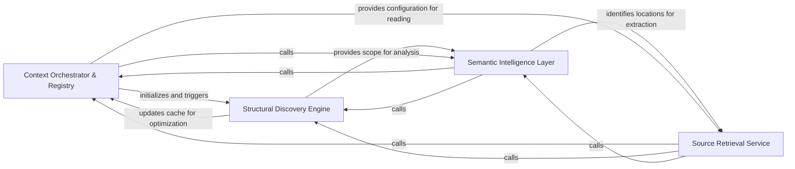

## Details

Provides high-level interfaces for AI agents to query the discovered environment and repository structure.

### Context Orchestrator & Registry [[Expand]](./Context_Orchestrator_Registry.md)
Centralizes tool instantiation and maintains the shared RepoContext state to manage repository lifecycle and tool registration.

**Related Classes/Methods**:

- `agents.tools.base.RepoContext`:10-54
- `agents.tools.base.BaseRepoTool`:57-96

**Source Files:**

- [`agents/tools/base.py`](https://github.com/CodeBoarding/CodeBoarding/blob/main/.codeboardingagents/tools/base.py)
  - `agents.tools.base.BaseRepoTool.ignore_manager` ([L73-L74](https://github.com/CodeBoarding/CodeBoarding/blob/main/.codeboardingagents/tools/base.py#L73-L74)) - Method
  - `agents.tools.base.BaseRepoTool.is_subsequence` ([L80-L96](https://github.com/CodeBoarding/CodeBoarding/blob/main/.codeboardingagents/tools/base.py#L80-L96)) - Method
- [`agents/tools/read_file_structure.py`](https://github.com/CodeBoarding/CodeBoarding/blob/main/.codeboardingagents/tools/read_file_structure.py)
  - `agents.tools.read_file_structure.FileStructureTool.cached_dirs` ([L34-L37](https://github.com/CodeBoarding/CodeBoarding/blob/main/.codeboardingagents/tools/read_file_structure.py#L34-L37)) - Method
  - `agents.tools.read_file_structure.get_tree_string` ([L104-L155](https://github.com/CodeBoarding/CodeBoarding/blob/main/.codeboardingagents/tools/read_file_structure.py#L104-L155)) - Function

### Structural Discovery Engine [[Expand]](./Structural_Discovery_Engine.md)
Discovers and visualizes the physical file and package organization, handling filtering and hierarchical depth.

**Related Classes/Methods**:

- `agents.tools.read_file_structure.FileStructureTool`:22-101
- `agents.tools.base.RepoContext._perform_walk`:42-54

**Source Files:**

- [`agents/tools/base.py`](https://github.com/CodeBoarding/CodeBoarding/blob/main/.codeboardingagents/tools/base.py)
  - `agents.tools.base.RepoContext._ensure_cache` ([L37-L40](https://github.com/CodeBoarding/CodeBoarding/blob/main/.codeboardingagents/tools/base.py#L37-L40)) - Method
  - `agents.tools.base.RepoContext._perform_walk` ([L42-L54](https://github.com/CodeBoarding/CodeBoarding/blob/main/.codeboardingagents/tools/base.py#L42-L54)) - Method
  - `agents.tools.base.BaseRepoTool.repo_dir` ([L69-L70](https://github.com/CodeBoarding/CodeBoarding/blob/main/.codeboardingagents/tools/base.py#L69-L70)) - Method

### Semantic Intelligence Layer [[Expand]](./Semantic_Intelligence_Layer.md)
Interfaces with static analysis data to answer relational queries about code logic, such as inheritance and dependencies.

**Related Classes/Methods**: _None_

**Source Files:**

- [`agents/tools/base.py`](https://github.com/CodeBoarding/CodeBoarding/blob/main/.codeboardingagents/tools/base.py)
  - `agents.tools.base.RepoContext.get_files` ([L25-L29](https://github.com/CodeBoarding/CodeBoarding/blob/main/.codeboardingagents/tools/base.py#L25-L29)) - Method
  - `agents.tools.base.RepoContext.get_directories` ([L31-L35](https://github.com/CodeBoarding/CodeBoarding/blob/main/.codeboardingagents/tools/base.py#L31-L35)) - Method
- [`agents/tools/get_external_deps.py`](https://github.com/CodeBoarding/CodeBoarding/blob/main/.codeboardingagents/tools/get_external_deps.py)
  - `agents.tools.get_external_deps.ExternalDepsTool._run` ([L24-L47](https://github.com/CodeBoarding/CodeBoarding/blob/main/.codeboardingagents/tools/get_external_deps.py#L24-L47)) - Method
- [`agents/tools/read_docs.py`](https://github.com/CodeBoarding/CodeBoarding/blob/main/.codeboardingagents/tools/read_docs.py)
  - `agents.tools.read_docs.ReadDocsTool.cached_files` ([L36-L49](https://github.com/CodeBoarding/CodeBoarding/blob/main/.codeboardingagents/tools/read_docs.py#L36-L49)) - Method
  - `agents.tools.read_docs.ReadDocsTool._run` ([L51-L132](https://github.com/CodeBoarding/CodeBoarding/blob/main/.codeboardingagents/tools/read_docs.py#L51-L132)) - Method

### Source Retrieval Service [[Expand]](./Source_Retrieval_Service.md)
Fetches raw source code, documentation, and specific line ranges from the filesystem.

**Related Classes/Methods**:

- `agents.tools.read_file.ReadFileTool`:19-90

**Source Files:**

- [`agents/tools/read_file.py`](https://github.com/CodeBoarding/CodeBoarding/blob/main/.codeboardingagents/tools/read_file.py)
  - `agents.tools.read_file.ReadFileTool.cached_files` ([L31-L33](https://github.com/CodeBoarding/CodeBoarding/blob/main/.codeboardingagents/tools/read_file.py#L31-L33)) - Method
  - `agents.tools.read_file.ReadFileTool._run` ([L35-L90](https://github.com/CodeBoarding/CodeBoarding/blob/main/.codeboardingagents/tools/read_file.py#L35-L90)) - Method
- [`agents/tools/read_file_structure.py`](https://github.com/CodeBoarding/CodeBoarding/blob/main/.codeboardingagents/tools/read_file_structure.py)
  - `agents.tools.read_file_structure.FileStructureTool._run` ([L39-L101](https://github.com/CodeBoarding/CodeBoarding/blob/main/.codeboardingagents/tools/read_file_structure.py#L39-L101)) - Method

### [FAQ](https://github.com/CodeBoarding/GeneratedOnBoardings/tree/main?tab=readme-ov-file#faq)