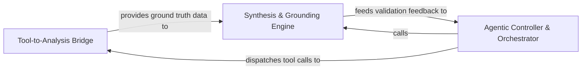

## Details

Implements the LLM-as-a-Controller pattern by exposing static analysis capabilities as discrete tools and translating natural language intent into structured graph queries.

### Tool-to-Analysis Bridge
Exposes the static analysis engine's internal graph representations as discrete, executable tools for the LLM.

**Related Classes/Methods**:

- `agents.tools.read_structure.CodeStructureTool`:14-49
- `agents.tools.read_cfg.GetCFGTool`:8-61
- `static_analyzer.graph.CallGraph.llm_str`:732-753

**Source Files:**

- [`agents/tools/base.py`](https://github.com/CodeBoarding/CodeBoarding/blob/main/.codeboardingagents/tools/base.py)
  - `agents.tools.base.BaseRepoTool.Config` ([L65-L66](https://github.com/CodeBoarding/CodeBoarding/blob/main/.codeboardingagents/tools/base.py#L65-L66)) - Class
  - `agents.tools.base.BaseRepoTool.static_analysis` ([L77-L78](https://github.com/CodeBoarding/CodeBoarding/blob/main/.codeboardingagents/tools/base.py#L77-L78)) - Method
- [`agents/tools/get_method_invocations.py`](https://github.com/CodeBoarding/CodeBoarding/blob/main/.codeboardingagents/tools/get_method_invocations.py)
  - `agents.tools.get_method_invocations.MethodInvocationsTool._run` ([L25-L47](https://github.com/CodeBoarding/CodeBoarding/blob/main/.codeboardingagents/tools/get_method_invocations.py#L25-L47)) - Method
- [`agents/tools/read_cfg.py`](https://github.com/CodeBoarding/CodeBoarding/blob/main/.codeboardingagents/tools/read_cfg.py)
  - `agents.tools.read_cfg.GetCFGTool._run` ([L18-L37](https://github.com/CodeBoarding/CodeBoarding/blob/main/.codeboardingagents/tools/read_cfg.py#L18-L37)) - Method

### Agentic Controller & Orchestrator
Manages the core LLM-as-a-Controller logic, maintaining state and selecting tools for the iterative analysis cycle.

**Related Classes/Methods**: _None_

**Source Files:**

- [`agents/tools/read_cfg.py`](https://github.com/CodeBoarding/CodeBoarding/blob/main/.codeboardingagents/tools/read_cfg.py)
  - `agents.tools.read_cfg.GetCFGTool.component_cfg` ([L39-L61](https://github.com/CodeBoarding/CodeBoarding/blob/main/.codeboardingagents/tools/read_cfg.py#L39-L61)) - Method
- [`agents/tools/read_packages.py`](https://github.com/CodeBoarding/CodeBoarding/blob/main/.codeboardingagents/tools/read_packages.py)
  - `agents.tools.read_packages.NoRootPackageFoundError.__init__` ([L21-L23](https://github.com/CodeBoarding/CodeBoarding/blob/main/.codeboardingagents/tools/read_packages.py#L21-L23)) - Method
  - `agents.tools.read_packages.PackageRelationsTool._run` ([L38-L60](https://github.com/CodeBoarding/CodeBoarding/blob/main/.codeboardingagents/tools/read_packages.py#L38-L60)) - Method
- [`agents/tools/read_structure.py`](https://github.com/CodeBoarding/CodeBoarding/blob/main/.codeboardingagents/tools/read_structure.py)
  - `agents.tools.read_structure.CodeStructureTool._run` ([L26-L49](https://github.com/CodeBoarding/CodeBoarding/blob/main/.codeboardingagents/tools/read_structure.py#L26-L49)) - Method

### Synthesis & Grounding Engine
Validates high-level architectural insights against source code to ensure accuracy and prevent hallucinations.

**Related Classes/Methods**: _None_

**Source Files:**

- [`static_analyzer/analysis_result.py`](https://github.com/CodeBoarding/CodeBoarding/blob/main/.codeboardingstatic_analyzer/analysis_result.py)
  - `static_analyzer.analysis_result.StaticAnalysisResults.get_languages` ([L272-L274](https://github.com/CodeBoarding/CodeBoarding/blob/main/.codeboardingstatic_analyzer/analysis_result.py#L272-L274)) - Method
- [`static_analyzer/graph.py`](https://github.com/CodeBoarding/CodeBoarding/blob/main/.codeboardingstatic_analyzer/graph.py)
  - `static_analyzer.graph.CallGraph.llm_str` ([L732-L753](https://github.com/CodeBoarding/CodeBoarding/blob/main/.codeboardingstatic_analyzer/graph.py#L732-L753)) - Method
  - `static_analyzer.graph.CallGraph._llm_str_class_level` ([L782-L827](https://github.com/CodeBoarding/CodeBoarding/blob/main/.codeboardingstatic_analyzer/graph.py#L782-L827)) - Method

### [FAQ](https://github.com/CodeBoarding/GeneratedOnBoardings/tree/main?tab=readme-ov-file#faq)