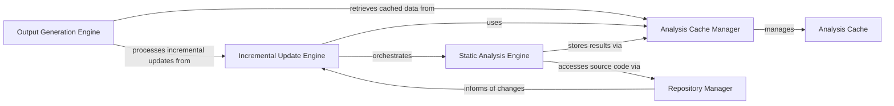

## Details

Persistently stores and retrieves static analysis results, preventing re-computation on unchanged code and supporting performance optimization.

### Analysis Cache
Persistently stores and retrieves static analysis results, preventing re-computation on unchanged code and supporting performance optimization.

**Related Classes/Methods**:

- <a href="https://github.com/CodeBoarding/CodeBoarding/blob/main/.codeboardingdiagram_analysis/incremental/updater.py" target="_blank" rel="noopener noreferrer">`repos.codeboarding.incremental.AnalysisCache`</a>

### Analysis Cache Manager
Manages the lifecycle of the Analysis Cache. It handles serialization and deserialization of complex analysis objects, orchestrates their storage into and retrieval from the Analysis Cache, and implements cache invalidation strategies.

**Related Classes/Methods**:

- <a href="https://github.com/CodeBoarding/CodeBoarding/blob/main/.codeboardingstatic_analyzer/analysis_cache.py" target="_blank" rel="noopener noreferrer">`static_analyzer.analysis_cache.AnalysisCacheManager`</a>

### Incremental Update Engine
Orchestrates the process of detecting code changes, assessing their impact, and triggering selective re-analysis or updates. It relies on the Analysis Cache Manager to fetch existing analysis data and store new or updated results.

**Related Classes/Methods**:

- <a href="https://github.com/CodeBoarding/CodeBoarding/blob/main/.codeboardingdiagram_analysis/incremental/updater.py" target="_blank" rel="noopener noreferrer">`diagram_analysis.incremental.updater.IncrementalUpdater`</a>

### Static Analysis Engine
The core component responsible for performing deep analysis of source code to extract structural, semantic, and behavioral information. It produces raw analysis artifacts that are then consumed by other components for storage or further processing.

**Related Classes/Methods**: _None_

### Repository Manager
Manages access to the project's source code repositories. It handles fetching code, tracking file changes, and providing the necessary code context to the analysis components.

**Related Classes/Methods**: _None_

### Output Generation Engine
Transforms the analysis results into various user-consumable formats, such as interactive diagrams (e.g., Mermaid.js), documentation, or reports. It is the final step in presenting the insights derived from the code analysis.

**Related Classes/Methods**: _None_

### [FAQ](https://github.com/CodeBoarding/GeneratedOnBoardings/tree/main?tab=readme-ov-file#faq)