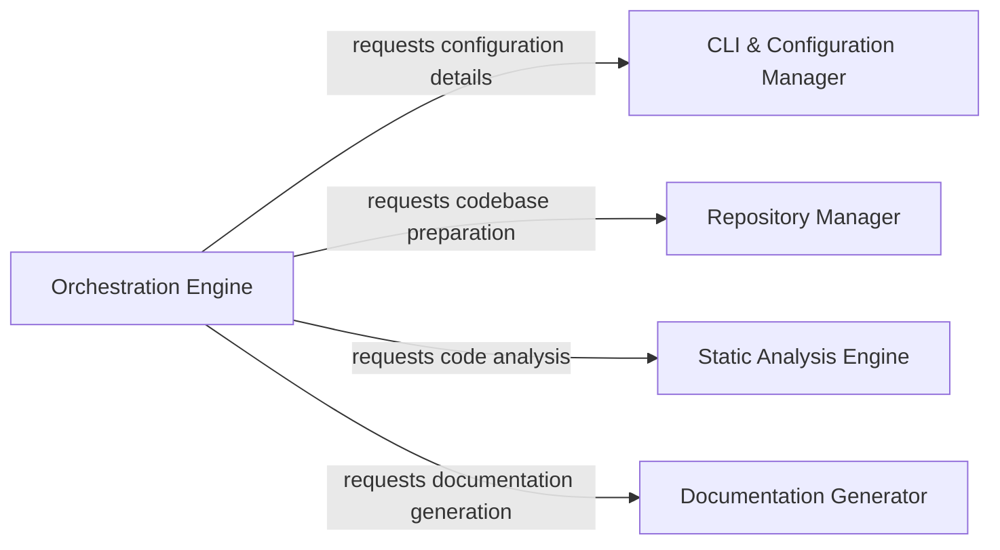

## Details

Coordinates the overall workflow of the documentation and diagram generation process. It acts as the high-level entry point, parsing command-line arguments, managing repository interactions, and triggering the various output generators after analysis data is available.

### Orchestration Engine
The central control unit that manages the entire workflow, from initial setup to final output generation. It orchestrates the sequence of operations, delegating tasks to other components based on parsed arguments and repository state.

**Related Classes/Methods**:

- <a href="https://github.com/CodeBoarding/CodeBoarding/blob/main/.codeboardinggithub_action.py" target="_blank" rel="noopener noreferrer">`repos.codeboarding.orchestrator.AnalysisOrchestrator`</a>
- <a href="https://github.com/CodeBoarding/CodeBoarding/blob/main/.codeboardingmain.py" target="_blank" rel="noopener noreferrer">`main.main`</a>

### CLI & Configuration Manager
Responsible for defining, parsing, and validating command-line arguments, and ensuring all necessary environment variables are correctly set for the application's operation. It prepares the runtime configuration.

**Related Classes/Methods**:

- <a href="https://github.com/CodeBoarding/CodeBoarding/blob/main/.codeboardinggithub_action.py" target="_blank" rel="noopener noreferrer">`repos.codeboarding.cli.CLIParser`</a>
- <a href="https://github.com/CodeBoarding/CodeBoarding/blob/main/.codeboardingmain.py" target="_blank" rel="noopener noreferrer">`main.define_cli_arguments`</a>
- <a href="https://github.com/CodeBoarding/CodeBoarding/blob/main/.codeboardingmain.py" target="_blank" rel="noopener noreferrer">`main.validate_arguments`</a>
- <a href="https://github.com/CodeBoarding/CodeBoarding/blob/main/.codeboardingmain.py" target="_blank" rel="noopener noreferrer">`main.validate_env_vars`</a>

### Repository Manager
Handles all interactions with code repositories, including cloning remote repositories, copying necessary files, checking for existing onboarding materials, and preparing both local and remote codebases for analysis.

**Related Classes/Methods**:

- <a href="https://github.com/CodeBoarding/CodeBoarding/blob/main/.codeboardinggithub_action.py" target="_blank" rel="noopener noreferrer">`repos.codeboarding.repository.RepositoryManager`</a>
- <a href="https://github.com/CodeBoarding/CodeBoarding/blob/main/.codeboardingmain.py" target="_blank" rel="noopener noreferrer">`main.process_remote_repository`</a>
- <a href="https://github.com/CodeBoarding/CodeBoarding/blob/main/.codeboardingmain.py" target="_blank" rel="noopener noreferrer">`main.copy_files`</a>
- <a href="https://github.com/CodeBoarding/CodeBoarding/blob/main/.codeboardingmain.py" target="_blank" rel="noopener noreferrer">`main.onboarding_materials_exist`</a>
- <a href="https://github.com/CodeBoarding/CodeBoarding/blob/main/.codeboardingmain.py" target="_blank" rel="noopener noreferrer">`main.process_local_repository`</a>

### Static Analysis Engine
Performs the core static analysis of the codebase, extracting structural and functional insights. It also supports incremental updates to existing analysis results.

**Related Classes/Methods**:

- <a href="https://github.com/CodeBoarding/CodeBoarding/blob/main/.codeboardingmain.py" target="_blank" rel="noopener noreferrer">`main.generate_analysis`</a>
- <a href="https://github.com/CodeBoarding/CodeBoarding/blob/main/.codeboardingmain.py" target="_blank" rel="noopener noreferrer">`main.partial_update`</a>

### Documentation Generator
Transforms the raw analysis results provided by the Static Analysis Engine into various human-readable documentation formats, such as Markdown or platform-specific outputs.

**Related Classes/Methods**:

- <a href="https://github.com/CodeBoarding/CodeBoarding/blob/main/.codeboardingmain.py" target="_blank" rel="noopener noreferrer">`main.generate_docs_remote`</a>
- <a href="https://github.com/CodeBoarding/CodeBoarding/blob/main/.codeboardingmain.py" target="_blank" rel="noopener noreferrer">`main.generate_markdown_docs`</a>

### [FAQ](https://github.com/CodeBoarding/GeneratedOnBoardings/tree/main?tab=readme-ov-file#faq)