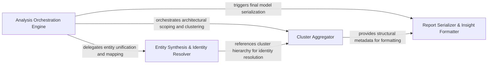

## Details

Responsible for aggregating individual architectural entities into a cohesive analysis report and handling serialization.

### Analysis Orchestration Engine
Manages the high-level execution flow and coordinates the sequence of analysis steps to ensure context is maintained throughout the abstraction process.

**Related Classes/Methods**: _None_

### Entity Synthesis & Identity Resolver
Unifies architectural entities by resolving naming collisions, ensuring unique identity keys, and mapping static code references to synthesized component definitions.

**Related Classes/Methods**: _None_

### Cluster Aggregator
Handles the grouping and hierarchical organization of code entities into logical clusters representing the system's macro-architecture.

**Related Classes/Methods**: _None_

### Report Serializer & Insight Formatter
Converts the internal synthesized model into structured output and formats LLM insights for rendering engines.

**Related Classes/Methods**: _None_

**Source Files:**

- [`agents/agent_responses.py`](https://github.com/CodeBoarding/CodeBoarding/blob/main/.codeboardingagents/agent_responses.py)
  - `agents.agent_responses.Relation.llm_str` ([L324-L325](https://github.com/CodeBoarding/CodeBoarding/blob/main/.codeboardingagents/agent_responses.py#L324-L325)) - Method

### [FAQ](https://github.com/CodeBoarding/GeneratedOnBoardings/tree/main?tab=readme-ov-file#faq)