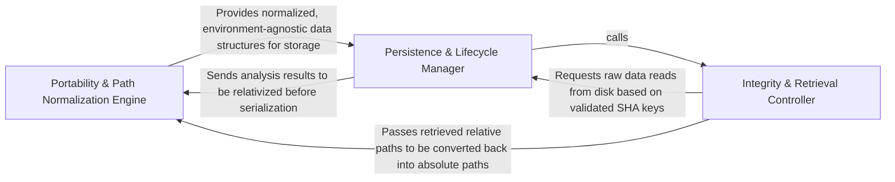

## Details

Manages the persistence of analysis results using SHA-based keys and model signatures to ensure cache integrity and portability.

### Portability & Path Normalization Engine [[Expand]](./Portability_Path_Normalization_Engine.md)
Handles the transformation of file paths between absolute and relative formats to ensure cache portability across different environments.

**Related Classes/Methods**:

- `static_analyzer.analysis_cache.StaticAnalysisCache._relativize`:79-88
- `static_analyzer.analysis_cache.StaticAnalysisCache._absolutize`:90-98
- `static_analyzer.language_results.LanguageResults.visit_paths`:123-128
- `utils.to_relative_path`:88-94

**Source Files:**

- [`static_analyzer/analysis_cache.py`](https://github.com/CodeBoarding/CodeBoarding/blob/main/.codeboardingstatic_analyzer/analysis_cache.py)
  - `static_analyzer.analysis_cache.StaticAnalysisCache._to_relative` ([L73-L74](https://github.com/CodeBoarding/CodeBoarding/blob/main/.codeboardingstatic_analyzer/analysis_cache.py#L73-L74)) - Method
  - `static_analyzer.analysis_cache.StaticAnalysisCache._to_absolute` ([L76-L77](https://github.com/CodeBoarding/CodeBoarding/blob/main/.codeboardingstatic_analyzer/analysis_cache.py#L76-L77)) - Method
  - `static_analyzer.analysis_cache.StaticAnalysisCache._relativize` ([L79-L88](https://github.com/CodeBoarding/CodeBoarding/blob/main/.codeboardingstatic_analyzer/analysis_cache.py#L79-L88)) - Method
  - `static_analyzer.analysis_cache.StaticAnalysisCache._absolutize` ([L90-L98](https://github.com/CodeBoarding/CodeBoarding/blob/main/.codeboardingstatic_analyzer/analysis_cache.py#L90-L98)) - Method
- [`static_analyzer/language_results.py`](https://github.com/CodeBoarding/CodeBoarding/blob/main/.codeboardingstatic_analyzer/language_results.py)
  - `static_analyzer.language_results.ControlFlowGraph.visit_paths` ([L33-L37](https://github.com/CodeBoarding/CodeBoarding/blob/main/.codeboardingstatic_analyzer/language_results.py#L33-L37)) - Method
  - `static_analyzer.language_results.ClassHierarchy.visit_paths` ([L54-L59](https://github.com/CodeBoarding/CodeBoarding/blob/main/.codeboardingstatic_analyzer/language_results.py#L54-L59)) - Method
  - `static_analyzer.language_results.References.visit_paths` ([L72-L77](https://github.com/CodeBoarding/CodeBoarding/blob/main/.codeboardingstatic_analyzer/language_results.py#L72-L77)) - Method
  - `static_analyzer.language_results.PackageDependencies.visit_paths` ([L90-L95](https://github.com/CodeBoarding/CodeBoarding/blob/main/.codeboardingstatic_analyzer/language_results.py#L90-L95)) - Method
  - `static_analyzer.language_results.SourceFiles.visit_paths` ([L107-L110](https://github.com/CodeBoarding/CodeBoarding/blob/main/.codeboardingstatic_analyzer/language_results.py#L107-L110)) - Method
  - `static_analyzer.language_results.LanguageResults.visit_paths` ([L123-L128](https://github.com/CodeBoarding/CodeBoarding/blob/main/.codeboardingstatic_analyzer/language_results.py#L123-L128)) - Method
- [`utils.py`](https://github.com/CodeBoarding/CodeBoarding/blob/main/.codeboardingutils.py)
  - `utils.to_relative_path` ([L88-L94](https://github.com/CodeBoarding/CodeBoarding/blob/main/.codeboardingutils.py#L88-L94)) - Function
  - `utils.to_absolute_path` ([L97-L105](https://github.com/CodeBoarding/CodeBoarding/blob/main/.codeboardingutils.py#L97-L105)) - Function

### Integrity & Retrieval Controller [[Expand]](./Integrity_Retrieval_Controller.md)
Orchestrates the lookup of cached analysis data by validating source code SHAs and AI model signatures.

**Related Classes/Methods**:

- `static_analyzer.analysis_cache.StaticAnalysisCache.get`:166-178
- `static_analyzer.analysis_cache.StaticAnalysisCache.read_tag_sha`:112-126
- `caching.cache.ModelSettings.signature`:288-289

**Source Files:**

- [`caching/cache.py`](https://github.com/CodeBoarding/CodeBoarding/blob/main/.codeboardingcaching/cache.py)
  - `caching.cache.BaseCache` ([L30-L268](https://github.com/CodeBoarding/CodeBoarding/blob/main/.codeboardingcaching/cache.py#L30-L268)) - Class
  - `caching.cache.BaseCache.close` ([L259-L268](https://github.com/CodeBoarding/CodeBoarding/blob/main/.codeboardingcaching/cache.py#L259-L268)) - Method
  - `caching.cache.ModelSettings` ([L271-L310](https://github.com/CodeBoarding/CodeBoarding/blob/main/.codeboardingcaching/cache.py#L271-L310)) - Class
  - `caching.cache.ModelSettings.canonical_json` ([L284-L286](https://github.com/CodeBoarding/CodeBoarding/blob/main/.codeboardingcaching/cache.py#L284-L286)) - Method
  - `caching.cache.ModelSettings.signature` ([L288-L289](https://github.com/CodeBoarding/CodeBoarding/blob/main/.codeboardingcaching/cache.py#L288-L289)) - Method
- [`static_analyzer/analysis_cache.py`](https://github.com/CodeBoarding/CodeBoarding/blob/main/.codeboardingstatic_analyzer/analysis_cache.py)
  - `static_analyzer.analysis_cache.StaticAnalysisCache.sha_path` ([L105-L106](https://github.com/CodeBoarding/CodeBoarding/blob/main/.codeboardingstatic_analyzer/analysis_cache.py#L105-L106)) - Method
  - `static_analyzer.analysis_cache.StaticAnalysisCache.lock_path` ([L109-L110](https://github.com/CodeBoarding/CodeBoarding/blob/main/.codeboardingstatic_analyzer/analysis_cache.py#L109-L110)) - Method
  - `static_analyzer.analysis_cache.StaticAnalysisCache.read_tag_sha` ([L112-L126](https://github.com/CodeBoarding/CodeBoarding/blob/main/.codeboardingstatic_analyzer/analysis_cache.py#L112-L126)) - Method
  - `static_analyzer.analysis_cache.StaticAnalysisCache._read_tag_sha_unlocked` ([L128-L140](https://github.com/CodeBoarding/CodeBoarding/blob/main/.codeboardingstatic_analyzer/analysis_cache.py#L128-L140)) - Method
  - `static_analyzer.analysis_cache.StaticAnalysisCache._legacy_pkl_path` ([L142-L143](https://github.com/CodeBoarding/CodeBoarding/blob/main/.codeboardingstatic_analyzer/analysis_cache.py#L142-L143)) - Method
  - `static_analyzer.analysis_cache.StaticAnalysisCache.load_with_sha` ([L145-L164](https://github.com/CodeBoarding/CodeBoarding/blob/main/.codeboardingstatic_analyzer/analysis_cache.py#L145-L164)) - Method
  - `static_analyzer.analysis_cache.StaticAnalysisCache.get` ([L166-L178](https://github.com/CodeBoarding/CodeBoarding/blob/main/.codeboardingstatic_analyzer/analysis_cache.py#L166-L178)) - Method
  - `static_analyzer.analysis_cache.StaticAnalysisCache._get_unlocked` ([L180-L214](https://github.com/CodeBoarding/CodeBoarding/blob/main/.codeboardingstatic_analyzer/analysis_cache.py#L180-L214)) - Method

### Persistence & Lifecycle Manager [[Expand]](./Persistence_Lifecycle_Manager.md)
Manages physical storage, atomic writes, and serialization of cache files on disk.

**Related Classes/Methods**:

- `static_analyzer.analysis_cache.StaticAnalysisCache.save`:216-273
- `static_analyzer.analysis_cache.copy_cache_files`:276-315
- `static_analyzer.__init__.StaticAnalyzer.flush_cache`:319-335

**Source Files:**

- [`diagram_analysis/diagram_generator.py`](https://github.com/CodeBoarding/CodeBoarding/blob/main/.codeboardingdiagram_analysis/diagram_generator.py)
  - `diagram_analysis.diagram_generator.DiagramGenerator._persist_static_analysis_artifact` ([L248-L255](https://github.com/CodeBoarding/CodeBoarding/blob/main/.codeboardingdiagram_analysis/diagram_generator.py#L248-L255)) - Method
- [`static_analyzer/__init__.py`](https://github.com/CodeBoarding/CodeBoarding/blob/main/.codeboardingstatic_analyzer/__init__.py)
  - `static_analyzer.__init__.StaticAnalyzer.flush_cache` ([L319-L335](https://github.com/CodeBoarding/CodeBoarding/blob/main/.codeboardingstatic_analyzer/__init__.py#L319-L335)) - Method
  - `static_analyzer.__init__.StaticAnalyzer.load_from_disk_cache` ([L355-L385](https://github.com/CodeBoarding/CodeBoarding/blob/main/.codeboardingstatic_analyzer/__init__.py#L355-L385)) - Method
- [`static_analyzer/analysis_cache.py`](https://github.com/CodeBoarding/CodeBoarding/blob/main/.codeboardingstatic_analyzer/analysis_cache.py)
  - `static_analyzer.analysis_cache.StaticAnalysisCache` ([L60-L273](https://github.com/CodeBoarding/CodeBoarding/blob/main/.codeboardingstatic_analyzer/analysis_cache.py#L60-L273)) - Class
  - `static_analyzer.analysis_cache.StaticAnalysisCache.pkl_path` ([L101-L102](https://github.com/CodeBoarding/CodeBoarding/blob/main/.codeboardingstatic_analyzer/analysis_cache.py#L101-L102)) - Method
  - `static_analyzer.analysis_cache.StaticAnalysisCache.save` ([L216-L273](https://github.com/CodeBoarding/CodeBoarding/blob/main/.codeboardingstatic_analyzer/analysis_cache.py#L216-L273)) - Method
  - `static_analyzer.analysis_cache.copy_cache_files` ([L276-L315](https://github.com/CodeBoarding/CodeBoarding/blob/main/.codeboardingstatic_analyzer/analysis_cache.py#L276-L315)) - Function
  - `static_analyzer.analysis_cache._atomic_copy` ([L318-L333](https://github.com/CodeBoarding/CodeBoarding/blob/main/.codeboardingstatic_analyzer/analysis_cache.py#L318-L333)) - Function

### [FAQ](https://github.com/CodeBoarding/GeneratedOnBoardings/tree/main?tab=readme-ov-file#faq)