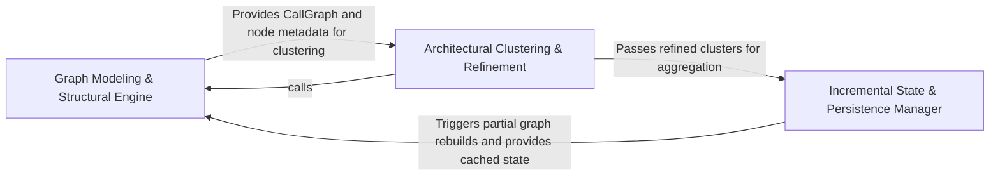

## Details

Bridges the gap between the installed tools and the target codebase. It applies repository-level ignore rules (e.g., .gitignore) to configure how language adapters should filter and interact with the file system.

### Graph Modeling & Structural Engine
Processes raw symbol data into a unified graph representation, managing the lifecycle of nodes and edges while providing structural query capabilities.

**Related Classes/Methods**:

- `static_analyzer.graph.CallGraph`:85-827
- `static_analyzer.node.Node`:9-69
- `static_analyzer.graph.Edge`:70-82
- `static_analyzer.engine.result_converter.convert_to_codeboarding_format`:17-122

**Source Files:**

- [`agents/validation.py`](https://github.com/CodeBoarding/CodeBoarding/blob/main/.codeboardingagents/validation.py)
  - `agents.validation._build_cluster_edge_lookup` ([L586-L613](https://github.com/CodeBoarding/CodeBoarding/blob/main/.codeboardingagents/validation.py#L586-L613)) - Function
  - `agents.validation._check_edge_between_cluster_sets` ([L616-L654](https://github.com/CodeBoarding/CodeBoarding/blob/main/.codeboardingagents/validation.py#L616-L654)) - Function
- [`static_analyzer/analysis_cache.py`](https://github.com/CodeBoarding/CodeBoarding/blob/main/.codeboardingstatic_analyzer/analysis_cache.py)
  - `static_analyzer.analysis_cache._collect_invalidated_edge` ([L425-L433](https://github.com/CodeBoarding/CodeBoarding/blob/main/.codeboardingstatic_analyzer/analysis_cache.py#L425-L433)) - Function
  - `static_analyzer.analysis_cache._validate_no_dangling_references` ([L436-L469](https://github.com/CodeBoarding/CodeBoarding/blob/main/.codeboardingstatic_analyzer/analysis_cache.py#L436-L469)) - Function
- [`static_analyzer/cluster_relations.py`](https://github.com/CodeBoarding/CodeBoarding/blob/main/.codeboardingstatic_analyzer/cluster_relations.py)
  - `static_analyzer.cluster_relations.ClusterRelation` ([L19-L25](https://github.com/CodeBoarding/CodeBoarding/blob/main/.codeboardingstatic_analyzer/cluster_relations.py#L19-L25)) - Class
  - `static_analyzer.cluster_relations.build_component_relations` ([L42-L83](https://github.com/CodeBoarding/CodeBoarding/blob/main/.codeboardingstatic_analyzer/cluster_relations.py#L42-L83)) - Function
- [`static_analyzer/constants.py`](https://github.com/CodeBoarding/CodeBoarding/blob/main/.codeboardingstatic_analyzer/constants.py)
  - `static_analyzer.constants.NodeType` ([L86-L137](https://github.com/CodeBoarding/CodeBoarding/blob/main/.codeboardingstatic_analyzer/constants.py#L86-L137)) - Class
- [`static_analyzer/engine/adapters/csharp_adapter.py`](https://github.com/CodeBoarding/CodeBoarding/blob/main/.codeboardingstatic_analyzer/engine/adapters/csharp_adapter.py)
  - `static_analyzer.engine.adapters.csharp_adapter.CSharpAdapter.is_reference_worthy` ([L262-L264](https://github.com/CodeBoarding/CodeBoarding/blob/main/.codeboardingstatic_analyzer/engine/adapters/csharp_adapter.py#L262-L264)) - Method
- [`static_analyzer/engine/adapters/php_adapter.py`](https://github.com/CodeBoarding/CodeBoarding/blob/main/.codeboardingstatic_analyzer/engine/adapters/php_adapter.py)
  - `static_analyzer.engine.adapters.php_adapter.PHPAdapter.is_reference_worthy` ([L46-L47](https://github.com/CodeBoarding/CodeBoarding/blob/main/.codeboardingstatic_analyzer/engine/adapters/php_adapter.py#L46-L47)) - Method
- [`static_analyzer/engine/language_adapter.py`](https://github.com/CodeBoarding/CodeBoarding/blob/main/.codeboardingstatic_analyzer/engine/language_adapter.py)
  - `static_analyzer.engine.language_adapter.LanguageAdapter.is_reference_worthy` ([L273-L284](https://github.com/CodeBoarding/CodeBoarding/blob/main/.codeboardingstatic_analyzer/engine/language_adapter.py#L273-L284)) - Method
- [`static_analyzer/engine/result_converter.py`](https://github.com/CodeBoarding/CodeBoarding/blob/main/.codeboardingstatic_analyzer/engine/result_converter.py)
  - `static_analyzer.engine.result_converter.convert_to_codeboarding_format` ([L17-L122](https://github.com/CodeBoarding/CodeBoarding/blob/main/.codeboardingstatic_analyzer/engine/result_converter.py#L17-L122)) - Function
  - `static_analyzer.engine.result_converter._map_symbol_kind` ([L125-L134](https://github.com/CodeBoarding/CodeBoarding/blob/main/.codeboardingstatic_analyzer/engine/result_converter.py#L125-L134)) - Function
- [`static_analyzer/engine/symbol_table.py`](https://github.com/CodeBoarding/CodeBoarding/blob/main/.codeboardingstatic_analyzer/engine/symbol_table.py)
  - `static_analyzer.engine.symbol_table.SymbolTable.primary_file_symbols` ([L47-L49](https://github.com/CodeBoarding/CodeBoarding/blob/main/.codeboardingstatic_analyzer/engine/symbol_table.py#L47-L49)) - Method
- [`static_analyzer/graph.py`](https://github.com/CodeBoarding/CodeBoarding/blob/main/.codeboardingstatic_analyzer/graph.py)
  - `static_analyzer.graph.LocationKey` ([L38-L45](https://github.com/CodeBoarding/CodeBoarding/blob/main/.codeboardingstatic_analyzer/graph.py#L38-L45)) - Class
  - `static_analyzer.graph.Edge` ([L70-L82](https://github.com/CodeBoarding/CodeBoarding/blob/main/.codeboardingstatic_analyzer/graph.py#L70-L82)) - Class
  - `static_analyzer.graph.Edge.get_source` ([L75-L76](https://github.com/CodeBoarding/CodeBoarding/blob/main/.codeboardingstatic_analyzer/graph.py#L75-L76)) - Method
  - `static_analyzer.graph.Edge.get_destination` ([L78-L79](https://github.com/CodeBoarding/CodeBoarding/blob/main/.codeboardingstatic_analyzer/graph.py#L78-L79)) - Method
  - `static_analyzer.graph.CallGraph` ([L85-L827](https://github.com/CodeBoarding/CodeBoarding/blob/main/.codeboardingstatic_analyzer/graph.py#L85-L827)) - Class
  - `static_analyzer.graph.CallGraph.add_node` ([L110-L147](https://github.com/CodeBoarding/CodeBoarding/blob/main/.codeboardingstatic_analyzer/graph.py#L110-L147)) - Method
  - `static_analyzer.graph.CallGraph.has_node` ([L149-L151](https://github.com/CodeBoarding/CodeBoarding/blob/main/.codeboardingstatic_analyzer/graph.py#L149-L151)) - Method
  - `static_analyzer.graph.CallGraph._resolve_name` ([L153-L155](https://github.com/CodeBoarding/CodeBoarding/blob/main/.codeboardingstatic_analyzer/graph.py#L153-L155)) - Method
  - `static_analyzer.graph.CallGraph.add_edge` ([L157-L172](https://github.com/CodeBoarding/CodeBoarding/blob/main/.codeboardingstatic_analyzer/graph.py#L157-L172)) - Method
  - `static_analyzer.graph.CallGraph.filter` ([L174-L200](https://github.com/CodeBoarding/CodeBoarding/blob/main/.codeboardingstatic_analyzer/graph.py#L174-L200)) - Method
  - `static_analyzer.graph.CallGraph.union` ([L202-L226](https://github.com/CodeBoarding/CodeBoarding/blob/main/.codeboardingstatic_analyzer/graph.py#L202-L226)) - Method
  - `static_analyzer.graph.CallGraph._prune_cluster_cache` ([L228-L253](https://github.com/CodeBoarding/CodeBoarding/blob/main/.codeboardingstatic_analyzer/graph.py#L228-L253)) - Method
  - `static_analyzer.graph.CallGraph.filter_by_files` ([L333-L358](https://github.com/CodeBoarding/CodeBoarding/blob/main/.codeboardingstatic_analyzer/graph.py#L333-L358)) - Method
  - `static_analyzer.graph.CallGraph.filter_by_nodes` ([L360-L375](https://github.com/CodeBoarding/CodeBoarding/blob/main/.codeboardingstatic_analyzer/graph.py#L360-L375)) - Method
  - `static_analyzer.graph.CallGraph._llm_str_detailed` ([L755-L780](https://github.com/CodeBoarding/CodeBoarding/blob/main/.codeboardingstatic_analyzer/graph.py#L755-L780)) - Method
- [`static_analyzer/incremental_orchestrator.py`](https://github.com/CodeBoarding/CodeBoarding/blob/main/.codeboardingstatic_analyzer/incremental_orchestrator.py)
  - `static_analyzer.incremental_orchestrator._filter_to_live_files` ([L305-L338](https://github.com/CodeBoarding/CodeBoarding/blob/main/.codeboardingstatic_analyzer/incremental_orchestrator.py#L305-L338)) - Function
- [`static_analyzer/language_results.py`](https://github.com/CodeBoarding/CodeBoarding/blob/main/.codeboardingstatic_analyzer/language_results.py)
  - `static_analyzer.language_results.ControlFlowGraph.merge` ([L21-L31](https://github.com/CodeBoarding/CodeBoarding/blob/main/.codeboardingstatic_analyzer/language_results.py#L21-L31)) - Method
- [`static_analyzer/node.py`](https://github.com/CodeBoarding/CodeBoarding/blob/main/.codeboardingstatic_analyzer/node.py)
  - `static_analyzer.node.Node` ([L9-L69](https://github.com/CodeBoarding/CodeBoarding/blob/main/.codeboardingstatic_analyzer/node.py#L9-L69)) - Class
  - `static_analyzer.node.Node.__init__` ([L12-L27](https://github.com/CodeBoarding/CodeBoarding/blob/main/.codeboardingstatic_analyzer/node.py#L12-L27)) - Method
  - `static_analyzer.node.Node.entity_label` ([L29-L31](https://github.com/CodeBoarding/CodeBoarding/blob/main/.codeboardingstatic_analyzer/node.py#L29-L31)) - Method
  - `static_analyzer.node.Node.added_method_called_by_me` ([L59-L63](https://github.com/CodeBoarding/CodeBoarding/blob/main/.codeboardingstatic_analyzer/node.py#L59-L63)) - Method

### Architectural Clustering & Refinement
Applies community detection algorithms and heuristic-based merging to group related code entities into logical architectural clusters.

**Related Classes/Methods**:

- `static_analyzer.cluster_helpers._detect_communities`:195-232
- `static_analyzer.cluster_helpers.merge_clusters`:432-470
- `static_analyzer.graph.CallGraph.cluster`:269-331
- `static_analyzer.cluster_helpers._absorb_small_communities`:346-378

**Source Files:**

- [`agents/cluster_methods_mixin.py`](https://github.com/CodeBoarding/CodeBoarding/blob/main/.codeboardingagents/cluster_methods_mixin.py)
  - `agents.cluster_methods_mixin.ClusterMethodsMixin._expand_to_method_level_clusters` ([L345-L399](https://github.com/CodeBoarding/CodeBoarding/blob/main/.codeboardingagents/cluster_methods_mixin.py#L345-L399)) - Method
  - `agents.cluster_methods_mixin.ClusterMethodsMixin._create_strict_component_subgraph` ([L401-L480](https://github.com/CodeBoarding/CodeBoarding/blob/main/.codeboardingagents/cluster_methods_mixin.py#L401-L480)) - Method
- [`static_analyzer/cfg_skip_planner.py`](https://github.com/CodeBoarding/CodeBoarding/blob/main/.codeboardingstatic_analyzer/cfg_skip_planner.py)
  - `static_analyzer.cfg_skip_planner.plan_skip_set.render` ([L188-L189](https://github.com/CodeBoarding/CodeBoarding/blob/main/.codeboardingstatic_analyzer/cfg_skip_planner.py#L188-L189)) - Function
- [`static_analyzer/cluster_helpers.py`](https://github.com/CodeBoarding/CodeBoarding/blob/main/.codeboardingstatic_analyzer/cluster_helpers.py)
  - `static_analyzer.cluster_helpers.enforce_cross_language_budget` ([L106-L146](https://github.com/CodeBoarding/CodeBoarding/blob/main/.codeboardingstatic_analyzer/cluster_helpers.py#L106-L146)) - Function
  - `static_analyzer.cluster_helpers._build_node_to_cluster_lookup` ([L154-L160](https://github.com/CodeBoarding/CodeBoarding/blob/main/.codeboardingstatic_analyzer/cluster_helpers.py#L154-L160)) - Function
  - `static_analyzer.cluster_helpers._build_meta_graph` ([L163-L187](https://github.com/CodeBoarding/CodeBoarding/blob/main/.codeboardingstatic_analyzer/cluster_helpers.py#L163-L187)) - Function
  - `static_analyzer.cluster_helpers._detect_communities` ([L195-L232](https://github.com/CodeBoarding/CodeBoarding/blob/main/.codeboardingstatic_analyzer/cluster_helpers.py#L195-L232)) - Function
  - `static_analyzer.cluster_helpers._community_files` ([L240-L245](https://github.com/CodeBoarding/CodeBoarding/blob/main/.codeboardingstatic_analyzer/cluster_helpers.py#L240-L245)) - Function
  - `static_analyzer.cluster_helpers._find_nearest_by_graph_distance` ([L248-L288](https://github.com/CodeBoarding/CodeBoarding/blob/main/.codeboardingstatic_analyzer/cluster_helpers.py#L248-L288)) - Function
  - `static_analyzer.cluster_helpers._find_nearest_by_file_overlap` ([L291-L312](https://github.com/CodeBoarding/CodeBoarding/blob/main/.codeboardingstatic_analyzer/cluster_helpers.py#L291-L312)) - Function
  - `static_analyzer.cluster_helpers.reindex_cluster_result` ([L315-L343](https://github.com/CodeBoarding/CodeBoarding/blob/main/.codeboardingstatic_analyzer/cluster_helpers.py#L315-L343)) - Function
  - `static_analyzer.cluster_helpers._absorb_small_communities` ([L346-L378](https://github.com/CodeBoarding/CodeBoarding/blob/main/.codeboardingstatic_analyzer/cluster_helpers.py#L346-L378)) - Function
  - `static_analyzer.cluster_helpers._build_merged_cluster_result` ([L386-L424](https://github.com/CodeBoarding/CodeBoarding/blob/main/.codeboardingstatic_analyzer/cluster_helpers.py#L386-L424)) - Function
  - `static_analyzer.cluster_helpers.merge_clusters` ([L432-L470](https://github.com/CodeBoarding/CodeBoarding/blob/main/.codeboardingstatic_analyzer/cluster_helpers.py#L432-L470)) - Function
- [`static_analyzer/graph.py`](https://github.com/CodeBoarding/CodeBoarding/blob/main/.codeboardingstatic_analyzer/graph.py)
  - `static_analyzer.graph.detect_communities` ([L21-L34](https://github.com/CodeBoarding/CodeBoarding/blob/main/.codeboardingstatic_analyzer/graph.py#L21-L34)) - Function
  - `static_analyzer.graph.ClusterResult` ([L49-L67](https://github.com/CodeBoarding/CodeBoarding/blob/main/.codeboardingstatic_analyzer/graph.py#L49-L67)) - Class
  - `static_analyzer.graph.CallGraph.to_networkx` ([L255-L267](https://github.com/CodeBoarding/CodeBoarding/blob/main/.codeboardingstatic_analyzer/graph.py#L255-L267)) - Method
  - `static_analyzer.graph.CallGraph.cluster` ([L269-L331](https://github.com/CodeBoarding/CodeBoarding/blob/main/.codeboardingstatic_analyzer/graph.py#L269-L331)) - Method
  - `static_analyzer.graph.CallGraph.to_cluster_string` ([L377-L427](https://github.com/CodeBoarding/CodeBoarding/blob/main/.codeboardingstatic_analyzer/graph.py#L377-L427)) - Method
  - `static_analyzer.graph.CallGraph._get_abstract_node_name` ([L429-L439](https://github.com/CodeBoarding/CodeBoarding/blob/main/.codeboardingstatic_analyzer/graph.py#L429-L439)) - Method
  - `static_analyzer.graph.CallGraph._cluster_with_algorithm` ([L441-L451](https://github.com/CodeBoarding/CodeBoarding/blob/main/.codeboardingstatic_analyzer/graph.py#L441-L451)) - Method
  - `static_analyzer.graph.CallGraph._score_clustering` ([L453-L484](https://github.com/CodeBoarding/CodeBoarding/blob/main/.codeboardingstatic_analyzer/graph.py#L453-L484)) - Method
  - `static_analyzer.graph.CallGraph._cluster_at_level` ([L486-L506](https://github.com/CodeBoarding/CodeBoarding/blob/main/.codeboardingstatic_analyzer/graph.py#L486-L506)) - Method
  - `static_analyzer.graph.CallGraph._try_all_algorithms` ([L508-L526](https://github.com/CodeBoarding/CodeBoarding/blob/main/.codeboardingstatic_analyzer/graph.py#L508-L526)) - Method
  - `static_analyzer.graph.CallGraph._map_candidates_to_original` ([L528-L552](https://github.com/CodeBoarding/CodeBoarding/blob/main/.codeboardingstatic_analyzer/graph.py#L528-L552)) - Method
  - `static_analyzer.graph.CallGraph._coverage` ([L554-L559](https://github.com/CodeBoarding/CodeBoarding/blob/main/.codeboardingstatic_analyzer/graph.py#L554-L559)) - Method
  - `static_analyzer.graph.CallGraph._build_result` ([L561-L592](https://github.com/CodeBoarding/CodeBoarding/blob/main/.codeboardingstatic_analyzer/graph.py#L561-L592)) - Method
  - `static_analyzer.graph.CallGraph._common_dot_prefix` ([L595-L608](https://github.com/CodeBoarding/CodeBoarding/blob/main/.codeboardingstatic_analyzer/graph.py#L595-L608)) - Method
  - `static_analyzer.graph.CallGraph.__cluster_str` ([L611-L700](https://github.com/CodeBoarding/CodeBoarding/blob/main/.codeboardingstatic_analyzer/graph.py#L611-L700)) - Method
  - `static_analyzer.graph.CallGraph.__non_cluster_str` ([L703-L723](https://github.com/CodeBoarding/CodeBoarding/blob/main/.codeboardingstatic_analyzer/graph.py#L703-L723)) - Method

### Incremental State & Persistence Manager
Maintains the global analysis state across multiple runs, handling intelligent cache invalidation and merging new analysis passes.

**Related Classes/Methods**:

- `static_analyzer.analysis_cache.invalidate_files`:336-390
- `static_analyzer.analysis_result.StaticAnalysisResults`:166-317
- `static_analyzer.language_results.LanguageResults`:114-128
- `static_analyzer.__init__.StaticAnalyzer._absorb_into_results`:666-673

**Source Files:**

- [`static_analyzer/__init__.py`](https://github.com/CodeBoarding/CodeBoarding/blob/main/.codeboardingstatic_analyzer/__init__.py)
  - `static_analyzer.__init__.StaticAnalyzer._absorb_into_results` ([L666-L673](https://github.com/CodeBoarding/CodeBoarding/blob/main/.codeboardingstatic_analyzer/__init__.py#L666-L673)) - Method
- [`static_analyzer/analysis_cache.py`](https://github.com/CodeBoarding/CodeBoarding/blob/main/.codeboardingstatic_analyzer/analysis_cache.py)
  - `static_analyzer.analysis_cache.invalidate_files` ([L336-L390](https://github.com/CodeBoarding/CodeBoarding/blob/main/.codeboardingstatic_analyzer/analysis_cache.py#L336-L390)) - Function
  - `static_analyzer.analysis_cache.merge_results` ([L393-L422](https://github.com/CodeBoarding/CodeBoarding/blob/main/.codeboardingstatic_analyzer/analysis_cache.py#L393-L422)) - Function
- [`static_analyzer/analysis_result.py`](https://github.com/CodeBoarding/CodeBoarding/blob/main/.codeboardingstatic_analyzer/analysis_result.py)
  - `static_analyzer.analysis_result.AnalysisData` ([L41-L70](https://github.com/CodeBoarding/CodeBoarding/blob/main/.codeboardingstatic_analyzer/analysis_result.py#L41-L70)) - Class
  - `static_analyzer.analysis_result.AnalysisData.from_dict` ([L50-L58](https://github.com/CodeBoarding/CodeBoarding/blob/main/.codeboardingstatic_analyzer/analysis_result.py#L50-L58)) - Method
  - `static_analyzer.analysis_result.InvalidatedAnalysis` ([L74-L77](https://github.com/CodeBoarding/CodeBoarding/blob/main/.codeboardingstatic_analyzer/analysis_result.py#L74-L77)) - Class
  - `static_analyzer.analysis_result.StaticAnalysisResults._bucket` ([L177-L178](https://github.com/CodeBoarding/CodeBoarding/blob/main/.codeboardingstatic_analyzer/analysis_result.py#L177-L178)) - Method
  - `static_analyzer.analysis_result.StaticAnalysisResults.add_class_hierarchy` ([L184-L186](https://github.com/CodeBoarding/CodeBoarding/blob/main/.codeboardingstatic_analyzer/analysis_result.py#L184-L186)) - Method
  - `static_analyzer.analysis_result.StaticAnalysisResults.add_cfg` ([L188-L190](https://github.com/CodeBoarding/CodeBoarding/blob/main/.codeboardingstatic_analyzer/analysis_result.py#L188-L190)) - Method
  - `static_analyzer.analysis_result.StaticAnalysisResults.add_package_dependencies` ([L192-L194](https://github.com/CodeBoarding/CodeBoarding/blob/main/.codeboardingstatic_analyzer/analysis_result.py#L192-L194)) - Method
  - `static_analyzer.analysis_result.StaticAnalysisResults.add_references` ([L196-L202](https://github.com/CodeBoarding/CodeBoarding/blob/main/.codeboardingstatic_analyzer/analysis_result.py#L196-L202)) - Method
  - `static_analyzer.analysis_result.StaticAnalysisResults.add_source_files` ([L301-L303](https://github.com/CodeBoarding/CodeBoarding/blob/main/.codeboardingstatic_analyzer/analysis_result.py#L301-L303)) - Method
- [`static_analyzer/language_results.py`](https://github.com/CodeBoarding/CodeBoarding/blob/main/.codeboardingstatic_analyzer/language_results.py)
  - `static_analyzer.language_results.ClassHierarchy.merge` ([L44-L52](https://github.com/CodeBoarding/CodeBoarding/blob/main/.codeboardingstatic_analyzer/language_results.py#L44-L52)) - Method
  - `static_analyzer.language_results.References.add` ([L66-L70](https://github.com/CodeBoarding/CodeBoarding/blob/main/.codeboardingstatic_analyzer/language_results.py#L66-L70)) - Method
  - `static_analyzer.language_results.PackageDependencies.merge` ([L84-L88](https://github.com/CodeBoarding/CodeBoarding/blob/main/.codeboardingstatic_analyzer/language_results.py#L84-L88)) - Method
  - `static_analyzer.language_results.SourceFiles.extend` ([L102-L105](https://github.com/CodeBoarding/CodeBoarding/blob/main/.codeboardingstatic_analyzer/language_results.py#L102-L105)) - Method
  - `static_analyzer.language_results.LanguageResults` ([L114-L128](https://github.com/CodeBoarding/CodeBoarding/blob/main/.codeboardingstatic_analyzer/language_results.py#L114-L128)) - Class

### [FAQ](https://github.com/CodeBoarding/GeneratedOnBoardings/tree/main?tab=readme-ov-file#faq)