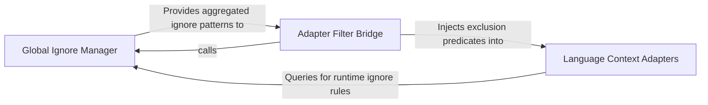

## Details

Bridges the gap between the installed tools and the target codebase. It applies repository-level ignore rules (e.g., .gitignore) to configure how language adapters should filter and interact with the file system.

### Global Ignore Manager
Responsible for the discovery, parsing, and enforcement of repository-level exclusion rules, providing a unified ignore check for the system.

**Related Classes/Methods**:

- `repo_utils.ignore.RepoIgnoreManager`:164-329

**Source Files:**

- [`repo_utils/ignore.py`](https://github.com/CodeBoarding/CodeBoarding/blob/main/.codeboardingrepo_utils/ignore.py)
  - `repo_utils.ignore.RepoIgnoreManager.__init__` ([L173-L175](https://github.com/CodeBoarding/CodeBoarding/blob/main/.codeboardingrepo_utils/ignore.py#L173-L175)) - Method
  - `repo_utils.ignore.RepoIgnoreManager._load_gitignore_patterns` ([L191-L202](https://github.com/CodeBoarding/CodeBoarding/blob/main/.codeboardingrepo_utils/ignore.py#L191-L202)) - Method
  - `repo_utils.ignore.RepoIgnoreManager._load_codeboardingignore_patterns` ([L204-L221](https://github.com/CodeBoarding/CodeBoarding/blob/main/.codeboardingrepo_utils/ignore.py#L204-L221)) - Method

### Adapter Filter Bridge
A translation layer that converts high-level ignore manager states into specific directory and file filters required by language adapters.

**Related Classes/Methods**:

- `static_analyzer.engine.adapters.go_adapter._directory_filters_from_ignore_manager`:22-70

**Source Files:**

- [`repo_utils/ignore.py`](https://github.com/CodeBoarding/CodeBoarding/blob/main/.codeboardingrepo_utils/ignore.py)
  - `repo_utils.ignore.RepoIgnoreManager.reload` ([L177-L189](https://github.com/CodeBoarding/CodeBoarding/blob/main/.codeboardingrepo_utils/ignore.py#L177-L189)) - Method
- [`static_analyzer/engine/adapters/go_adapter.py`](https://github.com/CodeBoarding/CodeBoarding/blob/main/.codeboardingstatic_analyzer/engine/adapters/go_adapter.py)
  - `static_analyzer.engine.adapters.go_adapter.GoAdapter` ([L73-L223](https://github.com/CodeBoarding/CodeBoarding/blob/main/.codeboardingstatic_analyzer/engine/adapters/go_adapter.py#L73-L223)) - Class
  - `static_analyzer.engine.adapters.go_adapter.GoAdapter.build_reference_key` ([L134-L136](https://github.com/CodeBoarding/CodeBoarding/blob/main/.codeboardingstatic_analyzer/engine/adapters/go_adapter.py#L134-L136)) - Method
  - `static_analyzer.engine.adapters.go_adapter.GoAdapter.get_lsp_env` ([L178-L186](https://github.com/CodeBoarding/CodeBoarding/blob/main/.codeboardingstatic_analyzer/engine/adapters/go_adapter.py#L178-L186)) - Method

### Language Context Adapters
The execution layer that applies filtered configurations to perform language-specific metadata extraction and symbol lookups.

**Related Classes/Methods**:

- `static_analyzer.engine.adapters.go_adapter.GoAdapter`:73-223

**Source Files:**

- [`static_analyzer/engine/adapters/go_adapter.py`](https://github.com/CodeBoarding/CodeBoarding/blob/main/.codeboardingstatic_analyzer/engine/adapters/go_adapter.py)
  - `static_analyzer.engine.adapters.go_adapter._directory_filters_from_ignore_manager` ([L22-L70](https://github.com/CodeBoarding/CodeBoarding/blob/main/.codeboardingstatic_analyzer/engine/adapters/go_adapter.py#L22-L70)) - Function
  - `static_analyzer.engine.adapters.go_adapter.GoAdapter.language` ([L76-L77](https://github.com/CodeBoarding/CodeBoarding/blob/main/.codeboardingstatic_analyzer/engine/adapters/go_adapter.py#L76-L77)) - Method
  - `static_analyzer.engine.adapters.go_adapter.GoAdapter.language_enum` ([L80-L81](https://github.com/CodeBoarding/CodeBoarding/blob/main/.codeboardingstatic_analyzer/engine/adapters/go_adapter.py#L80-L81)) - Method
  - `static_analyzer.engine.adapters.go_adapter.GoAdapter.lsp_command` ([L84-L85](https://github.com/CodeBoarding/CodeBoarding/blob/main/.codeboardingstatic_analyzer/engine/adapters/go_adapter.py#L84-L85)) - Method
  - `static_analyzer.engine.adapters.go_adapter.GoAdapter.language_id` ([L88-L89](https://github.com/CodeBoarding/CodeBoarding/blob/main/.codeboardingstatic_analyzer/engine/adapters/go_adapter.py#L88-L89)) - Method
  - `static_analyzer.engine.adapters.go_adapter.GoAdapter.get_lsp_init_options` ([L138-L165](https://github.com/CodeBoarding/CodeBoarding/blob/main/.codeboardingstatic_analyzer/engine/adapters/go_adapter.py#L138-L165)) - Method
  - `static_analyzer.engine.adapters.go_adapter.GoAdapter.get_workspace_settings` ([L167-L176](https://github.com/CodeBoarding/CodeBoarding/blob/main/.codeboardingstatic_analyzer/engine/adapters/go_adapter.py#L167-L176)) - Method

### [FAQ](https://github.com/CodeBoarding/GeneratedOnBoardings/tree/main?tab=readme-ov-file#faq)