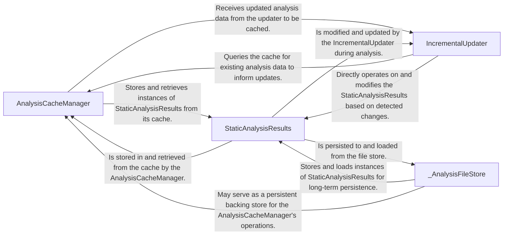

## Details

Manages the caching, persistence, and incremental updates of static analysis results, ensuring efficient storage and retrieval of codebase insights. This component is crucial for optimizing performance by only re-analyzing changed parts of the codebase.

### AnalysisCacheManager
Manages the caching mechanism for static analysis results. This includes handling the serialization, deserialization, validation, and merging of incremental analysis data to optimize performance and reduce re-computation.

**Related Classes/Methods**:

- <a href="https://github.com/CodeBoarding/CodeBoarding/blob/main/.codeboardingdiagram_analysis/incremental/io_utils.py" target="_blank" rel="noopener noreferrer">`AnalysisCacheManager`</a>

### StaticAnalysisResults
Serves as the central data structure for all static analysis outputs. It encapsulates foundational structural information extracted from the code, such as Control Flow Graphs, class hierarchies, package dependencies, and cross-references.

**Related Classes/Methods**:

- <a href="https://github.com/CodeBoarding/CodeBoarding/blob/main/.codeboardingdiagram_analysis/incremental/io_utils.py" target="_blank" rel="noopener noreferrer">`StaticAnalysisResults`</a>

### IncrementalUpdater
Orchestrates the entire incremental analysis workflow. It determines the scope of changes, identifies affected components, and coordinates the execution of patching, re-classification, and re-expansion processes to update analysis results efficiently.

**Related Classes/Methods**:

- <a href="https://github.com/CodeBoarding/CodeBoarding/blob/main/.codeboardingdiagram_analysis/incremental/io_utils.py" target="_blank" rel="noopener noreferrer">`IncrementalUpdater`</a>

### _AnalysisFileStore
Provides the underlying persistent storage and retrieval mechanism for static analysis outputs. It ensures the long-term availability and organization of analysis results, acting as the foundational storage layer.

**Related Classes/Methods**:

- <a href="https://github.com/CodeBoarding/CodeBoarding/blob/main/.codeboardingdiagram_analysis/incremental/io_utils.py" target="_blank" rel="noopener noreferrer">`_AnalysisFileStore`</a>

### [FAQ](https://github.com/CodeBoarding/GeneratedOnBoardings/tree/main?tab=readme-ov-file#faq)
